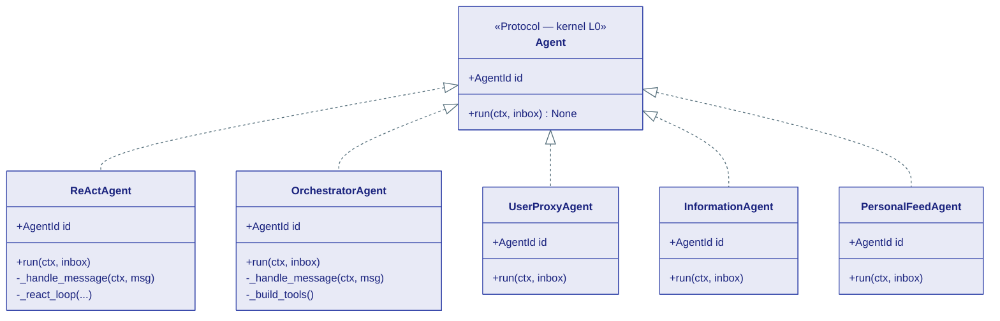
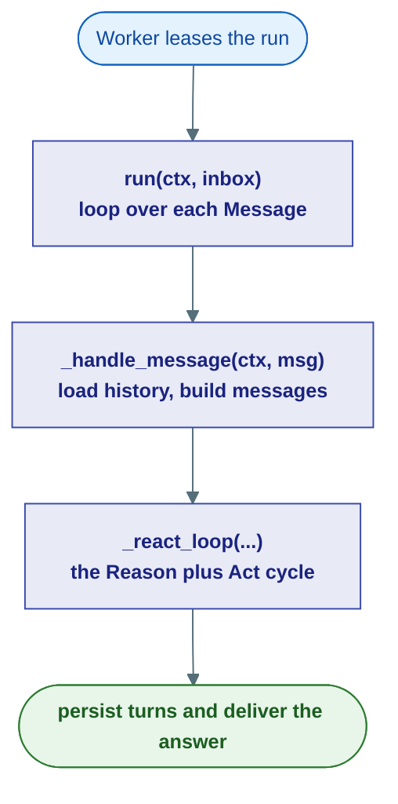
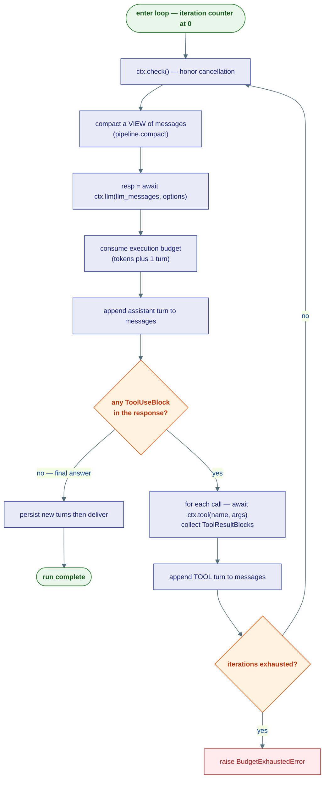
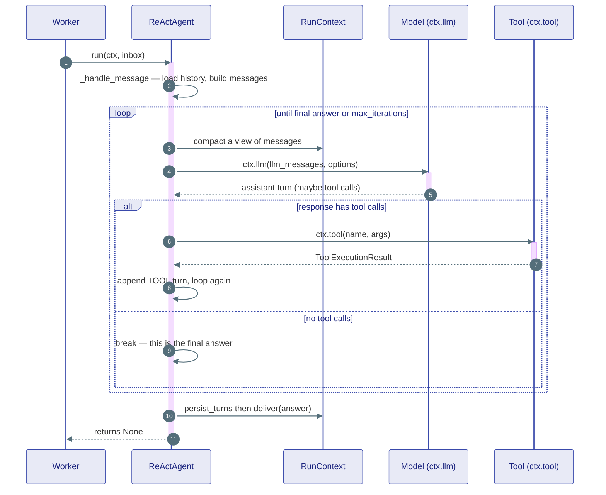
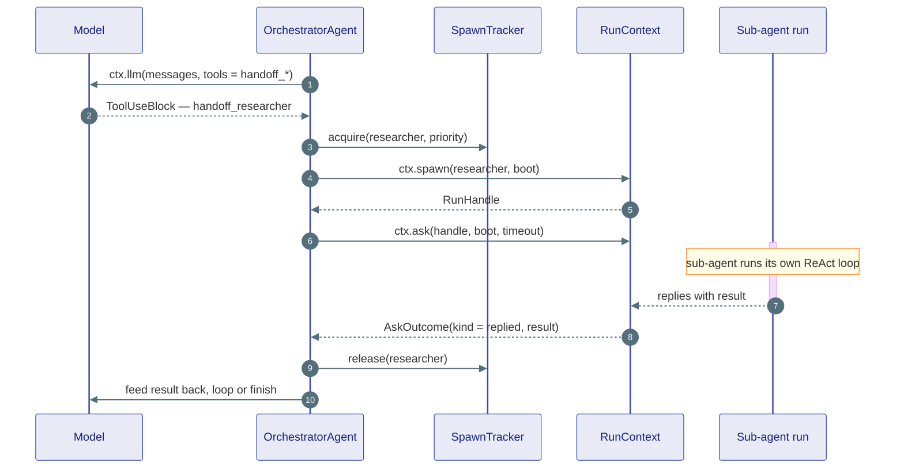
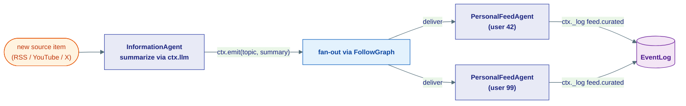

# Agent Types

## What this is

The kernel (L0) defines *what an agent is* in a single sentence — an object with
an `id` and one method, `async run(ctx, inbox)`. But a Protocol can't think. It's
a shape, an empty promise. **This page is about the classes that actually fill
that shape with intelligence** — the concrete agents that live at layer L1
(`agents/`).

Every agent here is a normal Python class that *satisfies* the kernel `Agent`
Protocol. There is no base class to inherit, no `@agent` decorator. If your class
has an `id` attribute and an `async def run(self, ctx, inbox)`, the runtime will
happily run it. The classes on this page are the batteries-included ones Agent Substrate
ships with.

!!! note "This page is the *implementation*, the kernel page is the *contract*"
    [The Runtime Contracts](../kernel/07-runtime.md) defines the `Agent` Protocol
    and the `ctx` your `run()` receives. [The Agent Model](../concepts/agent-model.md)
    tells the *story* — why agents are addresses, not objects. This page is the
    concrete middle: the real classes, real method names, real code. Read those
    two for the "why" and the "rules"; read this for "what Agent Substrate actually gives
    you and how each one works."

These classes may import from `kernel` (the layer below) but **never** from
`capabilities` or `fabric` (the layers above). That's the one architectural rule
that keeps the agent loop reusable everywhere.

---

## The cast, at a glance

| Agent | Role (plain English) | When to reach for it |
|---|---|---|
| `ReActAgent` | A worker who thinks, picks a tool, uses it, looks at the result, repeats | The default. Any chatbot or task-doer that uses tools. **The centerpiece.** |
| `OrchestratorAgent` | A manager who breaks a job up and delegates to specialists | A task that needs several different sub-agents coordinated |
| `UserProxyAgent` | A stand-in for the human at the keyboard | Pausing a run to ask a person a question (HITL) |
| `InformationAgent` | A newsroom that summarizes a source and broadcasts it | Demo: producer side of a feed (RSS / YouTube monitor) |
| `PersonalFeedAgent` | A subscriber who curates what the newsroom broadcasts | Demo: consumer side of a feed (per-user curation) |



!!! tip "They all share the same front door"
    Notice every class has the *exact same* public surface: an `id` and a
    `run(ctx, inbox)`. The Worker calls `run` and doesn't care which class it
    got. That uniformity is the whole point — an orchestrator can spawn a
    `ReActAgent`, a `ReActAgent` can ask a `UserProxyAgent`, all through the
    same address-and-message machinery.

---

## ReActAgent — the centerpiece

**What & why:** `ReActAgent` runs the *ReAct* pattern — **Reason + Act**. The
model reasons about the task, decides to *act* by calling a tool, sees the tool's
*result*, reasons again, and keeps going until it has a final answer (or runs out
of its iteration budget).

!!! tip "Analogy — a careful worker at a workbench"
    Picture someone fixing a bike. They **think** ("the chain is loose"), **pick
    a tool** (a wrench), **use it**, **look at the result** ("still loose"),
    think again, pick another tool, and repeat — until the bike is fixed or
    they've tried everything they're allowed to. The model is the brain; the
    tools are the wrench set; the loop is the patient back-and-forth.

### From `run()` to the loop

A run touches three methods, each smaller and more focused than the last:



**`run(ctx, inbox)`** is tiny. It stamps a couple of context variables (so tools
like the Kanban board know which agent and label they belong to), then walks the
inbox one message at a time. Between messages it calls `ctx.check()` — the
cooperative cancellation point that lets a parent or a deadline interrupt it
cleanly.

```python
async def run(self, ctx: RunContext, inbox: list[Message]) -> None:
    _task_agent_id.set(str(self.id))
    _task_agent_label.set(self.name)
    for msg in inbox:
        ctx.check()
        await self._handle_message(ctx, msg)
```

**`_handle_message(ctx, msg)`** sets up the conversation. It derives a
`session_id` (the conversation thread — falls back to `ctx.run_id` if the message
carries no `correlation_id`), loads the prior history, converts the incoming
message to a chat turn, and hands the assembled `messages` list to the loop.

```python
async def _handle_message(self, ctx: RunContext, msg: Message) -> None:
    session_id = msg.correlation_id or ctx.run_id
    _task_thread_id.set(session_id)
    _task_parent_agent_id.set(msg.metadata.get("parent_agent_id") or None)

    history_messages = await load_history(self._context, self.id, session_id)
    user_turn = message_to_chat(msg)
    messages: list[ChatMessage] = history_messages + [user_turn]

    await self._react_loop(ctx, msg, session_id, messages, len(history_messages))
```

!!! note "Why the ContextVars are stamped *here*, inside the Worker task"
    The Worker runs in a different asyncio context from the code that submitted
    the message. ContextVars set outside don't cross that boundary — so
    `_task_thread_id` and `_task_parent_agent_id` are set *inside*
    `_handle_message`, which is the code actually running in the Worker task.
    This is a real footgun the team hit and fixed; don't move these.

### The ReAct loop itself

`_react_loop` is the engine. It iterates up to `max_iterations` times. Each pass:

1. **Compact** a *view* of the messages (more on this below).
2. **Call the model** via `await ctx.llm(...)`.
3. **Record** the assistant turn and (if any) charge the execution budget.
4. **Look for tool calls.** No tool calls → the model is done; **break** out.
5. **Run each tool** via `await ctx.tool(name, **args)`, collect the results,
   append them as a `TOOL` turn, and loop again.



#### Compaction runs before *every* model call

This is the detail people miss. Tool results can be huge (a 5,000-line file, a
web page), and they pile up across iterations. So before each `ctx.llm()` call,
the agent compacts:

```python
# Compact a *view* of messages here and keep the full list intact for persistence.
llm_messages = await self._context.pipeline.compact(messages)
resp = await ctx.llm(llm_messages, options=options)
```

The key word is **view**. `compact()` returns a trimmed copy that goes *to the
model*; the full untrimmed `messages` list is what gets *persisted* afterwards.
The model sees a manageable window; the conversation record stays complete. See
[the compaction pipeline](../concepts/memory.md) for the strategies.

!!! tip "`initial_tool_choice` forces the first move only"
    If you pass `initial_tool_choice`, the loop applies it to the *very first*
    LLM call (e.g. "you must call the search tool first"), then immediately
    reverts to the unconstrained `base_options` so later iterations are free to
    answer with text or call other tools.

#### Tool dispatch goes through `ctx.tool()`

The agent never calls a tool's `execute()` directly. It asks the context:

```python
tool_calls = [b for b in resp.content if isinstance(b, ToolUseBlock)]
if not tool_calls:
    break

results: list[ToolResultBlock] = []
for tc in tool_calls:
    ctx.check()
    inv_result = await ctx.tool(tc.tool_name, **tc.arguments)
    results.append(
        ToolResultBlock(
            call_id=tc.call_id,
            content=[TextBlock(text=inv_result.text or "")],
            is_error=inv_result.status != "ok",
        )
    )
messages.append(ChatMessage(role=Role.TOOL, content=results))
```

Routing through `ctx.tool()` is what makes a tool call **journaled** — recorded
once so that on a crash-and-replay it returns the cached result instead of
re-running. That's the durability guarantee from
[Durability](../concepts/durability.md), and the agent gets it for free just by
calling `ctx.tool()` instead of the tool object.

#### The iteration cap is a hard budget

The loop is a Python `for ... range(self._max_iterations)`. If it completes all
iterations *without* breaking (i.e. the model kept calling tools and never
settled on an answer), the `for/else` fires:

```python
for _ in range(self._max_iterations):
    ...
else:
    from substrate.kernel.core.errors import BudgetExhaustedError
    raise BudgetExhaustedError(
        f"Agent reached max iterations limit ({self._max_iterations})"
    )
```

A runaway agent **fails loudly** with `BudgetExhaustedError` rather than looping
forever and burning tokens. When the loop *does* break normally, the agent
persists the new turns and delivers the answer:

```python
new_turns = messages[n_loaded:]
await persist_turns(self._context, self.id, session_id, ctx.run_id, new_turns)
ans = final_text(messages)
await deliver(ctx, msg, {"text": ans}, sender=self.id, output_topic=self._output_topic)
```

### A run, end to end



!!! note "What gets configured at construction"
    `ReActAgent.__init__` accepts the model, tools (a `ToolRegistry` or a plain
    `list`, auto-wrapped in a `Toolbox`), a `ContextConfig` (history provider +
    compaction pipeline), `system_instructions`, `max_iterations`,
    `approval_handler` / `approval_required_risk` (for tool approval gates), an
    `ExecutionTracker` budget, lifecycle `hooks`, and a `middleware` pipeline.
    Most of these are optional — the [minimal agent in the agent model](../concepts/agent-model.md#a-minimal-agent)
    sets only model, tools, context, and instructions.

---

## OrchestratorAgent — the manager

**What & why:** Some jobs are too big or too varied for one agent. An
`OrchestratorAgent` holds a roster of *sub-agents*, each declared as a
`SubAgentConfig`. The model decides which specialist to delegate to by calling a
tool whose name maps to that sub-agent. The orchestrator then **spawns** the
sub-agent as its own run and **asks** it for the answer.

!!! tip "Analogy — a project manager"
    A PM doesn't write the code, design the logo, and run the ads themselves.
    They break the project into pieces and hand each to a specialist, then
    collect the results and write the summary. The orchestrator is that PM; the
    sub-agents are the specialists; `ctx.spawn` is "hey, start on this" and
    `ctx.ask` is "are you done? what did you find?"

### Sub-agents become delegation tools

Each `SubAgentConfig` carries the sub-agent, a description, an `ask_timeout`, and
a `Priority`:

```python
@dataclass
class SubAgentConfig:
    agent: Agent
    description: str = ""
    ask_timeout: float = 120.0
    priority: Priority = Priority.NORMAL
```

At message time, `_build_tools()` synthesizes one `_DelegateTool` per sub-agent,
named `handoff_<key>`. These are *fake* tools — their `execute()` deliberately
raises if called. They exist only so the model sees them in
`GenerationOptions(tools=...)` and can pick one. The actual work is done by the
orchestrator, not the tool.

```python
def _build_tools(self) -> list[AnyTool]:
    return [
        _DelegateTool(
            name=f"handoff_{cfg.agent.id.key}",
            description=cfg.description or f"Delegate to the {cfg.agent.id.key} sub-agent",
        )
        for cfg in self._sub_agents
    ]
```

### Spawn, ask, and the SpawnTracker

The orchestrator runs its own ReAct-style loop. When the model emits a delegation
call, the orchestrator:

1. Looks up the matching `SubAgentConfig`.
2. Calls `spawn_tracker.acquire(...)` — the **`SpawnTracker`** enforces the
   `SpawnBudget` (a headcount cap with priority preemption) so you can't fork an
   unbounded swarm.
3. Builds a boot `Message` for the sub-agent, stamping its own id as
   `parent_agent_id` so the sub-agent's task board nests under it in the UI.
4. `await ctx.spawn(...)` starts the sub-agent run, then
   `await ctx.ask(handle, ..., timeout=...)` waits for the reply.
5. Releases the tracker slot in a `finally` — slot freed even on error.

```python
spawn_tracker.acquire(cfg.agent.id, priority=cfg.priority)
task_text = dispatch.arguments.get("task", str(dispatch.arguments))
boot_msg = Message(
    target=cfg.agent.id, sender=self.id,
    payload=ChatPayload(message=ChatMessage(role=Role.USER,
                                            content=[TextBlock(text=str(task_text))])),
    correlation_id=session_id,
    metadata={"parent_agent_id": str(self.id)},
)
try:
    handle = await ctx.spawn(cfg.agent.id, boot=boot_msg)
    outcome = await ctx.ask(handle, boot_msg, timeout=cfg.ask_timeout)
finally:
    spawn_tracker.release(cfg.agent.id)
```

!!! warning "Branch on `outcome.kind` — never assume it replied"
    `ctx.ask` returns an `AskOutcome`. The orchestrator checks
    `outcome.kind == "replied"` before reading `outcome.result`. Any other
    outcome (`timed_out`, `target_failed`, `target_cancelled`) becomes an
    error `ToolResultBlock` fed back to the model — it does *not* crash the
    orchestrator. This is the canonical "don't treat a timeout as a failure"
    discipline from [the runtime contracts](../kernel/07-runtime.md#asking-another-run-askoutcome-runstatussummary).



!!! note "The orchestrator is itself just an Agent"
    It has the same `id` + `run(ctx, inbox)` shape as everything else, and it
    can be spawned by *another* orchestrator. Delegation is recursive because
    there's nothing special about being a parent — it's all the same
    message-passing, one level up. See [Supervision & Budgets](../concepts/supervision.md)
    for how `SpawnBudget` and priority preemption bound the tree.

---

## UserProxyAgent — the human in the loop

**What & why:** Sometimes an agent needs a *person*, not a model — "should I
really send this $10,000 invoice?" The `UserProxyAgent` is an agent that
represents the human. It has no model and no tools. Its whole job is to receive a
question, surface it, go to sleep for free, and wake up when a human answers.

!!! tip "Analogy — a receptionist with a callback slip"
    A coworker asks the receptionist a question for the boss. The receptionist
    writes it on a slip, pins it to the board (logs it), and *stops waiting at
    the desk* — they go do other things at zero cost. When the boss finally
    answers, a bell rings (a signal), and the receptionist relays the answer back
    to whoever asked.

```python
async def _handle_message(self, ctx: RunContext, msg: Message) -> None:
    cid = msg.correlation_id
    question_text = self._extract_text(msg)
    await ctx._log("hitl.question", {"correlation_id": cid, "text": question_text})

    signal_name = f"human_reply:{cid}"
    human_payload = await ctx.sleep_until_signal(signal_name)

    if msg.reply_to:
        await ctx.reply(msg, human_payload)
```

The magic line is `await ctx.sleep_until_signal(...)`. The run goes **SUSPENDED**
— zero RAM, zero CPU, just rows in storage. The serving layer surfaces the logged
`hitl.question` to the user (over SSE), and when the human replies it calls
`SignalBus.signal(run_id, "human_reply:<cid>", {...})`. That signal wakes the
proxy, which relays the answer back to the agent that asked via `ctx.reply`.

!!! note "Waiting is free — that's the point"
    A proxy parked for three hours waiting on a human costs nothing because
    SUSPENDED runs are not threads, they're table rows. The full story is in
    [Human-in-the-Loop](../concepts/human-in-the-loop.md).

---

## InformationAgent and PersonalFeedAgent — the demo pair

!!! warning "These two are demo-grade, not production agents"
    `InformationAgent` and `PersonalFeedAgent` exist to *prove* a use case: the
    social / pub-sub model (an agent that follows another agent's broadcasts).
    They're deliberately simple — no history, no tools, no compaction — and are
    best read as worked examples of the `FollowGraph` + fan-out machinery, not
    as something you'd ship as-is.

Together they demonstrate a **producer/consumer feed** with no polling:



**`InformationAgent`** is the **producer**. On boot it summarizes any inbox item
via the shared `summarize` helper, emits the result to its `output_topic`, then
sleeps in a loop waiting for the next `new_source_item` signal:

```python
async def run(self, ctx: RunContext, inbox: list[Message]) -> None:
    for msg in inbox:
        ctx.check()
        await self._process_item(ctx, msg)
    while True:
        ctx.check()
        item_payload = await ctx.sleep_until_signal(self._source_signal)
        await self._process_item_from_signal(ctx, item_payload)
```

**`PersonalFeedAgent`** is the **consumer**. On its first wake it subscribes to
its topics via `ctx.follow(topic)` (the subscription is durable in the
`FollowGraph`, so it survives across runs), curates each delivered item against
the user's preferences, logs a `feed.curated` entry, and sleeps until the next
delivery:

```python
async def run(self, ctx: RunContext, inbox: list[Message]) -> None:
    if not self._subscribed:
        for topic in self._follow_topics:
            await ctx.follow(topic)
        self._subscribed = True
    for msg in inbox:
        ctx.check()
        await self._curate(ctx, msg)
    await ctx.sleep_until_signal("new_feed_item")
```

The takeaway: producers `emit`, consumers `follow`, and the runtime's fan-out
does the delivery — the same `Inbox` / `FollowGraph` contracts described in
[the runtime page](../kernel/07-runtime.md#pubsub-followgraph-fanoutstrategy).

---

## The shared helpers: `_loop.py`

Every agent above repeats the same conversation chores: turn a `Message` into a
chat turn, load history, persist new turns, extract the final answer, deliver the
result. Rather than copy-paste, those live in one small module,
`agents/core/_loop.py`, and are imported by all the agents.

| Helper | What it does |
|---|---|
| `message_to_chat(msg)` | Converts an inbox `Message` (ChatPayload / DataPayload / other) into a `USER` `ChatMessage` |
| `load_history(cfg, agent_id, session_id)` | Reads session history from the provider **and** runs the compaction pipeline over it |
| `persist_turns(cfg, agent_id, session_id, run_id, new_turns)` | Appends the new turns back to the history provider via `append_many` |
| `final_text(messages)` | Walks the list backwards and returns the text of the last `ASSISTANT` turn |
| `deliver(ctx, src_msg, result, *, sender, output_topic=None)` | If the source had a `reply_to`, calls `ctx.reply`; else emits to `output_topic` (if given) |
| `summarize(ctx, text, *, instructions)` | A one-shot journaled `ctx.llm()` summarization pass — used by the demo agents |

!!! note "`deliver` chooses reply-vs-emit for you"
    A request/response call (someone used `ctx.ask`, so `reply_to` is set) gets
    `ctx.reply`. A fire-and-forget broadcast (no `reply_to`, but an
    `output_topic`) gets `ctx.emit`. Same helper, two routing modes — that's how
    `ReActAgent` answers a user *and* how `InformationAgent` broadcasts to a
    topic with the same code path.

---

## The factory: convenience constructors

Wiring a `ReActAgent` by hand means assembling a `Toolbox`, a `ContextConfig`,
and a `CompactionPipeline`. `agents/factory.py` packages the common recipes so
serving code (monolith *and* the distributed path) builds agents the same way.

- **`create_assistant_agent(...)`** — the everyday constructor. Give it a
  `model_client`, optional `tools`, `system_instructions`, and a `memory`
  provider; it builds the `Toolbox`, defaults the compaction pipeline to a
  `SlidingWindowCompaction`, and returns a ready (but **unregistered**)
  `ReActAgent`. You still call `await runtime.register(agent)` yourself — the
  factory stays decoupled from the runtime so it's testable without live infra.

- **`load_session_memory(...)`** — the cold-start helper. Given a `session_id`
  and a `load_persisted_steps` callback, it checks whether a `HistoryProvider`
  already has that session; on a **miss** it seeds the session from cold storage
  (rebuilding `ChatMessage` turns from persisted step rows) and returns the
  provider. This is how a conversation resumes after a restart without re-reading
  everything every turn.

- **`rebuild_messages_from_steps(...)`** — the lower-level converter that turns
  persisted step rows (`user_message`, `assistant_message`, `tool_result`, …)
  back into the unified `ChatMessage` list the agent loop expects.

!!! tip "There's also `rebuild_agent(spec, ...)`"
    For full cold resume, `rebuild_agent` reconstructs a whole `ReActAgent` from
    the spec dict saved at submit time (`model`, `system_instructions`,
    `tool_names`, `max_iterations`, `session_id`, …) — pairing with
    `load_session_memory` to bring a crashed conversation fully back to life.

---

## Where this lives

| Concept | Source file |
|---|---|
| `ReActAgent` | `agents/core/react.py` |
| `OrchestratorAgent`, `SubAgentConfig` | `agents/core/orchestrator.py` |
| `UserProxyAgent` | `agents/core/proxy.py` |
| `InformationAgent` | `agents/core/information_agent.py` |
| `PersonalFeedAgent` | `agents/core/personal_feed_agent.py` |
| Shared helpers (`message_to_chat`, `load_history`, `persist_turns`, `final_text`, `deliver`, `summarize`) | `agents/core/_loop.py` |
| `create_assistant_agent`, `load_session_memory`, `rebuild_messages_from_steps`, `rebuild_agent` | `agents/factory.py` |
| `SpawnTracker`, `SpawnBudget` | `agents/supervision/budget.py`, `kernel/agent/supervision.py` |
| `ExecutionTracker` (budget) | `agents/resources/budget.py` |
| The `Agent` Protocol these implement | `kernel/runtime/agent.py` |

**Next:** [The In-Process Runtime](02-runtime.md) — the `Runtime` facade and
`Worker` that actually call `run(ctx, inbox)`, lease runs, and drive the durable
loop these agents ride on.
