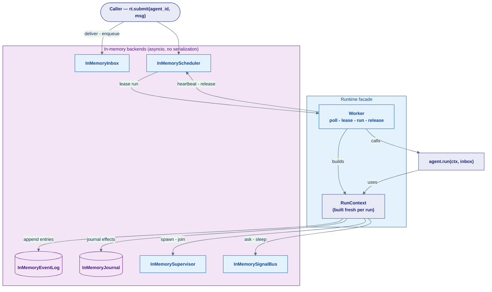
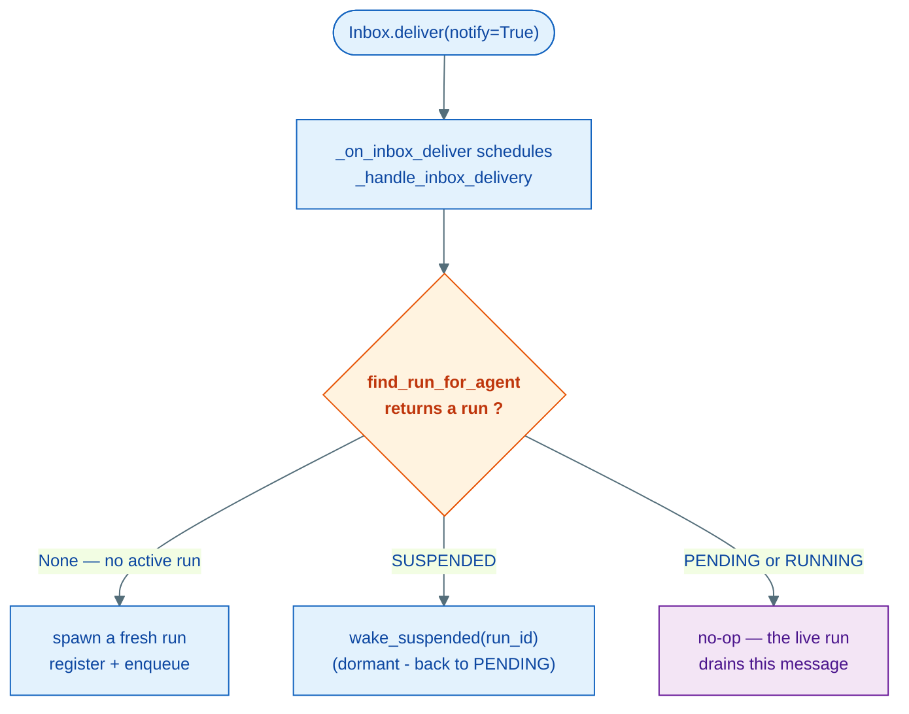
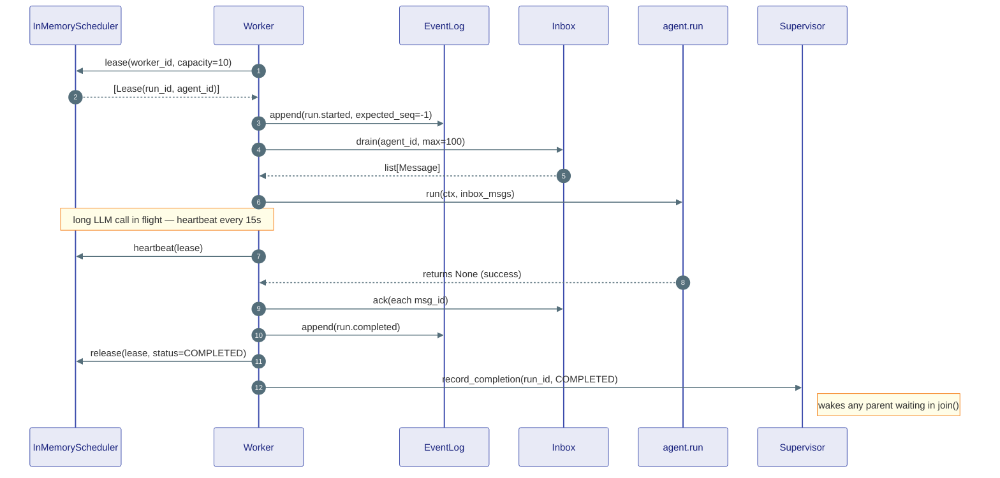
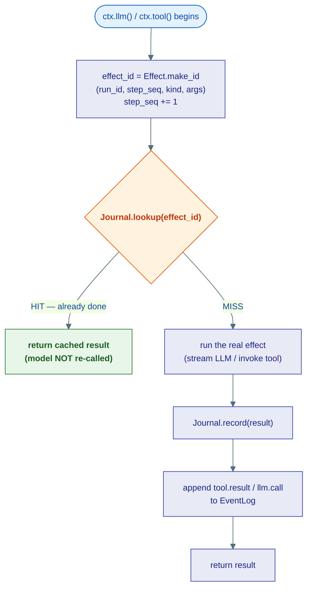

# The Runtime (L1)

## What this is

The [kernel page on runtime contracts](../kernel/07-runtime.md) describes a *shape*
— a handful of pure Protocols (`EventLog`, `Journal`, `Inbox`, `Scheduler`,
`Supervisor`, `SignalBus`, `FollowGraph`, `FanoutStrategy`) with no I/O, no
sockets, no database. **This page describes the first real machine that fills in
that shape.**

It is the **Stage-0, in-process implementation**: everything runs inside one
Python process, on one asyncio event loop, with **no serialization** — a leased
run is just an `asyncio.Task` that stays alive in memory. There is no Postgres,
no Redis, no network. You can `pip`-free, `docker`-free run a durable agent loop
on your laptop with nothing but `python`.

!!! note "This is the durable engine, from the inside"
    [Durability (concept)](../concepts/durability.md) tells the *story* — what a
    crash looks like, how replay avoids re-charging the card. The
    [kernel runtime contracts](../kernel/07-runtime.md) are the *interfaces* that
    make the story possible. **This page is the working code that drives them in
    development.** Read those two first for the "why" and the "what, precisely"
    — here we cross-link heavily and try not to repeat.

### The one idea that makes it all worth it

The agent author writes `async def run(self, ctx, inbox)` once. Every
`ctx.llm()`, `ctx.tool()`, `ctx.spawn()` call is journaled under the hood. That
**same agent code** runs unchanged against the Postgres/Redis backends in
[`infrastructure/runtime/`](../kernel/07-runtime.md) — you swap the *backends*,
not the agent. Dev and production are literally the same call sites.

```python
# Dev (Stage 0) — everything in-process, zero infra
async with Runtime() as rt:
    await rt.register(my_agent)
    run_id = await rt.submit(my_agent.id, boot_msg)

# Production (Stage 1) — durable backends injected by the infra factory
from ravi.infrastructure.runtime import build_postgres_runtime
async with build_postgres_runtime(postgres_url=..., redis_url=...) as rt:
    await rt.register(my_agent)
    run_id = await rt.submit(my_agent.id, boot_msg)   # identical
```

Here is the cast this page covers, each with a one-line analogy.

| Piece | One-liner | Analogy |
|---|---|---|
| `Runtime` | Facade that wires backends + the Worker, and the public API | the **building manager** who hooks up power, mail, and staff |
| `Worker` | The run loop: lease → run → file paperwork → release | a **driver** who leases a job, does it, files the paperwork |
| `RunContext` | The journaled `ctx` an agent receives for one run | the agent's **toolkit + notebook** for this one job |
| in-memory backends | Single-process stand-ins for the eight kernel Protocols | a **single office** standing in for the citywide postal system |



---

## The `Runtime` facade

**What & why:** `Runtime` is one object you create, hand a few agents, and submit
messages to. It owns the eight backends (defaulting each to its in-memory
implementation), wires the inbox wakeup hook, and starts a single `Worker`. Think
of it as the **building manager**: it connects the power, hangs the mailboxes,
hires the one driver, and gives you a front desk to drop off work.

It lives at `agents/runtime/runtime.py` and is exported as `Runtime`.

### Construction — inject or default

Every backend is an optional constructor argument. Pass nothing and you get the
full in-memory stack. Pass durable ones and the *same* `Runtime` runs against
Postgres/Redis — this is exactly what `build_postgres_runtime` does.

```python
class Runtime:
    def __init__(
        self,
        *,
        event_log: EventLog | None = None,
        inbox: Inbox | None = None,
        journal: Journal | None = None,
        scheduler: Scheduler | None = None,
        signal_bus: SignalBus | None = None,
        follow_graph: FollowGraph | None = None,
        fanout: FanoutStrategy | None = None,
    ) -> None:
        self._event_log = event_log or InMemoryEventLog()
        self._journal   = journal   or InMemoryJournal()
        self._scheduler = scheduler or InMemoryScheduler()
        self._inbox     = inbox     or InMemoryInbox()
        self._inbox.set_deliver_hook(self._on_inbox_deliver)   # the wakeup wire
        ...
```

!!! note "Why `Runtime` never imports a durable backend"
    Notice it only ever names `InMemory*` classes — it never imports
    `PostgresEventLog` or `RedisJournal`. That keeps the `agents` layer (L1)
    strictly **above** `infrastructure`. The durable backends are injected from
    the outside by the infra-layer factory, so the dependency rule
    (`agents` may not reach sideways into `infrastructure`) is never violated.

### The public API

Four verbs, plus lifecycle. All return fast — work happens on the Worker.

| Method | What it does |
|---|---|
| `register(agent)` | Add an agent to the registry so the Worker can dispatch runs to it |
| `submit(agent_id, msg, *, priority, tenant, max_retries)` | Deliver `msg` and enqueue a fresh run — returns the new `RunId` |
| `follow(follower, topic_type, topic_source)` | Subscribe an agent to a topic (newsletter sign-up) |
| `publish(topic_type, topic_source, msg)` | Fan `msg` out to every follower of a topic |
| `start()` / `stop()` / `cancel(run_id)` | Lifecycle — also exposed via `async with` |

### `submit` and the duplicate-run trap

`submit` does the delivery **and** the enqueue itself. The subtle bit is
`notify=False`:

```python
async def submit(self, agent_id, msg, *, priority=5, tenant="default", max_retries=3):
    run_id = new_run_id()
    self._scheduler.register_run(run_id, agent_id)
    # notify=False: submit() enqueues its OWN run below. If the deliver-hook
    # also fired, it would find no active run yet and spawn a DUPLICATE.
    await self._inbox.deliver(agent_id, msg, notify=False)
    await self._scheduler.enqueue(run_id, priority=priority, tenant=tenant,
                                  retry_policy=RunRetryPolicy(max_retries=max_retries))
    return run_id
```

!!! warning "`notify=False` is load-bearing, not an optimization"
    The deliver-hook exists for *unsolicited* deliveries — a `publish` fan-out, an
    inter-agent `ask`, a child's boot message — that arrive with no accompanying
    `submit`. When `submit` is the one delivering, it suppresses the hook so the
    explicit `enqueue` is the only run created. Forgetting this spawns two runs
    for one message.

### The inbox deliver-hook: wake vs spawn

When a message lands in a dormant agent's mailbox via the *normal* path
(`notify=True`), the Inbox calls a sync hook, which schedules
`_handle_inbox_delivery`. That method makes the central **wake-vs-spawn**
decision using `scheduler.find_run_for_agent()` — the same API on both the
in-memory and Postgres schedulers, so no private attributes are touched.

```python
async def _handle_inbox_delivery(self, agent_id: AgentId) -> None:
    result = await self._scheduler.find_run_for_agent(agent_id)
    if result is None:
        await self._spawn_run_for_inbox(agent_id)   # no active run -> spawn fresh
        return
    run_id, status = result
    if status == RunStatus.SUSPENDED:
        await self._scheduler.wake_suspended(run_id)  # dormant run -> wake it
    # PENDING / RUNNING -> no-op: the active run will drain this message itself
```



### Start / stop as a context manager

`start()` constructs the `InMemorySupervisor` (it needs references to the
EventLog, Inbox, Journal, and Scheduler) and the single `Worker`, then starts the
Worker's poll loop. `async with` calls `start`/`stop` for you.

```python
async with Runtime() as rt:        # -> start() : builds Supervisor + Worker, starts poll loop
    await rt.register(agent)
    await rt.submit(agent.id, msg)
    ...                            # Worker drives runs in the background
# -> stop() : cancels the poll loop and all in-flight agent tasks
```

---

## The `Worker` — the run loop

**What & why:** The `Worker` is the engine that turns a queued run into a running
agent. It polls the Scheduler for leased runs, builds a `RunContext`, drains the
inbox, calls `agent.run(...)`, and — win, lose, or cancel — files the paperwork
(append a terminal log entry, ack/nack messages, release the lease).

It lives at `agents/runtime/worker.py`.

!!! tip "Analogy — the driver who leases a job"
    A dispatcher hands the driver a job slip (the **lease**). The driver does the
    work, radios in periodically so the dispatch doesn't reassign the job (the
    **heartbeat**), and at the end files the trip report (the **terminal log
    entry**) and hands the slip back (the **release**). The driver never *becomes*
    the job — each job is its own asyncio Task.

### The poll loop

`_poll_loop` runs every `POLL_INTERVAL` (0.05 s). Each tick it leases up to
`capacity=10` runs and launches each as its own `asyncio.Task`. Many agents run
concurrently because each is an independent task; the lease capacity bounds how
many start per tick.

```python
async def _poll_loop(self) -> None:
    while self._running:
        leases = await self._scheduler.lease(worker_id=self._worker_id, capacity=10)
        for lease in leases:
            agent = self._registry.get(lease.agent_id)
            if agent is None:
                continue   # not registered yet — hold the lease, it expires + retries
            task = asyncio.create_task(self._run_agent(lease, agent))
            self._tasks[lease.run_id] = task
        await asyncio.sleep(self.POLL_INTERVAL)
```

### One run, start to finish (`_run_agent`)

This is the heart of the page. For one leased run, the Worker:

1. **Builds a fresh `RunContext`** — wiring in all backends plus the agent's LLM
   client and a `ToolInvoker` built from the agent's declared tools
   (`_build_tool_invoker`).
2. **Appends `run.started`** to the EventLog if `last_seq < 0` (fresh run).
3. **Drains the inbox** for this agent (up to 100 messages).
4. **Dispatches lifecycle hooks** (`RUN_START`) and runs through the
   agent's **middleware** pipeline if present, otherwise calls `agent.run` directly.
5. **Heartbeats** in the background every 15 s so a long LLM call never loses a
   Postgres lease (the in-memory scheduler's `heartbeat` is a no-op).
6. **On success** — `ack` every drained message, optionally clear run-scoped
   history (`_maybe_clear_run_history`), append `run.completed`, `release` with
   `COMPLETED`, and record completion with the Supervisor (this is what wakes a
   parent waiting in `join`).
7. **On cancel** (`asyncio.CancelledError` / `CancellationError`) — append
   `run.cancelled`, release `CANCELLED`.
8. **On any other exception** — branch: a guardrail stop (`MiddlewareTermination`)
   or budget stop (`BudgetExhaustedError`) is *expected*, so it `ack`s the messages
   and logs `run.failed` with a friendly status; a real `AgentCrashError`
   `nack`s the messages (so the run can be retried) and logs the crash.

```python
async def _run_agent(self, lease, agent):
    ctx = RunContext(meta=meta, event_log=..., journal=..., inbox=..., ...,
                     llm_client=getattr(agent, "model", None),
                     tool_invoker=self._build_tool_invoker(agent), agent=agent)
    if (await self._event_log.last_seq(run_id)) < 0:
        await self._event_log.append(run_id, RunLogEntry(..., kind="run.started"),
                                     expected_seq=-1)
    inbox_msgs = await self._inbox.drain(agent.id, max=100)
    heartbeat_task = asyncio.create_task(_heartbeat())   # renews lease every 15s
    try:
        if middleware is not None:
            await middleware.execute(ctx, lambda c: agent.run(c, inbox_msgs))
        else:
            await agent.run(ctx, inbox_msgs)
        for msg in inbox_msgs:
            await self._inbox.ack(agent.id, msg.id)
        await self._event_log.append(run_id, RunLogEntry(..., kind="run.completed"), ...)
        await self._scheduler.release(lease, status=RunStatus.COMPLETED)
        await self._supervisor.record_completion(run_id, RunStatus.COMPLETED)
    except (asyncio.CancelledError, CancellationError):
        ...  # append run.cancelled, release CANCELLED
    except Exception as exc:
        ...  # guardrail/budget -> ack + run.failed ; crash -> nack + run.failed
    finally:
        heartbeat_task.cancel()
        ...  # dispatch RUN_END hook, drop run from _tasks / _tokens
```



!!! note "External cancel: `Runtime.cancel` -> `Worker.cancel`"
    `cancel(run_id)` marks the run `CANCELLED` in the scheduler, cancels its
    asyncio Task, and trips its `CancellationToken` so an agent inside a long loop
    bails at its next `ctx.check()`. If no task exists yet, it appends
    `run.cancelled` to the log directly and records completion — so a cancel never
    leaves a run dangling.

---

## `RunContext` — the agent's toolkit and notebook

**What & why:** `RunContext` is the concrete `ctx` passed to `agent.run(ctx,
inbox)`. It satisfies the kernel's minimal `AgentRunContext` Protocol but offers
the full rich surface an agent author actually uses: `ctx.llm()`, `ctx.tool()`,
`ctx.spawn()`, `ctx.join()`, `ctx.ask()`, `ctx.send()`, `ctx.emit()`,
`ctx.check()`, and more. **Every effectful call is journaled**, so a replay never
re-bills the model or re-sends an email.

It lives at `agents/runtime/context.py`.

!!! tip "Analogy — the toolkit and the notebook"
    `ctx` is a fresh toolkit handed to the agent for *this one job*: a phone to
    call the model (`llm`), a set of wrenches (`tool`), a way to hire helpers
    (`spawn` / `join`), and a notebook (the EventLog + Journal) where every action
    is logged. If the job restarts, the agent re-reads the notebook instead of
    re-doing the expensive work.

### `_step_seq` and the at-most-once helper

The context keeps a counter `_step_seq` that starts at 0 and bumps on every
journaled operation. That counter is the **namespace** for effect ids: step N in
a run always computes the same `effect_id`, so on replay it finds the journal hit
and skips the work. The generic helper is `_journaled()`:

```python
async def _journaled(self, kind, args, fn):
    effect_id = Effect.make_id(self.run_id, self._step_seq, kind, args)
    self._step_seq += 1
    cached = await self._journal.lookup(effect_id)
    if cached:
        if cached.status == "error":
            raise RuntimeError(cached.value.get("error", "journaled error"))
        return cached.value           # HIT — return cached, do NOT re-run
    try:
        result = await fn()           # MISS — run the real effect
        await self._journal.record(EffectResult(effect_id=effect_id, status="ok",
                                                value=result or {}))
        return result
    except Exception as exc:
        await self._journal.record(EffectResult(effect_id=effect_id, status="error",
                                                value={"error": str(exc)}))
        raise
```

This is the same three-step lookup -> execute -> record dance described in
[Durability](../concepts/durability.md#the-at-most-once-protocol). `ctx.llm()`
and `ctx.tool()` inline the same pattern (so they can stream and serialize their
own results) rather than calling `_journaled` directly, but the contract is
identical.



### The capability surface

| `ctx` call | What it does | Journaled? |
|---|---|---|
| `ctx.llm(messages, *, options)` | Stream a model response, emit `text.delta` log entries, return `LLMResponse` | yes — replay never re-bills |
| `ctx.tool(name, **args)` | Invoke a tool via the `ToolInvoker`, return `InvocationResult` | yes — at-most-once side effect |
| `ctx.spawn(child_agent, *, boot, supervision)` | Spawn a child run, return a `RunHandle` (does not wait) | yes (in Supervisor) |
| `ctx.join(handle)` | Suspend until the child reaches a terminal state, return its `RunResult` | suspend point |
| `ctx.cancel(handle, *, reason)` | Cancel a child run and its whole subtree | — |
| `ctx.ask(target, msg, *, timeout)` | Send and suspend until a reply / timeout / target failure, return `AskOutcome` | suspend point |
| `ctx.reply(to, result)` | Signal the asker's run to complete its `ask` | — |
| `ctx.send(target, msg)` | Fire-and-forget delivery + wake the target | — |
| `ctx.emit(topic, msg)` | Publish to all followers of a topic | — |
| `ctx.follow(topic)` / `ctx.unfollow(topic)` | Subscribe / unsubscribe this run | — |
| `ctx.status(handle)` | One-shot peek at a run's progress (`RunStatusSummary`) — not a stream | — |
| `ctx.sleep_until_signal(name)` / `ctx.sleep_until(dt)` | Suspend until a named signal / wall-clock time | suspend point |
| `ctx.now()` / `ctx.random()` / `ctx.uuid()` | Journaled non-determinism — use these, not the stdlib equivalents | yes — replay-safe |
| `ctx.check()` | Cooperative cancellation point — raises if cancelled / deadline exceeded | — |

!!! warning "Use `ctx.now()` / `ctx.random()` / `ctx.uuid()`, never the stdlib"
    A plain `datetime.now()` or `uuid.uuid4()` produces a *different* value on
    replay, which corrupts the deterministic fold. The journaled helpers record
    the first value and return it on every replay — your code becomes replay-safe
    for free.

### How `ask` and `sleep` actually suspend (Stage 0)

In Stage 0 the coroutine is **never serialized** — it stays alive as an asyncio
Task. So `ctx.ask()` and `ctx.sleep_until_signal()` suspend by awaiting an
`asyncio.Event` inside the `InMemorySignalBus`, the lightweight in-process
stand-in for the durable `Wakeup` mechanism. `ask` sets `reply_to` and
`correlation_id`, delivers to the target, then waits on a `reply:{id}` signal:

```python
async def ask(self, target, msg, *, timeout, idempotency_key=None):
    enriched = msg.model_copy(update={"reply_to": self.run_id, "correlation_id": cid})
    await self._inbox.deliver(target_agent, enriched)
    await self._scheduler.wake_agent(target_agent)        # or wake_suspended(run)
    try:
        payload = await self._signal_bus.wait_for_signal(self.run_id, f"reply:{cid}",
                                                         timeout=timeout)
        return AskOutcome(kind="replied", result=..., last_seq=0)
    except asyncio.TimeoutError:
        # peek target status -> timed_out vs target_failed vs target_cancelled
        return AskOutcome(kind=kind, handle=handle, last_seq=last_seq)
```

!!! note "Stage 1 changes the suspend mechanism, not your code"
    In production the suspended run is dropped from RAM entirely and resumed from
    the EventLog when a real `Wakeup` arrives — so a three-hour wait costs nothing
    (see [SUSPENDED is the superpower](../kernel/07-runtime.md#run-identity-runid-runstatus)).
    The agent author's `await ctx.ask(...)` line is byte-for-byte unchanged.

---

## The in-memory backends

Each backend is a single-process, single-event-loop implementation of one kernel
Protocol. None is crash-durable — that is the whole point of Stage 0: zero infra,
fast tests, identical surface. They all live in `agents/runtime/backends/`.

!!! tip "Analogy — one office vs. the citywide postal system"
    Each in-memory backend is a single office doing by hand what the production
    backend does at city scale. The office's *front counter* (the Protocol methods)
    is identical to the post office's, so when you swap in the real thing nobody
    has to learn a new counter.

| In-memory backend | Implements kernel Protocol | Production counterpart (`infrastructure/runtime/`) |
|---|---|---|
| `InMemoryEventLog` | `EventLog` | `PostgresEventLog` (append-only table, `(run_id, seq)` PK) |
| `InMemoryJournal` | `Journal` | `RedisJournal` (keyed by `effect_id`, TTL) |
| `InMemoryInbox` | `Inbox` | `PostgresInbox` (durable queue + dead-letter) |
| `InMemoryScheduler` | `Scheduler` | `PostgresScheduler` (`SELECT … FOR UPDATE SKIP LOCKED` + leases) |
| `InMemorySupervisor` | `Supervisor` | *(still in-memory in Stage 1 — runs over the durable EventLog/Journal)* |
| `InMemorySignalBus` | `SignalBus` | *(still in-memory in Stage 1)* |
| `PushAllFanout` | `FanoutStrategy` | *(still in-memory — Stage 3 adds a push/pull hybrid)* |
| `InMemoryFollowGraph` | `FollowGraph` | *(still in-memory in Stage 1)* |

!!! note "The factory only swaps four backends today"
    `build_postgres_runtime` injects `PostgresEventLog`, `PostgresInbox`,
    `PostgresScheduler`, and `RedisJournal` (falling back to `InMemoryJournal` when
    no `redis_url` is given). Supervisor, SignalBus, Fanout, and FollowGraph keep
    their in-memory implementations — they ride on top of the now-durable EventLog
    and Journal. Because everything is behind a Protocol, hardening those four is a
    drop-in swap later.

A one-line tour:

- **`InMemoryEventLog`** — a `dict[run_id, list[RunLogEntry]]`. `append`
  enforces optimistic concurrency (raises `ConcurrentAppendError` when
  `expected_seq` doesn't match the real tail), `read` yields a finite slice,
  `tail` yields then blocks on an `asyncio.Event` for new entries (this powers
  live SSE streaming).
- **`InMemoryJournal`** — a `dict[effect_id, EffectResult]`. `record` uses
  `setdefault`, so it is **write-once**: the first result wins and a racing
  replay can never overwrite it.
- **`InMemoryInbox`** — per-agent message store with dedup by `Message.id`,
  per-sender FIFO ordering, and a retry counter that dead-letters after
  `max_retries` nacks. Holds the `on_deliver` wakeup hook the Runtime wires in.
- **`InMemoryScheduler`** — an `asyncio.PriorityQueue` (lower number = higher
  priority) plus status/lease/agent maps. `enqueue` **coalesces** (a run already
  pending is not added twice), `lease` hands out leases with a 30 s expiry,
  `heartbeat` is a no-op (single process), and `release` re-enqueues `FAILED`
  runs per their `RunRetryPolicy`. It owns `find_run_for_agent` — the wake-vs-spawn
  decider.
- **`InMemorySupervisor`** — `spawn` journals the child run id (so replay returns
  the *same* child and never duplicates it), delivers the boot message with
  `notify=False`, and logs `child.spawned` in the parent's EventLog. `join` awaits
  an `asyncio.Event` set by `record_completion`; `cancel` recurses through the
  subtree.
- **`InMemorySignalBus`** — `run_id -> name -> (asyncio.Event, payload_box)`.
  `signal` fired *before* a run waits is buffered (delivered eagerly), so a signal
  is never lost. `timer` schedules an `asyncio.sleep` that fires the `__timer__`
  signal. Exposes the non-Protocol `wait_for_signal` helper used by `ask` and
  `sleep_until_signal`.
- **`PushAllFanout`** — `publish` simply `async for follower in
  graph.followers_of(topic): inbox.deliver(follower, msg)`. Fine for normal
  agents; Stage 3 swaps a pull model for celebrity agents.
- **`InMemoryFollowGraph`** — two `defaultdict`s (`followers_of` and `following`)
  keyed by `"{type}/{source}"`; `follow` is idempotent (a set), `unfollow` is
  safe on an absent subscription.

---

## Where this lives

| Piece | Location |
|---|---|
| `Runtime` facade | `agents/runtime/runtime.py` |
| `Worker` run loop | `agents/runtime/worker.py` |
| `RunContext` (the journaled `ctx`) | `agents/runtime/context.py` |
| `InMemoryEventLog` | `agents/runtime/backends/_event_log.py` |
| `InMemoryJournal` | `agents/runtime/backends/_journal.py` |
| `InMemoryInbox` | `agents/runtime/backends/_inbox.py` |
| `InMemoryScheduler` | `agents/runtime/backends/_scheduler.py` |
| `InMemorySupervisor` | `agents/runtime/backends/_supervisor.py` |
| `InMemorySignalBus` | `agents/runtime/backends/_signal_bus.py` |
| `PushAllFanout` | `agents/runtime/backends/_fanout.py` |
| `InMemoryFollowGraph` | `agents/runtime/backends/_follow_graph.py` |
| The kernel Protocols these implement | `kernel/runtime/` ([contracts page](../kernel/07-runtime.md)) |
| Postgres / Redis backends + factory | `infrastructure/runtime/` |

**Next:** [Context, Compaction & Memory Backends](03-context-and-memory.md) — how
an agent's conversation history is stored, trimmed, and summarised so a long run
fits in the model's context window.
