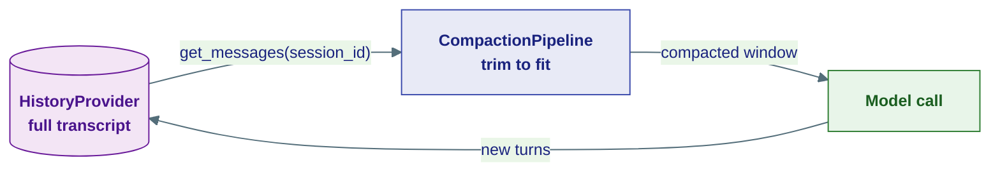
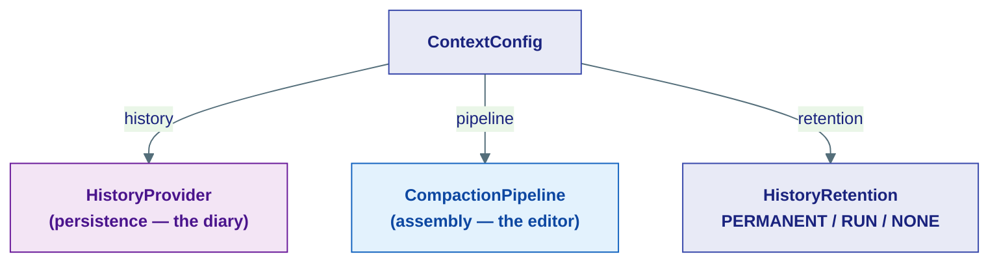
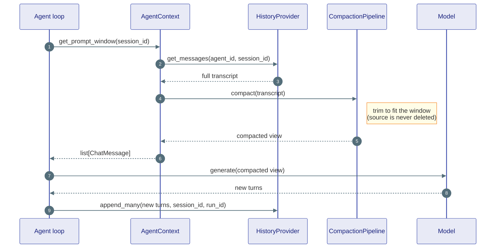
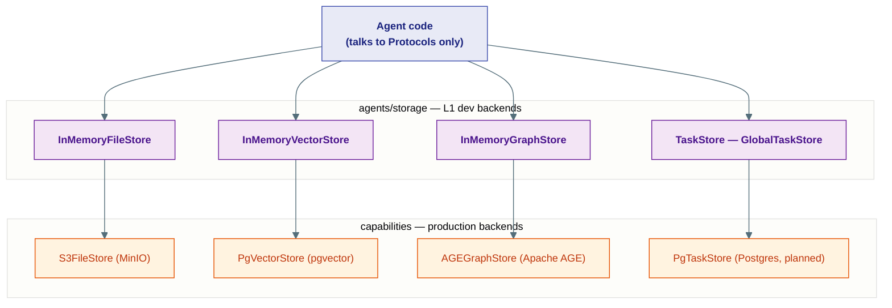

# Context & Memory

## What this is

An agent has to *remember* the conversation — but a model's context window is
small, and every token you send costs money and time. So "memory" is really two
jobs:

1. **Keep** every turn safely, so nothing is ever lost (persistence).
2. **Pick** what fits the window before each model call, without dropping what
   matters (assembly).

The frozen kernel (layer **L0**) defines the *shapes* for both jobs as
Protocols — `HistoryProvider`, `VectorStore`, `GraphStore`, `BlobStore`,
`TaskStore` — and nothing more. This page covers the **L1 `agents/` layer**: the
first place those shapes become real, runnable objects. Everything here imports
*down* into `kernel` but never *up* into `capabilities` or `fabric`.

!!! note "Where the L1 line is drawn"
    The kernel says *"a history provider must have an `append` and a
    `get_messages`."* The `agents/` layer ships the simplest thing that actually
    obeys that promise: a plain in-process Python object. The heavyweight
    Postgres / Redis / pgvector versions live one layer up in `capabilities/`.
    Same contract, different backend — that swap is the whole trick.

| L0 contract (kernel) | This page (L1 `agents/`) |
|---|---|
| The *promise* — `async def` signatures, no body | The *dev/test implementation* — dicts, lists, brute-force loops |
| `kernel/storage/history.py`, `kernel/storage/vector.py`, … | `agents/context/`, `agents/storage/` |
| Read first: [Storage Contracts](../kernel/05-storage.md) | The story-level tour: [Memory & Context](../concepts/memory.md) |



The full transcript always lives in the history provider. Compaction produces a
*view* for the model — it never deletes the source.

---

## ContextConfig — the bag you hand the agent

**Plain English:** `ContextConfig` is one small object that bundles together the
three things an agent needs to manage its memory: **where** turns are stored (a
`HistoryProvider`), **how** they get trimmed (a `CompactionPipeline`), and **how
long** they live afterwards (a `HistoryRetention` policy).

**Analogy:** a travel kit. Instead of handing a friend a diary, a pair of
scissors, and a "throw this away on Friday" sticky note separately, you zip all
three into one pouch and hand over the pouch.

You pass it to any agent via the `context=` keyword argument:

```python
from ravi.agents.context import (
    ContextConfig, InMemoryHistoryProvider,
    CompactionPipeline, ToolResultCompactionStrategy, SlidingWindowCompaction,
)
from ravi.kernel.agent.supervision import HistoryRetention

ctx = ContextConfig(
    InMemoryHistoryProvider(),
    CompactionPipeline([
        ToolResultCompactionStrategy(),
        SlidingWindowCompaction(max_messages=40),
    ]),
    retention=HistoryRetention.PERMANENT,
)
agent = ReActAgent("bot", model=client, context=ctx)
```

The constructor takes a `HistoryProvider` (required), an optional
`CompactionPipeline`, and a keyword-only `retention`:

```python
class ContextConfig:
    def __init__(
        self,
        history: HistoryProvider,
        pipeline: CompactionPipeline | None = None,
        *,
        retention: HistoryRetention = HistoryRetention.PERMANENT,
    ) -> None:
        self.history = history
        self.retention = retention
        # No pipeline? Default to a single sliding window.
        self.pipeline = pipeline or CompactionPipeline([SlidingWindowCompaction()])
```

!!! tip "`ContextConfig.default()` is the zero-config starting point"
    When you just want something that works, call the classmethod. It returns an
    `InMemoryHistoryProvider` wrapped in default sliding-window compaction — no
    arguments, no infrastructure.

    ```python
    ctx = ContextConfig.default()
    ```

### `retention` — what survives after the run

`retention` is a `HistoryRetention` enum (from `kernel/agent/supervision.py`)
that the Worker honours when a run ends:

| Policy | Behaviour | For |
|---|---|---|
| `PERMANENT` (default) | Kept forever | User-facing assistants |
| `RUN` | Cleared when the run ends (`clear_run`) | Transient sub-agents |
| `NONE` | Never written | Stateless workers |



---

## AgentContext — the runtime side of the kit

**Plain English:** `ContextConfig` is what *you* fill in. `AgentContext` is what
the agent *uses at runtime*. It is the concrete implementation of the kernel's
`AgentContextProtocol`: it holds the live `HistoryProvider` and
`CompactionPipeline` for one agent and exposes the single method the model loop
cares about — `get_prompt_window()`.

**Analogy:** if `ContextConfig` is the recipe card, `AgentContext` is the cook
standing at the counter actually following it.

Its one important method does exactly two steps — **read the diary, then let the
editor trim it**:

```python
class AgentContext:
    async def get_prompt_window(self, session_id: str) -> list[ChatMessage]:
        """Return the compacted history as ChatMessages for LLM generation."""
        raw = await self._history.get_messages(self._agent_id, session_id=session_id)
        return await self._pipeline.compact(raw)
```

Everything is scoped by `session_id`, so one agent instance can run many
sequential conversations without history bleeding between them.



---

## InMemoryHistoryProvider — the diary

**Plain English:** `InMemoryHistoryProvider` is the dev/test implementation of
the kernel `HistoryProvider` Protocol. It keeps the full ordered transcript of a
conversation in a plain Python dict. You only ever *append* turns and *read*
them back — it never summarises or trims (that is compaction's job).

**Analogy:** a diary. New entries go at the bottom, you read it front-to-back,
and you never rewrite yesterday.

Messages are keyed by `(agent_id, session_id)` and each is tagged with its
`run_id`, so `clear_run` can wipe exactly one run's turns while leaving the rest
of the thread intact (this is what powers `HistoryRetention.RUN`):

```python
class InMemoryHistoryProvider:
    def __init__(self) -> None:
        # (agent_id, session_id) -> list of (run_id, ChatMessage)
        self._store: dict[tuple[AgentId, str], list[tuple[str, ChatMessage]]] = {}

    async def append(self, agent_id, message, *, session_id, run_id="") -> None:
        tagged = self._tag(message, run_id)
        self._store.setdefault((agent_id, session_id), []).append((run_id, tagged))

    async def clear_run(self, agent_id, *, session_id, run_id) -> None:
        key = (agent_id, session_id)
        if key in self._store:
            self._store[key] = [(rid, m) for rid, m in self._store[key] if rid != run_id]
```

!!! note "session vs run"
    `session_id` is the **thread** — long-lived, many runs. `run_id` is **one
    `run()` call** — short-lived. `clear` drops the whole thread, `clear_run`
    drops just one run's turns.

It implements the full Protocol: `append`, `append_many`, `get_messages` (with
`limit` / `offset`), `clear`, `clear_run`, and `count_messages`. Its
production counterparts in `capabilities/history/` — `RedisHistoryProvider`
(fast, TTL'd) and `PostgresHistoryProvider` (durable, queryable) — obey the same
contract, so swapping them in needs no agent-code change.

---

## The CompactionPipeline — the editor

**Plain English:** a `CompactionPipeline` is an ordered chain of compaction
**strategies**. It runs the full history through each strategy in turn — the
output of one feeds the input of the next — and returns a single trimmed list
of messages. **This runs before every single LLM call.**

**Analogy:** an editor preparing a diary to fit on a postcard. First one pass
shrinks the bulky bits, then another keeps only the recent pages. The original
diary is untouched — only the postcard copy is trimmed.

```python
class CompactionPipeline:
    def __init__(self, strategies: list[CompactionStrategy]) -> None:
        self._strategies = list(strategies)

    async def compact(self, raw_history: list[ChatMessage]) -> list[ChatMessage]:
        window = raw_history
        for strategy in self._strategies:
            window = await strategy.compact(window)   # each feeds the next
        return window
```

!!! tip "Order matters, and empty is fine"
    Put cheap, lossless strategies first (shrink tool output) and aggressive,
    lossy ones last (sliding window, summarisation). An empty pipeline is a
    valid no-op — it returns the history unchanged. A single strategy can be
    passed without wrapping it in a pipeline.

```mermaid
%%{init: {'theme': 'base', 'themeVariables': {'primaryColor': '#E8EAF6','primaryTextColor': '#1A237E','primaryBorderColor': '#3949AB','lineColor': '#546E7A','fontSize': '13px'}}}%%
flowchart LR
    classDef raw  fill:#FFF3E0,stroke:#E65100,color:#BF360C
    classDef step fill:#E8EAF6,stroke:#3949AB,color:#1A237E,font-weight:bold
    classDef out  fill:#E8F5E9,stroke:#2E7D32,color:#1B5E20,font-weight:bold

    RAW["full history"]:::raw --> S1["ToolResultCompactionStrategy<br/>shrink bulky tool output"]:::step
    S1 --> S2["SelectiveToolCallCompactionStrategy<br/>drop stale tool-call groups"]:::step
    S2 --> S3["SlidingWindowCompaction<br/>keep last N turns"]:::step
    S3 --> OUT["window sent to model"]:::out
```



### The six strategies

Every strategy is just an object with one method —
`async def compact(raw_history) -> list[ChatMessage]` — so they are
interchangeable and composable. Here is what each one does and when to reach for
it:

| Strategy | What it does | When to use |
|---|---|---|
| `SlidingWindowCompaction` | Keeps only the most-recent `max_messages` (default 100), drops the oldest | The sensible default — recent turns matter most |
| `ToolResultCompactionStrategy` | Truncates non-error tool-result blocks longer than `max_chars` (default 500), appends a `[N chars truncated]` marker | Tool output (scrapes, query dumps) bloats context fastest — run this first, it is lossless for short results |
| `SelectiveToolCallCompactionStrategy` | Finds tool-call + tool-result groups and drops all but the last `keep_recent_groups` (default 5) | Long agentic runs with many tool calls where old calls are no longer relevant |
| `SummarizationCompaction` | Splits history by token budget, replaces the *old* slice with an LLM-generated summary, keeps recent turns verbatim | Very long conversations where old detail still matters but cannot fit — needs an `LLMClient` |
| `TruncationStrategy` | Hard backstop: drops oldest until under `max_messages` and/or `max_chars` | A guaranteed ceiling — a safety net at the end of a pipeline |
| `TokenBudgetComposedStrategy` | Wraps child strategies and applies them in order **only until** the estimated token count fits `token_budget`, then stops | Adaptive trimming sized to the model's context window via `from_model(...)` |

!!! note "Recency is an assumption, not a guarantee"
    Sliding windows, truncation, and summarisation are all *lossy by recency* —
    they assume old means irrelevant. For agents that must recall a specific old
    fact, the relevance-based strategies (Vector / Graph / Paged memory) are
    layered alongside these — see [Memory & Context](../concepts/memory.md#when-trimming-isnt-enough).

A couple of the strategies are worth a closer look.

**`SummarizationCompaction`** is token-aware. It walks the history from the
newest end, keeping turns until it hits `recent_token_budget`, and summarises
everything older. If the old slice already begins with a previous summary, it
*updates* that summary instead of stacking a new one — so repeated runs do not
grow an ever-longer chain of summaries:

```python
async def compact(self, raw_history: list[ChatMessage]) -> list[ChatMessage]:
    old, recent = self._split(raw_history)
    if _estimate_tokens_list(old, self._cpt) < self._min_old_tokens:
        return raw_history                       # not worth summarising yet
    summary = await self._get_summary(old, existing_summary=...)
    return [_make_summary_message(summary)] + recent
```

**`TokenBudgetComposedStrategy`** is the adaptive one. Give it a list of
strategies (cheap first, aggressive last) and a budget; it applies them one at a
time, re-measuring after each, and stops the moment the history fits:

```python
async def compact(self, raw_history: list[ChatMessage]) -> list[ChatMessage]:
    current = raw_history
    if self._estimate_tokens(current) <= self._budget:
        return current                           # already fits — do nothing
    for strategy in self._strategies:
        current = await strategy.compact(current)
        if self._estimate_tokens(current) <= self._budget:
            return current                       # fits now — stop early
    return current                               # exhausted — return best effort
```

Its `from_model(model_name, strategies, trigger_ratio=0.80)` classmethod sizes
the budget automatically from the model's known context length, so you do not
hard-code token counts.

---

## The in-memory stores — a desk drawer instead of a warehouse

Beyond conversation history, agents lean on a handful of other kernel storage
Protocols — for files, semantic search, knowledge graphs, and to-do boards. The
`agents/storage/` package ships the **dev/test implementation of each**: plain
Python objects, no infrastructure, no network.

**Analogy:** these are the desk drawer you keep handy while prototyping. The real
warehouse — Postgres, pgvector, Apache AGE, S3 — lives one layer up in
`capabilities/`. Same shelf labels (the Protocols), wildly different scale.



| In-memory store (L1) | Kernel Protocol shape | Production backend (L2) |
|---|---|---|
| `InMemoryFileStore` | `BlobStore` (large binary artifacts) | `S3FileStore` → MinIO / S3 |
| `InMemoryVectorStore` | `VectorStore` (semantic search) | `PgVectorStore` → pgvector |
| `InMemoryGraphStore` | `GraphStore` (knowledge graph) | `AGEGraphStore` → Apache AGE |
| `TaskStore` / `GlobalTaskStore` | `TaskStore` (Kanban boards) | `PgTaskStore` → Postgres (planned) |

### InMemoryFileStore — the locker stand-in

A dict from key to `(bytes, content_type)`. `upload` / `download` / `delete` do
the obvious thing; `presign_url` returns a fake `memory://{key}` URL that callers
recognise and fall back to a direct download path. `connect` / `disconnect` are
no-ops so it drops in wherever the real S3-backed store is expected.

### InMemoryVectorStore — brute-force cosine search

Documents live in a per-collection dict; search is a plain loop computing
[cosine similarity](../concepts/vector-memory.md) against every stored vector,
then sorting. It mirrors `PgVectorStore`'s contract exactly, so RAG pipelines run
against it in tests without pgvector.

```python
async def search(self, query_embedding, *, collection="default", limit=5, filter=None):
    bucket = self._collections.get(collection, {})
    scored = [
        SearchResult(id=doc.id, content=doc.content,
                     score=_cosine_similarity(query_embedding, doc.embedding),
                     metadata=doc.metadata)
        for doc in bucket.values()
        if doc.embedding is not None and self._matches_filter(doc, filter)
    ]
    scored.sort(key=lambda r: r.score, reverse=True)
    return scored[:limit]
```

!!! note "Embeddings are required, but it can compute them"
    Like `PgVectorStore`, every stored document must end up with an `embedding`.
    If a document arrives without one and you passed an `embedding_client`, the
    store computes it from the document's text; otherwise it raises
    `ValueError`. `add` is insert-if-absent, `upsert` is insert-or-replace.

### InMemoryGraphStore — BFS over a pinboard

Entities and relationships live in two dicts. `get_neighbors` does a
breadth-first walk outward from a node, up to `depth` hops, over **undirected**
edges (matching the AGE store's `-[r]-` pattern), optionally filtered by
relationship type, returning a `SubGraph`:

```python
async def get_neighbors(self, entity_id, *, depth=1, relationship_types=None) -> SubGraph:
    ...
    frontier = deque([(entity_id, 0)])
    while frontier:
        current, hops = frontier.popleft()
        if hops >= depth:
            continue
        for rel in self._relationships.values():
            # follow edges touching `current`, collect the neighbor, recurse
            ...
    return SubGraph(entities=..., relationships=...)
```

!!! warning "It deliberately is *not* `CypherCapable`"
    There is no Cypher engine in memory, so
    `isinstance(store, CypherCapable)` correctly returns `False`. Code that
    branches on Cypher support behaves the same against dev and production.
    `delete_entity` does a `DETACH DELETE` — it also drops every relationship
    touching the removed node.

### TaskStore / GlobalTaskStore — the Kanban board

`TaskStore` is the in-memory implementation of the kernel `TaskStore` Protocol:
per-agent Kanban boards (`TaskList` of `Task`s) keyed by
`(conversation_id, agent_id)`, guarded by an `asyncio.Lock`. It covers the whole
board lifecycle — `create_task_list`, `update_status`, `add_tasks`,
`increment_retry` (the agent's bounded retry), `force_retry` (the human
override), and `settle_conversation` (flips lingering `in_progress` tasks to
`succeeded` when a run ends so the UI board stops spinning).

`GlobalTaskStore` is a process-wide singleton wrapper. It returns a shared
`TaskStore` by default and is swapped to the Postgres-backed `PgTaskStore` at
startup when `RUNTIME_BACKEND=postgres`:

```python
class GlobalTaskStore:
    _instance: TaskStore | None = None

    @classmethod
    def get(cls) -> TaskStore:
        if cls._instance is None:
            cls._instance = TaskStore()
        return cls._instance
```

#### The ContextVars that scope a board

A tool like `TaskManagerTool` needs to know *which* agent's board it is writing
to — but the tool runs deep inside a call stack with no obvious handle to the
agent. `tasks.py` solves this with four `ContextVar`s set by the agent's `run()`
entry, so any code on that async task can read the current identity without
threading it through every argument:

```python
current_thread_id: ContextVar[str]            # the conversation
current_agent_id: ContextVar[str]             # which agent's board
current_agent_label: ContextVar[str]          # human-readable name
current_parent_agent_id: ContextVar[str | None]   # for sub-agent boards
```

They live in `agents/` (L1) on purpose: both `agents/core/*` and
`capabilities/tools/*` need to import them, and `capabilities` is allowed to
import `agents` — so placing them here keeps the layer contracts intact.

!!! warning "Set ContextVars inside the agent, not in serving code"
    A `ContextVar` set in an SSE generator is **not** visible inside the Worker
    task that actually runs the agent. Stamp these inside the agent's message
    handler — not in serving code — or boards will all land on the `"default"`
    thread.

---

## Where this lives

| Piece | Location |
|---|---|
| `ContextConfig`, `AgentContext` | `agents/context/context.py` |
| `InMemoryHistoryProvider` | `agents/context/history.py` |
| `CompactionPipeline` + all six strategies | `agents/context/compaction/` |
| `HistoryRetention` (enum) | `kernel/agent/supervision.py` |
| `CompactionStrategy`, `AgentContextProtocol` Protocols | `kernel/agent/context.py` |
| `InMemoryFileStore` | `agents/storage/memory.py` |
| `TaskStore`, `GlobalTaskStore`, the ContextVars | `agents/storage/tasks.py` |
| `InMemoryVectorStore` | `agents/storage/vector.py` |
| `InMemoryGraphStore` | `agents/storage/graph.py` |
| The kernel Protocols these implement | `kernel/storage/` ([Storage Contracts](../kernel/05-storage.md)) |
| Production backends | `capabilities/history/`, `capabilities/vector/`, `capabilities/graph/`, `capabilities/storage/` |

**Next:** [The LLM Stack](04-llm-stack.md) — the model registry, semantic cache,
fallback client, and router that sit between an agent and the providers.
