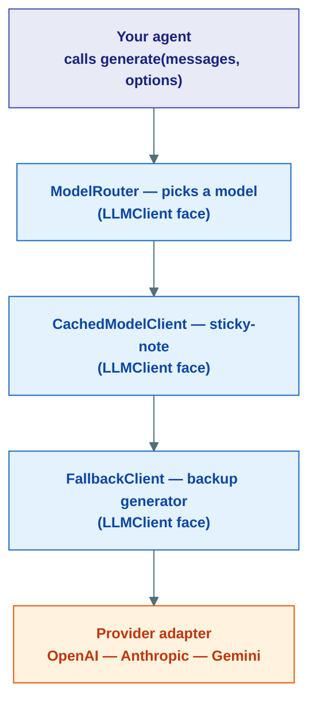
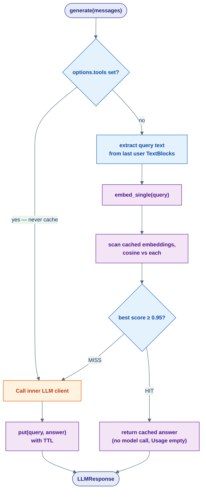
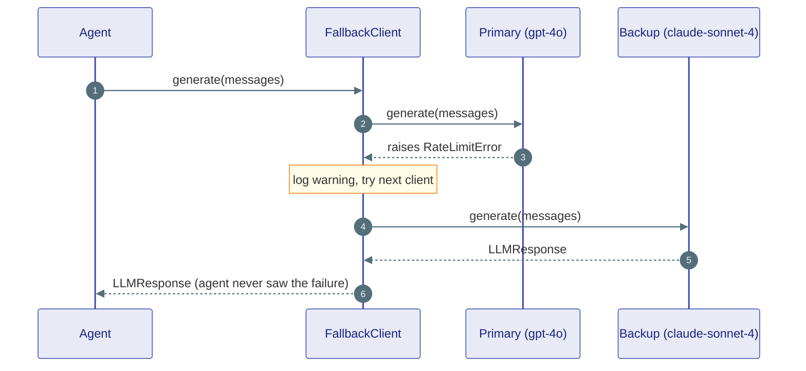
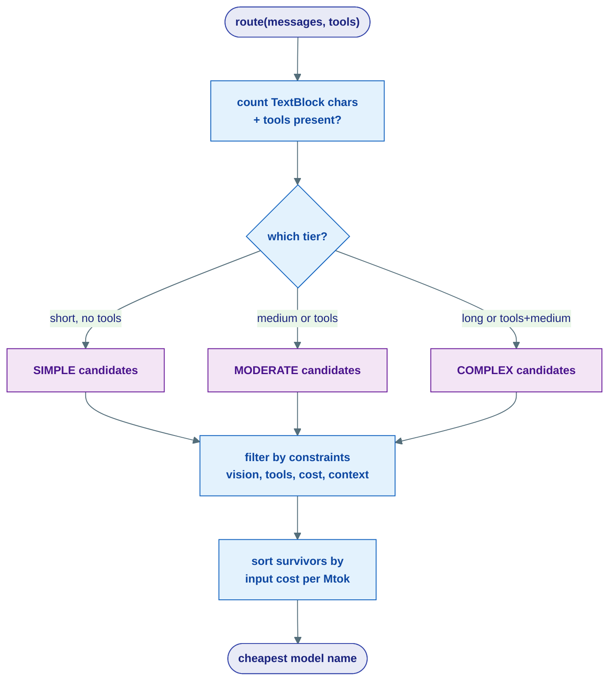
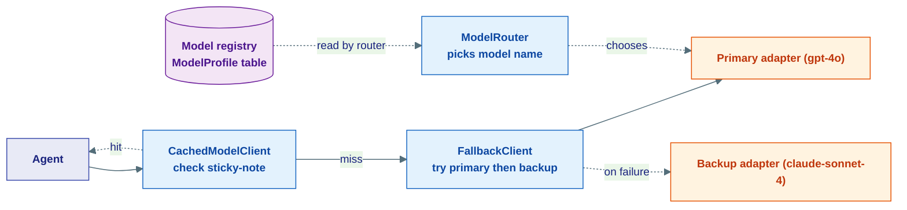

# The LLM Stack

## What this is, in one line

This is a set of **wrapper clients** that sit *between* your agent and a real model provider — adding caching, automatic failover, and cost-aware model routing — **without the agent ever knowing they are there**.

!!! note "The analogy: nesting adapters on one wall socket"
    The kernel gives you a single wall socket: the [`LLMClient`](../kernel/02-llm.md) contract. Every wrapper on this page plugs **into** that socket and **exposes the same socket** on its own face. So you can keep stacking them, like nesting power adapters, and the agent above still just plugs into "a socket":

    - **`SemanticCache` / `CachedModelClient`** = a sticky-note of the last answer. Same question? Hand back the note instead of asking again.
    - **`FallbackClient`** = a backup generator. Primary provider trips a breaker? Switch to the backup so the lights stay on.
    - **`ModelRouter`** = a receptionist. Easy question goes to the cheap intern, hard question goes to the expensive expert.

Everything here lives in `agents/llm/` — the **L1 (agents)** layer. These are *concrete* implementations built on the **frozen kernel (L0)** contract. They may import from `kernel` but never from `capabilities` (L2) or `fabric` (L3).

---

## The big idea: decorators that all wear the same face

The kernel defines [`LLMClient`](../kernel/02-llm.md) as a **Protocol** — a *shape*, not a base class. Any object with `model`, `generate()`, `generate_stream()`, and `count_tokens()` **is** an `LLMClient`. No inheritance required.

Every wrapper on this page takes an inner `LLMClient` (or several), does something extra, and re-exposes the **exact same four methods**. That makes them **decorators**: each one is an `LLMClient` *and* contains an `LLMClient`. The agent calls `generate(...)`; it cannot tell whether the thing it called was a raw provider client or a five-layer onion.



Each box wears the same `LLMClient` face. Peel one off and the agent above does not notice.

!!! tip "Order is composable — because every wrapper is an `LLMClient`"
    Since each wrapper *accepts* an `LLMClient` and *is* an `LLMClient`, you can stack them in **any order** that makes sense for you. Cache-then-fallback, fallback-then-cache, router on the outside — all valid wirings. The agent code is identical no matter which onion you build. (See [the kernel contract](../kernel/02-llm.md) for the four methods every layer must keep honoring.)

### The wrapper clients at a glance

| Wrapper | What it adds | When to use |
|---|---|---|
| `CachedModelClient` (`cached_client.py`) | Short-circuits the LLM when a *semantically similar* query was already answered | Repetitive / FAQ-style traffic where the same questions recur |
| `SemanticCache` (`cache.py`) | The Redis-backed store that powers the above (embed, cosine-match, TTL) | Injected into `CachedModelClient` — you rarely call it directly |
| `FallbackClient` (`fallback.py`) | Tries a primary client, falls through to backups on any exception | Production reliability — survive a provider outage or rate limit |
| `ModelRouter` (`router.py`) | Picks the cheapest model that fits the prompt's estimated complexity | Cost control across a mix of easy and hard prompts |

The model **registry** (`models.py`) is not a wrapper — it is the lookup table the router and cost estimators read from. We cover it first.

---

## The model registry — describing every model

Before the router can pick "the cheapest model that fits," something has to *know* what each model costs and can do. That something is the **model registry** in `agents/llm/models.py`.

A `ModelProfile` is a frozen dataclass describing one model — its provider, context window, prices, and capabilities:

```python
@dataclass(frozen=True)
class ModelProfile:
    name: str
    provider: str                  # "openai" | "anthropic" | "gemini" | "groq"
    context_length: int            # max input tokens
    max_output_tokens: int

    input_cost_per_mtok: float = 0.0   # USD per 1M input tokens
    output_cost_per_mtok: float = 0.0  # USD per 1M output tokens

    supports_vision: bool = False
    supports_tools: bool = True
    supports_thinking: bool = False
    supports_prompt_caching: bool = False
    aliases: tuple[str, ...] = ()      # e.g. "claude-sonnet-4" -> the dated id
```

All profiles live in one list (`_MODELS`). At import time, `_build_registry()` flattens them into a dict **keyed by both the canonical name and every alias**, so a lookup by `"claude-sonnet-4"` and by `"claude-sonnet-4-20250514"` both resolve to the same profile:

```python
MODEL_REGISTRY: dict[str, ModelProfile] = _build_registry()

def get_model_profile(model: str) -> ModelProfile | None:
    return MODEL_REGISTRY.get(model)           # name OR alias

def estimate_cost(model: str, input_tokens: int, output_tokens: int) -> float:
    profile = get_model_profile(model)
    if not profile:
        return 0.0
    return (profile.input_cost_per_mtok * input_tokens / 1_000_000
            + profile.output_cost_per_mtok * output_tokens / 1_000_000)
```

The helpers are the registry's whole public surface: `get_model_profile`, `get_context_length`, `estimate_cost`, and `list_models(provider=None)`.

!!! note "The registry has zero I/O"
    `models.py` is a static table of facts — no network calls, no API keys. It is the *map*; the [provider adapters](../kernel/02-llm.md) are the *territory*. The router reads the map to choose; the adapter drives there.

---

## `SemanticCache` + `CachedModelClient` — the sticky-note of last answers

### The plain-English idea

Two users ask "How do I reset my password?" and "I forgot my login." Different words, **same meaning**. A normal cache (keyed by exact text) misses both the second time. A *semantic* cache asks: "Is the *meaning* of this query close to one I have answered before?" If yes, it hands back the saved answer and **never calls the model**.

It does this with embeddings — turning each query into a vector (a [GPS coordinate for meaning](../kernel/02-llm.md)) and measuring **cosine similarity**. If the closest stored query is within `threshold` (default `0.95`), that is a HIT.

### `SemanticCache` — the store

`SemanticCache` (in `cache.py`) holds the embeddings and answers in Redis. Its two core methods are `get` and `put`:

```python
async def get(self, query: str) -> str | None:
    query_embedding = await self._embedding.embed_single(query)
    best_score, best_response = 0.0, None
    async for key in self._redis.scan_iter(match=f"{prefix}*", count=100):
        data = await self._redis.hgetall(key)
        cached_embedding = _unpack_embedding(data[b"embedding"])
        score = _cosine_similarity(query_embedding, cached_embedding)
        if score > best_score:
            best_score, best_response = score, data[b"response"].decode("utf-8")
    if best_score >= self._threshold and best_response is not None:
        return best_response          # HIT
    return None                       # MISS
```

A few things worth knowing:

- It embeds the query with the kernel's [`EmbeddingClient`](../kernel/02-llm.md) (`embed_single`).
- Embeddings are packed to raw bytes (`struct.pack`) for compact Redis storage.
- Entries carry a **TTL** (`ttl`, default 1 hour) so stale answers expire on their own.
- `_cosine_similarity` is a tiny pure-Python dot-product / norm — no extra dependency.

### `CachedModelClient` — the decorator

`CachedModelClient` (in `cached_client.py`) is the wrapper that wears the `LLMClient` face. It checks the cache *before* delegating to the inner client, and saves the answer *after*:

```python
async def generate(self, messages, *, options=GenerationOptions(), ctx=None) -> LLMResponse:
    cacheable = not options.tools                 # never cache tool-calling turns
    if cacheable:
        query_text = self._extract_query(messages)
        if query_text:
            cached = await self._cache.get(query_text)
            if cached is not None:
                return LLMResponse(content=[TextBlock(text=cached)], usage=Usage())

    result = await self._inner.generate(messages, options=options, ctx=ctx)

    if cacheable and result.content:
        response_text = "".join(
            part.text for part in result.content if isinstance(part, TextBlock)
        )
        if query_text and response_text:
            await self._cache.put(query_text, response_text)
    return result
```

Two important details:

- **Tool calls are never cached** (`cacheable = not options.tools`). A turn where the model might invoke a tool must always run live.
- **Streaming bypasses the cache** entirely — `generate_stream` just forwards to the inner client.

!!! note "`_extract_query` pulls text out of `TextBlock`s — not raw strings"
    A `ChatMessage`'s `content` is a **list of `ContentBlock` objects**, not a plain string. So the cache key is built by walking the most recent `user` message and joining the `.text` of every `TextBlock` — ignoring images, tool blocks, and the like:

    ```python
    text_parts = [b.text for b in content if isinstance(b, TextBlock)]
    if text_parts:
        return " ".join(text_parts)
    ```

    Treating the content as a bare string here would silently produce empty keys and a cache that never hits.

### Hit vs. miss, end to end



---

## `FallbackClient` — the backup generator

### The plain-English idea

A single provider can fail: rate limit, timeout, 500, key revoked. `FallbackClient` (in `fallback.py`) holds an **ordered list** of clients. It tries the first; on *any* exception it logs a warning and tries the next; if **all** fail, it re-raises the **last** exception. Its public `model` is just the **primary's** model — so to the agent it still looks like one client.

```python
def __init__(self, clients: list[LLMClient]) -> None:
    if not clients:
        raise ValueError("FallbackClient requires at least one client")
    self._clients = clients

async def generate(self, messages, *, options=GenerationOptions(), ctx=None) -> LLMResponse:
    last_exc = None
    for i, client in enumerate(self._clients):
        try:
            return await client.generate(messages, options=options, ctx=ctx)
        except Exception as exc:
            last_exc = exc
            logger.warning("FallbackClient: client %d (%s) failed: %s", i, client.model, exc)
    raise last_exc
```



### The streaming caveat

Non-streaming failover is clean: nothing left the building until a client *fully* succeeded, so swapping clients is invisible. Streaming is different. Once you have **yielded chunks to the consumer**, you cannot fail over — a second client would start a *new* answer on top of a half-emitted one, corrupting the stream. `_do_stream` guards this with a `yielded` flag:

```python
async def _do_stream(self, messages, *, options, ctx=None):
    last_exc = None
    for i, client in enumerate(self._clients):
        yielded = False
        try:
            async for chunk in client.generate_stream(messages, options=options, ctx=ctx):
                yielded = True
                yield chunk
            return
        except Exception as exc:
            last_exc = exc
            if yielded:                 # chunks already left — cannot recover
                logger.warning("stream failed after emitting output — cannot fail over")
                raise
            logger.warning("stream from client %d (%s) failed: %s", i, client.model, exc)
    if last_exc:
        raise last_exc
```

!!! warning "Streaming failover only works *before the first chunk*"
    If a streaming client fails **before** emitting anything (`yielded` is still `False`), `FallbackClient` quietly moves to the next client. But if it fails **after** even one chunk has reached the consumer, the wrapper **re-raises immediately** instead of switching — concatenating two partial streams would corrupt the output. So: streaming gives you *connect-time* resilience, not *mid-stream* resilience. If you need bulletproof failover, prefer non-streaming `generate()` where the whole response is atomic.

---

## `ModelRouter` — the receptionist

### The plain-English idea

Not every prompt needs your most expensive model. "What's 2 + 2?" should go to a cheap, fast model; "Refactor this 8-file module and explain the tradeoffs" deserves the strong one. `ModelRouter` (in `router.py`) estimates a prompt's **complexity tier**, then returns the **cheapest model** in that tier that satisfies your constraints.

### Step 1 — estimate complexity

`estimate_complexity` uses a simple, fast heuristic: the **total length of text** across all messages (plus whether tools are present). Crucially, it measures text by pulling it out of `TextBlock`s — the same content shape the cache handles — not by treating content as a string:

```python
def estimate_complexity(self, messages, *, tools=None, hint=None) -> ComplexityTier:
    if hint is not None:
        return hint                    # caller can force a tier

    total_chars = 0
    for msg in messages:
        content = getattr(msg, "content", None)
        if isinstance(content, str):
            total_chars += len(content)
        elif isinstance(content, list):
            for part in content:       # ContentBlock list — measure TextBlock text
                if isinstance(part, TextBlock):
                    total_chars += len(part.text)

    has_tools = bool(tools)
    if total_chars > 10_000 or (has_tools and total_chars > 2_000):
        return ComplexityTier.COMPLEX
    if has_tools or total_chars > 500:
        return ComplexityTier.MODERATE
    return ComplexityTier.SIMPLE
```

The three tiers each map to a list of candidate models, cheap to strong:

| Tier | Trigger (roughly) | Default candidates |
|---|---|---|
| `SIMPLE` | short prompt, no tools | `gpt-4.1-nano`, `gpt-4.1-mini`, `gemini-2.0-flash`, `claude-haiku-4` |
| `MODERATE` | medium prompt, or any tools | `gpt-4.1`, `gpt-5-mini`, `gpt-4o`, `gemini-2.5-flash`, `claude-sonnet-4` |
| `COMPLEX` | long prompt, or tools + medium length | `o3`, `o4-mini`, `gemini-2.5-pro`, `claude-opus-4` |

### Step 2 — pick the cheapest model that fits

`route` filters the tier's candidates through optional `RouteConstraints` (require vision, tools, thinking, a cost ceiling, preferred providers, a minimum context length), then **sorts the survivors by `input_cost_per_mtok` and returns the cheapest**:

```python
candidates = self._tiers.get(complexity, [])
valid = [(name, p) for name in candidates
         if (p := all_profiles.get(name)) and _passes(p, constraints)]
valid.sort(key=lambda x: x[1].input_cost_per_mtok)   # cheapest first
return valid[0][0] if valid else (candidates[0] if candidates else "gpt-4.1-mini")
```

If nothing satisfies the constraints it falls back to the first candidate in the tier (and ultimately `"gpt-4.1-mini"`), logging a warning rather than raising.

!!! note "The router returns a model *name*, not a client"
    `route(...)` hands you back a string like `"gpt-4.1-mini"`. It is a *decision*, not a connection. You (or the wiring layer) then build the actual `LLMClient` for that model. This keeps the router pure — it reads the registry and reasons about cost; it never touches the network.



---

## Composing the stack

Because all three wrappers are `LLMClient`s that *accept* an `LLMClient`, you build the stack by nesting constructors. A common production wiring is **Router decides the model, then Cache, then Fallback, then the provider client**:

```python
from substrate.agents.llm.router import ModelRouter
from substrate.agents.llm.cache import SemanticCache
from substrate.agents.llm.cached_client import CachedModelClient
from substrate.agents.llm.fallback import FallbackClient
from substrate.integrations.llm import LLMFactory

# 1) Router picks a model name for this request (a decision, not a client)
router = ModelRouter()
model_name = router.route(messages, tools=tools)

# 2) Build the chosen provider client + a backup, wrapped for failover
primary = LLMFactory(model_name, api_key).build()
backup  = LLMFactory("claude-sonnet-4-20250514", api_key).build()
resilient = FallbackClient(clients=[primary, backup])

# 3) Wrap that in a semantic cache
cache = SemanticCache(embedding_client=embed_client, redis_url=redis_url)
await cache.connect()
client = CachedModelClient(inner=resilient, cache=cache)

# 4) The agent just calls generate() — oblivious to all of the above
resp = await client.generate(messages, options=options)
```

The agent holds `client` and calls `generate(...)`. It cannot tell that behind one method call sits a cache check, a failover loop, and a provider adapter — because **every layer keeps the same `LLMClient` face**.



---

## Where this lives

| Piece | Location |
|---|---|
| `LLMClient`, `EmbeddingClient` re-exports | `agents/llm/client.py` (canonical: `kernel/llm/llm.py`) |
| `ModelProfile`, `MODEL_REGISTRY`, `get_model_profile`, `estimate_cost` | `agents/llm/models.py` |
| `SemanticCache` (embed + cosine + Redis store) | `agents/llm/cache.py` |
| `CachedModelClient` (caching decorator) | `agents/llm/cached_client.py` |
| `FallbackClient` (failover + streaming guard) | `agents/llm/fallback.py` |
| `ModelRouter`, `estimate_complexity`, `ComplexityTier`, `RouteConstraints` | `agents/llm/router.py` |
| The `LLMClient` / `EmbeddingClient` **contracts** these all satisfy | [`kernel/llm/llm.py`](../kernel/02-llm.md) |
| Concrete provider adapters (the real network calls) | `capabilities/llm/`, `integrations/llm/` |

**Next:** [Middleware & Guardrails](05-middleware-and-guardrails.md) — the interceptor pipeline that wraps an agent's *behavior* the way these clients wrap its *model calls*.
