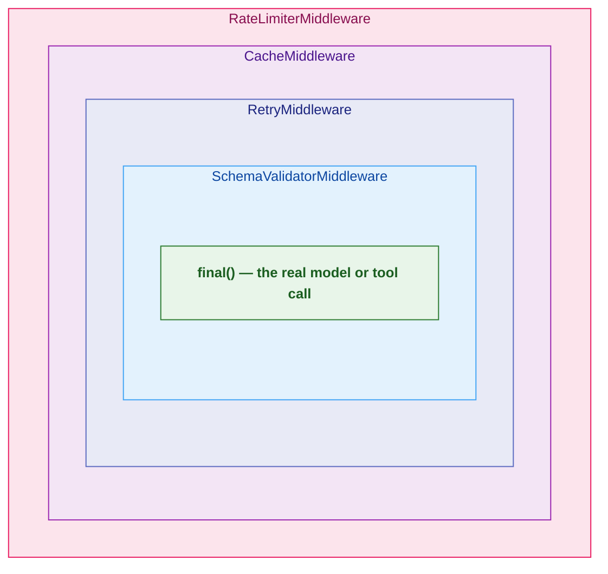
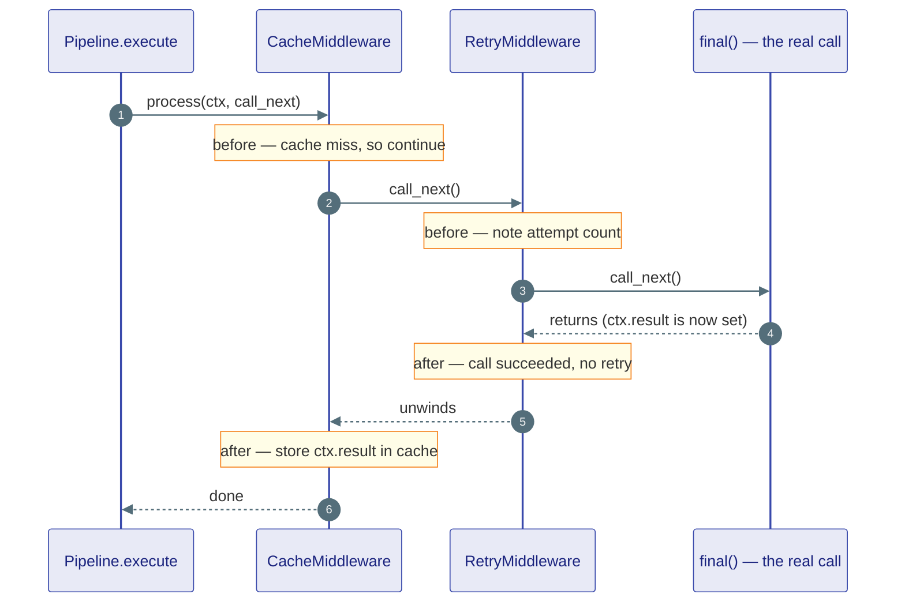
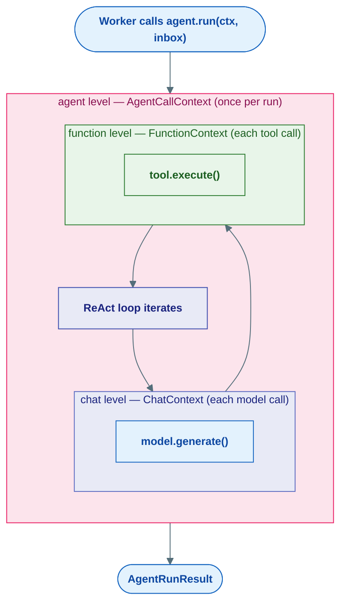
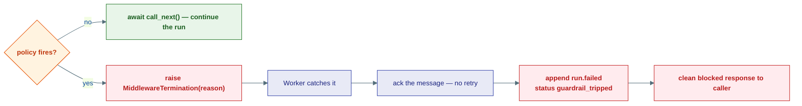
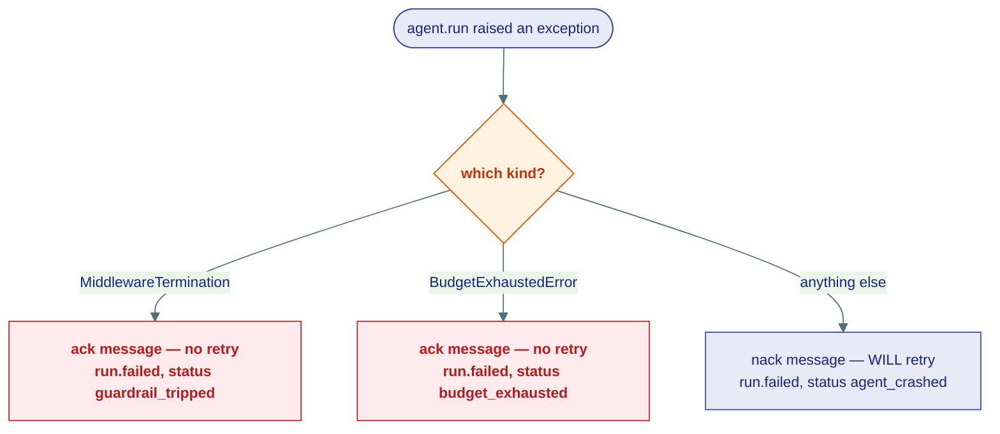

# Middleware & Guardrails

## What this is

This page is about the layers that wrap an agent's work without *being* the
agent's work. **Middleware** is the machinery that runs *around* every model
call, every tool call, and every whole run — to cache, retry, log, truncate, and
measure. **Guardrails** are a specialized branch of that same machinery whose job
is not to *help* the call but to *judge* it, and to **stop the run** when a line
is crossed.

!!! note "This is the contract-and-code page — read the stories first"
    [Middleware (concept)](../concepts/middleware.md) tells the *why* of wrapping
    cross-cutting concerns; [Guardrails (concept)](../concepts/guardrails.md)
    tells the *why* of safety checks that can halt. **This page is the precise
    L1 implementation** — the real classes, the three context types, the exact
    halt mechanism. We cross-link heavily and try not to repeat the stories.

!!! tip "Two analogies to hold the whole page"
    **Middleware is airport security.** Your bag travels *inward* through a stack
    of stations — ID check, X-ray, metal detector — reaches the gate, then you
    walk back *outward* past the same stations. Each station can inspect you on
    the way in and on the way out.

    **A guardrail is a checkpoint that can deny boarding.** Most stations just
    look and wave you through. A guardrail is the one that, if it doesn't like
    what it sees, says *"you're not getting on this flight"* — the run stops dead.

This is the `agents/` layer (L1). It builds on the frozen kernel (L0) contracts —
`ChatMessage`, `LLMResponse`, `Tool`, `ToolExecutionResult`, and the
`MiddlewareTermination` error — but never reaches up into `capabilities` or
`fabric`.

---

## The onion model

A middleware is anything with one method, `process(context, call_next)`. The
pipeline threads many of them into nested layers around the *real* work. Each
layer runs code **before** it calls inward, hands control to the next layer with
`call_next()`, then runs code **after** as control unwinds back out.



The request travels **inward** to the core, the response travels **outward** in
reverse. A layer has three moves:

- **Wrap** — do work, `await call_next()`, do more work. The normal onion.
- **Short-circuit** — skip `call_next()` entirely. Inner layers never run. This is
  exactly how the cache returns a stored hit.
- **Abort** — raise `MiddlewareTermination`. Inner layers never run, and the run
  stops. This is exactly how a guardrail blocks.

### The contract

`MiddlewareProtocol` is the whole interface. It is generic over the context type
(`ContextT_contra` is contravariant, so a middleware written against a base
context still works for a more specific one).

```python
class MiddlewareProtocol(Protocol[ContextT_contra]):
    async def process(
        self, context: ContextT_contra, call_next: Callable[[], Awaitable[None]]
    ) -> None: ...
```

Every layer has the same skeleton — *before*, *inward*, *after*:

```python
class TimingMiddleware:
    async def process(self, context, call_next):
        start = time.monotonic()                                  # ── before
        await call_next()                                         # ── go inward
        context.metadata["elapsed"] = time.monotonic() - start    # ── after
```

!!! note "Middleware returns nothing — the context IS the channel"
    `process` returns `None`. It never *returns* a value. Instead it **reads and
    writes a shared `context` object** that flows through the whole chain: read
    the inputs before `call_next()`, read or mutate `context.result` /
    `context.metadata` after.

### How the pipeline builds the chain

`MiddlewarePipeline.execute(context, final)` does one clever thing: it folds the
list of middlewares into a recursive `call_next()` chain, where the *innermost*
`call_next()` is `final` — the actual work being wrapped.

```python
class MiddlewarePipeline(Generic[ContextT]):
    def __init__(self, middlewares=None) -> None:
        self._middlewares = list(middlewares or [])

    def add(self, middleware) -> None:
        self._middlewares.append(middleware)

    async def execute(self, context, final) -> None:
        async def build_chain(idx: int) -> None:
            if idx >= len(self._middlewares):
                await final(context)              # innermost: do the real work
                return
            # this middleware's call_next() is "run the next index"
            await self._middlewares[idx].process(context, lambda: build_chain(idx + 1))

        await build_chain(0)
```

So `MiddlewarePipeline([A, B, C])` produces the call tree
`A( B( C( final ) ) )`. The first middleware in the list is the **outermost**
layer of the onion.

### Watching the chain unwind



---

## The three context types

Middleware wraps three *different things*, so there are three context dataclasses
in `_contracts.py`. Each one carries the inputs going in and a `result` slot
coming out, plus a free-form `metadata` dict for layers to scribble on. They all
live as plain dataclasses — no I/O, no surprises.

| Context | Wraps | Key fields | Result type |
|---|---|---|---|
| `AgentCallContext` | A whole `agent.run()` | `agent_name`, `run_id`, `session_id`, `messages` | `AgentRunResult` |
| `ChatContext` | A single model call | `agent_name`, `run_id`, `messages`, `system_instructions`, `tools` | `LLMResponse` |
| `FunctionContext` | A single tool call | `agent_name`, `run_id`, `function_name`, `arguments` | `ToolExecutionResult` |

```python
@dataclass
class ChatContext:
    agent_name: str
    run_id: str
    messages: list[ChatMessage]
    system_instructions: str
    tools: list[Tool] | None
    result: LLMResponse | None = None
    metadata: dict[str, Any] = field(default_factory=dict)
```

`AgentRunResult` is the terminal output of a whole run, also defined here (in
`_contracts.py`, to avoid a circular import with `react.py`):

```python
@dataclass
class AgentRunResult:
    output: str
    status: str  # "success" | "error" | "max_iterations" | "paused"
    tool_calls: list[ToolCallRecord] = field(default_factory=list)
    run_id: str = ""
    error: str | None = None
```

!!! tip "These contexts map 1:1 to the three attach levels"
    `AgentCallContext` ↔ **agent** level, `ChatContext` ↔ **chat** level,
    `FunctionContext` ↔ **function** level. Pick a middleware's level by which
    context it accepts — that decision is made just by the type its `process`
    signature declares. More on levels in [the attach-levels section](#the-three-attach-levels).

---

## The built-in middlewares

These ship in `agents/middleware/*.py`. Each is a plain class with a `process`
method — no base class, no registration.

| Middleware | Level (context) | What it does |
|---|---|---|
| `CacheMiddleware` | function | Returns a stored `ToolExecutionResult` for an identical `(function_name, args)` — **short-circuits** by skipping `call_next()` |
| `RetryMiddleware` | chat | Re-runs the inner call on transient errors with exponential backoff + jitter |
| `RateLimiterMiddleware` | agent | Token-bucket limiter — raises `MiddlewareTermination` when the bucket is empty |
| `SchemaValidatorMiddleware` | chat | Parses model output against a Pydantic schema, stashes the parsed object in `context.metadata` |
| `AuditLoggerMiddleware` | agent | Logs RUN START / END / ERROR with timing for compliance |
| `AgentTracingMiddleware` / `ChatTracingMiddleware` | agent / chat | OpenTelemetry spans (falls back to DEBUG logs if OTel is absent) |
| `ContentTruncatorMiddleware` | function | Trims an over-long tool result to `max_chars` |
| `HistoryTruncatorMiddleware` | chat | Drops oldest non-system messages to keep the window under `max_messages` |
| `FileValidatorMiddleware` | function | Vets file-path arguments (existence, extension, size) — raises `MiddlewareTermination` on a bad file |

### A short-circuit example: the cache

`CacheMiddleware` is the canonical short-circuit. On a hit it sets the result and
**returns without calling inward** — the tool never actually runs:

```python
async def process(self, context: FunctionContext, call_next) -> None:
    key = self._make_key(context)               # sha256 of {function, args}
    if key in self._cache:
        context.metadata["_cache_hit"] = True
        context.result = self._cache[key]
        return                                  # ← skip call_next() — short-circuit

    context.metadata["_cache_hit"] = False
    await call_next()                           # miss: run the tool for real
    self._cache[key] = context.result           # then remember the result
```

### A wrap-and-retry example

`RetryMiddleware` wraps `call_next()` in a loop, sleeping with backoff between
attempts and re-raising once `max_retries` is exhausted:

```python
async def process(self, context: ChatContext, call_next) -> None:
    attempt = 0
    while True:
        try:
            await call_next()
            return
        except self.retryable_exceptions as exc:
            if attempt >= self.max_retries:
                raise                                   # give up — propagate
            delay = _backoff(attempt, self.base_delay, self.max_delay, self.jitter)
            await asyncio.sleep(delay)
            attempt += 1
```

### Why `SchemaValidator` writes to `metadata`

`SchemaValidatorMiddleware` runs **after** the model answers, validates the text
against a Pydantic schema you put in `context.metadata["response_schema"]`, and
stores the parsed object back in `context.metadata["parsed"]`.

!!! warning "`LLMResponse` is frozen — the parsed object cannot live on it"
    `LLMResponse` is a frozen, slotted dataclass; you cannot attach a `parsed`
    attribute to it. So the validator deliberately puts its output in
    `context.metadata`, not on `context.result`. Downstream code reads
    `context.metadata["parsed"]` and `context.metadata["schema_valid"]`.

```python
async def process(self, context: ChatContext, call_next) -> None:
    await call_next()                                    # let the model answer first
    schema = context.metadata.get("response_schema")
    if schema is None or context.result is None:
        return
    text = context.result.content[0].text               # first TextBlock
    try:
        obj = schema.model_validate_json(text)
        context.metadata["parsed"] = obj                # ← parsed object lives here
        context.metadata["schema_valid"] = True
    except Exception as exc:
        context.metadata["schema_valid"] = False        # fail open — don't halt
```

---

## The three attach levels

Because middleware wraps three different things, it attaches at three levels.
Each level is the natural home for a different family of checks, and each level
sees its matching context type as control flows through one turn of the agent
loop.



| Level | Context | Runs | Good home for |
|---|---|---|---|
| **agent** | `AgentCallContext` | once per `agent.run()` | input/prompt checks, rate limiting, audit logging |
| **chat** | `ChatContext` | around every model call | token caps, retry, history truncation, output judging |
| **function** | `FunctionContext` | around every tool call | caching, PII checks, tool-arg validation, file checks |

!!! note "How wiring works today"
    `ReActAgent` accepts a single `middleware: MiddlewarePipeline`, and the
    **Worker** runs it at the **agent** level — it wraps the whole `agent.run`:

    ```python
    # agents/runtime/worker.py
    if middleware is not None:
        await middleware.execute(ctx, lambda c: agent.run(c, inbox_msgs))
    else:
        await agent.run(ctx, inbox_msgs)
    ```

    The chat and function levels are the same pattern applied around the
    model call and the tool call inside the loop. The level a middleware belongs
    to is fixed by the context type its `process` signature accepts — a
    `ChatContext` middleware is a chat middleware, a `FunctionContext` middleware
    is a function middleware.

### Composing a pipeline

Order the list **outermost-first** — index 0 is the outer onion layer:

```python
from agent_substrate.agents.middleware import (
    MiddlewarePipeline, RateLimiterMiddleware, CacheMiddleware,
    RetryMiddleware, SchemaValidatorMiddleware,
)

pipeline = MiddlewarePipeline([
    RateLimiterMiddleware(max_rate=60),   # outermost
    CacheMiddleware(),
    RetryMiddleware(max_retries=3),
    SchemaValidatorMiddleware(),          # innermost, closest to the real call
])
agent = ReActAgent("bot", model=model, middleware=pipeline)
```

---

## Guardrails: middleware that can deny boarding

Guardrails are an ordinary middleware family with one defining behaviour: when
their policy fires, they **halt the run by raising `MiddlewareTermination`**.
They don't transform the call — they judge it and either let it pass (`call_next`)
or block it (`raise`).

`MiddlewareTermination` is a kernel error (`kernel/core/errors.py`) and carries a
human-readable `.message`. Its whole purpose is to be an *intentional* stop, not
a crash.

| Guardrail | Level | What it catches |
|---|---|---|
| `PromptInjectionMiddleware` | agent | "ignore previous instructions", "jailbreak", "developer mode", and similar override attempts in the last message |
| `ContentFilterMiddleware` | agent | Banned keywords or regex patterns in the last message |
| `MaxTokenMiddleware` | chat | Input over a token budget (uses `tiktoken` if available, else a chars/token estimate) |
| `LLMJudgeMiddleware` | chat | Unsafe model *output*, classified by a secondary LLM |
| `PIIDetectionMiddleware` | function | Email / phone / SSN / credit-card / IP patterns leaking into tool arguments |
| `ToolCallValidationMiddleware` | function | Calls to blocked tools, calls outside an allow-list, or blocked argument patterns |

### How a guardrail halts

The shape is uniform: do the check around `call_next()`; if the policy fires,
raise. `MaxTokenMiddleware` checks **before** the call (it's gating the input):

```python
async def process(self, context: ChatContext, call_next) -> None:
    total_text = "".join(
        " ".join(b.text for b in m.content if isinstance(b, TextBlock)) + " "
        for m in context.messages
    )
    token_count = self._count_tokens(total_text.strip())
    if token_count > self.max_tokens:
        raise MiddlewareTermination(          # ← hard stop, before the model runs
            f"MaxToken: Input too long: {token_count} tokens — limit is {self.max_tokens}"
        )
    await call_next()
```

`LLMJudgeMiddleware` checks **after** the call (it's judging the output), and is
the one guardrail that uses a *second* model — its own `LLMClient` — to classify:

```python
async def process(self, context: ChatContext, call_next) -> None:
    await call_next()                                   # let the primary model answer
    if not context.result:
        return
    text = " ".join(b.text for b in context.result.content if isinstance(b, TextBlock))
    try:
        judgment = await self._classify(text)           # ask the JUDGE model
        if not judgment.get("safe", True):
            raise MiddlewareTermination(
                f"LLMJudge flagged as unsafe: {judgment.get('reason')}"
            )
    except MiddlewareTermination:
        raise                                           # a real block — propagate it
    except Exception as e:
        logger.warning("[LLMJudge] error — failing open: %s", e)   # judge itself broke
```



---

## The Worker treats a trip as a block, not a crash

When `MiddlewareTermination` propagates all the way out of `agent.run`, the
**Worker** catches it in its exception handler and recognizes it as a guardrail
trip — distinct from a budget exhaustion and, crucially, from an unexpected
crash:

```python
# agents/runtime/worker.py — terminal exception handling
is_guardrail = isinstance(exc, MiddlewareTermination)
is_budget    = isinstance(exc, BudgetExhaustedError)
is_crash     = not is_guardrail and not is_budget

if is_guardrail or is_budget:
    for msg in inbox_msgs:
        await self._inbox.ack(agent.id, msg.id)      # ack — do NOT retry
else:
    for msg in inbox_msgs:
        await self._inbox.nack(agent.id, msg.id, error=str(exc))  # crash — retry

if is_guardrail:
    payload = {"error": f"Request blocked: {exc.message}", "status": "guardrail_tripped"}
# ... then append run.failed with this payload, release the lease as FAILED
```

The three outcomes diverge exactly here:



!!! note "Why ack, not nack?"
    A guardrail trip is the *correct* outcome — the request *should* be blocked.
    Re-running it would just trip the guardrail again. So the Worker **acks** the
    message (consumes it, no redelivery), writes `run.failed` with
    `status: "guardrail_tripped"`, and returns a clean blocked response. A genuine
    crash instead **nacks**, so the durable runtime can retry it. See
    [Durability](../concepts/durability.md) for what retry-on-crash looks like.

---

## Fail-open vs. fail-closed

Not every guardrail should halt on every problem. There is one convention worth
internalizing:

!!! warning "The fail-open / fail-closed convention"
    - **Policy violation → fail CLOSED.** The check *worked* and found something
      bad. Raise `MiddlewareTermination` and block the action. (Prompt injection
      matched, PII detected, token limit exceeded.)
    - **The guardrail's OWN machinery errored → fail OPEN.** The check itself
      broke (the judge model timed out, a parser blew up). Log a warning and let
      the run continue — don't take the agent down over your own hiccup.

    `LLMJudgeMiddleware` is the textbook case: it re-raises a real
    `MiddlewareTermination` (fail closed) but swallows any *other* exception with
    a warning (fail open). `SchemaValidatorMiddleware` also fails open — a parse
    failure sets `schema_valid = False` rather than halting.

Choose per guardrail based on which mistake is worse for your use case: letting
bad content through (a false negative) or blocking good content on an
infrastructure blip (a false positive).

### Composing guardrails

Guardrails are middleware, so they compose in a `MiddlewarePipeline` like
anything else — order them outermost-first:

```python
from agent_substrate.agents.middleware import MiddlewarePipeline
from agent_substrate.agents.middleware.guardrails import (
    PromptInjectionMiddleware, MaxTokenMiddleware, PIIDetectionMiddleware,
)

pipeline = MiddlewarePipeline([
    PromptInjectionMiddleware(),          # agent — check input first
    MaxTokenMiddleware(max_tokens=8000),  # chat  — bound cost
    PIIDetectionMiddleware(),             # function — vet tool arguments
])
agent = ReActAgent("bot", model=model, middleware=pipeline)
```

---

## Where this lives

| Piece | Location |
|---|---|
| `MiddlewarePipeline`, `MiddlewareProtocol` | `agents/middleware/pipeline.py` |
| Context types + `AgentRunResult`, `ToolCallRecord` | `agents/middleware/_contracts.py` |
| Built-in middlewares (`Cache`, `Retry`, `RateLimiter`, …) | `agents/middleware/*.py` |
| Observability (`AgentTracing`, `ChatTracing`) | `agents/middleware/observability.py` |
| Guardrail middlewares | `agents/middleware/guardrails/` |
| `MiddlewareTermination` | `kernel/core/errors.py` |
| Pipeline executed around the run + trip handling | `agents/runtime/worker.py` |
| Public exports | `agents/middleware/__init__.py` |

**Next:** [Tools: Toolbox & Invoker](06-tools.md) — how agents act on the world,
and the dispatch path that function-level middleware and guardrails wrap.
