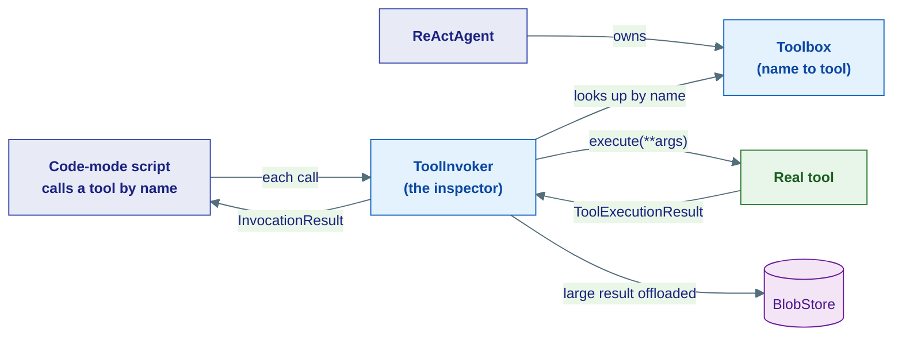
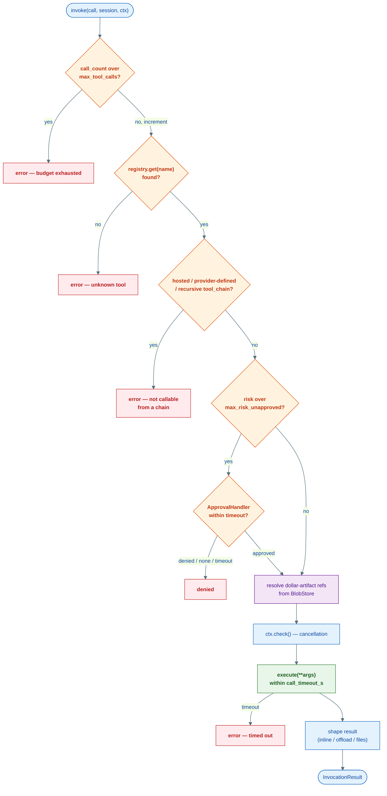
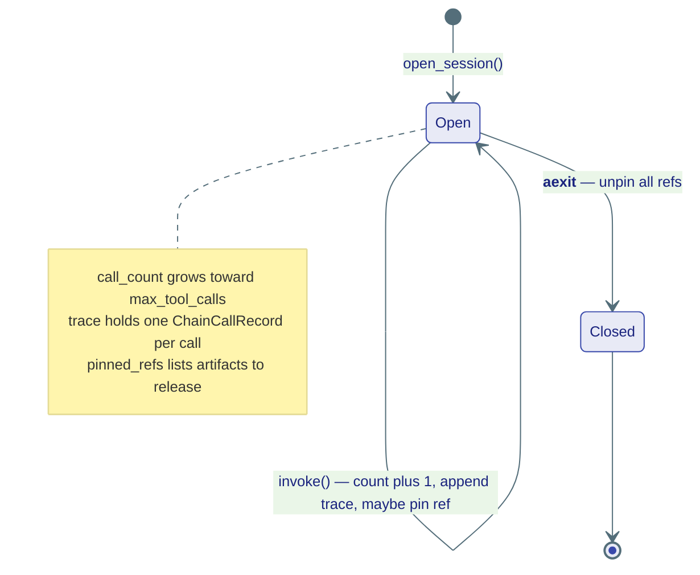
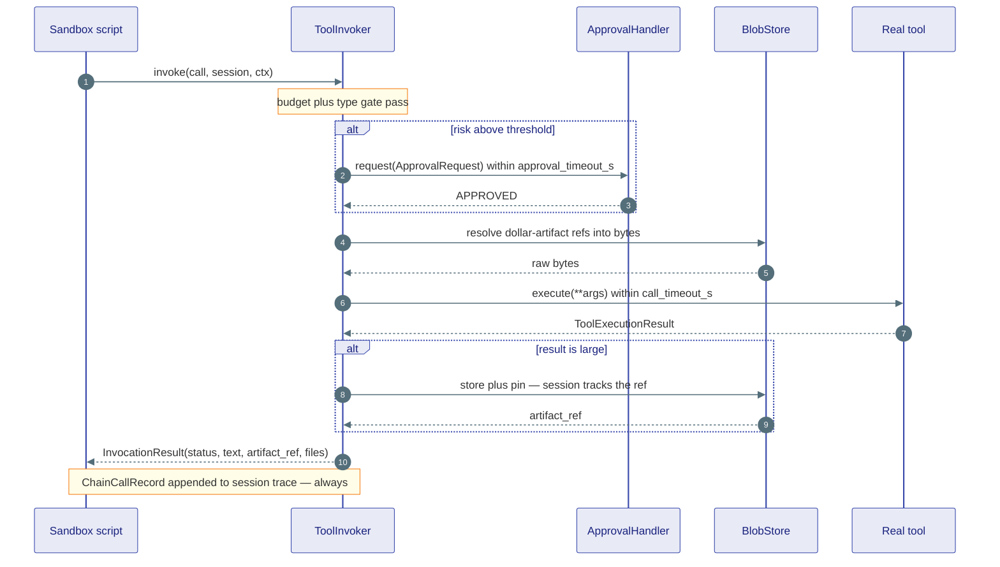

# Tools (the agents layer)

## What this is

The [kernel](../kernel/04-tools.md) wrote the *rules* of tools — what a tool is,
how risky it is, what a result looks like. This page is the **agents layer (L1)**
that finally puts those rules to work. Two concrete classes live here:

- **`Toolbox`** — a name-keyed bag that holds every tool an agent owns.
- **`ToolInvoker`** — the one place a *chained* (code-mode) tool call must pass
  through before and after it runs.

Picture a workshop. **`Toolbox`** is the labelled toolbox on the bench: every
tool has a slot with its name on it, you reach in by name and pull one out.
**`ToolInvoker`** is the safety inspector standing at the door: before any tool
is used inside a script it checks the permit, the danger rating, and the budget —
and after the tool runs it inspects what came back, shrinking anything too big to
carry by hand. No tool gets used in a chain without walking past the inspector.

!!! note "This is the runtime, not the contract"
    The frozen types these classes consume — `Tool`, `ToolRisk`,
    `ToolExecutionResult`, `ChainPolicy`, `InvocationResult` — are documented in
    [Kernel: Tool Contracts](../kernel/04-tools.md). The *story-level* tour of how
    a model picks a tool and gets a result is in [Concepts: Tools](../concepts/tools.md),
    which already walks the invoker's seven enforcement steps at a high level.
    This page stays inside `agents/tools/` and shows the **real code** that
    implements all of it.



---

## Toolbox — the labelled toolbox

**What it is:** the concrete implementation of the kernel `ToolRegistry`
Protocol — an in-memory `dict[str, AnyTool]` keyed by tool name. **Why it
exists:** something has to *hold* the tools and let the rest of the framework
look one up by name. `Toolbox` is that something.

`AnyTool` is the kernel union `Tool | HostedTool | ProviderDefinedTool` — so a
`Toolbox` happily stores all three kinds side by side (see the
[taxonomy](../kernel/04-tools.md#1-three-kinds-of-tool)).

The core surface is three small methods:

```python
class Toolbox:
    def __init__(self) -> None:
        self._tools: dict[str, AnyTool] = {}

    def add(self, tool: AnyTool) -> None:        # put a tool in its slot
        self._tools[tool.name] = tool

    def get(self, name: str) -> AnyTool | None:  # reach in by name
        return self._tools.get(name)

    def all(self) -> list[AnyTool]:              # tip the whole box out
        return list(self._tools.values())
```

That is the whole registry. `add` is keyed by `tool.name`, so adding two tools
with the same name keeps the last one. Beyond the three core methods there are a
few conveniences — `names()`, `by_risk(risk)`, `__len__`, and `name in toolbox`
membership — plus the schema helpers (`schemas()`, `schema_for()`,
`deferred_schemas()`) that turn each tool into the wire shape an LLM expects (a
function schema for local tools, the first `provider_specs` entry for
hosted/provider-defined ones, and a respect for per-tool `defer_loading`).

### A list of tools becomes a Toolbox for free

You rarely build a `Toolbox` by hand. When you hand a plain `list` of tools to a
[`ReActAgent`](01-agent-types.md), the constructor wraps it for you:

```python
# in ReActAgent.__init__
if isinstance(tools, list):
    from substrate.agents.tools.toolbox import Toolbox
    tb = Toolbox()
    for t in tools:
        tb.add(t)
    self.tools = tb
else:
    self.tools = tools     # already a ToolRegistry — used as-is
```

So both of these are valid, and end up identical inside the agent:

```python
agent = ReActAgent("bot", model=model, tools=[CalculatorTool(), WebSearchTool()])

box = Toolbox(); box.add(CalculatorTool()); box.add(WebSearchTool())
agent = ReActAgent("bot", model=model, tools=box)
```

!!! tip "When to build the box yourself"
    Pass a `list` for one-off agents. Build a shared `Toolbox` once (e.g. in the
    monolith lifespan) when several agents must share the *same* tool collection —
    wire once, reuse everywhere.

---

## ToolInvoker — the safety inspector

**What it is:** the single enforcement chokepoint for **programmatic / chained**
tool calls. **Why it exists:** when the model writes a small Python script that
calls tools as functions (code-mode chaining), those calls bypass the normal
agent loop. The `ToolInvoker` is the gate that makes them obey *exactly* the same
risk, approval, timeout, and budget rules the loop enforces — no shortcuts.

!!! note "Scope: the invoker is for *chains*, not every tool call"
    A tool the model calls directly in a normal turn is dispatched by the
    [agent loop](01-agent-types.md). The `ToolInvoker` governs the *other* path:
    tool calls that come from inside a sandboxed chain script via
    [`ToolChainTool`](#how-this-connects-to-the-rest-of-the-framework). Both
    paths honour the same kernel `ToolRisk` / `ApprovalHandler` contracts.

One invoker is built per process lifespan and shared across all chains. It holds
four collaborators, all kernel-typed:

```python
class ToolInvoker:
    def __init__(
        self,
        registry: ToolRegistry,                       # where tools are looked up (a Toolbox)
        approval_handler: ApprovalHandler | None = None,  # HITL; absent = deny all non-SAFE
        artifact_store: BlobStore | None = None,      # large-data backend; absent = always inline
        policy: ChainPolicy | None = None,            # timeouts, budget, inline threshold
        hooks: HookManager | None = None,             # lifecycle hooks (TOOL_START / TOOL_END)
    ) -> None: ...
```

Two design choices are worth reading twice: with **no `approval_handler`**, any
non-`SAFE` tool is denied outright (the inspector with no manager to call says
"no"); with **no `artifact_store`**, every result is returned inline (nowhere to
offload large data, so nothing gets offloaded).

### The enforcement pipeline

Every chained call enters through `invoke()`, which is a thin wrapper:

```python
async def invoke(self, call, *, session, ctx=None, progress_sink=None) -> InvocationResult:
    start_ms = ...
    if self._hooks:                                   # (a) hooks: TOOL_START
        await self._hooks.dispatch(HookEvent.TOOL_START, {"tool_name": call.name})
    try:
        result = await self._invoke_inner(call, session=session, ctx=ctx, ...)
        status = result.status
        return result
    except Exception as exc:                          # any blow-up becomes a clean error result
        return InvocationResult(status="error", text=f"Invoker error: ...")
    finally:
        if self._hooks:                               # (b) hooks: TOOL_END (always)
            await self._hooks.dispatch(HookEvent.TOOL_END, {...})
        session._trace.append(ChainCallRecord(...))   # (c) trace: always recorded
```

The two things `invoke()` guarantees **on every outcome** (success, denial,
crash, timeout): the `TOOL_END` hook fires, and a `ChainCallRecord` is appended
to the session trace. That trace is what gives at-most-once safety — on a retry,
the model can see that step 2 already sent its email and won't send it twice.

The real work is `_invoke_inner()`. Here is its pipeline, in execution order:

| # | Gate | What happens | Outcome on failure |
|---|---|---|---|
| 1 | **Budget** | `session._call_count >= policy.max_tool_calls`? then increment the counter | `status="error"` — budget exhausted |
| 2 | **Registry lookup** | `tool = registry.get(name)` | `status="error"` — unknown tool |
| 3 | **Type gate** | reject `is_hosted_tool`, `is_provider_defined_tool`, and the recursive `tool_chain` name | `status="error"` — can't call from a chain |
| 4 | **Risk / approval** | if `tool.risk` exceeds `policy.max_risk_unapproved`, ask the `ApprovalHandler` with a bounded `approval_timeout_s` | `status="denied"` — no handler, timeout, or refused |
| 5 | **Inbound ref resolution** | replace any `{"$artifact": "<ref>"}` arg with real bytes fetched from the `BlobStore` | warn and keep the ref on resolve failure |
| 6 | **ctx check** | `ctx.check()` to honour cancellation before dispatch | raises if the run was cancelled |
| 7 | **Progress** | emit a `TOOL_CALL` step to the `progress_sink` so UIs see inside the chain | — |
| 8 | **Execute** | `tool.execute(ctx=ctx, **args)` wrapped in `asyncio.wait_for(call_timeout_s)` | `status="error"` — timed out |
| 9 | **Progress** | emit a `TOOL_RESULT` step | — |
| 10 | **Result shaping** | inline small results, offload large ones, turn media into files | always returns an `InvocationResult` |



### Step 4 in detail — the approval gate with a bounded wait

Risk is compared with an integer ordering (`SAFE` 0, `HIGH` 1, `CRITICAL` 2)
against the policy's `max_risk_unapproved`:

```python
tool_risk = ToolRisk(getattr(tool, "risk", ToolRisk.SAFE))
if _RISK_ORDER[tool_risk] > _RISK_ORDER[policy.max_risk_unapproved]:
    if self._approval is None:
        return InvocationResult(status="denied", text="... no ApprovalHandler ...")
    try:
        decision = await asyncio.wait_for(
            self._approval.request(ApprovalRequest(call=call, risk=tool_risk, ...)),
            timeout=policy.approval_timeout_s,
        )
    except TimeoutError:
        return InvocationResult(status="denied", text="... timed out ...")
    if decision != ApprovalDecision.APPROVED:
        return InvocationResult(status="denied", text="... approval denied ...")
```

!!! warning "A slow human yields 'denied', never a hang"
    `approval_timeout_s` (55 s default) is deliberately **below** `call_timeout_s`
    (60 s). A human who takes too long simply produces `status="denied"` with
    guidance to call the tool directly outside the chain — the sandbox is never
    blocked indefinitely. This is the same `ChainPolicy` invariant noted in the
    [kernel chain contracts](../kernel/04-tools.md#4-code-mode-chaining-contracts).

### Step 5 — inbound ref resolution (big data never enters the sandbox)

When one chained tool returns something large, it comes back as an
`artifact_ref` rather than the bytes themselves. When the *next* tool is called
with that ref, `_resolve_inbound_refs()` swaps the ref for real bytes **on the
server side**, before `execute()`:

```python
for k, v in arguments.items():
    if isinstance(v, dict) and "$artifact" in v:
        ref = str(v["$artifact"])
        resolved[k] = await self._store.resolve(ref)   # bytes — not the model's
    else:
        resolved[k] = v
```

The 200 MB CSV never round-trips through the model or the sandbox heap — only the
short ref does.

### Step 10 — result shaping (inline, offload, or file)

`_shape_result()` decides how the result travels back to the script:

- **Media blocks** (`ImageBlock` with data) → stored in the `BlobStore`, pinned,
  recorded on the session, and surfaced as a `ChainFile` at a real workspace path
  like `/workspace/media/<tool>_0.png`.
- **Small text** (`len(text_bytes) <= max_inline_result_bytes`, or no store) →
  returned **inline** in `InvocationResult.text`.
- **Large text** → stored in the `BlobStore`, pinned, recorded on the session,
  and returned as a `preview` plus an `artifact_ref` the next call can pass along.

### InvocationResult statuses

Every call comes back as exactly one of these (the kernel `InvocationResult` only
defines three; `ChainCallRecord` in the trace can additionally read `timeout`):

| `status` | Means | Set when |
|---|---|---|
| `"ok"` | Tool ran, result returned | `execute()` succeeded and `is_error` was false |
| `"error"` | The call failed | unknown / wrong-type tool, budget exhausted, execution timeout, `is_error` result, or an invoker crash |
| `"denied"` | Policy refused the call | risk above threshold with no handler, approval timeout, or an explicit `DENIED`/`SKIPPED` decision |

---

## InvokerSession — per-chain scratchpad

**What it is:** the small bundle of mutable state for *one* chain run. **Why it
exists:** the `ToolInvoker` is shared by every chain, so it must stay stateless.
All the per-chain counters live in the session instead. You get one from
`open_session()` and pass it into every `invoke()` of that chain:

```python
class InvokerSession:
    def __init__(self, invoker: ToolInvoker) -> None:
        self._invoker = invoker
        self._call_count: int = 0                # drives the budget gate
        self._trace: list[ChainCallRecord] = []  # one record per call, every outcome
        self._pinned_refs: list[str] = []        # artifacts to unpin at the end
```

It exposes read-only views (`session.trace`, `session.call_count`) and — most
importantly — it is an **async context manager**. On exit, `close()` unpins every
artifact the chain pinned, so large intermediate results don't leak:

```python
session = invoker.open_session()
async with session:
    r1 = await invoker.invoke(call_1, session=session, ctx=ctx)
    r2 = await invoker.invoke(call_2, session=session, ctx=ctx)
    # ... budget counted across both, trace holds both records
# on exit: every pinned artifact is unpinned
```

!!! tip "Always use `async with` for the session"
    Forgetting to `close()` leaks pinned artifacts in the `BlobStore`. The
    `async with` form guarantees the unpin even if the chain raises.



### A full chained call, end to end



---

## How this connects to the rest of the framework

- **Kernel contracts (L0).** Everything the invoker touches is a frozen kernel
  type: it gates on `ToolRisk`, builds `ApprovalRequest`s for the
  `ApprovalHandler` Protocol, returns the `InvocationResult` value type, and
  records `ChainCallRecord`s — all defined in
  [`kernel/tools/`](../kernel/04-tools.md). `Toolbox` is the concrete
  implementation of the kernel `ToolRegistry` Protocol.

- **Capabilities (L2): `ToolChainTool`.** Code-mode chaining is driven by
  `ToolChainTool` in `capabilities/tools/chain/`. It runs the model's script in a
  sandbox and routes **every** in-script tool call back across a bridge to *this*
  invoker. That round-trip is why a script can't dodge risk, approval, timeout,
  or budget — the inspector is unavoidable. The kernel only describes the chain
  *value types*; the running machinery is `ToolChainTool` (L2) talking to
  `ToolInvoker` (L1).

!!! note "InvokerSession lives in agents, not in the kernel"
    The kernel `chain.py` deliberately stays pure data (`ChainPolicy`,
    `InvocationResult`, `ChainFile`, `ChainCallRecord`, `ChainRunResult`). The
    *session* abstraction — the mutable counter, trace, and pin list — is a
    runtime concern, so it lives **here** in `agents/tools/invoker.py`, not in
    `kernel/tools/chain.py`. The kernel side stays replayable and shippable; the
    moving parts stay one layer up.

---

## Where this lives

| Piece | Location |
|---|---|
| `Toolbox` (the `ToolRegistry` impl) | `agents/tools/toolbox.py` |
| `ToolInvoker`, `InvokerSession` | `agents/tools/invoker.py` |
| `ChainPolicy`, `InvocationResult`, `ChainFile`, `ChainCallRecord` (contracts) | `kernel/tools/chain.py` |
| `ToolRisk`, `ToolRegistry`, `is_hosted_tool`, `is_provider_defined_tool` | `kernel/tools/tools.py` |
| `ApprovalHandler`, `ApprovalRequest`, `ApprovalDecision` | `kernel/tools/approval.py` |
| `HookManager`, `HookEvent` (TOOL_START / TOOL_END) | `agents/hooks/` |
| `ToolChainTool` + bridge + prelude (the chain driver) | `capabilities/tools/chain/` |
| List-to-`Toolbox` wrapping in the agent | `agents/core/react.py` |

**Next:** [Supervision, Budgets & Hooks](07-supervision-and-hooks.md) — the
headcount, spend, and lifecycle-hook machinery that wraps an agent run (and that
feeds the `HookManager` the invoker fires `TOOL_START` / `TOOL_END` into).
