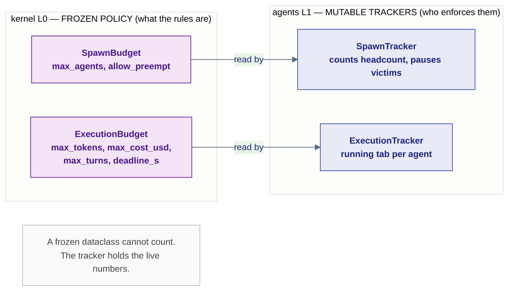
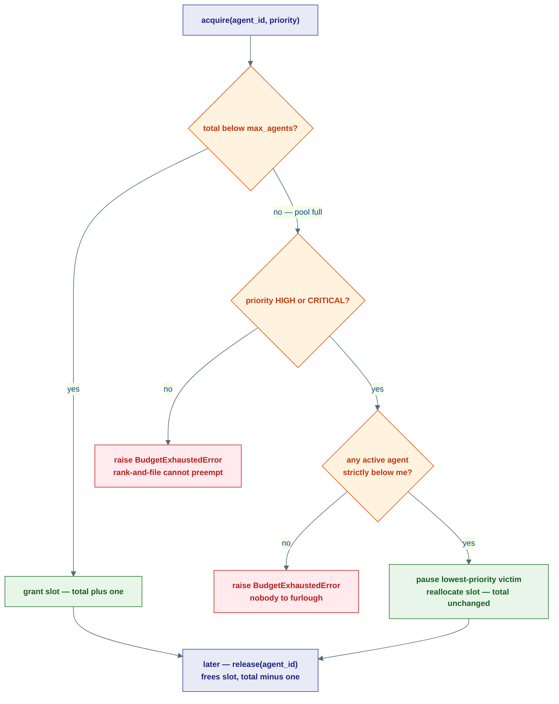
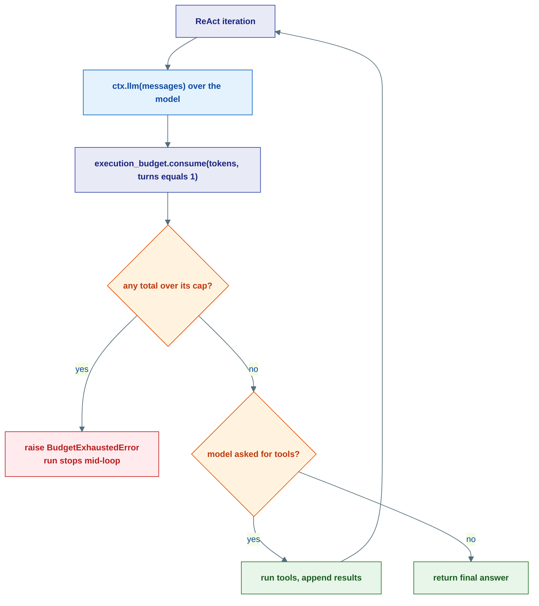
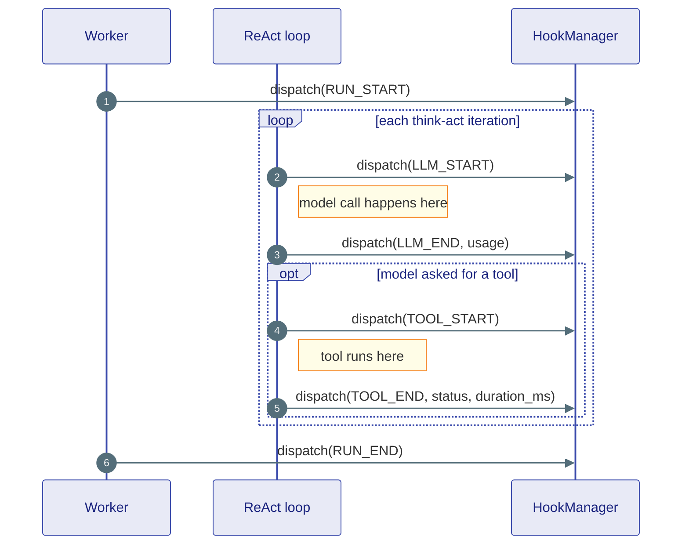

# Supervision & Hooks: Enforcing Policy, Watching the Run

## The big idea

The kernel (layer L0) writes the **rules** for a multi-agent run as frozen
policy: *how many agents may exist* (`SpawnBudget`), *how much each one may spend*
(`ExecutionBudget`), and *how important each branch is* (`Priority`). But a frozen
dataclass cannot count. It says "no more than 50 agents" — it does not know that
12 are running right now.

That counting is this layer's job. The `agents/` layer holds the **mutable
trackers** that turn the kernel's frozen policy into something actually enforced:

- a `SpawnTracker` that knows the live headcount and who to pause,
- an `ExecutionTracker` that keeps each agent's running tab,
- a `HookManager` that lets you *watch* the run without ever touching it.

!!! note "Policy here, enforcement next door — and the story pages"
    This page is the **enforcement** companion to the kernel contracts in
    [Agent Policy: Supervision, Context, Middleware](../kernel/06-agent.md), which
    documents the frozen `Supervision`, `SpawnBudget`, `ExecutionBudget`, and
    `Priority` shapes. For the *narrative* of why these exist, read
    [Supervision & Budgets](../concepts/supervision.md) and
    [Hooks](../concepts/hooks.md). This page stays inside `agents/` and shows the
    real trackers — the classes that hold the counters.



| Kernel policy (L0, frozen) | Agents tracker (L1, mutable) | Scope | What the tracker counts |
|---|---|---|---|
| `SpawnBudget` | `SpawnTracker` | **Run-wide** — one tracker per run | live agent headcount + the paused set |
| `ExecutionBudget` | `ExecutionTracker` | **Per-agent** — one tracker per agent | tokens, cost, turns spent so far |
| (lifecycle, not a budget) | `HookManager` | **Per-agent** — registered observers | nothing — it only *notifies* |

---

## `SpawnTracker` — the HR system tracking headcount

**What it is, in one line:** the run-wide authority that knows how many agents are
alive right now and refuses to let the tree hire past its cap.

**The analogy.** `SpawnBudget` is the company's **hiring cap** written into the
charter ("no more than 20 people on this project"). `SpawnTracker` is the **HR
system** that actually tracks current headcount, hands out a slot when someone is
hired, takes the slot back when they leave, and — when the cap is full but an
urgent role needs filling — decides **who to furlough** so the important hire can
start.

It lives in `agents/supervision/budget.py` and is created once per run from the
kernel's `SpawnBudget`:

```python
from ravi.kernel.agent.supervision import Supervision, SpawnBudget, Priority
from ravi.agents.supervision.budget import SpawnTracker

supervision = Supervision.root(orchestrator_id, spawn_budget=SpawnBudget(max_agents=20))
tracker = SpawnTracker(supervision.spawn_budget)
```

The root agent already counts as 1, so the tracker starts at `_total = 1`.

### Two orthogonal mechanisms

The docstring names them precisely:

- **headcount** — `max_agents` is a shared pool for the whole run. Every spawned
  agent consumes one slot via `acquire()`, and `release()` returns it so
  temporary helpers don't permanently drain the quota.
- **priority** — when the pool is full, a `HIGH`/`CRITICAL` agent can **preempt** a
  lower-priority active agent by issuing it a cooperative pause signal. The paused
  agent checks `is_paused()` before each LLM call and stops spawning new work; its
  slot is reallocated to the higher-priority requester without waiting for it to
  finish.

### `acquire(agent_id, priority)` — claim a slot or preempt

This is the one method called before every spawn. It has exactly three outcomes:

```python
def acquire(self, agent_id: AgentId, priority: Priority = Priority.NORMAL) -> None:
    with self._lock:
        if self._total < self._max_agents:
            self._active[agent_id] = priority      # room → grant immediately
            self._total += 1
            return

        # Pool is full.
        if priority <= Priority.NORMAL:            # NORMAL or below → denied
            raise BudgetExhaustedError(...)

        # HIGH/CRITICAL: try to preempt the lowest-priority victim below us.
        candidates = [(aid, p) for aid, p in self._active.items() if p < priority]
        if not candidates:
            raise BudgetExhaustedError(...)        # nobody outranked → denied

        victim_id, _ = min(candidates, key=lambda x: x[1].value)
        self._paused.add(victim_id)                # furlough the victim
        self._active[agent_id] = priority          # reallocate — total UNCHANGED
```

Three rules to remember:

1. **Room available** → anyone gets a slot, regardless of priority. `_total` goes up by 1.
2. **Full + you're `NORMAL` or below** → `BudgetExhaustedError`. No preemption for the rank-and-file.
3. **Full + you're `HIGH`/`CRITICAL`** → the *lowest-priority active agent strictly below you* is added to `_paused`, and you take its slot. `_total` stays the same — a furlough is a reallocation, not a new hire. If everyone alive already outranks (or ties) you, you are also denied.



### `release()`, `is_paused()`, and `reprioritize()`

- **`release(agent_id)`** — removes the agent from `_active` and from `_paused`,
  and decrements `_total` (never below 1, so the root's slot is never lost). The
  orchestrator calls this in a `finally` so a crashed child still returns its slot.
- **`is_paused(agent_id)`** — the cooperative half of preemption. A furloughed
  agent polls this before each LLM call; when `True` it should stop spawning new
  work and return a partial result (`status="paused"`).
- **`reprioritize(agent_id, new_priority)`** — change a live agent's rank mid-run.
  Demote below `NORMAL` while the pool is full and it gets auto-paused; promote a
  paused agent to `NORMAL`+ and its pause is lifted.

!!! tip "Cooperative, not forced"
    Preemption never kills anyone. The tracker only *sets a flag*; the victim
    notices and yields on its own. Pausing is polite — which is exactly why an
    agent must check `is_paused()` at its yield points for preemption to work.

### Who uses it: `OrchestratorAgent`

`OrchestratorAgent` (in `agents/core/orchestrator.py`) is the concrete consumer.
It builds one `SpawnTracker` per run and, each time the model delegates to a
sub-agent, runs the acquire → spawn → ask → release dance:

```python
spawn_tracker = SpawnTracker(self._spawn_budget)
...
spawn_tracker.acquire(cfg.agent.id, priority=cfg.priority)   # claim or preempt
try:
    handle = await ctx.spawn(cfg.agent.id, boot=...)         # start child run
    outcome = await ctx.ask(handle, ..., timeout=cfg.ask_timeout)
finally:
    spawn_tracker.release(cfg.agent.id)                      # always give it back
```

---

## `RetryPolicy` — how many times to restart a crashed agent

**What it is, in one line:** a tiny per-agent retry counter — restart a failed
agent up to `max_retries` times, then give up.

It lives next to `SpawnTracker` in `agents/supervision/policies.py`. There is no
exponential backoff or jitter here — it is deliberately a plain ceiling on attempts:

```python
class RetryPolicy:
    """Restarts a failed agent up to *max_retries* times, then gives up."""

    def __init__(self, max_retries: int = 3) -> None:
        self.max_retries = max_retries
        self._counts: dict[AgentId, int] = {}

    def should_retry(self, agent_id: AgentId) -> bool:
        count = self._counts.get(agent_id, 0)
        if count < self.max_retries:
            self._counts[agent_id] = count + 1   # bump the attempt count
            return True
        return False

    def reset(self, agent_id: AgentId) -> None:
        self._counts.pop(agent_id, None)         # clear after a success
```

The pattern: a supervisor calls `should_retry(agent_id)` after a crash; each call
**both checks and increments** the count, returning `True` while attempts remain
and `False` once the ceiling is hit. Call `reset(agent_id)` after a clean run so a
later failure starts from a fresh count.

---

## `ExecutionTracker` — the running tab per agent

**What it is, in one line:** the per-agent meter that adds up tokens, cost, and
turns and trips the instant any limit is crossed.

**The analogy.** `ExecutionBudget` is an employee's **spending allowance** ("you
may spend up to $5 and 1000 tokens"). `ExecutionTracker` is the **running tab**:
every time the agent calls the model, the bartender adds the round to the tab and
checks it against the allowance. The moment the tab goes over, the tab is cut off —
`BudgetExhaustedError`.

It lives in `agents/resources/budget.py` and is a small mutable dataclass that
mirrors three of the four `ExecutionBudget` dimensions (`deadline_s` is enforced
elsewhere — by `RunMeta.check()` at the kernel boundary):

```python
@dataclass
class ExecutionTracker:
    max_tokens: int | None = None
    max_cost_usd: float | None = None
    max_turns: int | None = None
    # private running totals, not part of the constructor
    _used_tokens: int = 0
    _used_cost: float = 0.0
    _used_turns: int = 0

    def consume(self, tokens: int = 0, cost: float = 0.0, turns: int = 0) -> None:
        self._used_tokens += tokens
        self._used_cost += cost
        self._used_turns += turns
        self._check()           # raises BudgetExhaustedError if any limit exceeded
```

A limit of `None` means *unlimited for that one dimension*. `_check()` compares
each used total against its cap and raises on the first breach, with a message
naming the offending dimension (e.g. `Token budget exceeded: 4200 > 4000`).

### Wired into the ReAct loop

This is where the tab gets added up. Inside `ReActAgent._react()`, **after every
LLM call**, the agent records the round on its tracker:

```python
resp = await ctx.llm(llm_messages, options=options)
...
if self._execution_budget is not None:
    self._execution_budget.consume(
        tokens=resp.usage.total_tokens if resp.usage else 0,
        turns=1,
    )
```

If that `consume()` pushes a total over its cap, `BudgetExhaustedError` is raised
mid-loop and the run stops — no further model calls, no further spend.



!!! note "Two budgets, two trackers, two failure modes"
    A run can be stopped two ways from this page alone: too many *agents*
    (`SpawnTracker.acquire` raises) or too much *spend* by one agent
    (`ExecutionTracker.consume` raises). Both raise the same
    `BudgetExhaustedError` — read the message to tell which cap tripped.

---

## `HookManager` + `HookEvent` — the security cameras

**What it is, in one line:** a per-agent registry of read-only observers that get
notified at well-defined points in the run loop and can never change or break it.

**The analogy.** Hooks are **security cameras** mounted around the run. They
*watch* every door open and close — but they never reach out and touch anything.
A camera that catches fire is unplugged quietly; the store keeps running. Contrast
this with **middleware** (covered in [the kernel page](../kernel/06-agent.md) and
[Middleware](../concepts/middleware.md)), which is a *guard standing in the
doorway* — it can inspect, redirect, or block. The one-line rule:

- Need to **see** what happened? → **Hook** (read-only, crash-isolated, safe).
- Need to **change** what happens? → **Middleware** (in the call path).

### The lifecycle events

`HookEvent` (a `str` enum in `agents/hooks/manager.py`) names every observable
moment. You subscribe to the ones you care about:

| Event | Fires when… | Notable context keys |
|---|---|---|
| `RUN_START` | `agent.run()` begins | `agent_name`, `run_id` |
| `RUN_END` | `agent.run()` completes (success or failure) | `agent_name`, `run_id` |
| `STEP_START` | a think-act cycle begins | `agent_name`, `step` |
| `STEP_END` | a think-act cycle completes | `agent_name`, `step` |
| `LLM_START` | before a model call | `agent_name`, `run_id` |
| `LLM_END` | after the model responds | `agent_name`, `run_id`, `usage` |
| `TOOL_START` | before a tool runs | `agent_name`, `tool_name` |
| `TOOL_END` | after a tool finishes | `tool_name`, `status`, `duration_ms` |
| `GUARDRAIL_TRIP` | a guardrail forced a hard stop | `agent_name` |
| `HANDOFF` | an orchestrator delegates to a sub-agent | `agent_name` |
| `FLOW_START` | a Flow begins execution | — |
| `FLOW_END` | a Flow finishes execution | — |

Each callback receives a single read-only context `dict` (`JsonObject`). The
`LLM_END` payload carries the kernel `Usage` object (`input_tokens` /
`output_tokens`), which is how the bundled `CostTracker` totals up spend.



!!! note "Where each event is fired"
    The **Worker** dispatches `RUN_START` / `RUN_END` around the whole run; the
    **ReAct loop** (`agents/core/react.py`) dispatches `LLM_START` / `LLM_END`
    (and the tool events) in place. Your callbacks just observe — they sit off to
    the side of the real work.

### Registering hooks

Use the `on()` decorator or `register()` for programmatic wiring, then hand the
manager to the agent:

```python
from ravi.agents.hooks import HookManager, HookEvent

hooks = HookManager()

@hooks.on(HookEvent.RUN_START)
async def log_start(ctx):
    print(f"Agent {ctx['agent_name']} starting run {ctx['run_id']}")

@hooks.on(HookEvent.TOOL_END)
def track_tool(ctx):                       # sync callbacks are fine too
    metrics.timing(ctx["tool_name"], ctx["duration_ms"])

agent = ReActAgent("bot", model=model, hooks=hooks)
```

Both **async and sync** callbacks are accepted. `dispatch()` calls each one,
awaits it if it returned a coroutine, and runs every callback for an event
concurrently with `asyncio.gather`.

### Three guarantees that make hooks safe

The whole point is that you can attach observers freely. `HookManager` guarantees:

1. **Read-only.** Hooks receive a context `dict`; they cannot mutate run state.
   Need to *change* behaviour? Use middleware.
2. **Crash-isolated.** Every callback runs inside `_safe_call`, which catches and
   logs any exception. A broken metrics call is logged and swallowed — it never
   propagates into the agent and never crashes the run.
3. **Per-agent.** Hooks are registered on a `HookManager` instance handed to one
   agent, not globally — so one agent's observers never fire for another.

```python
async def _safe_call(cb: HookCallback) -> None:
    try:
        result = cb(context)
        if asyncio.iscoroutine(result):
            await result
    except Exception as e:
        logger.error("Hook error in %s for %s: %s", ..., exc_info=True)
        # swallowed — the agent keeps running
```

!!! warning "A hook can't save you from a bad run"
    Because hooks are read-only and crash-isolated, they cannot stop, retry, or
    edit a run — even a `GUARDRAIL_TRIP` hook only *observes* the trip; the
    guardrail middleware is what actually halted the agent. If you find yourself
    wanting a hook to abort the run, you want **middleware** instead.

The module also ships two ready-made hook implementations: `CostTracker`
(accumulates LLM spend from `LLM_END` usage and logs the total at `RUN_END`) and
`RunLogger` (logs every event into a bounded deque for debugging).

---

## Putting it together

A single orchestrated run uses all three at once:

```python
from ravi.kernel.agent.supervision import SpawnBudget, ExecutionBudget, Priority
from ravi.agents.resources.budget import ExecutionTracker
from ravi.agents.hooks import HookManager, HookEvent

hooks = HookManager()

@hooks.on(HookEvent.LLM_END)
async def watch_cost(ctx):                       # camera: observe only
    record(ctx["usage"])

researcher = ReActAgent(
    "researcher",
    model=model,
    execution_budget=ExecutionTracker(max_tokens=50_000, max_turns=20),  # the tab
    hooks=hooks,
)

orchestrator = OrchestratorAgent(
    "lead",
    model=model,
    sub_agents=[SubAgentConfig(agent=researcher, priority=Priority.HIGH, ask_timeout=120)],
    spawn_budget=SpawnBudget(max_agents=10, allow_preempt=True),          # the hiring cap
)
```

- The `SpawnTracker` built from `spawn_budget` caps the whole tree at 10 agents
  and lets `HIGH` work preempt lower lanes for the last slot.
- Each agent's `ExecutionTracker` cuts that agent off the instant it crosses
  50k tokens or 20 turns.
- The `HookManager` watches every model call without ever influencing the run.

---

## Where this lives

| Piece | Location |
|---|---|
| `SpawnTracker` (headcount + priority preemption) | `agents/supervision/budget.py` |
| `RetryPolicy` (per-agent restart ceiling) | `agents/supervision/policies.py` |
| `ExecutionTracker` (per-agent token / cost / turn tab) | `agents/resources/budget.py` |
| `HookManager`, `HookEvent`, `CostTracker`, `RunLogger` | `agents/hooks/manager.py` |
| `OrchestratorAgent`, `SubAgentConfig` (use `SpawnTracker`) | `agents/core/orchestrator.py` |
| `ReActAgent` (wires `ExecutionTracker` + dispatches hooks) | `agents/core/react.py` |
| `SpawnBudget`, `ExecutionBudget`, `Priority`, `Supervision` (frozen policy) | `kernel/agent/supervision.py` |
| `BudgetExhaustedError` (raised by both trackers) | `kernel/core/errors.py` |

**Next:** back to the [Agents Layer overview](index.md) — how the concrete
intelligence of L1 fits together on top of the frozen kernel.
