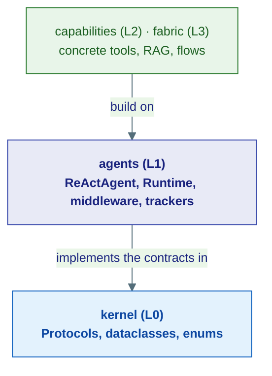
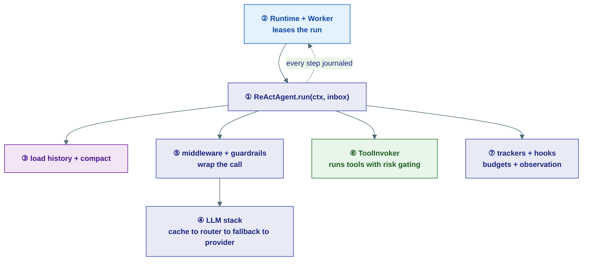

# The Agents Layer (L1)

## What this layer is (in one breath)

If the [kernel](../kernel/index.md) is the *rulebook* of empty socket shapes, the **agents layer is the first set of appliances that actually plug in**. It is the concrete intelligence of the framework: the real `ReActAgent` that thinks and acts, the real in-process runtime that drives it, the real middleware, guardrails, caches, and budget trackers.

!!! tip "The analogy"
    The kernel says *"a `HistoryProvider` must have `get_messages()`."* The agents layer says *"here is `InMemoryHistoryProvider`, which actually stores them in a dict."* Kernel = the job description. Agents = the employee who shows up and does the job.

The one rule to remember: the agents layer may import **down** from `kernel`, but never **up** from `capabilities` or `fabric`. That keeps the intelligence reusable and the dependency graph acyclic (enforced in CI by `uv run lint-imports`).

---

## Three views of the same system

The docs describe this layer at three zoom levels. Use whichever matches your question:

| Zoom level | Section | Answers |
|---|---|---|
| Story | [Core Concepts](../concepts/index.md) | *Why does this exist? What problem does it solve?* |
| Contract | [Kernel Reference](../kernel/index.md) | *What is the exact Protocol / dataclass shape?* |
| **Implementation** | **this section** | *Which concrete class does it, and how is it wired?* |

Each page below cross-links to its concept and kernel companions, so you can hop between the "why," the "what," and the "how."

---

## The seven pages, in reading order

| # | Page | What it implements | Analogy |
|---|------|--------------------|---------|
| 1 | [Agent Types](01-agent-types.md) | The kernel `Agent` Protocol — `ReActAgent`, `OrchestratorAgent`, `UserProxyAgent` | Workers who think-act-repeat |
| 2 | [The In-Process Runtime](02-runtime.md) | `EventLog`/`Journal`/`Scheduler`/`Inbox` contracts (in-memory) + `Worker` + `RunContext` | The dispatcher and the job paperwork |
| 3 | [Context, Compaction & Memory](03-context-and-memory.md) | `HistoryProvider`, `BlobStore`, `VectorStore`, `GraphStore` (in-memory) + compaction | A diary plus an editor and desk drawers |
| 4 | [The LLM Stack](04-llm-stack.md) | The kernel `LLMClient` (wrappers: cache, fallback, router) | Nesting adapters around one socket |
| 5 | [Middleware & Guardrails](05-middleware-and-guardrails.md) | The middleware pipeline + safety guardrails | Airport-security layers around the gate |
| 6 | [Tools: Toolbox & Invoker](06-tools.md) | `ToolRegistry` + the enforcement `ToolInvoker` | A toolbox plus a safety inspector |
| 7 | [Supervision, Budgets & Hooks](07-supervision-and-hooks.md) | The mutable trackers enforcing kernel budgets + lifecycle hooks | HR headcount, a running tab, security cameras |

---

## How a single run flows through this layer

One `ReActAgent` run touches almost every piece. Follow the numbers from the reading order:

---

## A few layer-wide facts worth knowing early

!!! note "Stage 0 is in-process, but the code is production-ready"
    The runtime here runs everything as in-process asyncio with no serialization. The **same** `ReActAgent` code runs durably against Postgres + Redis by swapping the injected backends (in `infrastructure/`). You write the agent once.

!!! note "Wrappers and trackers are composable by design"
    The LLM wrappers all implement `LLMClient`, so you can stack `Router → Cache → Fallback → provider` in any order. Middleware composes the same way. This is the layer's recurring pattern: small pieces that share a kernel contract and nest cleanly.

!!! warning "ContextVars must be stamped inside the Worker task"
    Things like the task-board's `agent_id`/`thread_id` ContextVars are not visible across the SSE generator → Worker task boundary. They are set inside `ReActAgent._handle_message()`, not in serving code. See [Context, Compaction & Memory](03-context-and-memory.md).

---

**Start here:** [Agent Types](01-agent-types.md)
