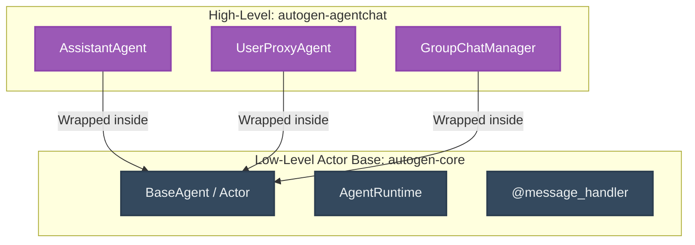
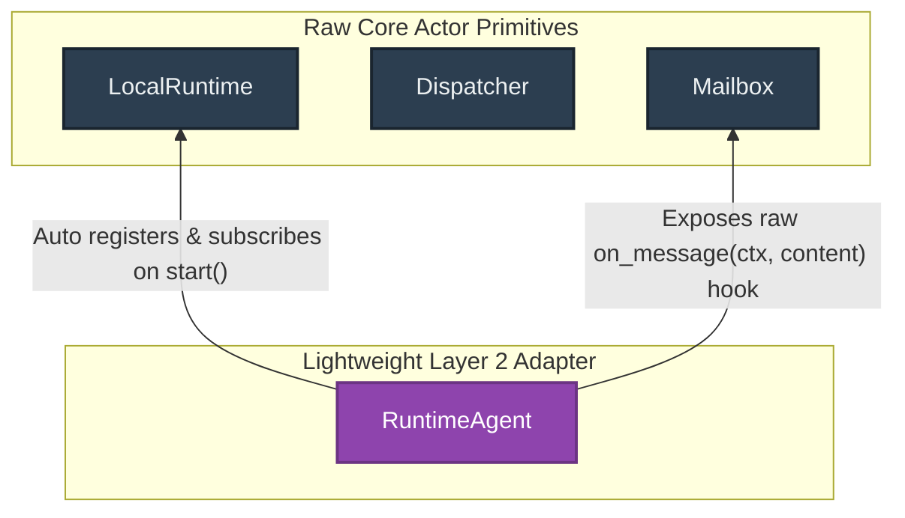

# Architectural Notes: Microsoft AutoGen 0.4 Abstraction vs. Our Lightweight Layer 2

This document analyzes the design of **Microsoft AutoGen 0.4** and compares its high-level abstractions (`autogen-agentchat`) against our **Layer 2** (`RuntimeAgent`) approach. It details why keeping abstractions minimal and declarative is critical for preserving framework flexibility and escaping the "chat-centric overengineering trap."

---

## 1. How AutoGen 0.4 Layering Works

AutoGen 0.4 split its architecture into two distinct, isolated libraries:

### The Abstraction Layers
1. **`autogen-core` (The Infrastructure)**: A pure, mathematical implementation of the **Actor Model**. Actors are registered, receive typed messages, and communicate exclusively by passing messages via a distributed runtime. It is entirely unopinionated about LLMs, Prompts, or conversational turns.
2. **`autogen-agentchat` (The Highly Opinionated Layer)**: Wraps these raw actors in high-level classes like `ConversableAgent` or `AssistantAgent`. It forces everything into a **chat-thread paradigm** with built-in memory, automatic tool call handling, and standard conversational handoffs.

---

## 2. The Danger of Over-Abstraction (Loss of Flexibility)

While `autogen-agentchat` makes it easy to stand up a simple Discord-style bot or round-robin group chat, it introduces **critical bottlenecks** that limit its usefulness for complex, custom production engines:

* **Chat-Centric Lock-In**: It assumes that every agent interaction is a conversational turn-taking dialog (e.g. sending a chat message and waiting for a text response). Real-world autonomous tasks (like reactive DAG pipelines, code-execution sandboxes, or search indexes) do not fit this model.
* **Opaque state / hidden memory**: High-level abstractions encapsulate memory and model context deeply inside the class. If you want to customize how memory is compressed, inject dynamic sliding windows, or prune history midway through a run, you have to fight the abstraction.
* **Heavy, Unyielding Tool Loops**: High-level agents automatically intercept and run tool calls inside their inner loops. If you want to route tools to external sandbox servers, implement manual human-in-the-loop approvals, or coordinate re-entrant locking, you are blocked by the pre-coded agent chat loop.

---

## 3. How Our Layer 2 (`RuntimeAgent`) Avoids This Trap

Our `RuntimeAgent` was designed explicitly to avoid the over-abstraction trap. It acts as a **pure lifecycle adapter**, not a cognitive runtime.

### Key Differences in Our Design

1. **Unopinionated Cognition**:
   * *AutoGen AgentChat*: Forces you to use their model clients, memory objects, and chat formats.
   * *Our `RuntimeAgent`*: Has **zero** opinion on how the agent thinks. It does not dictate what LLM client you use, what memory format you store, or whether it even uses LLMs at all! It is simply an actor that receives a message and yields a response.
2. **Minimal Plumbing Automation**:
   * It only automates the infrastructure boilerplate: registering with the dispatcher, subscribing to specified topics, and providing direct shorthands (`self.send()`, `self.publish()`).
3. **100% Developer Control**:
   * Because it exposes the raw `MessageContext` and `ContentBlock` directly inside the `on_message` hook, the developer retains complete, unhindered access to the core runtime, lock managers, saga coordinators, and sandboxes. You get 100% of the raw actor engine's power with none of the boilerplate.

---

## 4. Architectural Summary

| Dimension | AutoGen AgentChat | Our `RuntimeAgent` (Layer 2) |
| :--- | :--- | :--- |
| **Philosophy** | "Let us handle the chat logic for you." | "Let us automate the boilerplate, you own the logic." |
| **Flexibility** | **Low.** Difficult to break out of the chat loop. | **Maximum.** The agent loop is just custom python code in `on_message()`. |
| **Cognitive Bias** | **Chat-centric.** Hardcoded model/conversational tools. | **Neutral.** Works for reactive scripts, LLMs, or standard RPC. |
| **Boilerplate reduction** | High, but at the cost of opacity. | High, with complete transparency. |

By keeping `RuntimeAgent` lightweight, your framework achieves a massive competitive advantage: it remains **blazingly fast, simple to debug, and infinitely flexible** for advanced multi-agent orchestrations.
