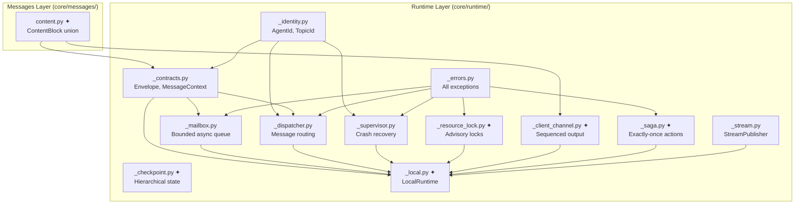

# Ravi Engine — Full Architecture Tree

> This document shows where every component lives in the engine.
> Components marked with ✦ are **new/redesigned** in this runtime overhaul.

```
ravi-engine/
├── src/
│   └── ravi/
│       │
│       ├── __init__.py                          # Package root + public API re-exports
│       ├── cli.py                               # CLI entry point (click/typer)
│       ├── console.py                           # Rich console utilities
│       ├── logger.py                            # Logging configuration
│       ├── exceptions.py                        # Top-level exception hierarchy
│       │
│       │
│       │  ╔══════════════════════════════════════════════════════════════╗
│       │  ║                    CORE — THE FOUNDATION                    ║
│       │  ║  Everything below this line is the engine kernel.           ║
│       │  ║  Zero external infrastructure required.                    ║
│       │  ╚══════════════════════════════════════════════════════════════╝
│       │
│       ├── core/
│       │   ├── __init__.py
│       │   │
│       │   │  ┌────────────────────────────────────────────────┐
│       │   │  │ RUNTIME — Actor-based message passing kernel   │
│       │   │  │ The beating heart of the agent system.         │
│       │   │  └────────────────────────────────────────────────┘
│       │   │
│       │   ├── runtime/
│       │   │   ├── __init__.py                  # Public API re-exports (all symbols)
│       │   │   ├── _identity.py                 # AgentId, TopicId (frozen, hashable value objects)
│       │   │   ├── _protocol.py                 # AgentRuntime protocol (interface every backend implements)
│       │   │   ├── _base.py                     # BaseRuntime ABC (handler registry, topic bindings)
│       │   │   ├── _contracts.py                # Envelope✦ (multimodal content, causation_id, trace_id, TTL)
│       │   │   │                                  MessageContext, MessageHandler, CancellationToken,
│       │   │   │                                  RestartPolicy, StreamDone, Subscription
│       │   │   ├── _errors.py                   # All runtime exceptions ✦ (expanded with:
│       │   │   │                                  ResourceConflictError, DeadlockDetectedError,
│       │   │   │                                  SagaFailedError, CheckpointCorruptedError,
│       │   │   │                                  EnvelopeExpiredError)
│       │   │   ├── _dispatcher.py               # Message routing table + pub/sub fan-out
│       │   │   ├── _mailbox.py                  # Bounded async mailbox with backpressure
│       │   │   ├── _supervisor.py               # Erlang-style crash recovery (one-for-one / one-for-all)
│       │   │   ├── _stream.py                   # StreamPublisher (topic-based streaming)
│       │   │   ├── _resource_lock.py          ✦ # ResourceLockManager — exclusive/shared advisory locks
│       │   │   │                                  Deadlock detection via wait-for graph
│       │   │   │                                  Prevents 2 agents from corrupting same file
│       │   │   ├── _client_channel.py         ✦ # ClientWriteChannel — sequenced multi-agent output
│       │   │   │                                  Per-agent write lanes, backpressure, attribution
│       │   │   │                                  Solves: multiple agents writing to client
│       │   │   ├── _saga.py                   ✦ # SagaCoordinator — exactly-once critical actions
│       │   │   │                                  Idempotent execution via step_id + request_hash
│       │   │   │                                  Compensating rollback (e.g., refund on failure)
│       │   │   │                                  Solves: payment recovery in fault tolerance
│       │   │   ├── _checkpoint.py             ✦ # RunCheckpoint — hierarchical tree checkpoints
│       │   │   │                                  Parent↔child linking for sub-agent state
│       │   │   │                                  Tracks resource_locks + pending_sagas
│       │   │   │                                  Solves: sub-agent checkpointing
│       │   │   ├── _local.py                  ✦ # LocalRuntime — in-process runtime (rewritten)
│       │   │   │                                  Integrates: ResourceLockManager, ClientWriteChannel,
│       │   │   │                                  SagaCoordinator, multimodal Envelope, TTL expiry
│       │   │   └── _types.py                    # Backward-compat re-exports
│       │   │
│       │   │  ┌────────────────────────────────────────────────┐
│       │   │  │ MESSAGES — Multimodal communication primitives │
│       │   │  │ list[ContentBlock] is the universal wire type  │
│       │   │  └────────────────────────────────────────────────┘
│       │   │
│       │   ├── messages/
│       │   │   ├── __init__.py                  # Re-exports
│       │   │   ├── content.py                 ✦ # ContentBlock union (Text, Image, Audio, Video,
│       │   │   │                                  Document, Data, Code, Error,
│       │   │   │                                  ToolUseBlock✦, ToolResultBlock✦, ThinkingBlock✦)
│       │   │   │                                  JsonValue, JsonObject, content_block_from_dict,
│       │   │   │                                  content_blocks_to_str
│       │   │   ├── base_message.py              # BaseClientMessage, BaseAgentMessage, BaseAgentEvent
│       │   │   ├── client_messages.py           # SystemMessage, UserMessage, AssistantMessage,
│       │   │   │                                  ToolCallMessage, ToolExecutionResultMessage
│       │   │   ├── _types.py                    # StreamChunk types
│       │   │   └── encoders/                    # Provider-specific serialization
│       │   │       ├── __init__.py
│       │   │       ├── openai.py                # OpenAI wire format encoder
│       │   │       ├── anthropic.py             # Anthropic wire format encoder
│       │   │       ├── gemini.py                # Gemini wire format encoder
│       │   │       └── storage.py               # Storage serialization
│       │   │
│       │   │  ┌────────────────────────────────────────────────┐
│       │   │  │ AGENTS — Agent implementations                 │
│       │   │  └────────────────────────────────────────────────┘
│       │   │
│       │   ├── agents/
│       │   │   ├── __init__.py
│       │   │   ├── base_agent.py                # BaseAgent ABC (run, run_stream, handle_message)
│       │   │   ├── config.py                    # Agent configuration models
│       │   │   ├── agent_result.py              # AgentRunResult (structured output)
│       │   │   ├── react_agent.py               # ReActAgent (think-act loop, tool calling)
│       │   │   ├── default_agent.py             # DefaultAgent (simple LLM wrapper)
│       │   │   ├── orchestrator_agent.py        # OrchestratorAgent (multi-agent delegation)
│       │   │   ├── graph.py                     # FlowGraph (agent topology visualization)
│       │   │   ├── flow.py                      # Flow (sequential/parallel agent pipelines)
│       │   │   ├── _tool_execution.py           # Tool execution engine
│       │   │   ├── _stream_handler.py           # Streaming response handler
│       │   │   └── _guardrail_runner.py         # Guardrail execution
│       │   │
│       │   │  ┌────────────────────────────────────────────────┐
│       │   │  │ CHECKPOINTING — Fault recovery                 │
│       │   │  └────────────────────────────────────────────────┘
│       │   │
│       │   ├── checkpointing/
│       │   │   ├── __init__.py                ✦ # Re-exports from runtime._checkpoint + legacy compat
│       │   │   ├── models.py                    # AgentCheckpoint (legacy flat model, kept for compat)
│       │   │   └── store.py                     # Legacy CheckpointStore (superseded by runtime._checkpoint)
│       │   │
│       │   │  ┌────────────────────────────────────────────────┐
│       │   │  │ RESILIENCE — Retry, circuit breaker, bulkhead  │
│       │   │  └────────────────────────────────────────────────┘
│       │   │
│       │   ├── resilience.py                    # RetryPolicy, CircuitBreaker, TimeoutPolicy, BulkheadPolicy
│       │   │
│       │   │  ┌────────────────────────────────────────────────┐
│       │   │  │ SUPPORTING MODULES                             │
│       │   │  └────────────────────────────────────────────────┘
│       │   │
│       │   ├── tools/
│       │   │   ├── __init__.py
│       │   │   ├── base_tool.py                 # BaseTool, ToolResult (no MCP dependency)
│       │   │   ├── builtin_tools.py             # Built-in tools (file, search, etc.)
│       │   │   └── catalog.py                   # Tool catalog + discovery
│       │   │
│       │   ├── llm/
│       │   │   ├── __init__.py
│       │   │   ├── base_client.py               # BaseModelClient ABC
│       │   │   ├── base_embedding_client.py     # BaseEmbeddingClient ABC
│       │   │   ├── models.py                    # LLM configuration models
│       │   │   ├── provider.py                  # Provider registry
│       │   │   ├── router.py                    # Multi-model routing
│       │   │   ├── fallback.py                  # Fallback chain
│       │   │   ├── cache.py                     # Response cache
│       │   │   └── cached_client.py             # Cached model client wrapper
│       │   │
│       │   ├── context/
│       │   │   ├── __init__.py
│       │   │   ├── base_context.py              # ModelContext ABC (builds message lists for LLM)
│       │   │   └── implementations.py           # UnboundedContext, SlidingWindowContext, etc.
│       │   │
│       │   ├── execution/
│       │   │   ├── __init__.py
│       │   │   ├── context.py                   # ExecutionContext (run_id, depth, cancellation, deadline)
│       │   │   ├── errors.py                    # MaxAgentDepthError, CircuitOpenError
│       │   │   └── pipeline.py                  # Execution pipeline
│       │   │
│       │   ├── memory/
│       │   │   ├── __init__.py
│       │   │   ├── base_memory.py               # BaseMemory ABC
│       │   │   ├── unbounded_memory.py          # In-memory implementation
│       │   │   ├── memory_scope.py              # ISOLATED / SHARED / HIERARCHICAL
│       │   │   ├── message_serializer.py        # Message serialization
│       │   │   └── session_manager.py           # Session management
│       │   │
│       │   ├── middleware/
│       │   │   ├── __init__.py
│       │   │   ├── base.py                      # BaseMiddleware, MiddlewareContext
│       │   │   ├── runner.py                    # MiddlewarePipeline
│       │   │   └── builtins/                    # Pre-built middleware
│       │   │       ├── __init__.py
│       │   │       ├── audit_logger.py
│       │   │       ├── cache.py
│       │   │       ├── content_truncator.py
│       │   │       ├── file_validator.py
│       │   │       ├── rate_limiter.py
│       │   │       ├── retry.py
│       │   │       └── schema_validator.py
│       │   │
│       │   ├── guardrails/
│       │   │   ├── __init__.py
│       │   │   ├── base_guardrail.py            # BaseGuardrail ABC
│       │   │   ├── prebuilt.py                  # Pre-built guardrails
│       │   │   └── runner.py                    # Guardrail runner
│       │   │
│       │   ├── hooks.py                         # HookManager (lifecycle events: run, step, tool, handoff)
│       │   │                                      CostTracker, RunLogger
│       │   │
│       │   ├── pipelines/                       # YAML/JSON-driven agent pipelines
│       │   │   ├── __init__.py
│       │   │   ├── schema.py                    # Pipeline schema definitions
│       │   │   ├── runner.py                    # Pipeline executor
│       │   │   ├── middleware.py                # Pipeline middleware
│       │   │   ├── codegen.py                   # Code generation from pipeline spec
│       │   │   ├── condition_runner.py          # Conditional pipeline steps
│       │   │   └── while_runner.py              # Looping pipeline steps
│       │   │
│       │   ├── rag/                             # Retrieval-Augmented Generation
│       │   │   ├── __init__.py
│       │   │   ├── pipeline.py
│       │   │   ├── chunking.py
│       │   │   ├── vector_store.py
│       │   │   ├── reranker.py
│       │   │   ├── graph_rag.py
│       │   │   ├── graph_store.py
│       │   │   └── loaders/                     # Document loaders
│       │   │       ├── __init__.py
│       │   │       ├── base.py
│       │   │       ├── text_loader.py
│       │   │       ├── pdf_loader.py
│       │   │       ├── csv_loader.py
│       │   │       └── json_loader.py
│       │   │
│       │   ├── extraction/                      # Structured data extraction
│       │   │   ├── __init__.py
│       │   │   ├── extractor.py
│       │   │   └── schemas.py
│       │   │
│       │   ├── structured/                      # Structured output (routing, judging)
│       │   │   ├── __init__.py
│       │   │   ├── parse.py
│       │   │   ├── judge.py
│       │   │   ├── router.py
│       │   │   ├── result.py
│       │   │   └── schemas.py
│       │   │
│       │   ├── storage/                         # File/blob storage abstraction
│       │   │   ├── __init__.py
│       │   │   ├── base.py
│       │   │   ├── local.py
│       │   │   ├── document.py
│       │   │   ├── encrypted.py
│       │   │   ├── factory.py
│       │   │   └── tenant.py
│       │   │
│       │   └── batch/                           # Batch processing
│       │       ├── __init__.py
│       │       ├── models.py
│       │       └── runner.py
│       │
│       │
│       │  ╔══════════════════════════════════════════════════════════════╗
│       │  ║                    INTEGRATIONS                            ║
│       │  ║  External service adapters — none required for core.       ║
│       │  ╚══════════════════════════════════════════════════════════════╝
│       │
│       ├── integrations/
│       │   ├── __init__.py
│       │   │
│       │   ├── llm/                             # LLM provider clients
│       │   │   ├── __init__.py
│       │   │   ├── factory.py                   # Provider factory
│       │   │   ├── openai/
│       │   │   │   ├── __init__.py
│       │   │   │   ├── openai_client.py
│       │   │   │   ├── openai_chat_client.py
│       │   │   │   ├── openai_embedding_client.py
│       │   │   │   └── utils.py
│       │   │   ├── anthropic/
│       │   │   │   ├── __init__.py
│       │   │   │   └── anthropic_client.py
│       │   │   └── gemini/
│       │   │       ├── __init__.py
│       │   │       ├── gemini_client.py
│       │   │       └── gemini_embedding_client.py
│       │   │
│       │   ├── runtime/                         # Distributed runtime backends
│       │   │   ├── __init__.py
│       │   │   ├── _base.py
│       │   │   ├── grpc/                        # gRPC runtime
│       │   │   │   ├── __init__.py
│       │   │   │   ├── runtime.py
│       │   │   │   └── node.py
│       │   │   ├── nats/                        # NATS runtime
│       │   │   │   ├── __init__.py
│       │   │   │   └── bridge.py
│       │   │   └── restate/                     # Restate durable execution runtime
│       │   │       ├── __init__.py
│       │   │       ├── runtime.py
│       │   │       ├── activities.py
│       │   │       ├── worker.py
│       │   │       ├── client.py
│       │   │       ├── policies.py
│       │   │       ├── workflows.py
│       │   │       └── app.py
│       │   │
│       │   ├── memory/                          # External memory backends
│       │   │   ├── __init__.py
│       │   │   ├── postgres_memory.py
│       │   │   └── redis_memory.py
│       │   │
│       │   ├── vector/                          # Vector store integrations
│       │   │   ├── __init__.py
│       │   │   └── pgvector_store.py
│       │   │
│       │   ├── storage/                         # Cloud storage
│       │   │   ├── __init__.py
│       │   │   └── s3.py
│       │   │
│       │   ├── graph/                           # Graph database
│       │   │   ├── __init__.py
│       │   │   └── age_store.py
│       │   │
│       │   ├── skills/                          # Skill extensions
│       │   │   └── __init__.py
│       │   │
│       │   ├── spotify/                         # Spotify integration
│       │   │   ├── __init__.py
│       │   │   ├── auth.py
│       │   │   └── client.py
│       │   │
│       │   └── mcp/                             # ⚠️ ARCHIVED — kept for reference only
│       │       ├── __init__.py                    DO NOT USE. All tool contracts are owned
│       │       ├── client.py                      directly by core/tools/base_tool.py now.
│       │       ├── tool.py
│       │       └── app_tools.py
│       │
│       │
│       │  ╔══════════════════════════════════════════════════════════════╗
│       │  ║                    SERVER                                   ║
│       │  ║  FastAPI application — HTTP/SSE/WebSocket surface.         ║
│       │  ╚══════════════════════════════════════════════════════════════╝
│       │
│       ├── server/
│       │   ├── __init__.py
│       │   ├── app.py                           # FastAPI app factory
│       │   ├── _lifespan.py                     # App lifecycle (startup/shutdown)
│       │   ├── context.py                       # Request context
│       │   ├── database.py                      # DB session management
│       │   ├── hooks.py                         # Server-level hook wiring
│       │   ├── models.py                        # Server data models
│       │   ├── schemas.py                       # API schemas
│       │   ├── security/
│       │   │   ├── __init__.py
│       │   │   ├── deps.py                      # Security dependencies
│       │   │   └── jwt.py                       # JWT handling
│       │   ├── routes/                          # API route handlers
│       │   │   ├── __init__.py
│       │   │   ├── chat.py                      # Chat endpoint
│       │   │   ├── threads.py                   # Thread management
│       │   │   ├── files.py                     # File upload/download
│       │   │   ├── tasks.py                     # Task management
│       │   │   ├── code_interpreter.py          # Code execution
│       │   │   ├── pipelines.py                 # Pipeline execution
│       │   │   ├── workflows.py                 # Workflow execution
│       │   │   ├── rag.py                       # RAG endpoints
│       │   │   ├── admin.py                     # Admin endpoints
│       │   │   ├── auth.py                      # Auth endpoints
│       │   │   ├── audio.py                     # Audio processing
│       │   │   ├── builder.py                   # Agent builder
│       │   │   ├── cancel.py                    # Run cancellation
│       │   │   ├── elements.py                  # UI elements
│       │   │   ├── feedback.py                  # User feedback
│       │   │   ├── hitl.py                      # Human-in-the-loop
│       │   │   ├── mcp_apps.py                  # (legacy MCP app routes)
│       │   │   ├── triggers.py                  # Event triggers
│       │   │   ├── spotify_oauth.py             # Spotify OAuth
│       │   │   └── workspace_oauth.py           # Workspace OAuth
│       │   ├── services/                        # Server-side service layer
│       │   │   ├── __init__.py
│       │   │   ├── agent_service.py
│       │   │   ├── audio_service.py
│       │   │   ├── file_service.py
│       │   │   └── thread_service.py
│       │   └── sse/                             # Server-Sent Events
│       │       ├── __init__.py
│       │       ├── bridge.py                    # SSE event bridge
│       │       └── events.py                    # SSE event types
│       │
│       │
│       │  ╔══════════════════════════════════════════════════════════════╗
│       │  ║                    MICROSERVICES                            ║
│       │  ║  Independently deployable service modules.                 ║
│       │  ╚══════════════════════════════════════════════════════════════╝
│       │
│       ├── services/
│       │   ├── __init__.py
│       │   ├── base.py                          # BaseService ABC
│       │   ├── admin/                           # Admin service
│       │   ├── agent_runtime/                   # Agent runtime service
│       │   ├── code_interpreter/                # Code interpreter service
│       │   ├── conversation/                    # Conversation management
│       │   ├── file_store/                      # File storage service
│       │   ├── gateway/                         # API gateway
│       │   ├── human_gate/                      # HITL approval service
│       │   ├── identity/                        # Identity/auth service
│       │   ├── job_controller/                  # Job scheduling
│       │   ├── live_stream/                     # Live streaming service
│       │   ├── policy/                          # Policy engine
│       │   └── tool_executor/                   # Remote tool execution
│       │
│       │
│       │  ╔══════════════════════════════════════════════════════════════╗
│       │  ║                    SHARED                                   ║
│       │  ║  Cross-cutting concerns shared between server + services.  ║
│       │  ╚══════════════════════════════════════════════════════════════╝
│       │
│       ├── shared/
│       │   ├── __init__.py
│       │   ├── auth/                            # JWT, claims, middleware
│       │   ├── contracts/                       # API contracts (Pydantic models)
│       │   ├── database/                        # Database utilities
│       │   ├── events/                          # Event bus + envelope
│       │   ├── execution/                       # Agent factory + runner
│       │   ├── observability/                   # Telemetry, tracing
│       │   └── tasks/                           # Task store
│       │
│       │
│       │  ╔══════════════════════════════════════════════════════════════╗
│       │  ║                    OTHER                                    ║
│       │  ╚══════════════════════════════════════════════════════════════╝
│       │
│       ├── catalog/                             # Skill catalog + pre-built tools
│       ├── configs/                             # Configuration schemas
│       ├── evals/                               # Agent evaluation framework
│       └── archive/                             # Archived/deprecated code
│           └── mcp/                           ✦ # Archived MCP code (DO NOT USE)
│
├── tests/                                       # Test suite
├── docs/                                        # Documentation
│   └── architecture/
│       └── full_engine.md                       # ← THIS FILE
├── examples/                                    # Usage examples
├── deployment/                                  # Docker, K8s configs
├── pyproject.toml                               # Project config
└── Makefile                                     # Dev commands
```

---

## Component Dependency Graph



---

## What Changed (✦ markers)

| Component | Status | What changed |
|-----------|--------|-------------|
| `content.py` | **Enhanced** | Added `ToolUseBlock`, `ToolResultBlock`, `ThinkingBlock` |
| `_contracts.py` | **Enhanced** | Envelope: `payload:object` → `content:list[ContentBlock]`, added `causation_id`, `trace_id`, `priority`, `ttl` |
| `_errors.py` | **Enhanced** | Added 5 new error types for locks, sagas, checkpoints |
| `_resource_lock.py` | **NEW** | Advisory lock manager with deadlock detection |
| `_client_channel.py` | **NEW** | Sequenced multi-agent client output with lanes |
| `_saga.py` | **NEW** | Exactly-once critical action coordinator |
| `_checkpoint.py` | **NEW** | Hierarchical tree-structured checkpoints |
| `_local.py` | **Rewritten** | Integrates all new subsystems |
| `__init__.py` (runtime) | **Updated** | Exports all new symbols |
| `checkpointing/__init__.py` | **Updated** | Re-exports from new checkpoint module |
| `archive/mcp/` | **NEW** | Archived MCP code |