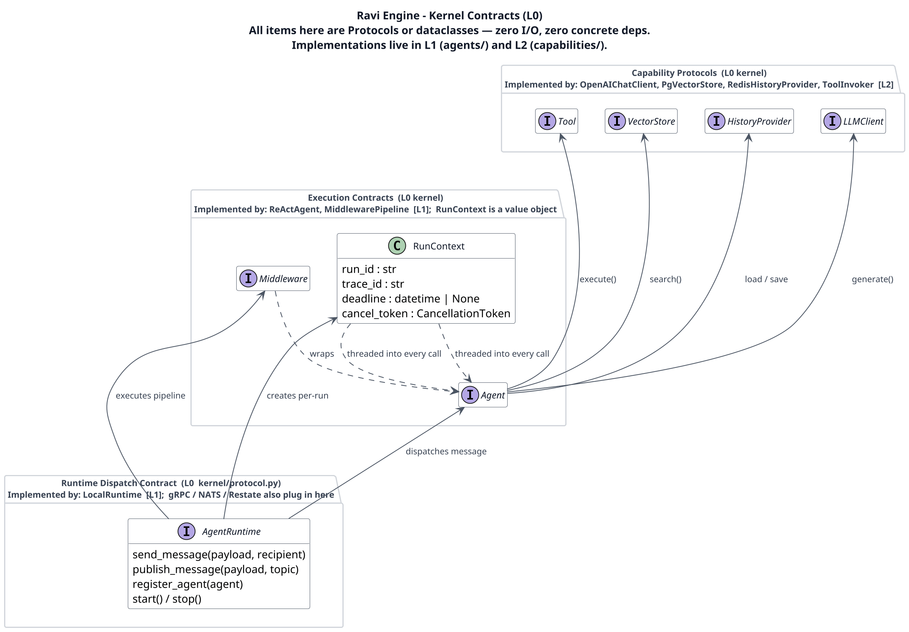
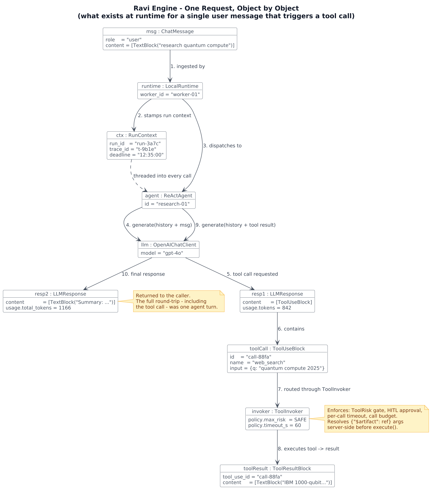
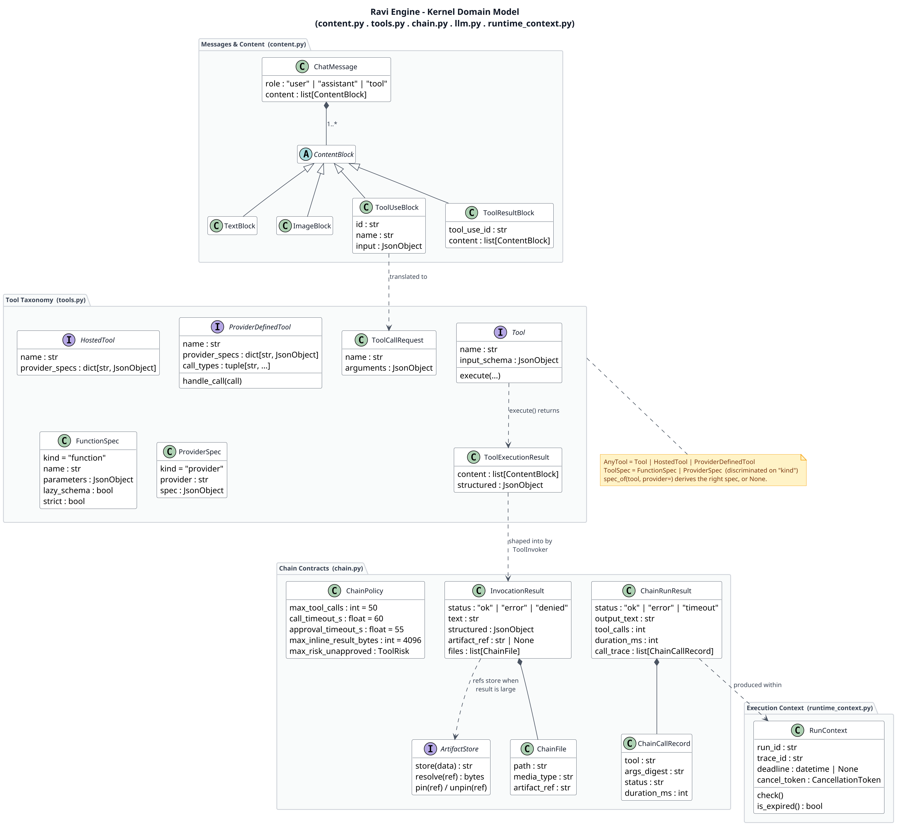
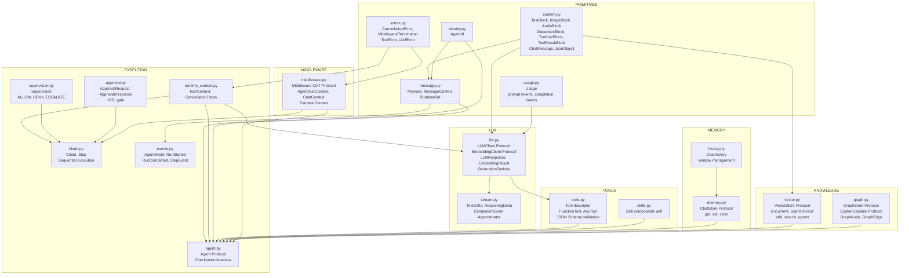
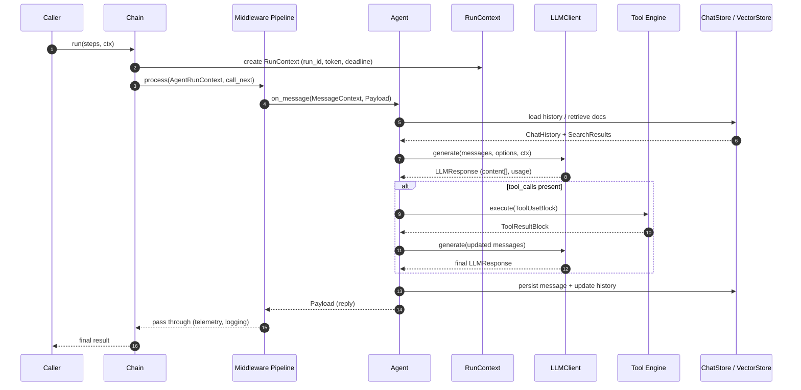
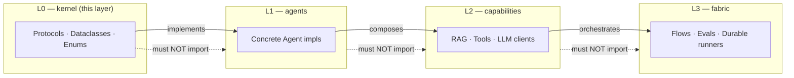

# Kernel Architecture

> **L0 — Pure Contracts.** The kernel contains zero concrete implementations — only `Protocol`, `dataclass`, and `Enum` definitions. Every upper layer depends on this layer; this layer depends on nothing inside the framework.

---

## Architectural Views

To make the system architecture easy to understand, we split the kernel visualization into three distinct perspectives:

### 1. High-Level Architecture
An overview of the central `Agent` protocol and how it connects to core architectural components (context, middleware, model clients, tool execution, and state storage).

### 2. Runtime Object Snapshot
A lightweight representation of object relations during execution, showing how a message triggers a request through the context, agent, and LLM client.

### 3. Domain Model
A static view of the core domain data structures (messages, content blocks, search results, checkpoints, and contexts) and their composition/inheritance relationships, without runtime flow clutter.

---

## Module Map

---

## Execution Lifecycle

---

## Protocol Dependency Rules

> Enforced at CI time by **import-linter** (`uv run lint-imports`).

---

## Key Design Principles

| Principle | How the kernel enforces it |
|---|---|
| **No concrete deps** | Every module uses only `typing.Protocol` — no imports of `httpx`, `openai`, etc. |
| **Immutability** | All value objects are `@dataclass(frozen=True)` or `@dataclass(frozen=True, slots=True)` |
| **Runtime checkable** | Key protocols are `@runtime_checkable` so `isinstance()` works for adapters |
| **Cancellation-first** | `CancellationToken` is threaded into every async API call signature |
| **Multimodal by default** | `content: list[ContentBlock]` — not `str` — is the universal payload type |
| **Usage accounting** | `Usage` is returned alongside every `LLMResponse` for cost tracking |
