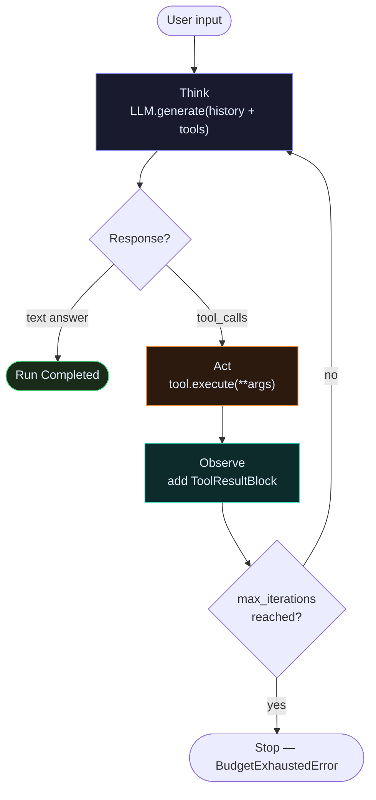

# Agents

Every agent in Ravi follows the same loop: **Think → Act → Observe**.

- **Think**: call the LLM with history + tool schemas.
- **Act**: execute the tool(s) the LLM picked.
- **Observe**: add the result back to history.
- Repeat until the LLM produces a final text answer or `max_iterations` is reached.

---

## The ReAct loop



---

## Constructing an Agent

`ReActAgent` is the concrete implementation you use in practice. You configure it with an LLM client, optional tools, a context manager configuration, and system instructions.

```python
from agent_substrate.agents import ReActAgent
from agent_substrate.agents.context import ContextConfig, InMemoryHistoryProvider
from agent_substrate.integrations.llm.openai import OpenAIClient
from agent_substrate.capabilities.tools import CalculatorTool

client = OpenAIClient(model="gpt-4o", api_key="sk-...")

agent = ReActAgent(
    name="researcher",
    model=client,
    tools=[CalculatorTool()],
    context=ContextConfig(InMemoryHistoryProvider()),
    system_instructions="You are a precise research assistant.",
    max_iterations=10,
)
```

### Key constructor parameters

| Parameter | Type | Default | Purpose |
|---|---|---|---|
| `name` | `str` | required | Unique name of the agent |
| `model` | `LLMClient` | `None` | LLM client backend |
| `tools` | `ToolRegistry \| list` | `None` | Custom or native tools |
| `context` | `ContextConfig` | `None` | Memory history and compaction configuration |
| `system_instructions` | `str` | `""` | Base instructions prepended to the system prompt |
| `max_iterations` | `int` | `10` | Bounded iteration limit per run |
| `approval_handler` | `ApprovalHandler` | `None` | Human-in-the-loop approval coordinator |

---

## Running an Agent via the Runtime

Agents in Ravi do not run in isolation; they are registered with a `Runtime` which manages delivery, scheduling, lifecycle hooks, and durable journals.

### Async Execution

```python
from agent_substrate.agents import Runtime, ReActAgent
from agent_substrate.kernel import Message, ChatPayload, ChatMessage, Role, TextBlock

async with Runtime() as rt:
    await rt.register(agent)
    
    # Submit message to agent
    msg = Message(
        target=agent.id,
        payload=ChatPayload(
            message=ChatMessage(role=Role.USER, content=[TextBlock(text="What is 17 * 23?")])
        ),
    )
    run_id = await rt.submit(agent.id, msg)
    
    # Wait for completion via the EventLog
    async for entry in rt.event_log.tail(run_id):
        if entry.kind in ("run.completed", "run.failed", "run.cancelled"):
            print(f"Finished with event: {entry.kind}")
            break
```

---

## Source Files

| File | What it owns |
|---|---|
| [`agents/core/react.py`](https://github.com/Ravikumarchavva/ravi-engine/blob/main/src/ravi/agents/core/react.py) | `ReActAgent` — full Think → Act → Observe loop |
| [`agents/core/orchestrator.py`](https://github.com/Ravikumarchavva/ravi-engine/blob/main/src/ravi/agents/core/orchestrator.py) | `OrchestratorAgent` — delegates subproblems to sub-agents |
| [`agents/runtime/runtime.py`](https://github.com/Ravikumarchavva/ravi-engine/blob/main/src/ravi/agents/runtime/runtime.py) | `Runtime` — registers and schedules agent runs |
