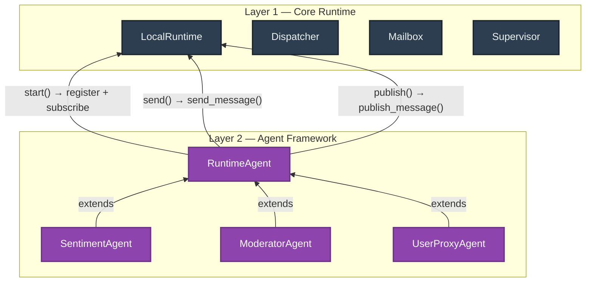
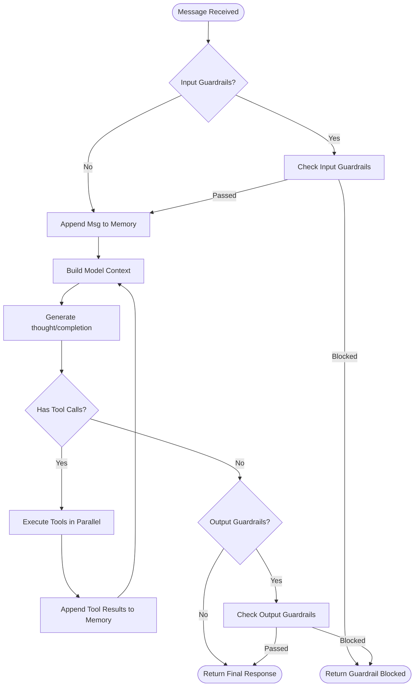
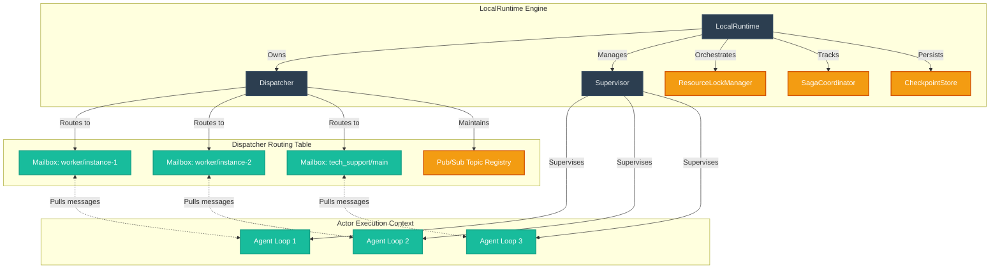
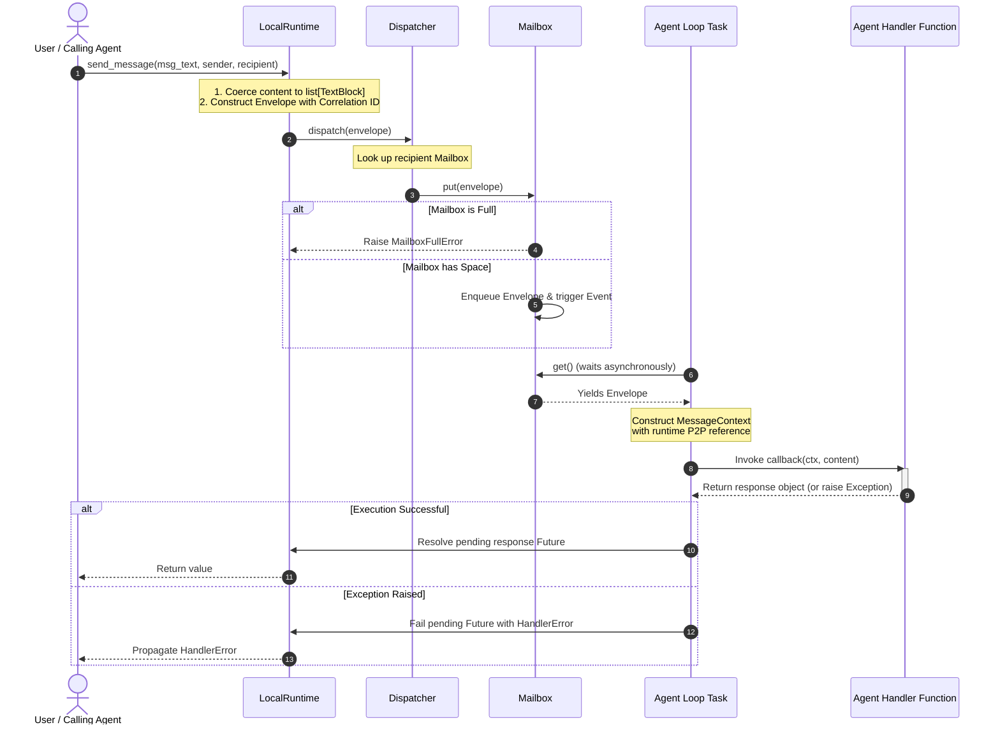
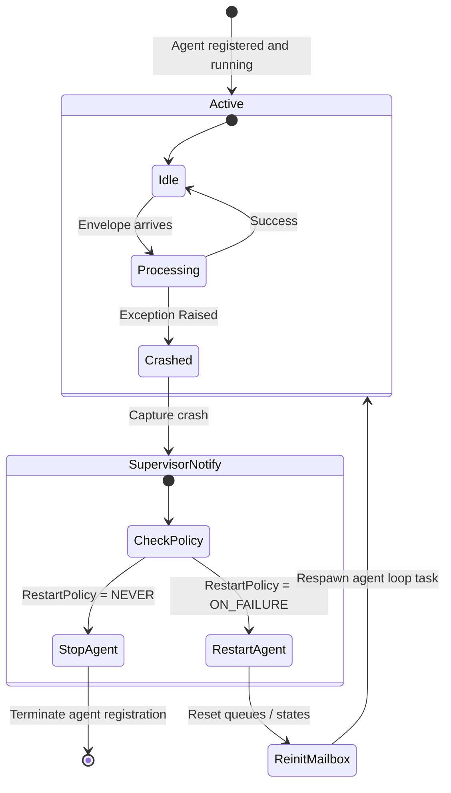
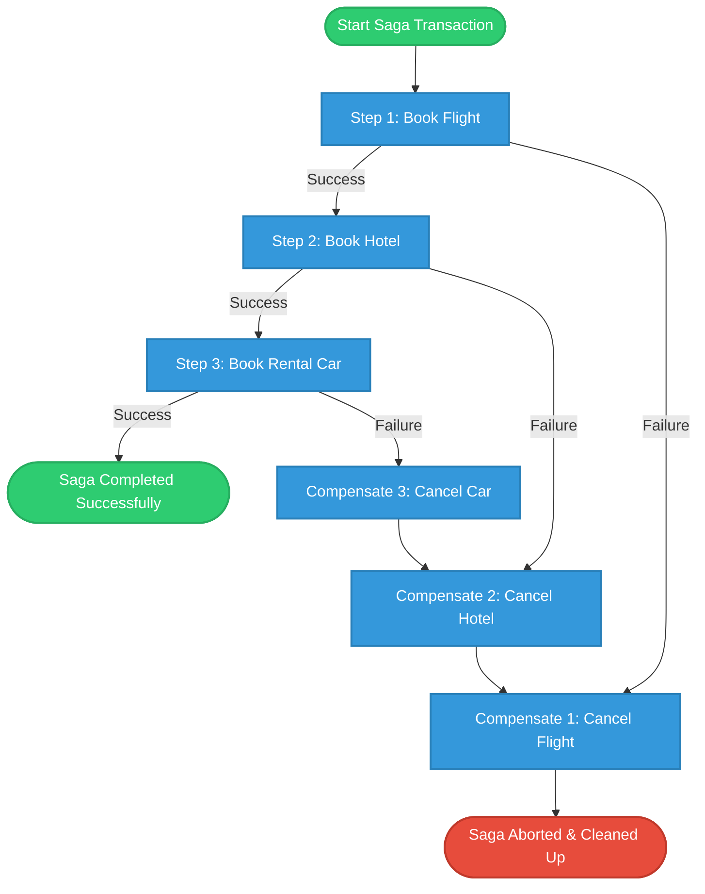
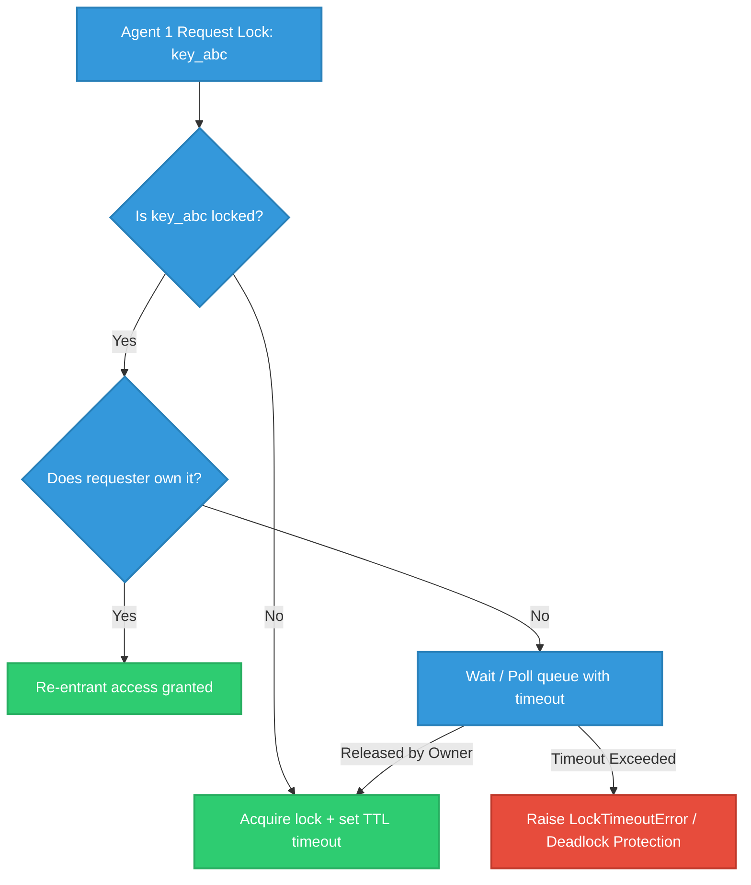

# Modular Actor Runtime — Under the Hood Architecture

This document provides a deep, comprehensive overview of the core modular actor runtime, visualising its internal structures, class hierarchies, and execution flows with **Mermaid diagrams**. 

Trust this as the ultimate developer reference for understanding how message routing, mailbox queues, supervision, P2P peer messaging, sagas, and locking operate under the hood.

---

## 0. Two-Layer Architecture

The framework is built in two clean layers. **Layer 1** is the raw actor runtime (mailboxes, dispatcher, envelopes). **Layer 2** is the declarative agent API built on top.

| Aspect | Layer 1 (Core Runtime) | Layer 2 (RuntimeAgent) |
|---|---|---|
| Registration | `runtime.register("name", handler_fn)` | `agent.start()` (auto) |
| Subscriptions | `runtime.subscribe("name", topic)` | `subscriptions=[topic]` in constructor |
| Message handling | Bare async function | Override `on_message()` method |
| Sending messages | `runtime.send_message(msg, sender=..., recipient=...)` | `self.send(msg, recipient=...)` |
| Publishing events | `runtime.publish_message(msg, sender=..., topic=...)` | `self.publish(msg, topic=...)` |

### 0.1 RuntimeAssistantAgent Cognitive Loop

The `RuntimeAssistantAgent` is a high-level cognitive agent implemented directly on top of the Layer 2 `RuntimeAgent` contract. It provides an autonomous reasoning and tool execution loop (similar to AutoGen's AssistantAgent) with built-in guardrails:

---

## 1. Actor Model Lifecycle & Component Hierarchy

The modular runtime is built on an **Actor-based architecture**. Instead of calling agent functions directly, all agents run as isolated actor loops processing incoming strictly-typed envelopes from their dedicated mailboxes.

### Core Architecture Diagram
This diagram shows how `LocalRuntime` organizes, supervises, and routes messages using the `Dispatcher`, `Mailbox`, and `Supervisor` hierarchies.

---

## 2. End-to-End P2P Messaging Pipeline

When an agent or user invokes `send_message()`, the request goes through an optimized asynchronous delivery pipeline. Let's trace how a message is routed, queued, processed, and replied to.

### Flowchart: Message Dispatch and Execution Loop

---

## 3. Resilience, Supervision & Recovery

Supervisors act as safety nets. If an agent's processing loop encounters a crash or persistent failures, the `Supervisor` automatically acts according to the `RestartPolicy` (e.g. `OneForOne` or `AllForOne`), maintaining stable, long-running agent execution.

### Supervision Crash & Restart Loop

---

## 4. Saga Coordination (Fault-Tolerant Workflows)

For complex multi-agent orchestrations where multiple actions need to succeed together (e.g. Booking a trip involving flight, hotel, and car agents), a `SagaCoordinator` manages compensating tools to achieve eventual consistency.

### Saga Success vs. Compensation Path

---

## 5. Resource Locking with Deadlock Protection

To prevent concurrent agents from modifying the same data or calling the same tools simultaneously, the `ResourceLockManager` implements non-blocking asynchronous key locks with safety timeout triggers.

