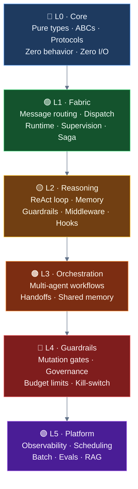
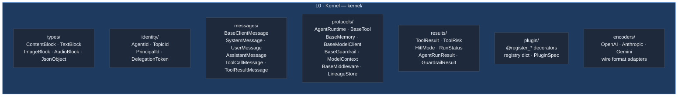
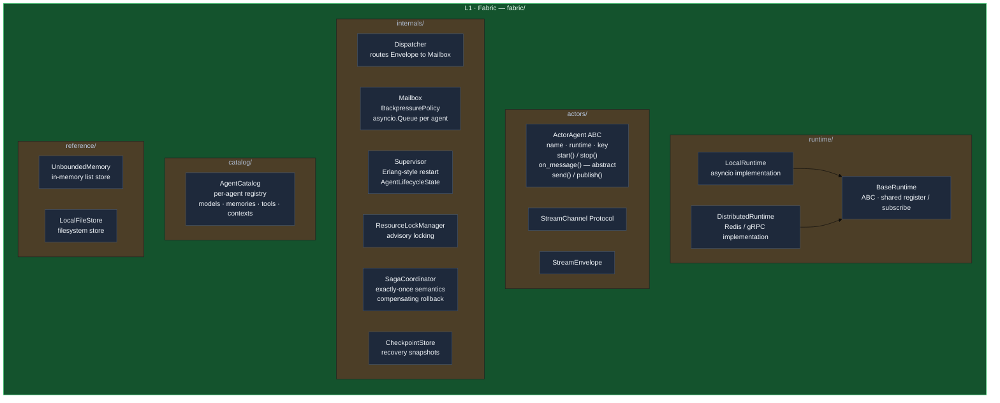
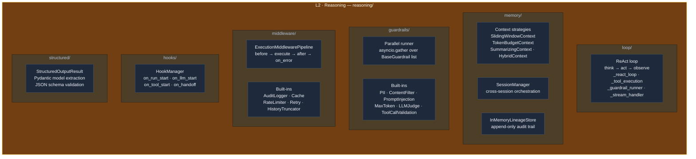
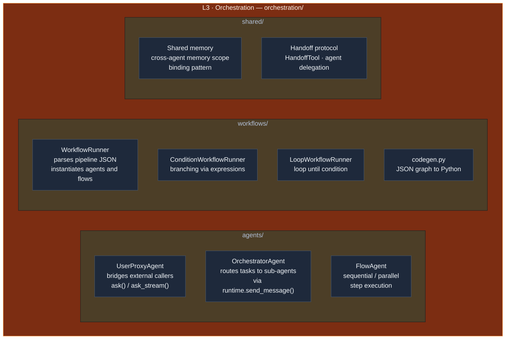
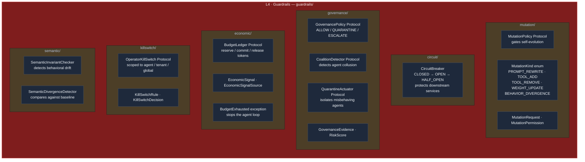
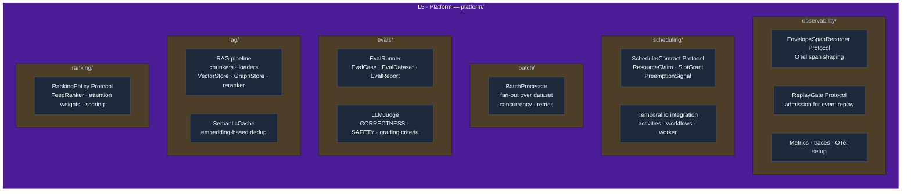

# Layered Architecture

**Status**: Implemented — migrated 2026-05-29  
**Background**: The original `kernel/` mixed pure contracts with full concrete implementations — `LocalRuntime` (643 lines), `SagaCoordinator` (411 lines), `ResourceLockManager` (354 lines), and more — all frozen alongside pure ABCs and Protocols. This document records the diagnosis that motivated the six-layer split, the design rationale for each layer, and the migration map that describes what moved where.

---

## The Problem That Was Solved

The kernel was supposed to be "pure contracts — no I/O, no concrete implementations." What it actually contained:

| File | Lines | What it actually was |
|------|-------|---------------------|
| `kernel/runtime/_local.py` | 643 | Full concrete `LocalRuntime` with asyncio loops |
| `kernel/runtime/_saga.py` | 411 | Complete `SagaCoordinator` implementation |
| `kernel/runtime/_resource_lock.py` | 354 | Complete `ResourceLockManager` with async locking |
| `kernel/runtime/_checkpoint.py` | 296 | Full checkpoint store implementation |
| `kernel/runtime/_client_channel.py` | 310 | Concrete `ClientWriteChannel` |
| `kernel/hooks.py` | 289 | Complete `HookManager` with deque-based dispatch |
| `kernel/governance/_contracts.py` | 241 | `GovernancePolicy`, `CoalitionDetector`, `QuarantineActuator` |
| `kernel/scheduler/_contracts.py` | 212 | `SchedulerContract`, `ResourceClaim`, `PreemptionSignal` |
| `kernel/semantics/_contracts.py` | 225 | `SemanticInvariantChecker`, `SemanticDivergenceDetector` |

The kernel was mixing **four fundamentally different levels** into one frozen bucket:

```mermaid
%%{init: {"theme": "base", "themeVariables": {"primaryColor": "#1e293b", "primaryTextColor": "#f1f5f9", "primaryBorderColor": "#475569"}}}%%
quadrantChart
    title What is actually inside kernel/
    x-axis "Low abstraction (primitives)" --> "High abstraction (platform)"
    y-axis "Protocol-only (correct)" --> "Full implementation (wrong)"
    quadrant-1 Should be platform/ or guardrails/
    quadrant-2 Should be fabric/ (separate layer)
    quadrant-3 Belongs in kernel
    quadrant-4 Should be reasoning/ or fabric/
    AgentId: [0.05, 0.05]
    ToolRisk: [0.08, 0.05]
    ContentBlock: [0.10, 0.05]
    BaseMemory: [0.15, 0.10]
    BaseTool: [0.18, 0.12]
    BaseGuardrail: [0.20, 0.15]
    ModelContext: [0.22, 0.08]
    MessageContext: [0.25, 0.10]
    ExecutionMiddlewarePipeline: [0.35, 0.65]
    HookManager: [0.40, 0.70]
    LocalRuntime: [0.42, 0.90]
    SagaCoordinator: [0.55, 0.88]
    ResourceLockManager: [0.50, 0.85]
    MutationPolicy: [0.72, 0.15]
    GovernancePolicy: [0.85, 0.12]
    EconomicLedger: [0.88, 0.14]
    SchedulerContract: [0.82, 0.12]
    SemanticInvariant: [0.90, 0.15]
    KillSwitch: [0.88, 0.18]
```

The consequence is architectural: when you want to add a new governance rule that references both `EconomicSignal` and `MutationKind` (both currently in `kernel/`), you cannot implement it anywhere — the kernel cannot import from `extensions/`, and `extensions/` cannot import freely from `kernel/governance/` without pulling everything.

---

## The Six-Layer Model

A truly autonomous agent system needs six independent capabilities, each built on the one below it. These are the layers the codebase is now structured around:



Each layer can import from any layer below it. Nothing ever imports upward.

---

## Layer-by-Layer Breakdown

### L0 — Kernel (the frozen contract layer)

The absolute bedrock. Only pure Python types: dataclasses, enums, ABCs with no logic in their bodies, and Protocols. No `asyncio`, no Pydantic `@field_validator` with business logic, no concrete method bodies. If a file has more than a few lines per class, it does not belong here.



**What was removed from kernel/ during the migration:**

| Was in `kernel/` | Moved to |
|------------------|----------|
| `runtime/_local.py` (LocalRuntime — full concrete) | L1 · Fabric |
| `runtime/_base.py` (BaseRuntime — abstract but with concrete methods) | L1 · Fabric |
| `runtime/_saga.py` (SagaCoordinator — full impl) | L1 · Fabric |
| `runtime/_resource_lock.py` (ResourceLockManager) | L1 · Fabric |
| `runtime/_checkpoint.py` (CheckpointStore impl) | L1 · Fabric |
| `runtime/_client_channel.py` (ClientWriteChannel) | L1 · Fabric |
| `runtime/_dispatcher.py`, `_mailbox.py`, `_supervisor.py` | L1 · Fabric |
| `agents/actor.py` (ActorAgent ABC — refs runtime internals) | L1 · Fabric |
| `agent_catalog/_catalog.py` (AgentCatalog — 789 lines) | L1 · Fabric |
| `hooks.py` (HookManager — concrete, 289 lines) | L2 · Reasoning |
| `execution/pipeline.py` (ExecutionMiddlewarePipeline — concrete runner) | L2 · Reasoning |
| `memory/unbounded_memory.py` (reference impl) | L1 · Fabric |
| `storage/local.py` (LocalFileStore — concrete) | L1 · Fabric |
| `safeguards/_mutation.py` | L4 · Guardrails |
| `safeguards/_breaker.py` | L4 · Guardrails |
| `governance/_contracts.py` | L4 · Guardrails |
| `economic/_ledger.py`, `_signals.py` | L4 · Guardrails |
| `observability/_killswitch.py`, `_replay.py` | L4 · Guardrails |
| `scheduler/_contracts.py` | L5 · Platform |
| `semantics/_contracts.py` | L5 · Platform |
| `ranking/_contracts.py` | L5 · Platform |
| `observability/_spans.py` | L5 · Platform |

**What stays in kernel/ (L0):** pure types, ABCs with no implementations, Protocols, the plugin registry. After the migration the kernel sits at ~11.8k LOC / 95 files, bounded by CI ceilings of 14k LOC / 115 files. The remaining code is genuinely frozen — it changes only when a new fundamental primitive is needed.

---

### L1 — Fabric (the runtime infrastructure)

The fabric makes agents addressable, routes messages between them, supervises their lifecycle, and handles exactly-once execution of critical actions. It is the "operating system" for the agent mesh.



The key distinction from the current arrangement: `ActorAgent` moves from `kernel/` to `fabric/`. It belongs here because its `start()` method calls `runtime.register()` — it has a concrete dependency on the fabric. The kernel (L0 Core) should contain only protocols; `ActorAgent` with its concrete `start()`, `stop()`, `send()`, `publish()` methods is a fabric object.

The fabric is also where `SagaCoordinator` and `ResourceLockManager` live. These are not abstract contracts — they are full working implementations. Having them in a supposedly "frozen" layer was the mistake.

---

### L2 — Reasoning (how one agent thinks)

Reasoning is everything a single agent needs to think, remember, act, and introspect — without caring about other agents, multi-tenancy, or production operations.



The single concrete agent implementation (`AssistantAgent`) lives here, at the top of the reasoning layer. The key insight about reasoning: it is **stateless with respect to other agents**. `AssistantAgent` receives a task, runs a loop against its own memory and tools, and returns a result. It does not know about orchestration, workflows, or other agents. That awareness belongs in the orchestration layer.

---

### L3 — Orchestration (how agents cooperate)

Orchestration is the layer where individual reasoning agents become a system. Patterns here describe how tasks get routed, how results get combined, how context flows between agents.



Orchestration agents (`OrchestratorAgent`, `FlowAgent`) are `ActorAgent` subclasses (L1) whose `on_message()` implementations dispatch to other agents via `runtime.send_message()`. They are architecturally identical to reasoning agents — the difference is that their logic is routing, not thinking.

---

### L4 — Guardrails (how the system stays trustworthy)

Guardrails is the layer that constrains what agents are permitted to do. It is intentionally separate from reasoning and orchestration because safety rules must be enforceable independently of how agents are implemented. A governance policy should not need to know whether it is gating an `AssistantAgent` or an `OrchestratorAgent`.



**Why guardrails is a separate layer and not part of reasoning:**

An agent's reasoning (L2) decides *what* to do. Guardrails (L4) decides *whether* it is *allowed* to do it. These are different authorities — in production you want to strengthen guardrail rules without redeploying reasoning logic, and vice versa.

Before the migration, `MutationPolicy` lived in `kernel/safeguards/` and `GovernancePolicy` in `kernel/governance/` — both contracts with no implementations, impossible to compose. Moving both to `guardrails/` (L4) fixed this: contracts and implementations share a layer, and the layer boundary is enforced by import-linter. The `guardrails/` layer can import from `orchestration/` downward; `orchestration/` cannot import from `guardrails/`.

---

### L5 — Platform (how the system operates at scale)

Platform concerns are orthogonal to what agents do — they describe how the operator observes, schedules, evaluates, and scales the system.



RAG lives in `platform/rag/` because retrieval is not a single-agent reasoning operation — it is a data-platform concern shared across agents and tenants. An `AssistantAgent` calls a tool that queries the RAG pipeline; the RAG pipeline itself is a platform service.

---

## The Full Picture

```mermaid
%%{init: {"theme": "base", "themeVariables": {"primaryColor": "#1e293b", "primaryTextColor": "#f1f5f9", "primaryBorderColor": "#334155", "lineColor": "#64748b", "clusterBkg": "#0f172a"}}}%%
flowchart TD
    subgraph SV["server / services"]
        S1["FastAPI routes<br/>ORM models · DI wiring"]
    end

    subgraph CAT["catalog/"]
        S2["Tools · Skills · Connectors<br/>Data pipelines"]
    end

    subgraph INTG["integrations/"]
        S3["OpenAI · Anthropic · Gemini<br/>Redis · Postgres · S3 · MCP"]
    end

    subgraph PLAT["platform/ — L5"]
        S4["Observability · Scheduling<br/>Batch · Evals · RAG · Ranking"]
    end

    subgraph SAFE["guardrails/ — L4"]
        S5["Mutation gates · Governance<br/>Budget limits · Kill-switch<br/>Semantic drift detection"]
    end

    subgraph COORD["orchestration/ — L3"]
        S6["OrchestratorAgent · FlowAgent<br/>UserProxyAgent · WorkflowRunner"]
    end

    subgraph COG["reasoning/ — L2"]
        S7["AssistantAgent · ReAct loop<br/>Guardrail runner · Middleware<br/>Memory strategies · Hooks"]
    end

    subgraph FAB["fabric/ — L1"]
        S8["LocalRuntime · ActorAgent<br/>Dispatcher · Mailbox · Supervisor<br/>Saga · ResourceLock · AgentCatalog"]
    end

    subgraph KER["kernel/ — L0"]
        S9["ContentBlock · AgentId<br/>Message types · ABCs<br/>Protocols · Enums · Plugin registry"]
    end

    SV --> CAT --> INTG --> PLAT --> SAFE --> COORD --> COG --> FAB --> KER

    style KER fill:#1e3a5f,stroke:#60a5fa,color:#eff6ff
    style FAB fill:#14532d,stroke:#4ade80,color:#f0fdf4
    style COG fill:#713f12,stroke:#fbbf24,color:#fffbeb
    style COORD fill:#7c2d12,stroke:#fb923c,color:#fff7ed
    style SAFE fill:#7f1d1d,stroke:#f87171,color:#fef2f2
    style PLAT fill:#4a1d96,stroke:#c084fc,color:#faf5ff
    style INTG fill:#065f46,stroke:#34d399,color:#ecfdf5
    style CAT fill:#1e3a5f,stroke:#94a3b8,color:#e2e8f0
    style SV fill:#334155,stroke:#94a3b8,color:#e2e8f0
```



`shared/` and `configs/` remain orthogonal utilities (cross-cutting infrastructure: Pydantic settings, JWT auth, database sessions, event bus). They are importable by any layer above L0.

---

## Why the Six Layers Enable Better Autonomous Agents

### Problem 1: Minimal agent dependency was impossible

Before the migration the only agent was `AssistantAgent` in `extensions/agents/assistant/`. Using it meant depending on the whole `extensions/` bucket — guardrail runner, context strategies, HITL, middleware, orchestration, and RAG as undifferentiated peers.

**Now:** `AssistantAgent` depends on `reasoning/` which depends on `fabric/` which depends on `kernel/`. The dependency chain is explicit and minimal. Taking just `reasoning/` gives a fully working single agent with no multi-agent, no governance, no platform concerns.

### Problem 2: Safety contracts had no home

`MutationPolicy` was in `kernel/safeguards/` but implementations had to live in `extensions/`. `GovernancePolicy` was in `kernel/governance/` but implementations were nowhere — there was no clear place to put them.

**Now:** `guardrails/` contains both contracts and implementations. A `TenantBudgetPolicy(BudgetLedger)` lives in `guardrails/economic/` alongside the contract it implements. The layer boundary is enforced: `guardrails/` can import from `orchestration/` downward, but `orchestration/` cannot import from `guardrails/`.

### Problem 3: The "frozen" constraint was unenforceable

The kernel had 16,895 LOC including full asyncio implementations. Import-linter prevented upward imports but could not prevent the kernel from growing with concrete code.

**Now:** The kernel sits at ~11.8k LOC / 95 files (CI ceiling: 14k / 115). Only contracts remain — adding a feature never requires editing L0.

### Problem 4: No guidance for where new features live

*"I want to add a budget-aware retry that stops the agent when it hits $10 in LLM costs. Where does this go?"*

Before: unclear — `kernel/economic/` had the contract, `extensions/resilience/` had retry, `extensions/middleware/` had another retry, nothing was wired together.

**Now:** Budget-aware retry is a guardrails + reasoning composition. Write `BudgetAwareRetryMiddleware` in `guardrails/economic/` (it reads from `BudgetLedger`) and register it as middleware. The layer guarantees it can import from `reasoning/` (middleware protocol) and `guardrails/` (economic ledger).

---

## What Moved Where

Complete file-to-layer reference for the migration.

| Old path | Current path | Layer |
|----------|-------------|-------|
| `kernel/runtime/_local.py` | `fabric/runtime/local.py` | L1 |
| `kernel/runtime/_base.py` | `fabric/runtime/base.py` | L1 |
| `kernel/runtime/_dispatcher.py` | `fabric/runtime/dispatcher.py` | L1 |
| `kernel/runtime/_mailbox.py` | `fabric/runtime/mailbox.py` | L1 |
| `kernel/runtime/_supervisor.py` | `fabric/runtime/supervisor.py` | L1 |
| `kernel/runtime/_saga.py` | `fabric/saga.py` | L1 |
| `kernel/runtime/_resource_lock.py` | `fabric/locks.py` | L1 |
| `kernel/runtime/_checkpoint.py` | `fabric/checkpoint.py` | L1 |
| `kernel/runtime/_client_channel.py` | `fabric/channel.py` | L1 |
| `kernel/agents/actor.py` | `fabric/actors/actor.py` | L1 |
| `kernel/agent_catalog/` | `fabric/catalog/` | L1 |
| `kernel/memory/unbounded_memory.py` | `fabric/memory/unbounded.py` | L1 |
| `kernel/storage/local.py` | `fabric/storage/local.py` | L1 |
| `kernel/hooks.py` | `reasoning/hooks/manager.py` | L2 |
| `kernel/execution/pipeline.py` | `reasoning/middleware/pipeline.py` (then kernel) | L2→L0 |
| _(old extensions)_ `agents/assistant/` | `reasoning/agents/assistant/` | L2 |
| _(old extensions)_ `context/` | `reasoning/memory/` | L2 |
| _(old extensions)_ `guardrails/` | `reasoning/guardrails/` | L2 |
| _(old extensions)_ `middleware/` | `reasoning/middleware/` | L2 |
| _(old extensions)_ `structured/` | `reasoning/structured/` | L2 |
| _(old extensions)_ `agents/orchestrator/` | `orchestration/agents/` | L3 |
| _(old extensions)_ `agents/flow/` | `orchestration/agents/` | L3 |
| _(old extensions)_ `agents/user_proxy/` | `orchestration/agents/proxy/` | L3 |
| _(old extensions)_ `pipelines/` | `orchestration/workflows/` | L3 |
| `kernel/safeguards/` | `guardrails/mutation/` | L4 |
| `kernel/governance/` | `guardrails/governance/` | L4 |
| `kernel/economic/` | `guardrails/economic/` | L4 |
| `kernel/observability/_killswitch.py` | `guardrails/` | L4 |
| `kernel/semantics/` | `guardrails/semantic/` | L4 |
| `kernel/observability/_spans.py` | `platform/observability/` | L5 |
| `kernel/scheduler/` | `platform/scheduling/` | L5 |
| `kernel/ranking/` | `platform/ranking/` | L5 |
| `evals/` | `platform/evals/` | L5 |
| _(old extensions)_ `rag/` | `platform/rag/` | L5 |
| _(old extensions)_ `batch/` | `platform/batch/` | L5 |

**Stays in kernel/ (L0):** `kernel/messages/`, `kernel/tools/base_tool.py`, `kernel/memory/base_memory.py`, `kernel/context/`, `kernel/guardrails/base_guardrail.py`, `kernel/middleware/base.py`, `kernel/llm/base_client.py`, `kernel/storage/base.py`, `kernel/structured/result.py`, `kernel/runtime/_identity.py`, `kernel/runtime/_protocol.py`, `kernel/runtime/_contracts.py`, `kernel/runtime/_errors.py`, `kernel/plugin/`, `kernel/contracts/`, `kernel/agents/agent_result.py`, `kernel/safeguards/` (contracts only), `kernel/governance/` (contracts only), `kernel/economic/` (contracts only), `kernel/observability/` (contracts only), `kernel/semantics/` (contracts only).

---

## Migration Summary

The migration was completed in six phases on 2026-05-29. All 1297 tests pass. Import-linter reports 0 violations. Kernel sits at ~11.8k LOC / 95 files.

| Phase | What was done | CI status |
|-------|---------------|-----------|
| 1 — Fabric | Moved `LocalRuntime`, runtime internals, `ActorAgent`, `AgentCatalog`, `SagaCoordinator`, `ResourceLockManager`, `UnboundedMemory` | Green |
| 2 — Reasoning | Moved `AssistantAgent`, context strategies, guardrail runner and built-ins, middleware, `HookManager` | Green |
| 3 — Orchestration | Moved `OrchestratorAgent`, `FlowAgent`, `UserProxyAgent`, pipeline runners → `orchestration/workflows/` | Green |
| 4 — Guardrails | Moved `MutationPolicy`, `CircuitBreaker`, governance contracts, economic ledger, kill-switch, semantic invariants | Green |
| 5 — Platform | Moved OTel span recorder, replay gate, scheduler contracts, evals, RAG, batch, ranking | Green |
| 6 — Kernel strip | Removed all upward re-export shims from kernel `__init__.py` files; deleted dead `extensions/` tree; lowered CI ceilings | Green |

---

## What Did Not Change

- The `catalog/`, `integrations/`, `server/`, `services/`, `shared/` directories are unchanged.
- The plugin registry API (`@register_agent`, `@register_guardrail`, etc.) is unchanged.
- The `AgentRuntime` protocol and `AgentId`/`TopicId` types are unchanged — they remain in `kernel/`.
- The `Envelope` dataclass stays in `kernel/` (pure value type with no runtime dependency).
- `BaseTool`, `BaseMemory`, `BaseGuardrail`, `BaseModelClient`, `ModelContext` ABCs stay in `kernel/`.

---

## Import Paths After Migration

There is no backward compatibility. Old `kernel.runtime._local.LocalRuntime` style imports must be updated:

| What you need | Current import |
|---|---|
| `LocalRuntime` | `from ravi.fabric.runtime.local import LocalRuntime` |
| `ActorAgent` | `from ravi.fabric.actors.actor import ActorAgent` |
| `StreamChannel`, `StreamEnvelope` | `from ravi.fabric.actors.actor import StreamChannel, StreamEnvelope` |
| `AgentCatalogRegistry` | `from ravi.fabric.catalog import AgentCatalogRegistry` |
| `UnboundedMemory` | `from ravi.fabric.memory.unbounded import UnboundedMemory` |
| `AssistantAgent` | `from ravi.reasoning.agents.assistant.agent import AssistantAgent` |
| `UserProxyAgent` | `from ravi.orchestration.agents.proxy.agent import UserProxyAgent` |
| `AgentId`, `TopicId` | `from ravi.kernel.runtime._identity import AgentId, TopicId` |
| `AgentRuntime` (protocol) | `from ravi.kernel.runtime._protocol import AgentRuntime` |
| `BaseTool`, `ToolResult` | `from ravi.kernel.tools.base_tool import BaseTool, ToolResult` |
| `BaseMemory` | `from ravi.kernel.memory.base_memory import BaseMemory` |
| `BaseGuardrail` | `from ravi.kernel.guardrails.base_guardrail import BaseGuardrail` |

