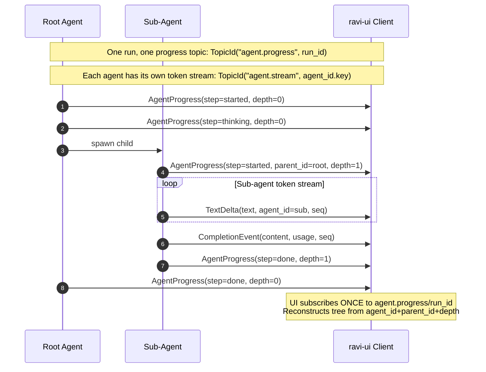

# messaging/ — Agent Communication

> **Source:** `kernel/messaging/message.py` · `kernel/messaging/stream.py` · `kernel/messaging/events.py`

Three distinct communication channels — messages between agents, stream events to the UI, and generic events to the event bus. They look similar but serve different purposes.

---

## The Message — Agent-to-Agent Envelope

A `Message` wraps any `Payload` and routes it to a specific agent or topic. Every agent-to-agent send goes through a `Message`.

## The Message — Agent-to-Agent Envelope

A `Message` wraps any `Payload` and routes it to a specific agent or topic. Every agent-to-agent send goes through a `Message`.

### Message Envelope Fields

| Field | Type | Description |
|---|---|---|
| `id` | `str` | Unique message ID (UUID hex string). |
| `target` | `AgentId \| TopicId` | Routing target: point-to-point (`AgentId`) or pub/sub fan-out (`TopicId`). |
| `sender` | `AgentId \| None` | Address of the sending agent, or `None` if system-initiated. |
| `correlation_id`| `str` | Links all messages within the same logical conversation/run tree. |
| `causation_id` | `str \| None` | References the specific message ID that triggered this one. |
| `reply_to` | `str \| None` | The run ID of the asking supervisor (used for response routing). |
| `is_broadcast` | `bool` | Flag set to `True` when the target is a `TopicId`. |

### Built-in Payload Types

| Payload Class | Discriminator (`kind`) | Fields | Description |
|---|---|---|---|
| `ChatPayload` | `'chat'` | `message: ChatMessage` | Wraps standard turn history messages. |
| `DataPayload` | `'data'` | `data: dict` | Carries raw structured dictionary payloads. |
| `ControlPayload` | `'control'` | `signal: str`, `data: dict` | Passes lifecycle control signals (e.g. abort, resume). |
| `ProgressPayload` | `'progress'` | `progress: AgentProgress` | Streams step-by-step progress metrics. |
| `ToolCallRequest` | `'tool_call'` | `name: str`, `arguments: dict`, `call_id: str` | Represents tool invocation requests. |
| `ToolExecutionResult`| `'tool_result'`| `call_id: str`, `content: list[ContentBlock]`, `is_error: bool` | Represents tool outcomes (supports multimodal outputs). |

**`register_payload_type(cls)`** — add custom payload kinds. `cls` must subclass `PayloadBase` and have a `kind: Literal[...]` field. Call once at module load time.

---

## Two Parallel Visibility Streams

While agents run, two independent channels stream to the UI. They share `seq` for ordering but serve different consumers.



### Stream event types

**Token stream** — `TopicId("agent.stream", agent_id.key)` — one topic per agent:

| Type | When | Key fields |
|---|---|---|
| `TextDelta` | Each text token from the LLM | `text`, `seq`, `agent_id`, `run_id` |
| `ReasoningDelta` | Each thinking token (extended-thinking only) | `text`, `seq` |
| `CompletionEvent` | End of LLM call | `content: list[ContentBlock]`, `usage`, `seq` |
| `StreamDone` | End sentinel | `reason: str` |

**Progress stream** — `TopicId("agent.progress", run_id)` — ONE topic for the whole run:

| `AgentStep` | Meaning |
|---|---|
| `started` | Agent woke up, beginning `run()` |
| `thinking` | Agent made an LLM call |
| `tool_call` | Agent invoked a tool |
| `tool_result` | Tool returned a result |
| `handoff` | Orchestrator delegated to a sub-agent |
| `paused` | Agent suspended (waiting for signal/timer/child) |
| `done` | Agent completed |
| `error` | Agent failed |

`AgentProgress.depth` is used by the UI to indent sub-agents correctly in the tree view.

---

## Event — The Generic Bus Envelope

Separate from `Message`. `Event` is the envelope for the Redis pub/sub event bus (`integrations/events/`). It carries infrastructure-level events like `workflow.started`, `agent.crashed`, `hitl.approved`.

### Event Envelope Fields

| Field | Type | Description |
|---|---|---|
| `id` | `str` | Unique event ID (UUID hex). |
| `type` | `str` | Event topic/type (e.g. `workflow.started`). |
| `source` | `str` | Identifier of the originating component or process. |
| `schema_version`| `int` | Integer schema version to handle backwards compatibility. |
| `correlation_id`| `str` | Associated run or execution context ID. |
| `ts` | `datetime` | Creation timestamp. |
| `data` | `dict` | Raw dictionary payload matching the event type's schema. |

### Event Bus Protocols

| Protocol | Method | Description |
|---|---|---|
| **`EventPublisher`** | `publish(event, topic)` | Send a serialized Event onto the designated bus topic. |
| **`EventSubscriber`**| `subscribe(topic, handler)` | Register a handler callback to consume events on a topic. |
| | `unsubscribe(id)` | Deregister a subscription by ID. |
| | `stream(topic)` | Return an async iterator streaming events on a topic. |

**Always use factory functions** from `serving/shared/events/types.py` — never construct `Event` dicts manually:

```python
from substrate.serving.shared.events.types import workflow_started
await bus.publish(workflow_started(run_id=run.id, thread_id=thread.id, user_content=text))
```

`Event.create()` is the kernel-level convenience constructor for when factory functions don't exist yet.
