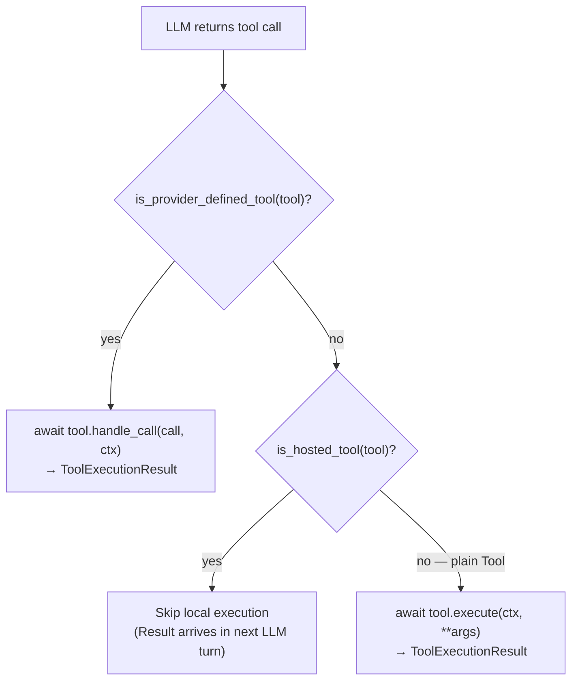
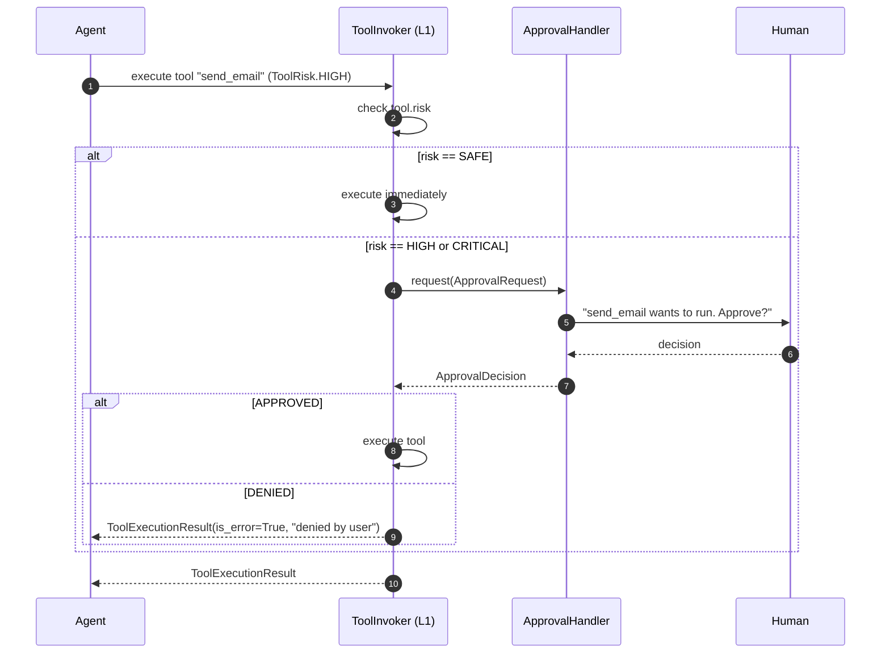
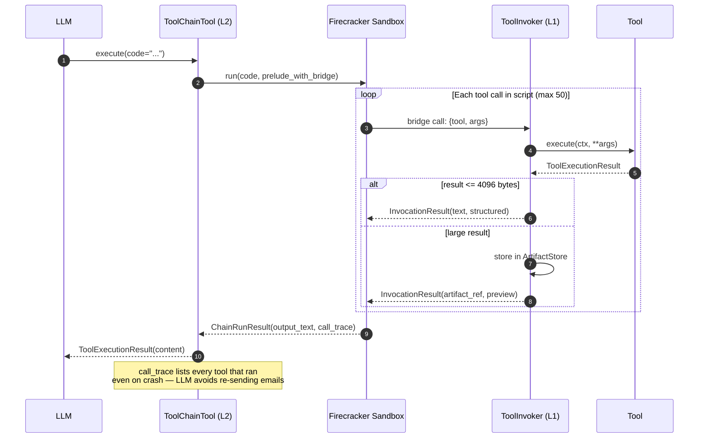

# tools/ — What Agents Can Do

> **Source:** `kernel/tools/tools.py` · `kernel/tools/chain.py` · `kernel/tools/approval.py` · `kernel/tools/skills.py`

Defines the complete tool taxonomy: three execution modes across two axes, wire declarations for LLM providers, sandboxed code chaining, human-in-the-loop approval, and prompt skills.

---

## The Tool Taxonomy

Three Protocols govern all tools. The right one depends on **who executes** and **who declares**:

| Tool Protocol | Execution Mode | Key Fields | Core Execution Method | Examples |
|---|---|---|---|---|
| **`Tool`** | **Local** | `name`, `description`, `input_schema` | `execute(ctx, **kwargs)` | `WebSearchTool`, `CalculatorTool` |
| **`HostedTool`** | **Provider** | `name`, `description`, `provider_specs: dict` | *Executed by provider* | OpenAI `web_search_preview`, Anthropic `web_search` |
| **`ProviderDefinedTool`** | **Provider-declared, Local execution** | `name`, `description`, `provider_specs: dict`, `call_types` | `handle_call(call, ctx)` | OpenAI `computer_use`, `apply_patch` |

### Core Data & Specs

* **`ToolExecutionResult`**: Represents execution outputs. Fields:
    * `content: list[ContentBlock]`: The multimodal output blocks.
    * `is_error: bool`: Flag indicating execution failure.
    * `structured_content: dict`: Parsed dictionary response.
* **`FunctionSpec`**: Local schema specification: `name`, `description`, `parameters: dict`, `lazy_schema: bool`.
* **`ProviderSpec`**: Provider-specific spec: `name`, `provider: str`, `spec: dict`.

---

### Dispatch pattern at runtime

**Always check `is_provider_defined_tool` before `is_hosted_tool`** — both have `provider_specs`, but only `ProviderDefinedTool` has `handle_call`.

---

## ToolRisk and Approval

Tools declare a risk level. High and critical risk tools pause execution and ask a human before proceeding.

`ApprovalRequest` is immutable and fully serializable — it can be stored in Postgres and resumed after a restart. `ApprovalHandler` implementations: `WebApprovalHandler` (the `ravi-ui` HITL card), `AutoApprovalHandler` (tests), `CliApprovalHandler` (terminal).

---

## Sandboxed Code-Mode Chaining

Tool chaining lets the LLM write a Python script that calls multiple tools and pipes results between them. The script runs in a Firecracker/K8s sandbox; each tool call crosses the bridge back to the framework-side `ToolInvoker`.

**Key types from `chain.py`:**

| Type | Purpose |
|---|---|
| `ChainPolicy` | Limits: `max_tool_calls=50`, `call_timeout_s=60`, `total_timeout_s=300`, `max_inline_result_bytes=4096` |
| `InvocationResult` | What the sandbox receives back: `status`, `text`, `structured`, `artifact_ref`, `files` |
| `ChainRunResult` | Final outcome: `status`, `output_text`, `call_trace`, `duration_ms` |
| `ChainCallRecord` | One entry per bridged call in the trace: `tool`, `args_digest`, `status`, `duration_ms` |

---

## Skills — Prompt Packages

A `Skill` behaves as a prompt package attached to an agent to inject custom instructions and constrain available tools:

| Field | Type | Description |
|---|---|---|
| `name` | `str` | Unique skill name. |
| `instructions` | `str` | Prompt text appended to the agent's system prompt during runs. |
| `description` | `str` | Short explanation of the skill's purpose. |
| `allowed_tools` | `tuple[str, ...]` | List of tool names that the agent is restricted to using while this skill is active. |
| `path` | `str \| None` | Filepath if the skill was loaded dynamically from disk. |
| `version` | `str` | Version string (e.g. `'1.0.0'`). |

A `Skill` extends an agent's behaviour without modifying its code. When attached to an agent, `instructions` are appended to the effective system prompt and `allowed_tools` limits which tools the skill can use.
