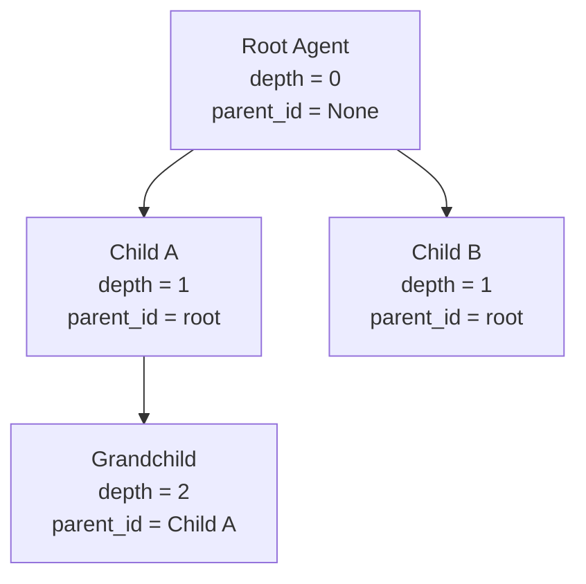

# agent/ — What an Agent IS

> **Source:** `kernel/agent/context.py` · `kernel/agent/middleware.py` · `kernel/agent/runtime_context.py` · `kernel/agent/supervision.py` · `kernel/runtime/agent.py`

Defines the `Agent` Protocol, the supervision tree that governs it, the execution context threaded through every call, and the three-level middleware chain that wraps every operation.

---

## The Agent Protocol

The simplest possible contract — just an identity and an entry point:

### Protocol Definition

| Protocol Requirement | Type | Description |
|---|---|---|
| `id` (Property) | `AgentId` | Unique address of the agent instance. |
| `run(ctx, inbox)` | `async def` | Entry point invoked by the worker when messages arrive. |

### Out-of-the-box Implementations

* **`ReActAgent`** (L1 — `agents/core/`): Core agent executing the standard reasoning loop.
* **`OrchestratorAgent`** (L1 — `agents/core/`): Special agent managing child dispatching and fan-outs.
* **`InformationAgent`** (L1 — `agents/core/`): Subscribes to events to aggregate metrics.
* **Custom Agents**: Any class implementing the `Agent` protocol can be registered and hosted.

`AgentRunContext` is the **kernel-visible slice** only. At runtime, `ctx` is actually a `RunContext` from L1, which adds all the journaled methods: `ctx.llm()`, `ctx.tool()`, `ctx.spawn()`, `ctx.join()`, `ctx.emit()`, `ctx.sleep_until()`. Type-hint with `RunContext` in your agent code for full IDE support.

---

## Supervision — The Agent Org-Chart

When an orchestrator spawns a sub-agent, it passes `Supervision` — the child's formal position in the execution tree.

### Supervision Fields

| Field | Type | Description |
|---|---|---|
| `run_id` | `str` | Short-lived identifier for a single execution tree. |
| `session_id` | `str` | Long-lived identifier for the conversation thread (keys history). |
| `root_id` | `AgentId` | The `AgentId` of the root/entry agent. |
| `parent_id` | `AgentId \| None` | Direct parent agent or `None` if root. |
| `depth` | `int` | Integer depth in execution tree (starts at `0`). |
| `spawn_budget` | `SpawnBudget` | Shared tree-wide budget governing child limits. |
| `execution_budget` | `ExecutionBudget` | Run-scoped token, cost, turn, and deadline limits. |
| `retention` | `HistoryRetention` | Scope of history retention: `NONE`, `RUN`, or `PERMANENT`. |
| `priority` | `Priority` | Task prioritization weights (`BACKGROUND`, `LOW`, `NORMAL`, `HIGH`, `CRITICAL`). |

### Propagating Down the Tree



`session_id` and `run_id` serve different scopes:
- `session_id` — the conversation thread. Long-lived, many runs. **History is keyed by this.**
- `run_id` — one execution tree. Short-lived, one `run()` call. **Budget, supervision, and progress topic are keyed by this.**

---

## RunMeta and CancellationToken

Threaded through every kernel API call — LLM calls, tool executions, storage reads. Lets any operation be cancelled cooperatively without global state.

### RunMeta & Token Primitives

| Class | Fields / Methods | Description |
|---|---|---|
| **`RunMeta`** | `run_id: str`<br>`cancellation: CancellationToken`<br>`supervision: Supervision \| None`<br>`deadline: datetime \| None`<br>`trace_id: str`<br>`tenant_id: str \| None` | Frozen metadata context representing the current run execution context. |
| **`CancellationToken`** | `cancel(reason)` | Requests cooperative cancellation across the execution context. |
| | `check()` | Raises `CancellationError` if cancelled or deadline passed. |
| | `wait()` (Awaitable) | Suspends execution until the token is cancelled. |
| | `child()` | Produces a linked child token cascading cancellation downward. |

`RunMeta` is immutable. Thread it down call stacks. For child spans: create a new `RunMeta` with a child token (cancellation propagates) and a new trace span.

---

## Three-Level Middleware Pipeline

Every operation passes through three nested interceptor chains — one per level of the agent loop.

| Middleware Level | Targeted Function | Context Object | Example Use Cases |
|---|---|---|---|
| **Agent-Level** (`AgentMiddleware`) | Wraps `agent.run()` | `AgentRunContext` | Rate limiting, global logging, session validation |
| **Chat-Level** (`ChatMiddleware`) | Wraps `model.generate()` | `ChatContext` | PII redactors, content warning filters, caching |
| **Function-Level** (`FunctionMiddleware`) | Wraps `tool.execute()` | `FunctionContext` | Human approval gates, tool execution audit logging |

All three levels share one Protocol shape:

```python
class Middleware(Protocol[CtxT]):
    async def process(self, context: CtxT,
                      call_next: Callable[[], Awaitable[None]]) -> None: ...
```

Call `call_next()` to continue; raise `MiddlewareTermination` to halt. The concrete `MiddlewarePipeline` at L1 chains registered instances.

---

## AgentContextProtocol — What the Loop Reads

### Context Protocol

| Property / Method | Return Type | Description |
|---|---|---|
| `agent_id` (Property) | `AgentId` | Associated agent target address. |
| `get_prompt_window(session_id)` | `async def` &rarr; `list[ChatMessage]` | Compacts conversation history into a window suitable for LLM inference. |

### Components of `AgentContext` (L1 Reference Impl)

* **`HistoryProvider`**: Swappable storage engine reading raw message transcripts from the DB/memory.
* **`CompactionStrategy`**: Algorithms (e.g. sliding window, summarizing, truncation) defining how history is condensed for the prompt limit.

`get_prompt_window(session_id)` is the only thing the agent loop calls on context. Internally it calls the `HistoryProvider` to get the transcript and the `CompactionStrategy` to reduce it to a manageable LLM context window.
