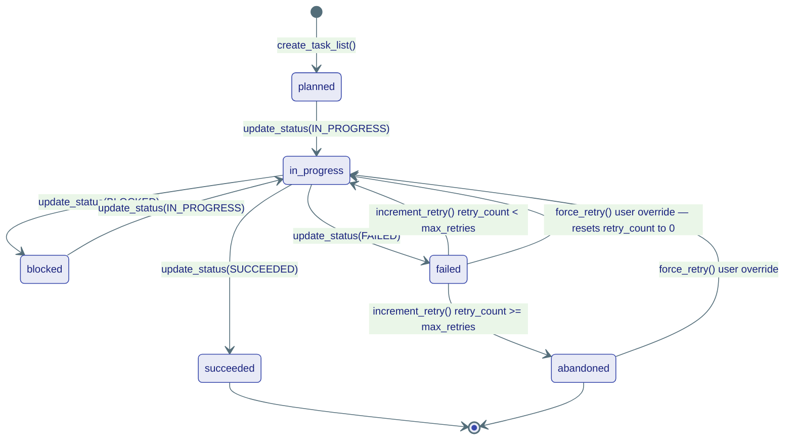

# storage/ — What Agents Remember

> **Source:** `kernel/storage/history.py` · `kernel/storage/memory.py` · `kernel/storage/vector.py` · `kernel/storage/graph.py` · `kernel/storage/blob.py` · `kernel/storage/tasks.py`

Six storage Protocols, each with a specific scope and purpose. All are swappable — in-memory for tests, Postgres/Redis for production — without changing any agent code.

---

## Storage Roles at a Glance

## Storage Roles at a Glance

| Storage Protocol | Responsibility | Primary Scope Keys | Concrete Implementations |
|---|---|---|---|
| **`HistoryProvider`** | Ordered conversation transcript (what was said). | `(agent_id, session_id)` | `InMemoryHistoryProvider` (L1), `RedisHistoryProvider` (L2), `PostgresHistoryProvider` (L2) |
| **`ShortTermMemory`** | Key-value state inside a session (what was learned this session). | `session_id` | `RedisSessionStore` (L2), `PostgresMemoryStore` (L2) |
| **`LongTermMemory`** | Extracted cross-session facts (what was learned forever). | `(agent_id, namespace)` | `RedisSessionStore` (L2), `PgVectorStore` (L2) |
| **`VectorStore`** | Semantic RAG search corpus. | `(id, collection)` | `PgVectorStore` (L2) |
| **`GraphStore`** | Knowledge graph structure (entities + relationships). | Global | `AGEGraphStore` (L2) |
| **`BlobStore`** | Binary file storage (with TTL control). | Global | `S3FileStore` (L2) |
| **`TaskStore`** | Kanban task boards. | `(conversation_id, agent_id)` | `InMemoryTaskStore` (L1), `PgTaskStore` (infrastructure) |

---

## HistoryProvider — Conversation Transcript

The raw ordered log of `ChatMessage` turns. Does not summarize or compact — that's `CompactionStrategy`'s job.

### HistoryProvider Methods

| Method | Parameters | Description |
|---|---|---|
| `append` | `agent_id, msg, session_id, run_id` | Append a single chat turn. |
| `append_many` | `agent_id, messages, session_id, run_id` | Bulk-append a list of chat turns. |
| `get_messages` | `agent_id, session_id, limit, offset` | Retrieve ordered messages for a session. |
| `clear` | `agent_id, session_id` | Delete all history for a session. |
| `clear_run` | `agent_id, session_id, run_id` | Delete only messages from a specific run (supports `HistoryRetention.RUN`). |
| `count_messages` | `agent_id, session_id` | Return message count in a session. |

> [!NOTE]
> `run_id` tags each message so `clear_run()` can cleanly purge temporary sub-agent steps without destroying parent context.

---

## ShortTermMemory vs LongTermMemory

Two distinct memory scopes — session-local vs. permanent across all sessions.

### API Methods

| Memory Store | Method | Description |
|---|---|---|
| **`ShortTermMemory`** | `get_state(session_id)` | Retrieve JSON-serializable session state dict. |
| | `set_state(session_id, state)` | Overwrite session state dict. |
| | `update_state(session_id, patch)`| Atomically merge keys. Prefer for concurrent agents. |
| | `clear(session_id)` | Delete session state. |
| **`LongTermMemory`** | `save(agent_id, content, namespace, ttl)` | Persist a fact memory (returns unique ID). |
| | `search(agent_id, query, namespace, limit)` | Query facts semantically (returns list of `Memory` items). |
| | `get(agent_id, memory_id, namespace)` | Fetch a specific fact memory. |
| | `delete(agent_id, memory_id, namespace)` | Delete a specific fact memory. |
| | `clear(agent_id, namespace)` | Delete all memories in a namespace. |

### Memory Value Objects

`Memory` represents an extracted fact:
* `content: str`: The fact/text.
* `score: float`: Search similarity score.
* `id: str`: Unique identifier.
* `metadata: dict`: Extra descriptive fields.

---

## VectorStore and GraphStore — RAG

### API Methods

| Store Protocol | Method | Description |
|---|---|---|
| **`VectorStore`** | `add(documents, collection)` | Add a batch of `Document` items. |
| | `search(query_embedding, collection, limit, filter)` | Query document vectors (returns `SearchResult` list). |
| | `get(ids, collection)` | Fetch documents by ID. |
| | `upsert(documents, collection)` | Upsert documents in a collection. |
| | `delete(ids, collection)` | Delete documents by ID. |
| | `list_collections()` | List all active vector collections. |
| | `delete_collection(collection)` | Drop a collection. |
| **`GraphStore`** | `add_entities(entities)` | Insert entity nodes into the graph. |
| | `add_relationships(relationships)` | Insert relationship edges into the graph. |
| | `get_neighbors(entity_id, depth, types)` | Get connected graph nodes. |
| | `delete_entity(entity_id)` | Delete entity node. |
| | `delete_relationship(relationship_id)` | Delete relationship edge. |
| **`CypherCapable`** | `query_cypher(query, params)` | (Optional) Execute raw Cypher queries. |

### Core RAG Types

* **`Document`**: Represents raw chunks. Fields: `content: list[ContentBlock]`, `id: str`, `embedding: list[float] \| None`, `metadata: dict`.
* **`SearchResult`**: Match outcome. Fields: `id: str`, `content: list[ContentBlock]`, `score: float`, `metadata: dict`.

> [!WARNING]
> Do not conflate `Document` (chunk in vector search) with `DocumentBlock` (a block within a chat message carrying an uploaded file).

---

## TaskStore — Per-Agent Kanban Board

Task state is a 6-state lifecycle. Both `Task` and `TaskList` are **frozen** — all mutations use `dataclasses.replace()`.

**`TaskList`** groups multiple tasks and tracks `max_retries`. One board per `(conversation_id, agent_id)` pair — sub-agents each get their own board.

**`settle_conversation(conversation_id)`** — flips all `in_progress` tasks to `succeeded` when a run ends normally. Stops the UI Kanban from spinning after the agent finishes.
