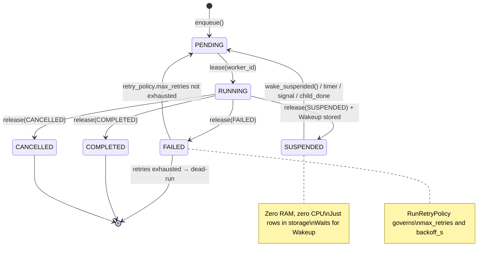
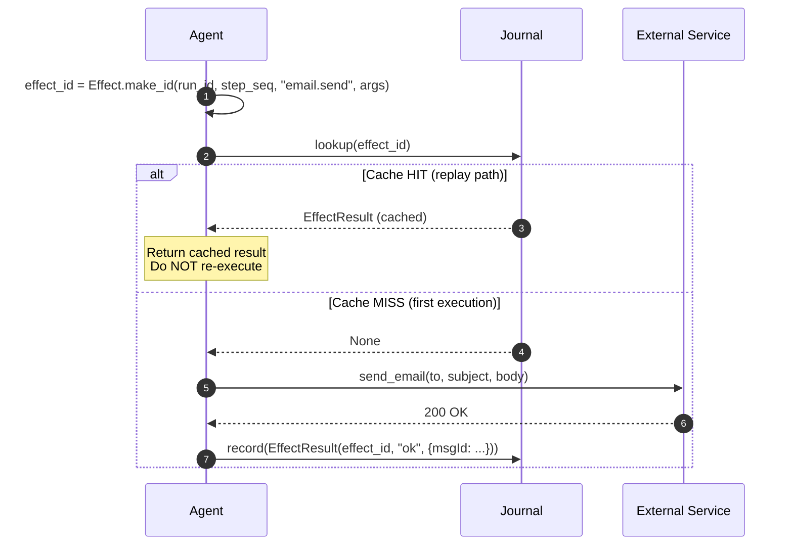
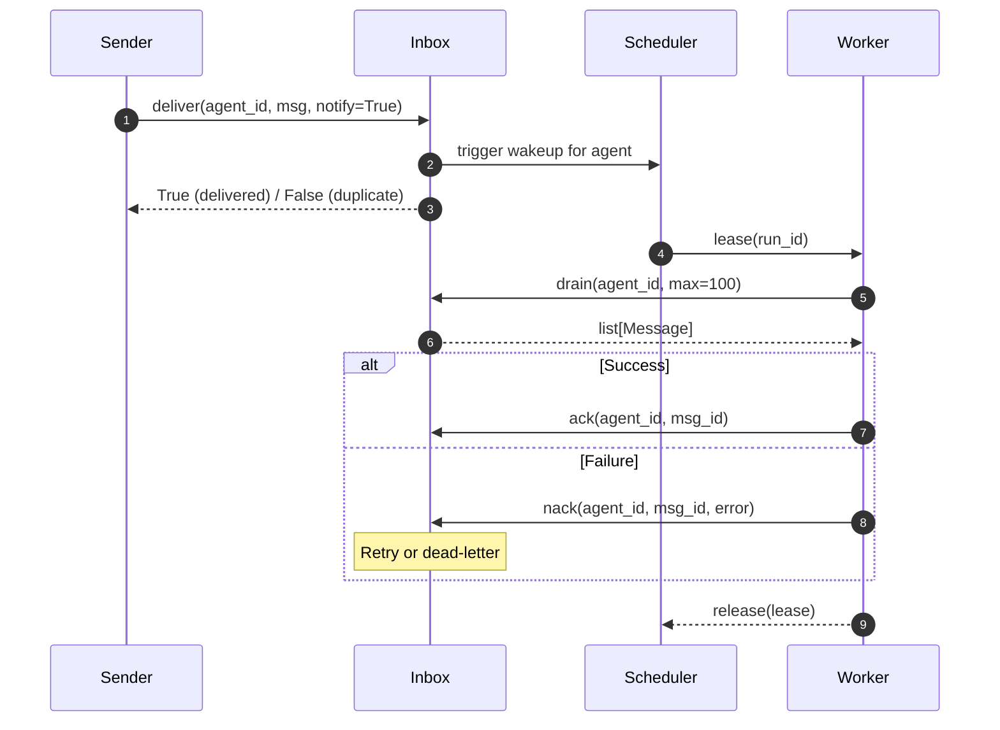
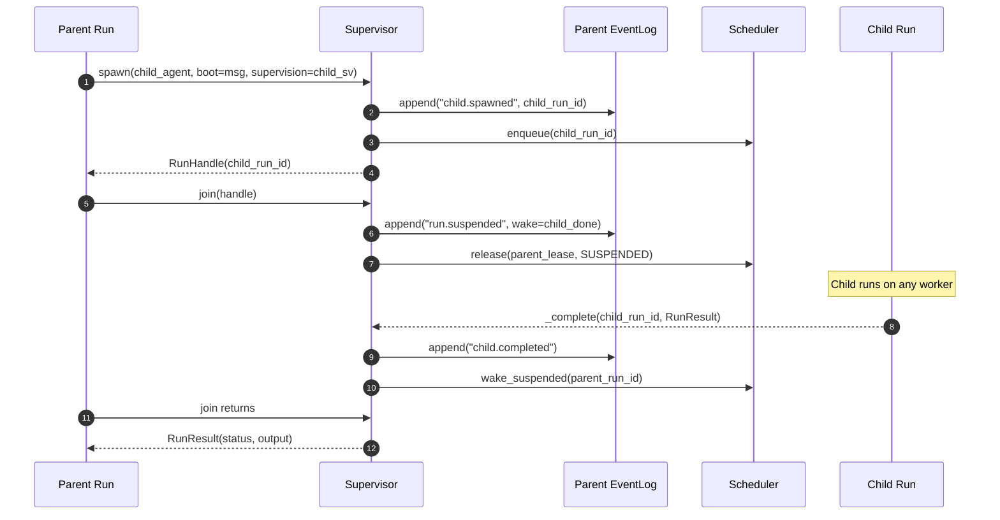
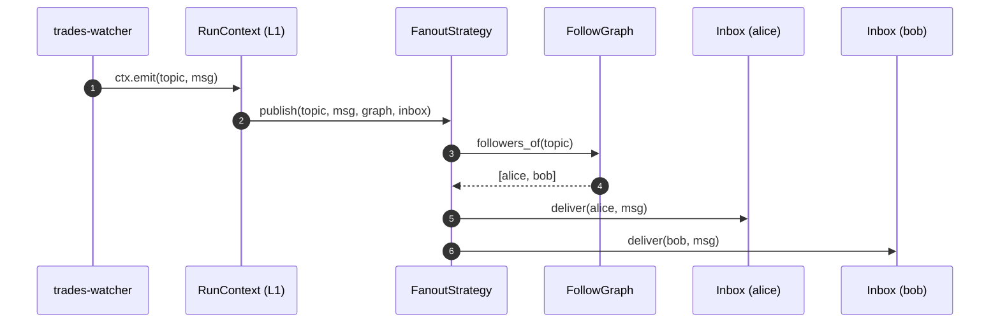

# runtime/ — Durable Execution Machinery

> **Source:** `kernel/runtime/ids.py` · `kernel/runtime/log_entry.py` · `kernel/runtime/effects.py` · `kernel/runtime/inbox.py` · `kernel/runtime/scheduler.py` · `kernel/runtime/supervisor.py` · `kernel/runtime/wakeup.py` · `kernel/runtime/follow_graph.py` · `kernel/runtime/fanout.py` · `kernel/runtime/communication.py`

The deepest part of the kernel. These contracts make agent runs survive crashes, scale across workers, and resume correctly after sleeping for hours — without the agent author doing anything special.

---

## Run Lifecycle

`SUSPENDED` is the efficient idle state — a run waiting for a message, timer, signal, or child completion costs nothing while suspended.

---

## The Full Execution Flow

Every agent execution follows a structured, durable execution flow managed by the runtime:

---

## EventLog — Source of Truth

A run's state is always `fold(all entries from seq=0)`. There is no separate state table. On crash, any worker can pick up the run, replay the log, and continue from exactly where it left off.

### EventLog Protocol

| Method | Parameters | Description |
|---|---|---|
| `append` | `run_id, entry, expected_seq` | Append a new log entry (throws `ConcurrentAppendError` on mismatch). |
| `read` | `run_id, from_seq` | Read log entries sequentially. |
| `tail` | `run_id, from_seq` | Live-stream log entries. |
| `last_seq` | `run_id` | Retrieve the latest sequence ID. |

### RunLogEntry Schema

| Field | Type | Description |
|---|---|---|
| `run_id` | `RunId` | Target run execution ID. |
| `seq` | `int` | Sequential log index. |
| `kind` | `str` | Event type (e.g., `run.started`, `msg.received`, `tool.called`, `run.completed`). |
| `payload` | `dict` | Metadata dictionary payload. |
| `ts` | `datetime` | Log timestamp. |

---

## Journal — At-Most-Once Side-Effects

Prevents executing the same side-effect twice when a worker crashes mid-tool.

**The crash window:** If the worker dies after `execute()` but before `record()`, the effect may have happened without a journal entry. On replay the miss path runs again — the effect executes twice in that window. This is at-most-once's trade-off: we never double-send on record failures, but the crash window is unavoidable. Tools that are genuinely idempotent (GET calls, Stripe with idempotency key) are safe to re-run and should say so in their `description`.

`Effect.make_id()` is deterministic: SHA-256 of `{run_id, step_seq, kind, args}` with sorted keys. The same logical step in the same run always produces the same id.

---

## Inbox — Per-Agent Mailbox

Three robustness guarantees every implementation must honour:
1. **Idempotent delivery** — `deliver()` with the same `Message.id` twice is a no-op. At-least-once transports (Redis Streams) re-deliver on restart; the Inbox absorbs duplicates.
2. **Per-sender FIFO** — messages from the same sender are drained in arrival order. Prevents "post deleted" arriving before "post created" when both come from the same producer.
3. **Dead-letter after N failures** — `nack()` increments the counter. At `max_retries`, the message moves to dead-letter storage and is never delivered again.

**`notify=False`** — callers that enqueue their own run (like `Runtime.submit`) pass `notify=False` to suppress the deliver-hook and avoid spawning a duplicate run.

---

## Scheduler — Work Queue and Admission Control

### Scheduler Protocol

| Method | Parameters | Description |
|---|---|---|
| `enqueue` | `run_id, priority, tenant, wake` | Enqueue a run. |
| `lease` | `worker_id, capacity` | Acquire active leases (returns `list[Lease]`). |
| `heartbeat` | `lease` | Keep active lease alive. |
| `release` | `lease, status, wake_on` | Complete execution and schedule any future wakeups. |
| `find_run_for_agent`| `agent_id` | Return active run ID for agent. |
| `wake_suspended` | `run_id` | Force wake a suspended run. |
| `wake_agent` | `agent_id` | Wake agent. |

### Lease Fields

* `run_id: str`: Targeted run execution ID.
* `agent_id: AgentId`: Target agent address.
* `worker_id: str`: Active worker lease holder.
* `expires_at: datetime`: Expiration deadline (must heartbeat before expiry).
* `attempt: int`: Integer attempt/retry counter.

**Coalescing guarantee** — if a timer fires AND a message arrives while a run is already pending, the Scheduler merges them into one entry. Workers receive a run at most once per wake-cycle regardless of how many sources fired.

---

## Wakeup — What Resumes a Suspended Run

### Wakeup Fields

| Field | Type | Description |
|---|---|---|
| `kind` | `str` | Wakeup trigger category: `message`, `timer`, `signal`, or `child_done`. |
| `at` | `datetime \| None` | Scheduled timer expiration threshold. |
| `signal` | `str \| None` | Buffered signal identifier name. |
| `payload` | `dict` | Signal context data. |
| `source_run` | `RunId \| None` | Associated parent or sender run context ID. |
| `child_run` | `RunId \| None` | Spawned child run identifier. |
| `result_ref` | `str \| None` | Location reference in the ArtifactStore. |

### SignalBus Protocol

* `signal(run_id, name, payload)`: Fire a user signal.
* `timer(run_id, at)`: Set a future wakeup timer.

---

## Supervisor — Spawn, Join, Cancel

**Four hard properties:**
1. **Replay-deterministic spawn** — `spawn` appends `child.spawned` to the parent's log BEFORE enqueuing. On replay, the same `child_run_id` is returned — never a duplicate child.
2. **Mobile children** — a child is its own run with its own EventLog. Any worker can pick it up.
3. **Budget, not depth** — `spawn` consults `SpawnBudget` on the root `run_id`. Over budget → `SpawnDenied`. No per-branch depth limits.
4. **Cancellation cascade** — `cancel()` delivers cancel wakeups to direct children, which cascade recursively. Each child honours the cancel at its next `ctx.check()`.

---

## FollowGraph and FanoutStrategy — The Social Layer

`FollowGraph` is durable — subscriptions survive restarts. `FanoutStrategy` is swappable — Stage 0 does synchronous push to every follower; Stage 3 uses a push/pull hybrid for viral agents with millions of followers.

---

## AskOutcome — The Four Cases

`RunContext.ask()` sends a message to a target agent and awaits its reply. The result is always one of four distinct outcomes:

| Outcome Case | Condition | Status of Target |
|---|---|---|
| **`replied`** | Target completed execution successfully. | COMPLETED |
| **`timed_out`**| Specified timeout elapsed before reply was ready. | RUNNING (still active; returns `RunHandle`) |
| **`target_failed`**| Worker executing target died or lease expired. | FAILED (safe to retry/respawn) |
| **`target_cancelled`**| Target run was explicitly cancelled. | CANCELLED (do not retry) |

> [!CAUTION]
> Collapsing `timed_out` (target is still running, do not respawn) and `target_failed` (target is dead, safe to respawn) results in duplicate executions. Always distinguish these cases cleanly.
