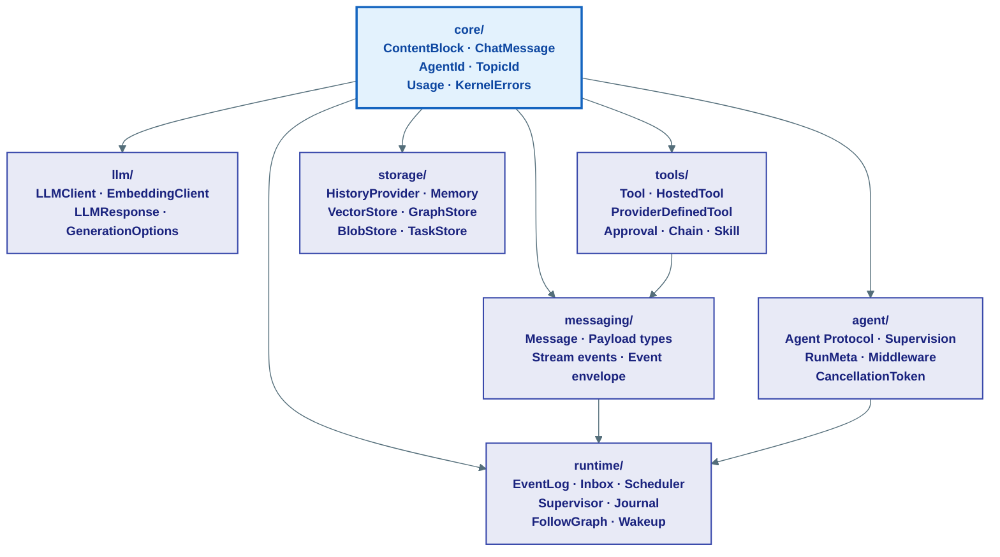
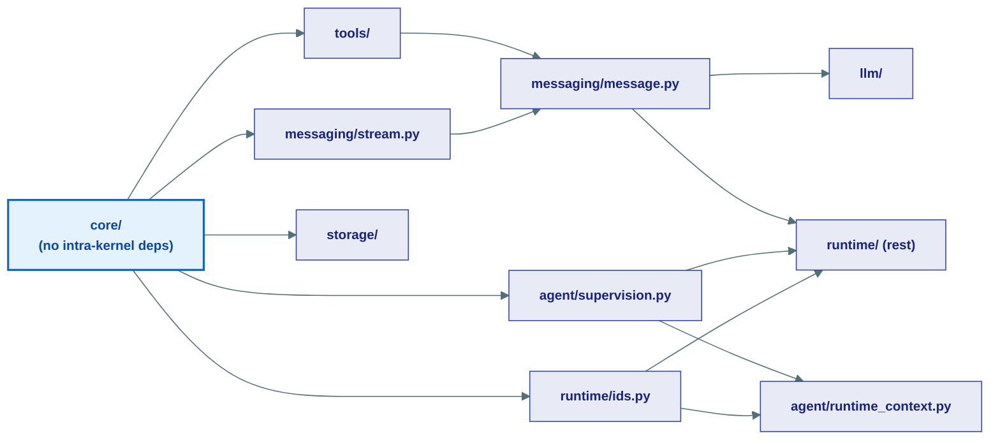

# Kernel — Architecture Overview

> **The kernel is L0 — frozen.** It contains only Protocols, dataclasses, and enums. No I/O, no concrete implementations, no imports from any higher layer. Every layer above (agents → capabilities → fabric → serving) builds on it.

## What Lives Here

| Subpackage Module | Core Concern & Focus | What it answers |
|---|---|---|
| [`core/` &mdash; Universal Primitives](01-core.md) | Content blocks, identities, and errors | What data flows everywhere? (ContentBlock, identity, errors) |
| [`llm/` &mdash; LLM Clients](02-llm.md) | Standard client and embedding protocols | How do we talk to an AI model? |
| [`messaging/` &mdash; Conversation Wire](03-messaging.md) | Messages, stream events, envelopes | How do agents communicate? |
| [`tools/` &mdash; Capability Dispatch](04-tools.md) | Standard/hosted tools, approvals, chains | What can an agent do? |
| [`agent/` &mdash; Execution Loop](05-agent.md) | Agent interfaces and supervisions | What IS an agent? How is it supervised? |
| [`storage/` &mdash; Persistence Interfaces](06-storage.md) | Inboxes, logs, history, and store protocols | What does an agent remember? |
| [`runtime/` &mdash; Execution Engines](07-runtime.md) | Priority schedulers, journals, and lifecycles | How does a run stay alive across crashes? |

---

## Subpackage Map

---

## Dependency Rule

Imports within the kernel flow in one direction only:

---

## The Staged Implementation Model

Every kernel Protocol has concrete implementations at higher layers. The engine ships Stage 0 and Stage 1 out of the box:

| Kernel Protocol | Stage 0 (in-process) | Stage 1 (durable) |
|---|---|---|
| `EventLog` | In-memory list | Postgres append-only table |
| `Inbox` | In-memory deque | Postgres `(agent_id, msg_id)` table |
| `Scheduler` | asyncio priority queue | `SELECT FOR UPDATE SKIP LOCKED` |
| `Journal` | In-memory dict | Redis (hot) + Postgres (cold) |
| `HistoryProvider` | `InMemoryHistoryProvider` | `PostgresHistoryProvider` |
| `VectorStore` | — | `PgVectorStore` |
| `GraphStore` | — | `AGEGraphStore` |

Switch backends by changing the wiring in `infrastructure/serving_factory.py`. Agent code never changes.
