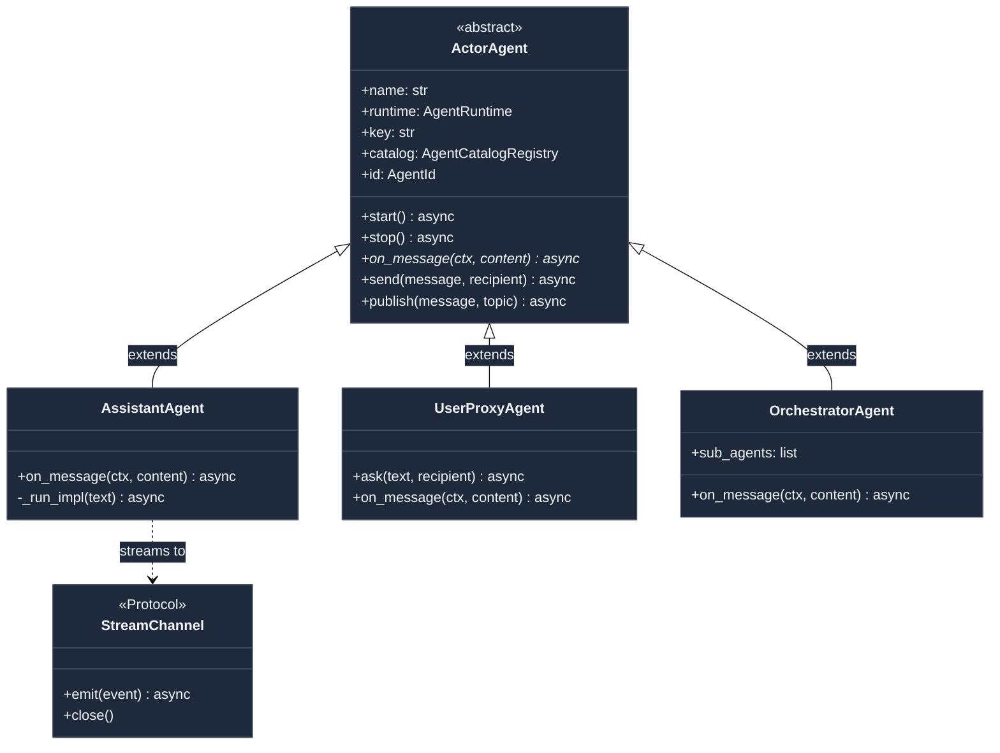
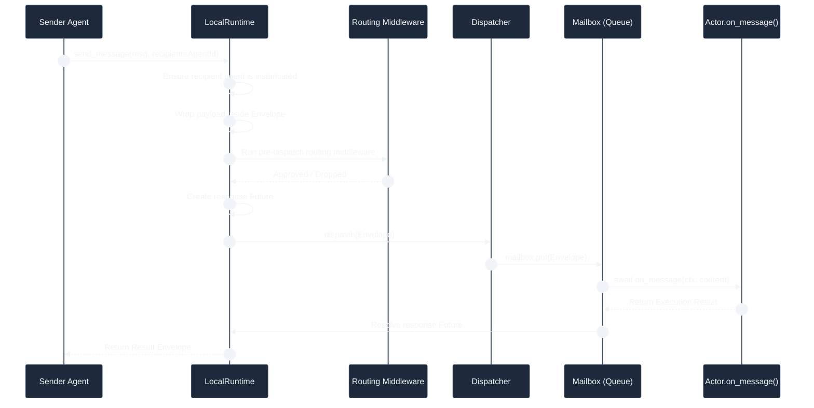
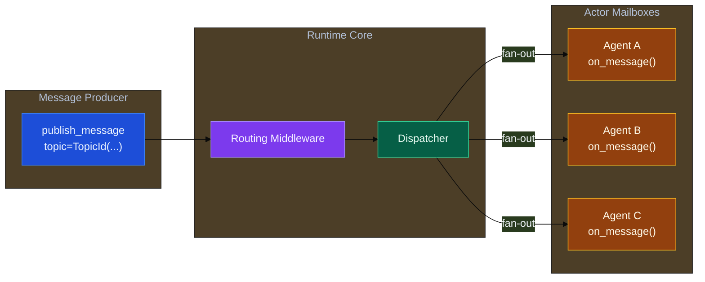
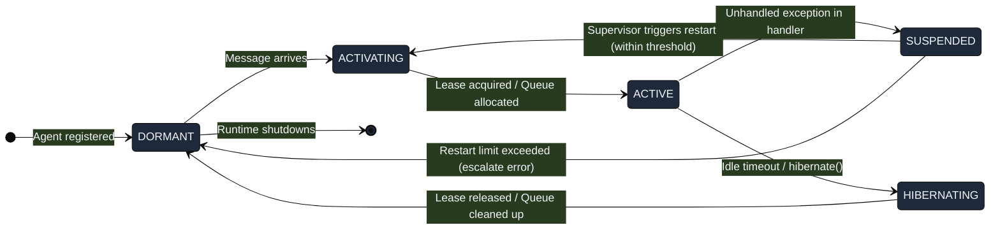

# L1 · The Fabric

The **Fabric** layer is the operating system and messaging middleware of the Ravi framework. It provides the actor-model implementation, manages message dispatch and fan-out, coordinates transactions, and supervises agent lifecycle states across local and distributed topologies.

---

## The Actor: Every Agent is a Node

In Ravi, every active agent is an actor extending the `ActorAgent` abstract base class. Individual agents do not run as isolated procedures. Instead, they exist as nodes inside a runtime system.

### Key Characteristics of ActorAgent
*   **Decoupled & Addressable**: Communicates strictly using `AgentId` coordinates. An agent does not hold references to other agent instances directly.
*   **Unified Entry Point**: All work enters through the async `on_message(ctx, content)` interface.
*   **Outward-Only Communication**: Agents emit results and trigger downstream steps using `send(msg, recipient)` (point-to-point) or `publish(msg, topic)` (event-driven broadcast).

---

## Runtime Message Flow Architecture

Ravi supports both `LocalRuntime` (in-process queue orchestration) and `DistributedRuntime` (Redis/gRPC backplane). The rest of the framework interacts strictly with the `AgentRuntime` interface, allowing developers to scale their topologies without changing their agent code.

### 1. Point-to-Point Messaging (`send_message`)
Point-to-point delivery uses a target mailbox architecture to isolate and buffer execution. The runtime handles routing middleware, lazy agent activation, queueing, and response matching.

### 2. Event Broadcast / Pub-Sub (`publish_message`)
Event-driven workflows use fire-and-forget broadcasting. The runtime automatically resolves matching topics and fans the message out to the mailbox of every subscribed agent.

---

## Agent Lifecycle State Machine

The runtime supervises the health, activation, and recovery states of every registered actor instance via an Erlang-style supervisor pattern.

> [!TIP]
> In distributed configurations, the `ACTIVATING` phase communicates with a `LeaseRegistry`. If a lease is already held by a node in another process, the runtime fails over or proxies the message, facilitating seamless high-availability deployments.

---

## Reliability and Coordination Engines

The Fabric layer packs three crucial subsystems that ensure reliability across long-running or volatile operations:

### 1. Saga Coordinator (`SagaCoordinator`)
For operations marked as **critical**, the runtime wraps tool execution in a Saga pattern. If an actor crashes mid-transaction, the coordinator utilizes a WAL (Write-Ahead Log) stored in the `CheckpointStore` to either replay the remaining steps or apply rollback compensations using registered compensating tools.

### 2. Resource Lock Manager (`ResourceLockManager`)
An advisory locking system that secures specific resource URIs (e.g., database rows, filesystem paths) before tool execution. This prevents multiple concurrent actor steps from editing or corrupting the same external resource.

### 3. Checkpoint Store (`CheckpointStore`)
Maintains incremental snapshots of agent memories, lineage metadata, and runtime states, enabling rapid recovery after system restarts.
