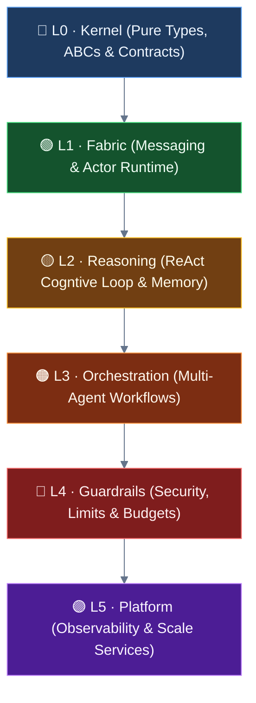
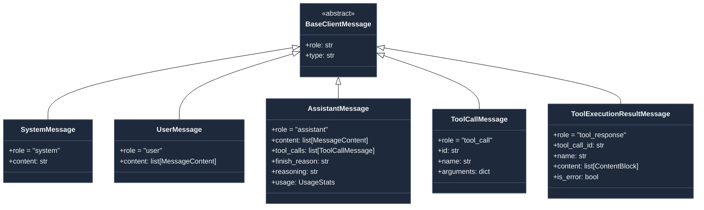
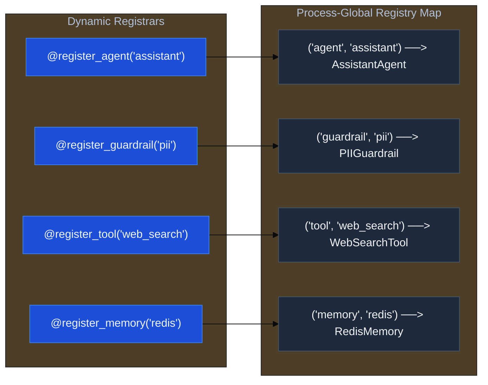

# L0 · The Kernel

The absolute bedrock of the Ravi Framework. The **Kernel** defines *what* everything is without implementing *how* anything works. It is a pure, compile-time contract layer containing exclusively Protocols, Abstract Base Classes (ABCs), Type definitions, Enums, and the Plugin Registry.

---

## Architectural Philosophy

To ensure the framework remains maintainable and decoupled at scale, the Kernel is governed by a strict discipline:

1. **Zero I/O & Zero Side Effects**: There are no database calls, no network sockets, no HTTP client initialization, and no LLM API requests inside `src/ravi/kernel/`. 
2. **Pure Python Types & Contracts**: The Kernel specifies contracts and base structures. Concrete behaviors—such as message routing, database storage, and LLM inference—are implemented in layers above.
3. **Downward Import-Only Flow**: Files within `kernel/` are not allowed to import from any higher layers. This is enforced at the CI level by import linting.

---

## Core Primitives and Abstractions

The type system inside the Kernel acts as a universal translator across all layers.

### 1. Identity & Routing Keys
At the core of the messaging fabric are identity wrappers:
*   `AgentId`: Structured identifier mapping an agent's `type` and a unique identifier `key` (e.g., `assistant/default`).
*   `TopicId`: Pub/sub target containing a specific source and routing key.

### 2. Value Containers
*   `Envelope`: The primary transport mechanism of the fabric. Every message in flight is wrapped in an `Envelope`, which carries the sender/recipient `AgentId`, tracing headers, identity context, temporal metadata (TTL), and the payload itself.
*   `ContentBlock`: A typed, multimodal primitive (such as `TextBlock`, `ImageBlock`, `AudioBlock`, or `VideoBlock`) representing individual segments of content inside a message payload.

### 3. The Multimodal Message System
All LLM-facing communication inherits from the `BaseClientMessage` contract. Each message contains a `role` mapped to native vendor formats:

---

## Key Interface Contracts

All operational blocks in Ravi implement a Kernel protocol:

| Contract Interface | Category | Purpose |
|-------------------|----------|---------|
| `AgentProtocol` | Execution | The core contract for any actor-mesh node. Defines the async `on_message` interface. |
| `AgentRuntime` | Runtime | The message bus, tracking subscriber topics and point-to-point delivery. |
| `BaseModelClient` | LLM Gateway | The abstract interface for model providers (OpenAI, Anthropic, Gemini). |
| `BaseTool` | Capability | Template-method class for safe, annotated, and risk-rated tools. |
| `BaseMemory` | Memory | Simple async interface for appending and retrieving agent message logs. |
| `BaseGuardrail` | Safety | Async validator checks injecting into execution stages. |
| `BaseMiddleware` | Interceptor | Sequential hook handler wrapping execution boundaries. |

---

## The Plugin Registry

The Kernel houses the process-global Plugin Registry (`_REGISTRY`). It acts as a catalog of available classes (such as agents, tools, guardrails, and memory backends) that can be dynamically registered using Python decorators at import time.

> [!NOTE]
> The registry ensures early failure: attempting to register a class that does not satisfy its base contract raises a `PluginRegistryError` at import time, preventing silent misconfigurations at runtime.
