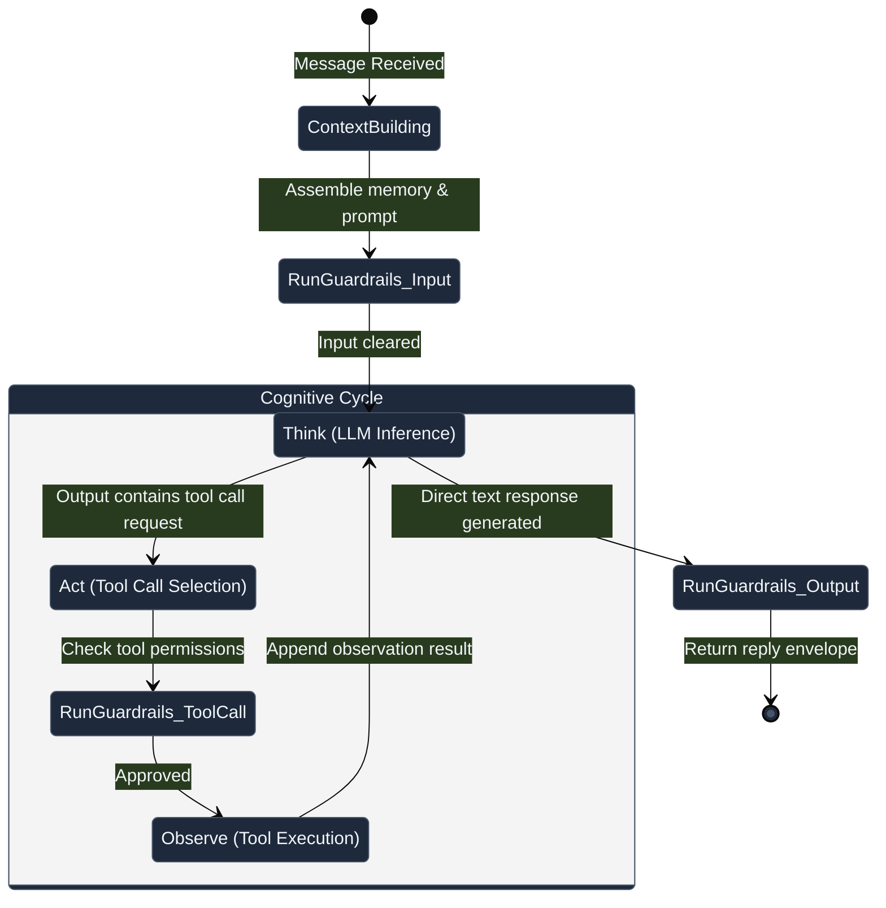
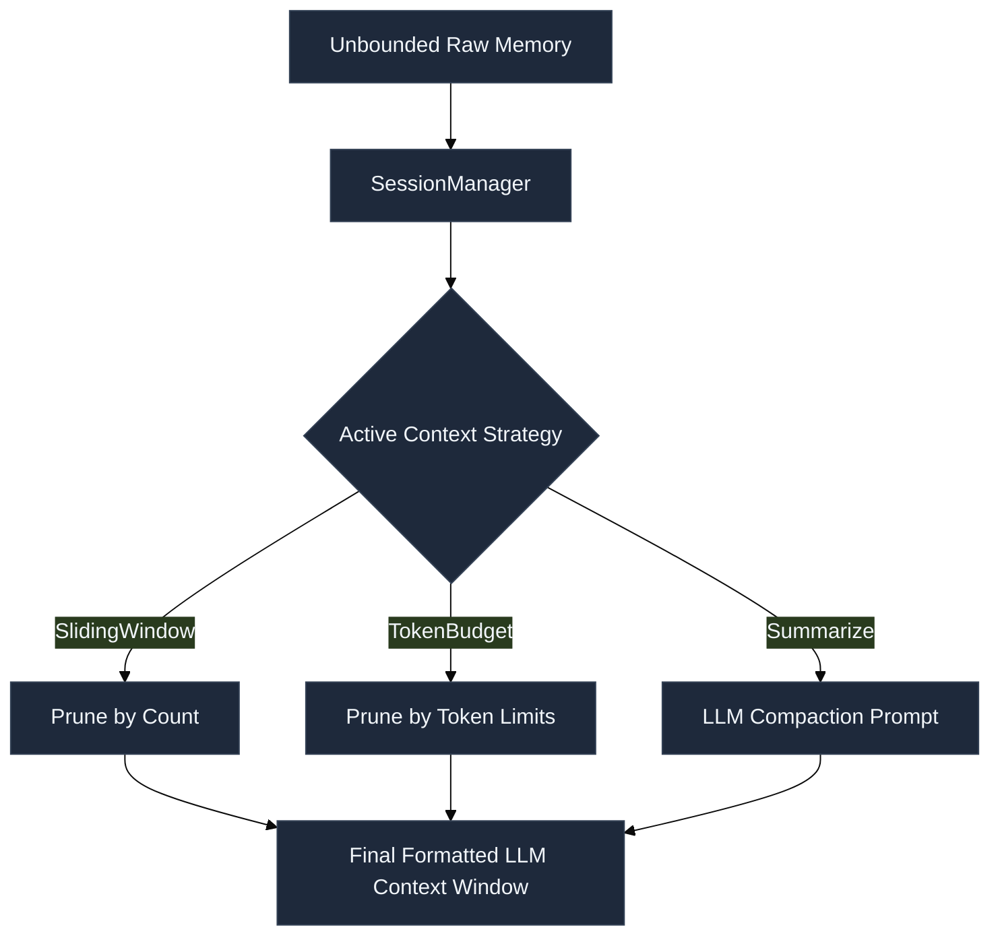
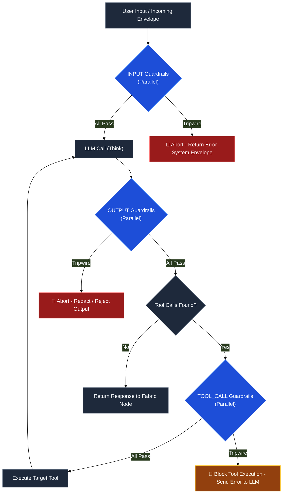
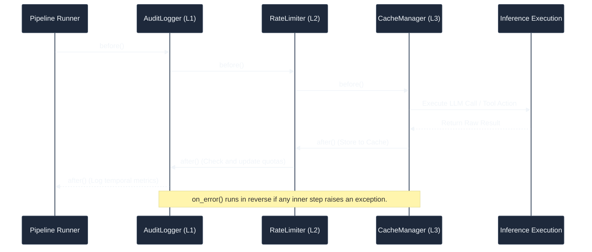

# L2 · Reasoning

The **Reasoning** layer represents the cognitive core of a single agent. It encapsulates the execution loops, prompt context assembly strategies, tool-calling lifecycle, parallel guardrail validation, middleware pipelines, and structured schemas that allow an actor to think, decide, and react.

---

## The Core: AssistantAgent & The ReAct Loop

The primary cognitive agent in Ravi is `AssistantAgent`. Upon receiving an envelope, the agent launches a localized **ReAct (Reasoning and Action)** execution cycle inside its `on_message` handler.

---

## Memory and Context Strategies

An agent's reasoning is heavily dependent on how context is assembled before prompting the LLM. Instead of sending an unmanaged list of historical messages, Ravi uses modular **Context Strategies** to build the active window.

*   `SlidingWindowContext`: Evicts the oldest messages once a target message count is reached.
*   `TokenBudgetContext`: Calculates tokens dynamically (using tiktoken or provider-specific encoders) and prunes historical blocks to fit strict model token ceilings.
*   `SummarizingContext`: Compresses older turns of a conversation into a running semantic paragraph, appending it as a system block while keeping recent turns intact.
*   `HybridContext`: Combines vector search retrieval (RAG) with local message histories to construct highly contextual prompts dynamically.

---

## Three-Stage Guardrail Pipelines

Safety checking is implemented as non-blocking, parallel guardrail pipelines that execute at three distinct entry points of the cognitive loop.

> [!IMPORTANT]
> **Parallel Execution**: Each guardrail stage executes its checks concurrently using `asyncio.gather`. Expensive checks (e.g., LLM-as-a-judge evaluators) do not block or serialize fast checks (e.g., regex pattern matching).
> **Immutable Context**: Guardrails receive a frozen `GuardrailContext` snapshot, ensuring they cannot mutate the state of the active agent mid-check.

---

## The Middleware Onion Interceptor

Execution pipelines inside the reasoning loop are wrapped in an onion-style interceptor pattern using the `ExecutionMiddlewarePipeline`. This is used to layer cross-cutting concerns around LLM actions.

If an error is thrown during execution, the pipeline halts and calls `on_error(ctx, exception)` in reverse order, allowing retry policies to trap, log, and recover before propagating failures to the fabric.

---

## Event Hooks and Observability

The reasoning layer emits operational telemetry at critical boundaries via the `HookManager`. Other layers subscribe to these hooks to power platform evaluations, dashboards, and live debugging portals:

*   `on_run_start`: Triggered when an agent receives an initial envelope and spawns its thread.
*   `on_llm_start` / `on_llm_end`: Measures prompt tokens, completion latency, and model efficiency.
*   `on_tool_start` / `on_tool_end`: Records tool execution times, input parameters, and failure states.
*   `on_handoff`: Captures transfers of delegation between separate actors.
