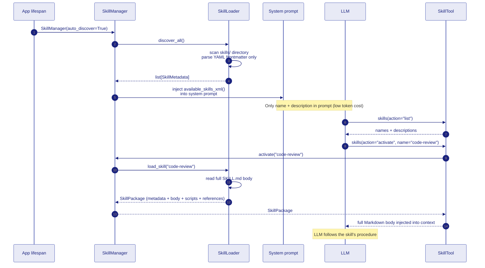
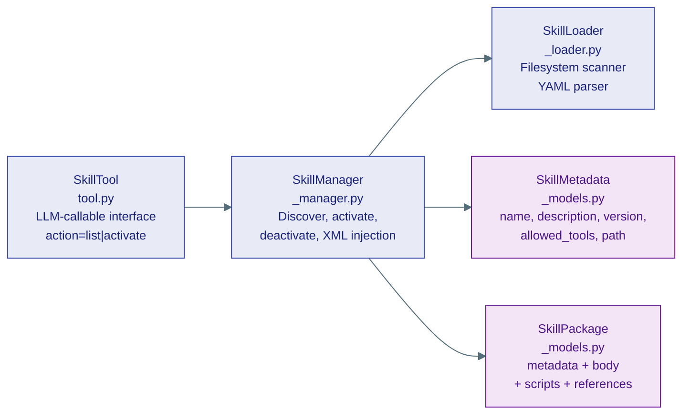

# 2 · Skills

Skills are **prompt packages** — a `SKILL.md` file containing YAML frontmatter (metadata) plus a Markdown body (procedural instructions for the LLM). They follow the [agentskills.io](https://agentskills.io) open spec.

## SKILL.md structure

```yaml
---
name: code-review          # kebab-case, 1–64 chars
description: Structured code review skill for evaluating code quality...
version: "1.0"
license: MIT
allowed-tools: code_interpreter file_manager   # tools this skill may call
category: development/project
tags: [review, quality, refactor, best-practice]
aliases: [review-code, code-quality, pr-review]
metadata:
  author: agent-framework
---

# Code Review Skill

Use this skill when the user asks you to review code...

## Review Procedure
### Step 1 — Understand Context
...
```

The YAML frontmatter is loaded at startup (cheap — metadata only). The Markdown body is only loaded when the skill is **activated** (the LLM decides it needs it).

## Lifecycle — two-phase loading



## Three classes



### `SkillManager`

The coordinator. Lives on `app.state.skill_manager`.

```python
manager = SkillManager()           # auto_discover=True by default
manager.discover()                 # re-scan (safe to call multiple times)

# Inject into system prompt
system = manager.inject_into_prompt(base_system_prompt)

# Activate on demand (lazy — loads full body)
skill = manager.activate("code-review")   # -> SkillPackage | None
context_block = manager.active_context_block()

# Deactivate between conversations
manager.deactivate_all()
```

### `SkillTool`

The LLM-callable interface registered in the Toolbox. Two actions:

| Action | Effect |
|---|---|
| `list` | Returns all discovered skill names and descriptions |
| `activate` | Loads and returns the full SKILL.md body for the named skill |

### `SkillPackage`

The fully loaded skill. Has helper methods:

```python
skill.to_context_block()    # → Markdown formatted for LLM injection
skill.list_scripts()        # → ["build.sh", "validate.py"]
skill.read_reference("schema.json")   # → file contents | None
```

## Built-in skills

| Skill name | Category | `allowed-tools` |
|---|---|---|
| `api-testing` | development/execution | `http_request`, `code_interpreter` |
| `code-explainer` | development | — |
| `code-review` | development/project | `code_interpreter`, `file_manager` |
| `data-analysis` | analysis | `code_interpreter` |
| `debugging` | development | `code_interpreter` |
| `project-planning` | planning | — |
| `spotify-player` | entertainment | `spotify` |
| `summarization` | writing | — |
| `web-research` | research | `web_search`, `read_url` |
| `writing-assistant` | creative | — |

## Adding a skill

Create a directory under `capabilities/tools/skills/<skill-name>/` with a `SKILL.md`:

```
capabilities/tools/skills/
└── my-skill/
    ├── SKILL.md          ← required
    ├── scripts/          ← optional shell/python helpers
    │   └── run.sh
    └── references/       ← optional reference files
        └── schema.json
```

The `SkillLoader` auto-discovers it at next startup — no registration needed.

### Naming rules (from `SkillMetadata.__post_init__`)

- Lowercase alphanumeric + hyphens only
- Cannot start or end with a hyphen
- No consecutive hyphens (`--`)
- 1–64 characters

```python
# Valid
"code-review", "api-testing", "web-research"

# Invalid — raises ValueError at startup
"Code-Review", "my--skill", "-bad", "good-"
```
