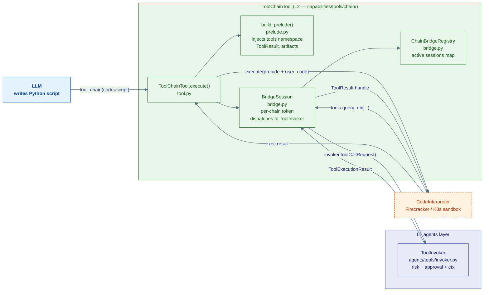
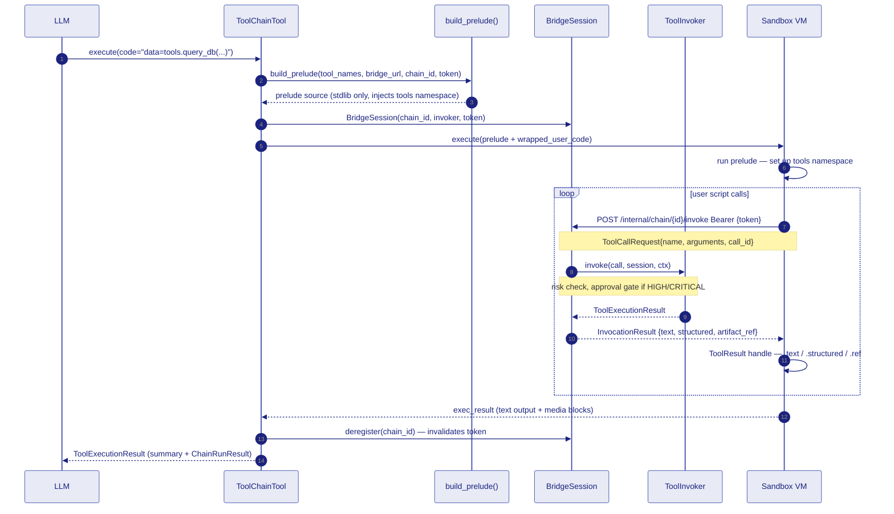

# 3 · Tool Chain

Tool Chain lets the LLM write a **single Python script** that calls multiple tools and pipes results between them — all inside the existing CodeInterpreter sandbox. Instead of the ReAct loop dispatching one tool at a time, the LLM writes the orchestration logic itself.

## Why this matters

In a normal ReAct loop: `query_db` → (wait) → (LLM processes) → `send_email` → (wait) — each hop re-enters the LLM.  
With Tool Chain: the LLM writes `data = tools.query_db(...); tools.send_email(body=data.text)` — the two calls happen inside one sandbox execution with no LLM round-trips between them.

Large data never re-enters the sandbox as text either — it is passed **by reference** (a `DataRef` pointer) store-to-tool.

## Architecture



## End-to-end execution sequence



## The `tools` namespace in the sandbox

`build_prelude()` injects a stdlib-only Python preamble. Inside the script the LLM can write:

```python
# Call any registered tool
data = tools.query_db(query="SELECT * FROM events LIMIT 1000")

# Pass large data by reference — payload never re-enters the sandbox as text
summary = tools.analysis_tool(data=data)   # DataRef passed by {$artifact: ref}

# Materialise to disk for pandas / numpy
path = await data.materialize()   # downloads artifact → /workspace/artifact_abc.csv
import pandas as pd
df = pd.read_csv(path)

# Upload sandbox-produced files back
chart_ref = artifacts.put("/workspace/chart.png", "image/png")

return {"summary": summary.text, "chart": chart_ref}
```

### `ToolResult` handle

| Attribute | Type | Contents |
|---|---|---|
| `.text` | `str` | Inline text or preview |
| `.structured` | `dict` | `structured_content` from `ToolExecutionResult` |
| `.ref` | `str \| None` | `DataRef` ID — present when data was offloaded to Redis/S3 |
| `.files` | `list` | Media blocks (images, files) |
| `await .materialize()` | `str` | Downloads ref to `/workspace/…` and returns local path |

### Pass-by-reference

When a `ToolResult` with a non-`None` `.ref` is passed as a tool argument, the prelude serialises it as `{"$artifact": ref}`. The bridge resolves it server-side — the actual payload travels store-to-tool without re-entering the sandbox.

## Security

| Mechanism | Where |
|---|---|
| Per-chain bearer token (32-byte random, single-use) | `BridgeSession.__init__` |
| Token invalidated in `finally` even on crash | `ToolChainTool.execute()` |
| K8s NetworkPolicy gates sandbox → engine HTTP | Deployment manifest |
| Risk / approval still enforced per tool call | `ToolInvoker.invoke()` |
| `timeout` capped at `policy.total_timeout_s` | `ToolChainTool._run_chain()` |

## Wiring

`ToolChainTool` requires an active `CodeInterpreterTool` — if `CODE_INTERPRETER_URL` is unset, the constructor raises `RuntimeError` and the tool is simply not registered.

```python
# In lifespan
tool = ToolChainTool(
    invoker=ToolInvoker(registry, approval, artifact_store, policy),
    interpreter=code_interpreter_tool,
    bridge_registry=app.state.chain_bridge,
    bridge_base_url="http://engine:8001",
)
toolbox.add(tool)
```
