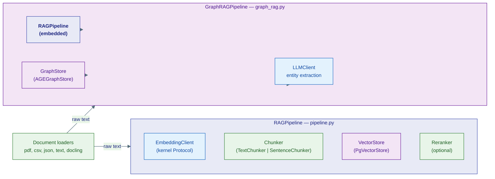
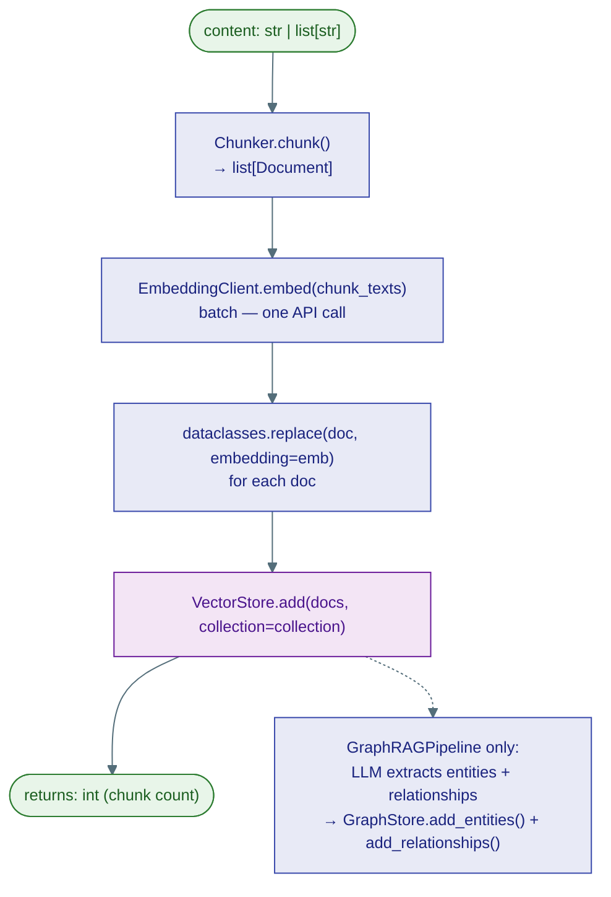
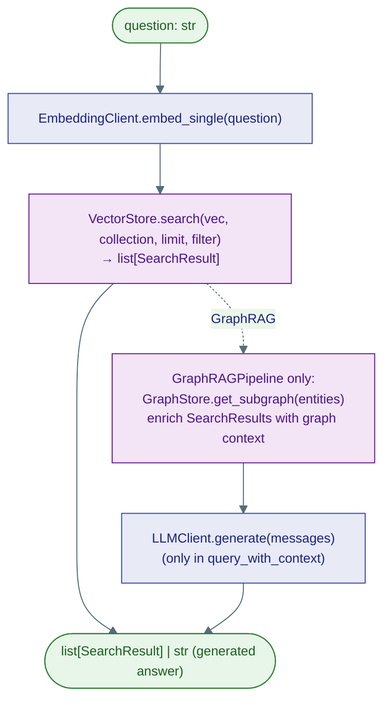

# 4 · Knowledge & RAG

The knowledge sub-package wires together embedding clients, vector stores, chunkers, and an optional knowledge graph into two high-level pipelines: `RAGPipeline` (vector similarity only) and `GraphRAGPipeline` (vector + graph traversal).

## Two pipelines



## Ingest flow



## Query flow



## `RAGPipeline` API

```python
pipeline = RAGPipeline(
    embedding_client=embed_client,   # EmbeddingClient Protocol
    vector_store=vector_store,       # VectorStore Protocol
    default_chunk_size=512,
    default_chunk_overlap=128,
)

# Ingest text
n = await pipeline.ingest("Long document …", collection="kb", chunker="text")

# Ingest pre-chunked documents (e.g. from a loader)
n = await pipeline.ingest_documents(docs, collection="kb")

# Retrieve
results: list[SearchResult] = await pipeline.query("What is X?", collection="kb", limit=5)

# Full RAG: retrieve + generate
answer: str = await pipeline.query_with_context(
    "What is X?",
    collection="kb",
    model_client=llm_client,
)
```

## `GraphRAGPipeline` API

```python
pipeline = GraphRAGPipeline(
    rag_pipeline=rag_pipeline,
    graph_store=graph_store,
    model_client=model_client,
)

# Ingest into vector store + extract entities into graph
n = await pipeline.ingest_with_graph("Document …", collection="kb", extract_graph=True)

# Query — vector results enriched with graph neighbours
results = await pipeline.query("Who works at Acme?", collection="kb")
```

## Chunkers

| Class | Strategy | Parameters |
|---|---|---|
| `TextChunker` | Fixed-size character split with overlap | `chunk_size=512`, `overlap=128` |
| `SentenceChunker` | Sentence-boundary split | `max_chunk_size` |

```python
from ravi.capabilities.knowledge.chunking import get_chunker

chunker = get_chunker("text", chunk_size=512, overlap=128)
docs = chunker.chunk("Long text …", metadata={"source": "readme.md"})
```

## Document loaders

All loaders implement the `DocumentLoader` base protocol: `async def load(path) -> list[Document]`.

| Module | Class | Formats |
|---|---|---|
| `text_loader.py` | `TextLoader` | `.txt`, `.md` |
| `pdf_loader.py` | `PDFLoader` | `.pdf` (pypdf) |
| `csv_loader.py` | `CSVLoader` | `.csv` |
| `json_loader.py` | `JSONLoader` | `.json` |
| `docling_loader.py` | `DoclingLoader` | `.pdf`, `.docx`, `.pptx`, `.html` via docling |

## `RAGProvider` Protocol

Both pipelines satisfy the `RAGProvider` protocol (`knowledge/protocol.py`):

```python
class RAGProvider(Protocol):
    async def ingest(self, content, *, collection="default", **kwargs) -> int: ...
    async def query(self, question, *, collection="default", limit=5, **kwargs) -> list[SearchResult]: ...
    async def query_with_context(self, question, *, collection="default", limit=5, **kwargs) -> str: ...
```

The `KnowledgeSearchTool` (`capabilities/tools/ai/knowledge_search.py`) accepts any `RAGProvider` — swap `RAGPipeline` for `GraphRAGPipeline` without changing the tool.

## Reranker

`capabilities/knowledge/reranker.py` provides a cross-encoder reranker that can post-process `VectorStore.search()` results before they are passed to the LLM. It is optional — use it when recall quality matters more than latency.

```python
from ravi.capabilities.knowledge.reranker import Reranker

reranker = Reranker(model="cross-encoder/ms-marco-MiniLM-L-6-v2")
reranked = await reranker.rerank(query, results, top_k=3)
```

## Paged memory pipeline

`knowledge/page_pipeline.py` handles very long documents by splitting them into pages rather than fixed-size chunks. Use it when the document has natural page boundaries (PDFs) and you want to preserve page-level context.
