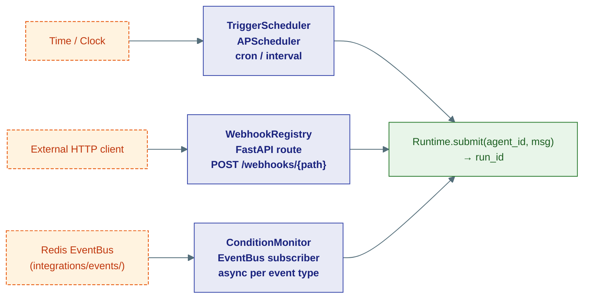
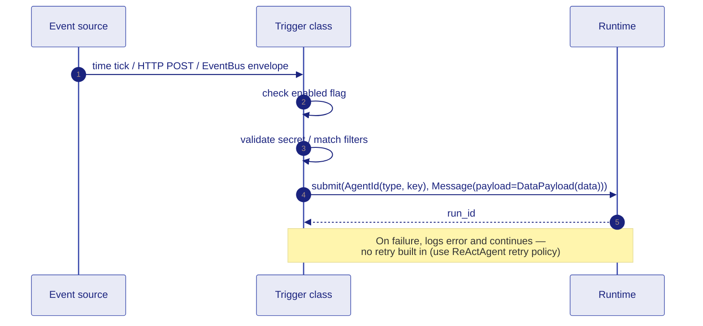

# 7 · Triggers

Three independent trigger mechanisms — each detects an event and dispatches a `Message` to the native `Runtime`:

| Class | File | How it fires |
|---|---|---|
| `TriggerScheduler` | `triggers/scheduler.py` | Cron or interval — APScheduler + Redis job store |
| `WebhookRegistry` | `triggers/webhooks.py` | Incoming HTTP POST to `/webhooks/{path}` |
| `ConditionMonitor` | `triggers/conditions.py` | EventBus subscription — event matches filter dict |

All three share the same dispatch pattern: build an `AgentId` + `Message`, call `await runtime.submit(agent_id, msg)`.

## Architecture



## `TriggerScheduler`

Backed by APScheduler (`AsyncScheduler` with `MemoryDataStore`). The Runtime is injected via `set_runtime()` so the scheduler can be instantiated before the runtime is ready.

```python
from ravi.capabilities.triggers import TriggerScheduler, TriggerDef

scheduler = TriggerScheduler(redis_url=settings.REDIS_URL)
scheduler.set_runtime(runtime)
await scheduler.start()

await scheduler.add_trigger(TriggerDef(
    name="daily-report",
    kind="cron",
    schedule="0 8 * * *",            # every day at 08:00 UTC
    target_type="pipeline",
    target_name="morning-report",
    target_params={"recipients": ["team@example.com"]},
))

await scheduler.add_trigger(TriggerDef(
    name="health-check",
    kind="interval",
    schedule="300",                   # every 300 seconds
    target_type="pipeline",
    target_name="health-monitor",
))

trigger = scheduler.get_trigger("daily-report")
removed = await scheduler.remove_trigger("daily-report")
await scheduler.stop()
```

### `TriggerDef` fields

| Field | Type | Description |
|---|---|---|
| `name` | `str` | Unique trigger name |
| `kind` | `"cron" \| "interval"` | Schedule type |
| `schedule` | `str` | Cron expression or seconds |
| `target_type` | `"pipeline" \| "chain" \| "workflow"` | Agent type to dispatch to |
| `target_name` | `str` | Agent key / pipeline name |
| `target_params` | `dict` | Passed as `DataPayload.data` in the dispatched `Message` |
| `enabled` | `bool` | Disabled triggers are registered but silently skipped when they fire |

## `WebhookRegistry`

Webhooks are registered dynamically and each gets a `secret` (16-char hex, auto-generated). HTTP callers include the secret in the request body to authenticate.

```python
from ravi.capabilities.triggers import WebhookRegistry

registry = WebhookRegistry(runtime=runtime)

webhook = await registry.register(
    name="deploy-notify",
    path="deploy-notify",             # URL: POST /webhooks/deploy-notify
    target_type="pipeline",
    target_name="post-deploy-checks",
    target_params={"env": "production"},
)
print(webhook.secret)   # share with the caller for HMAC/secret validation

# In the FastAPI route (mounted by monolith/app.py):
result = await registry.handle(
    path="deploy-notify",
    payload={"commit": "abc123", "branch": "main"},
    secret=provided_secret,
)
# → {"status": "triggered", "dispatched": True, "run_id": "..."}

removed = await registry.unregister("deploy-notify")
```

The incoming HTTP payload is merged with `target_params` and passed as `DataPayload.data`.

## `ConditionMonitor`

Subscribes to the Redis EventBus. One asyncio Task per distinct `event_type`. When an event is received and matches a condition's `filters` dict (key-value exact match on `event.data`), the configured pipeline is dispatched.

```python
from ravi.capabilities.triggers import ConditionMonitor, ConditionDef

monitor = ConditionMonitor(runtime=runtime)
monitor.set_event_bus(event_bus)
await monitor.start()

await monitor.add_condition(ConditionDef(
    name="low-balance-alert",
    event_type="account.balance_updated",
    filters={"balance_below_threshold": True, "account_type": "premium"},
    target_type="pipeline",
    target_name="alert-pipeline",
    target_params={"channel": "slack"},
))

await monitor.stop()
```

### Matching logic

```python
def matches(self, event: dict) -> bool:
    if event.get("type") != self.event_type:
        return False
    data = event.get("data", {})
    return all(data.get(k) == v for k, v in self.filters.items())
```

All filters must match (AND semantics). An empty `filters` dict matches every event of the right type.

## Trigger dispatch sequence



## Wiring in lifespan

```python
# In monolith lifespan
app.state.trigger_scheduler = TriggerScheduler(redis_url=settings.REDIS_URL)
app.state.webhook_registry = WebhookRegistry()
app.state.condition_monitor = ConditionMonitor()

# Inject runtime after it's built
runtime = build_runtime(...)
app.state.trigger_scheduler.set_runtime(runtime)
app.state.webhook_registry.set_runtime(runtime)
app.state.condition_monitor.set_runtime(runtime)
app.state.condition_monitor.set_event_bus(app.state.bus)

await app.state.trigger_scheduler.start()
await app.state.condition_monitor.start()
```

On shutdown, call `await scheduler.stop()` and `await monitor.stop()` in the lifespan teardown.
