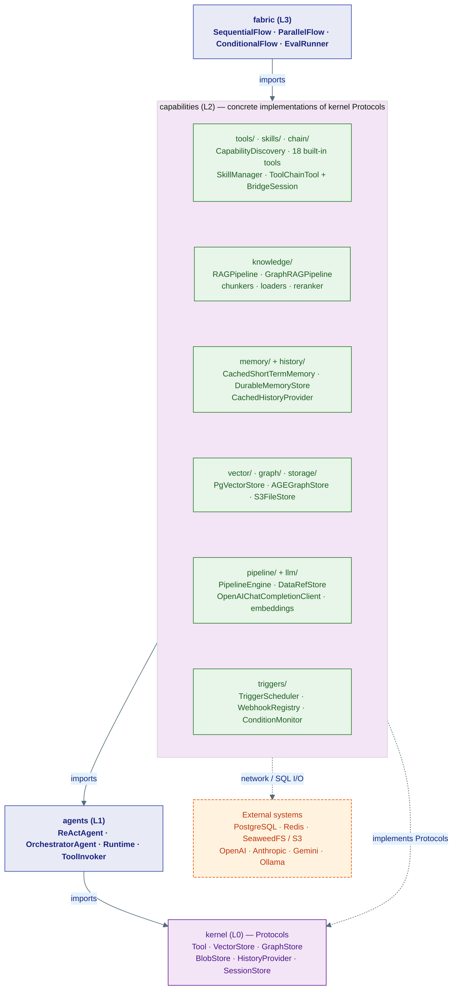

# Capabilities Layer (L2)

L2 is the **"what agents can do"** layer. Every concrete tool, knowledge pipeline, memory backend, storage adapter, and trigger lives here. Kernel (L0) defines the contracts; agents (L1) drive the ReAct loop; capabilities (L2) provides everything those agents can reach for.

Prefer a visual, concern-organized tour instead? See the **[Capability Map](../capability-map.md)**.

## Ten sub-packages

```
capabilities/
├── tools/          Tool implementations + Skills + ToolChain
├── knowledge/      RAGPipeline, GraphRAGPipeline, chunkers, loaders, reranker
├── memory/         CachedShortTermMemory + DurableSessionStore + RedisSessionStore (session state)
│                   DurableMemoryStore (long-term facts)
├── history/        CachedHistoryProvider + DurableHistoryProvider + RedisHistoryProvider (chat logs)
├── vector/         PgVectorStore — implements kernel VectorStore Protocol
├── graph/          AGEGraphStore — implements kernel GraphStore Protocol
├── storage/        S3FileStore — implements kernel BlobStore Protocol
├── pipeline/       PipelineEngine, PipelineDef, DataRefStore (adapter chains)
├── llm/            OpenAIChatCompletionClient, embedding clients
└── triggers/       TriggerScheduler, WebhookRegistry, ConditionMonitor
```

## How capabilities fit into the stack



## Design rules

**Capabilities only implement kernel Protocols** — `PgVectorStore` implements `VectorStore`, `RedisHistoryProvider` implements `HistoryProvider`, and so on. No layer above L2 ever imports a concrete backend directly; they import the Protocol from kernel and receive the implementation via dependency injection in lifespan.

**No capabilities import from agents or fabric** — the dependency rule strictly flows downward. If you need runtime context inside a tool, it is passed as the `ctx` parameter to `execute()`.

**Auto-discovery, not registration** — `CapabilityDiscovery` scans `capabilities/tools/` at startup. Any package with a `tool.py` containing a class with `{name, description, input_schema, execute}` is automatically registered. No central list to update.

## Pages in this section

| Page | Topic |
|---|---|
| [1 · Tools](01-tools.md) | Tool taxonomy, `CapabilityDiscovery`, `Toolbox` |
| [2 · Skills](02-skills.md) | `SkillTool`, `SKILL.md` format, `SkillManager` |
| [3 · Tool Chain](03-tool-chain.md) | `ToolChainTool`, sandbox bridge, code-mode chaining |
| [4 · Knowledge & RAG](04-knowledge-rag.md) | `RAGPipeline`, `GraphRAGPipeline`, loaders, reranker |
| [5 · Memory & History](05-memory-and-history.md) | Session state, chat logs, Redis/Postgres backends |
| [6 · Storage & Pipeline](06-storage-and-pipeline.md) | `PgVectorStore`, `AGEGraphStore`, `S3FileStore`, `PipelineEngine` |
| [7 · Triggers](07-triggers.md) | `TriggerScheduler`, `WebhookRegistry`, `ConditionMonitor` |
