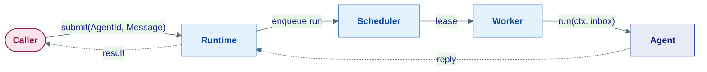
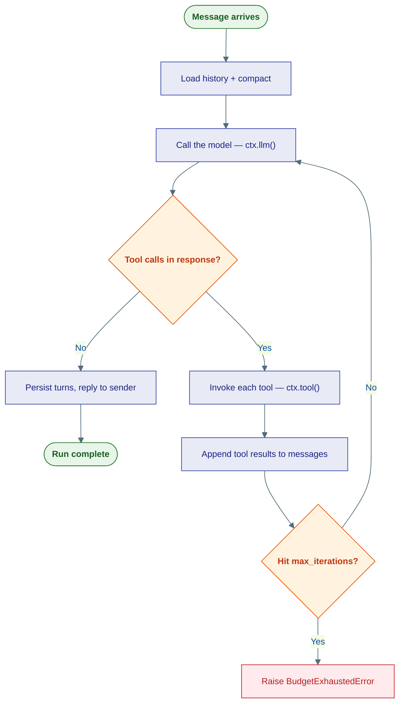

# The Agent Model

## The problem

The naive way to build an agent is a function you call directly:

```python
result = my_agent.run("book me a flight")   # blocks until done
```

This breaks the moment anything real happens. If the agent needs to wait three hours for a human to approve a payment, your thread is stuck. If the process crashes, the run is gone. If you want the agent to live on another machine, you have to rewrite the call. And if one agent needs to ask another agent something, you have a tangle of direct references.

## The idea: agents are addresses, not objects

In Ravi, you never hold a reference to a running agent. You hold its **address** — an `AgentId` — and you send it a **message**. The runtime is responsible for delivering that message, starting a run, and routing the reply back.



Because the caller talks to an address, **the call site never changes**. Whether the agent runs in the same process, in another service, or in a Kubernetes pod is a deployment decision — not a code change. This is the actor model, applied to LLM agents.

---

## The three identities

Ravi separates three things that beginners often conflate:

| Identity | What it is | Lifetime |
|---|---|---|
| **`AgentId`** | The agent's address — `type` + `key`. Routing only. | As long as the agent is registered |
| **`session_id`** | A conversation thread. History is keyed by this. | Long-lived; spans many runs |
| **`run_id`** | One execution of `run()`. Scopes budget, the event log, supervision, and the progress channel. | Short-lived; one run |

A single agent (`AgentId`) can hold many conversations (`session_id`s), and each conversation is made of many runs (`run_id`s). Keeping these separate is what lets the same agent serve thousands of users without their histories leaking into each other.

---

## What an agent actually is

An agent is any object satisfying the kernel `Agent` Protocol — essentially two things:

```python
class Agent(Protocol):
    id: AgentId
    async def run(self, ctx: RunContext, inbox: list[Message]) -> None: ...
```

That's it. `id` is the address. `run` is called by the Worker with a `ctx` (the journaled execution context) and the `inbox` (messages waiting for this agent). Everything else — tools, memory, guardrails — is configuration the concrete agent reads.

The standard concrete agent is **`ReActAgent`**: it runs the *Reason + Act* loop.

---

## The ReAct loop

`ReActAgent` implements the classic pattern: the model **reasons**, decides to **act** by calling a tool, sees the **result**, and reasons again — until it produces a final answer or hits its iteration cap.



A few details that matter in practice:

- **Compaction runs before *every* model call**, not just at the start. Tool results can balloon the context across iterations, so the [compaction pipeline](memory.md) trims a *view* of the messages while the full list is kept for persistence.
- **`ctx.llm()` and `ctx.tool()` are journaled.** That's what makes the loop crash-safe — see [Durability](durability.md).
- **The iteration cap is a real budget**, not a guess. Hitting it raises `BudgetExhaustedError` rather than looping forever.

---

## A minimal agent

```python
from agent_substrate.agents import ReActAgent, Runtime
from agent_substrate.agents.context import ContextConfig, InMemoryHistoryProvider
from agent_substrate.integrations.llm import LLMFactory
from agent_substrate.capabilities.tools import CalculatorTool

model = LLMFactory("gpt-4o", api_key).build()

agent = ReActAgent(
    "helper",
    model=model,
    tools=[CalculatorTool()],
    context=ContextConfig(InMemoryHistoryProvider()),
    system_instructions="You are a helpful assistant.",
)

async with Runtime() as rt:
    await rt.register(agent)
    run_id = await rt.submit(agent.id, boot_message)   # fire a message at the address
```

Notice the flow: you build the agent, **register** it with the runtime (so the runtime knows the address), then **submit** a message. You never call `agent.run()` yourself — the Worker does, when it leases the run.

---

## Beyond a single agent

The same model scales to teams. An **`OrchestratorAgent`** holds a roster of sub-agents and exposes each as a delegation tool. When the model decides to delegate, the orchestrator **spawns** the sub-agent (a new run) via `ctx.spawn()` and **awaits its reply** via `ctx.ask()` — the same message-passing primitives, one level up. See [Supervision & Budgets](supervision.md) for how spawning is bounded.

---

## Where this lives

| Piece | Location |
|---|---|
| `Agent` Protocol, `AgentId` | `kernel/runtime/agent.py`, `kernel/core/identity.py` |
| `ReActAgent` | `agents/core/react.py` |
| `OrchestratorAgent` | `agents/core/orchestrator.py` |
| `Runtime` facade + `Worker` | `agents/runtime/` |
| `RunContext` (the `ctx`) | `agents/runtime/context.py` |

**Next:** [Durability](durability.md) — how a run survives a crash.
