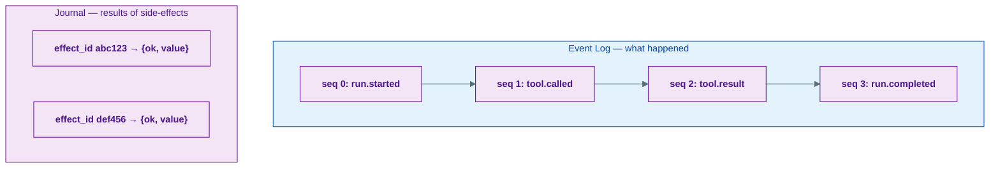
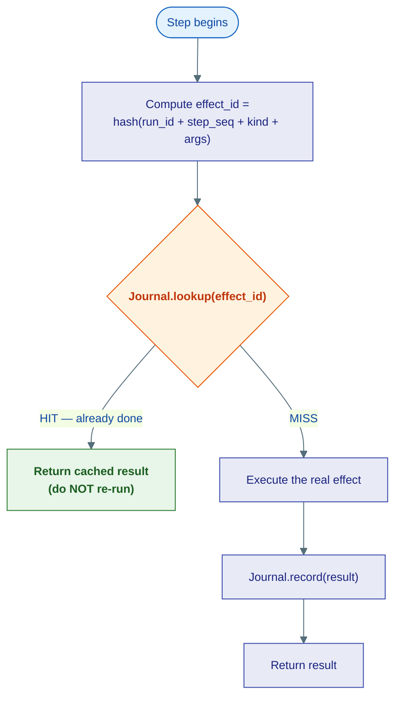
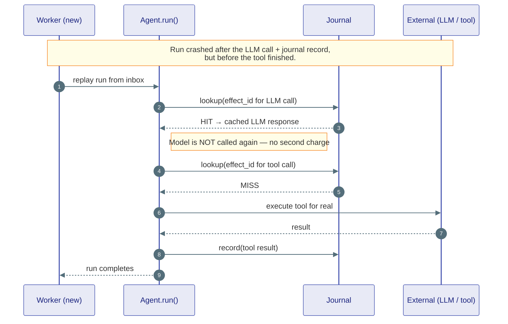
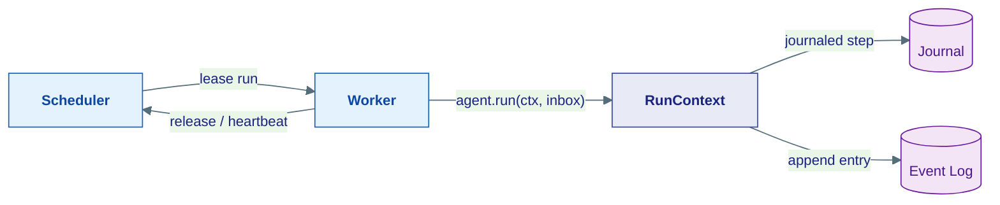

# Durability

## The problem

An agent run is a long, fragile sequence of expensive, irreversible actions: call the model ($), charge a card ($$), send an email (can't unsend), spawn a sub-agent. Now the worker process dies halfway through — a deploy, an OOM kill, a spot-instance reclaim.

Two bad outcomes are possible:

- **Lose the work** — restart from scratch, re-pay for everything already done.
- **Repeat the work** — replay the run and charge the card *again*.

Durability is the machinery that avoids both: a crashed run **resumes where it left off** without re-executing the side-effects that already completed.

---

## Two structures do all the work

Agent Substrate achieves this with two append-only structures, both defined as kernel Protocols so they can be backed by memory (dev) or Postgres + Redis (production) without changing agent code.



**Event Log** — the ordered, append-only history of a run. Every meaningful step appends a `RunLogEntry` with a monotonic `seq` and a `kind` (`run.started`, `tool.called`, `tool.result`, `child.spawned`, `run.suspended`, `run.completed`, …). The truth of a run is `fold(entries from seq 0)`. A checkpoint is just a compaction snapshot — never the source of authority.

**Journal** — an idempotency cache. Before any external effect runs, it computes a deterministic `effect_id` and asks the journal whether that effect already completed. If yes, it returns the cached result instead of re-running.

---

## The at-most-once protocol

Every journaled step — every `ctx.llm()`, every `ctx.tool()` — follows the same three-step dance:



The `effect_id` is **deterministic**: the same logical step in the same run always hashes to the same id (`Effect.make_id` sorts the args before hashing, so argument order doesn't matter). This is the linchpin — on replay, step N computes the *same* id it did the first time, finds the journal hit, and skips the work.

---

## What replay looks like

When a worker crashes, the run goes back to `PENDING`. Another worker leases it and replays:



Completed effects are free on replay (journal hits). Only the work that hadn't finished re-runs. The run reaches the same end state as if it had never crashed.

### The honest caveat

There is one unavoidable window: if the worker dies **after** executing an effect but **before** recording it, the journal has no entry. On replay that step is a MISS and runs again.

Agent Substrate chooses **at-most-once**, not at-least-once: it does *not* retry on that uncertainty, so you never double-charge — but in that rare window an effect can be silently lost rather than repeated. Tools that are genuinely idempotent (a `GET`, a Stripe charge with an idempotency key) can be safely retried and should say so in their `description` so callers know they get effectively exactly-once.

---

## Who drives all this: the Worker

You never invoke the protocol yourself. The **Worker** does, around every run:

1. Lease a run from the **SchedulerProtocol** (with a heartbeat to keep long LLM calls from losing the lease).
2. Append `run.started` to the event log, drain the agent's inbox.
3. Build a fresh `RunContext` and call `agent.run(ctx, inbox)`.
4. On success → append `run.completed`, release the lease.
5. On crash → append `run.failed`/`run.cancelled`, `nack` the messages so the run is retried.

Inside `agent.run`, every `ctx.llm()` / `ctx.tool()` / `ctx.spawn()` call routes through `_journaled()`, which runs the at-most-once protocol above and bumps `step_seq`.



---

## Dev and production are the same code

The whole point of putting these behind kernel Protocols is that the agent never knows which backend is live:

| Backend | Dev (Stage 0) | Production |
|---|---|---|
| Event Log | in-memory | Postgres append-only table, `(run_id, seq)` PK |
| Effect dedup (at-most-once) | in-memory `EffectCache` fold | same `EffectCache`, folded from the Postgres EventLogProtocol — no separate Journal/Redis store |
| SchedulerProtocol / InboxProtocol | in-memory asyncio | Postgres queue with leases |
| SupervisorProtocol (spawn/join tree) | in-memory | `Supervisor` — `ravi_run_tree`/`ravi_spawn_effects` tables |
| SignalBusProtocol (suspend/resume wakeups) | in-memory | `SignalBus` — `ravi_signals` table, exactly-once consume-based fencing |

```python
# Dev — everything in-process, no infra needed
async with Runtime() as rt:
    ...

# Production — durable backends injected by the infrastructure factory
from substrate.infrastructure.runtime import build_postgres_runtime
async with build_postgres_runtime(postgres_url=...) as rt:
    ...
```

Same agent. Same call site. The durability guarantees turn on with the backend swap. There is no separate Redis journal in the production path anymore — effect-result durability for LLM/tool call dedup comes from the EventLog itself, folded into an `EffectCache` per lease (see `agents/runtime/effect_cache.py`); this closed a real gap the old TTL'd Redis store had (a run suspended past the TTL used to come back to a journal miss on every effect).

---

## Where this lives

| Piece | Location |
|---|---|
| `Effect`, `EffectResult`, `Journal` Protocol | `kernel/runtime/effects.py` |
| `RunLogEntry`, `EventLogProtocol` Protocol | `kernel/runtime/log_entry.py` |
| `EffectCache` (folds `EventLogProtocol` into effect-dedup state per lease) | `agents/runtime/effect_cache.py` |
| `_journaled()` wrapper | `agents/runtime/context/journal.py` |
| Worker run loop | `agents/runtime/worker.py` |
| In-memory backends | `agents/runtime/backends/` |
| Postgres backends (`EventLogProtocol`/`InboxProtocol`/`SchedulerProtocol`/`SignalBusProtocol`/`SupervisorProtocol`) + `build_postgres_runtime` factory | `infrastructure/runtime/` |

**Next:** [Human-in-the-Loop](human-in-the-loop.md) — how a run pauses for a human and resumes later (durability is what makes the wait free).
