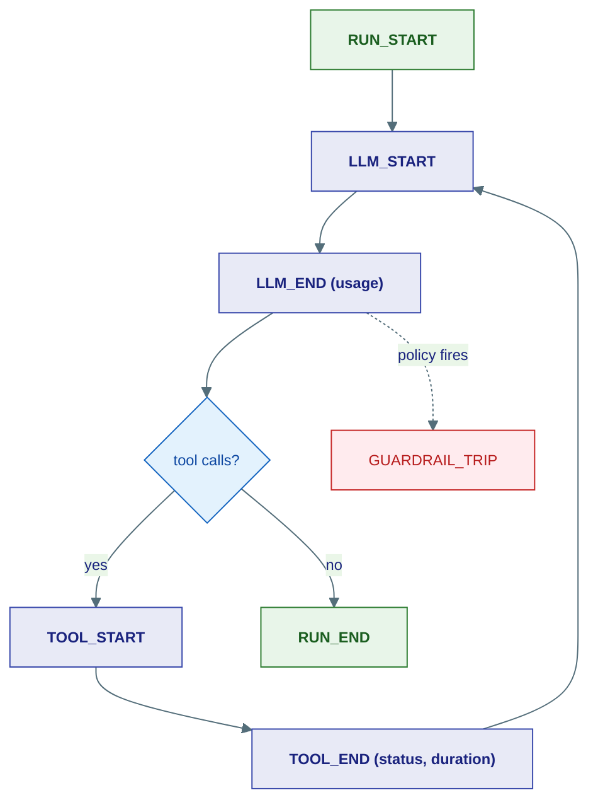

# Hooks

## The problem

You want visibility into a running agent — log when a run starts, push a metric on every tool call, send a webhook when a guardrail trips — without editing the agent loop and without risking that your logging code crashes the agent. [Middleware](middleware.md) can do this too, but middleware sits *in* the call path and can change or break things. Sometimes you want pure, safe **observation**.

That's what hooks are: read-only notifications fired at well-defined points in the run loop.

---

## The lifecycle events

The run loop emits events as it progresses. You subscribe to the ones you care about.



| Event | Fires |
|---|---|
| `RUN_START` / `RUN_END` | An `agent.run()` begins / completes (success or failure) |
| `STEP_START` / `STEP_END` | A think-act cycle begins / completes |
| `LLM_START` / `LLM_END` | Before / after a model call (`LLM_END` carries `usage`) |
| `TOOL_START` / `TOOL_END` | Before / after a tool runs (`TOOL_END` carries `status`, `duration_ms`) |
| `GUARDRAIL_TRIP` | A guardrail forced a hard stop |
| `HANDOFF` | An orchestrator delegated to a sub-agent |
| `FLOW_START` / `FLOW_END` | A Flow began / finished |

---

## Three guarantees that make hooks safe

The whole point of hooks is that you can attach them freely without worrying. The `HookManager` enforces:

1. **Read-only.** Hooks receive a context dict; they cannot mutate run state. (Need to *change* behaviour? Use [middleware](middleware.md).)
2. **Crash-isolated.** An exception thrown inside a hook is caught and logged — it never propagates into the agent. Your broken metrics call won't take down the run.
3. **Per-agent.** Hooks are registered on an agent instance, not globally, so one agent's observers don't fire for another.

Both async and sync callbacks are accepted (sync ones are run off the event loop), so logging to a DB or sending a webhook from a hook is fine.

---

## Using them

```python
from ravi.agents.hooks import HookManager, HookEvent

hooks = HookManager()

@hooks.on(HookEvent.RUN_START)
async def log_start(ctx):
    print(f"Agent {ctx['agent_name']} starting run {ctx['run_id']}")

@hooks.on(HookEvent.TOOL_END)
async def track_tool(ctx):
    await metrics.timing(ctx["tool_name"], ctx["duration_ms"])

@hooks.on(HookEvent.LLM_END)
async def track_cost(ctx):
    usage = ctx["usage"]            # kernel Usage: input_tokens / output_tokens
    await billing.record(usage)

agent = ReActAgent("bot", model=model, hooks=hooks)
```

The Worker dispatches `RUN_START`/`RUN_END` around the whole run; the ReAct loop dispatches the `LLM_*` and `TOOL_*` events in place. Your callbacks just observe.

---

## Hooks vs. Middleware — the one-line rule

- Need to **see** what happened? → **Hook** (safe, read-only, can't break the run).
- Need to **change** what happens? → [Middleware](middleware.md) (in the path, can modify/short-circuit/abort).

---

## Where this lives

| Piece | Location |
|---|---|
| `HookManager`, `HookEvent` | `agents/hooks/manager.py` |
| Dispatch sites | `agents/runtime/worker.py`, `agents/core/react.py` |

**Back to:** [Core Concepts](index.md)
