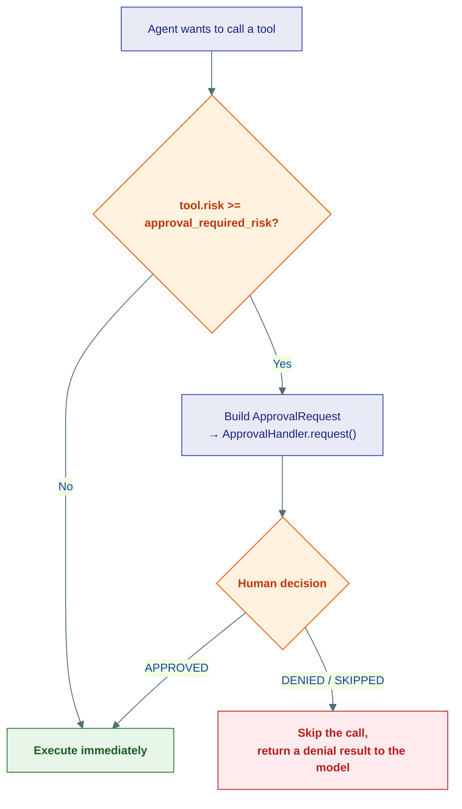
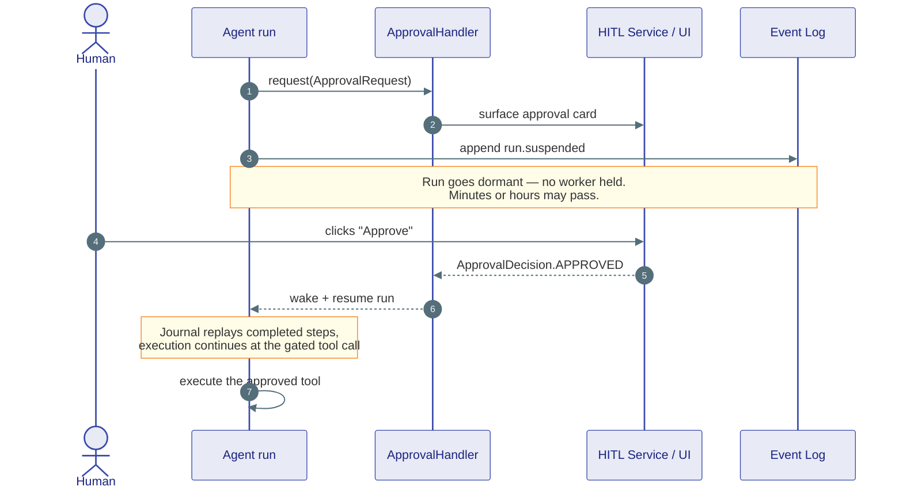

# Human-in-the-Loop

## The problem

Some actions are too consequential to let an agent take alone: wiring money, deleting a production table, emailing a customer, merging a pull request. You want the agent to do all the reasoning and prepare the action — then **stop and ask a human** before it actually happens.

Two things make this hard:

1. **Waiting is expensive.** A human might take three hours to click "approve." You can't hold a worker thread (or a database connection) hostage that whole time.
2. **The wait must survive a restart.** If the server redeploys while the request is pending, the approval can't be lost.

Agent Substrate solves both by combining a small approval contract with the [durable runtime](durability.md).

---

## Risk tiers decide what needs approval

Every tool declares a `ToolRisk`:

| Risk | Meaning | Default behaviour |
|---|---|---|
| `SAFE` | Read-only or trivially reversible (search, calculate) | Runs without approval |
| `HIGH` | Meaningful side-effect (send email, write to DB) | Approval required |
| `CRITICAL` | Dangerous / irreversible (delete data, move money) | Approval required |

You set the threshold per agent with `approval_required_risk`. Anything at or above that tier is gated; anything below runs freely.



---

## The contract

The whole HITL surface is three small types in the kernel — deliberately tiny so any backend can implement it:

```python
class ApprovalDecision(StrEnum):
    APPROVED = "approved"
    DENIED   = "denied"
    SKIPPED  = "skipped"

@dataclass(frozen=True, slots=True)
class ApprovalRequest:
    call: ToolCallRequest      # the pending tool call
    risk: ToolRisk             # why approval is needed
    agent_id: AgentId          # who is asking
    run_id: str                # which run to resume
    context: JsonObject        # extra metadata (e.g. the user's message)
    requested_at: datetime

class ApprovalHandler(Protocol):
    async def request(self, req: ApprovalRequest) -> ApprovalDecision: ...
```

`ApprovalRequest` is **frozen and fully serializable** on purpose: it can be written to a database, forwarded over pub/sub, and reconstructed after a restart. That is what lets the wait outlive the process.

The agent loop just `await`s `handler.request(req)`. Where that blocks and how the decision comes back is entirely the backend's business:

| Handler | Where the human is |
|---|---|
| `WebApprovalHandler` | Sends the request to the HITL service; the user clicks a card in the UI |
| `CliApprovalHandler` | Prompts the terminal operator |
| `AutoApprovalHandler` | Always approves — for tests |

---

## Why the wait is free

This is where HITL and [durability](durability.md) meet. In the durable runtime, an agent awaiting approval doesn't hold a worker. The run records `run.suspended` to the event log and goes dormant. The worker moves on to other runs. When the human finally decides, the decision wakes the run, which resumes from exactly where it paused — the journal replays every completed step, and execution continues at the approval point.



In the simple in-process runtime the `await` just suspends the coroutine instead — same code, lighter guarantees. The agent author writes the loop once; the runtime decides how durable the pause is.

---

## Putting it together

```python
from agent_substrate.kernel.tools.tools import ToolRisk

agent = ReActAgent(
    "ops-bot",
    model=model,
    tools=[DeleteRecordsTool(), SearchTool()],   # one CRITICAL, one SAFE
    approval_handler=WebApprovalHandler(hitl_service),
    approval_required_risk=ToolRisk.HIGH,          # gate HIGH and CRITICAL
)
```

Now `SearchTool` runs freely, while `DeleteRecordsTool` always pauses for a human — and that pause survives a redeploy.

---

## Where this lives

| Piece | Location |
|---|---|
| `ApprovalRequest`, `ApprovalDecision`, `ApprovalHandler` | `kernel/tools/approval.py` |
| `ToolRisk` tiers | `kernel/tools/tools.py` |
| Risk gating in tool dispatch | `agents/tools/invoker.py` |
| Web approval bridge | `serving/monolith/sse/` |

**Next:** [Middleware](middleware.md) — wrap every model call with cross-cutting behaviour.
