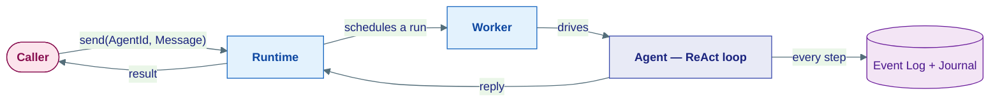
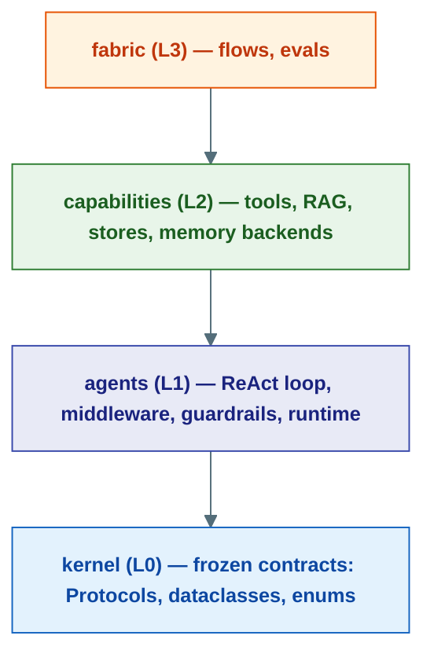

# Core Concepts

This section explains **how Agent Substrate works** — not the API surface, but the ideas behind it. Read it like a map: each page takes one concept, shows the problem it solves, and walks through how the framework implements it.

If you only read one page, read [The Agent Model](agent-model.md). Everything else builds on it.

---

## The one-paragraph mental model

In Agent Substrate, an **agent** is not an object you call. It is an address you send messages to. The **runtime** receives the message, schedules a **run**, and drives the agent's reasoning loop. Every step the agent takes — calling the model, invoking a tool, spawning a sub-agent — is written to an append-only **event log** and guarded by a **journal**, so a crashed run can be replayed without repeating side-effects. Along the way, **middleware** wraps each model call, **guardrails** can block unsafe content, and risky tools can **pause for human approval** and resume later. Old conversation turns are kept by a **history provider** and trimmed by a **compaction pipeline** before they reach the model.

---

## The concept map

### Foundations — read these in order

| # | Concept | The question it answers |
|---|---------|------------------------|
| 1 | [The Agent Model](agent-model.md) | What *is* an agent, and how does a message become a running reasoning loop? |
| 2 | [Durability](durability.md) | How does a run survive a crash without re-charging the card or re-sending the email? |
| 3 | [Tools](tools.md) | How does an agent take actions in the world, and how are risky ones controlled? |
| 4 | [Memory & Context](memory.md) | What does the agent remember, and how does old history fit in a finite window? |

### Control & safety

| Concept | The question it answers |
|---------|------------------------|
| [Human-in-the-Loop](human-in-the-loop.md) | How does an agent pause for a human to approve a sensitive action, then resume? |
| [Middleware](middleware.md) | How do I wrap every model call with caching, retries, validation, or logging? |
| [Guardrails](guardrails.md) | How do I block prompt injection, PII leaks, or unsafe output? |
| [Supervision & Budgets](supervision.md) | How do I stop a multi-agent system from spawning forever or burning the budget? |
| [Hooks](hooks.md) | How do I observe the run loop without modifying agent code? |

### Advanced memory — three orthogonal strategies

These solve different failure modes and can run together. Start with [Memory & Context](memory.md), then go deeper:

| Strategy | How it recalls | Best for |
|---|---|---|
| [Vector Memory](vector-memory.md) | Embed + cosine search | Fuzzy semantic recall over large histories |
| [Graph Memory](graph-memory.md) | Entity nodes + relationship traversal | Structured facts, constraints, decisions |
| [Paged Memory](paged-memory.md) | Explicit pages + index + agent-controlled retrieval | Full-fidelity recall; the agent decides what to load |

---

## How the layers fit

Every concept on these pages lives in a specific architectural layer. The rule is simple: **higher layers import from lower ones, never the reverse** (enforced in CI by `uv run lint-imports`).

`integrations`, `infrastructure`, and `serving` sit orthogonal to this stack — they implement kernel Protocols (LLM providers, Postgres/Redis backends, the FastAPI shells) and wire everything together at startup.
