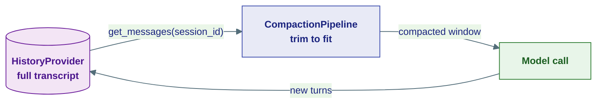
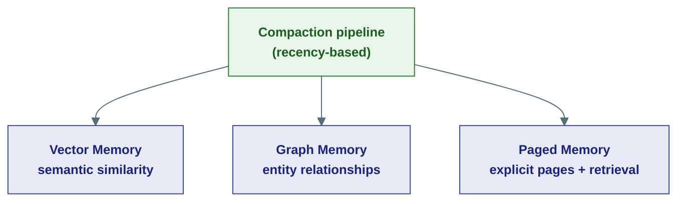

# Memory & Context

## The problem

An agent needs to remember the conversation — but a model's context window is finite and every token costs money and latency. So there are really two problems hiding under "memory":

1. **Persistence** — where do past turns live, so the agent can recall them across runs and restarts?
2. **Context assembly** — how do you fit a long history into a small window before each model call, without losing what matters?

Agent Substrate splits these cleanly: a **HistoryProvider** owns persistence; a **CompactionPipeline** owns context assembly. They meet in the `ContextConfig` you pass to an agent.



The full transcript always lives in the history provider. Compaction produces a *view* for the model — it never deletes the source.

---

## Persistence: the HistoryProvider

A `HistoryProvider` is a small Protocol for reading and writing turns, always scoped by `session_id` so conversations never bleed into each other:

```python
class HistoryProvider(Protocol):
    async def append(self, agent_id, message, *, session_id, run_id): ...
    async def append_many(self, agent_id, messages, *, session_id, run_id): ...
    async def get_messages(self, agent_id, *, session_id) -> list[ChatMessage]: ...
    async def clear(self, agent_id, *, session_id): ...
    async def clear_run(self, agent_id, *, session_id, run_id): ...
```

Three backends ship, all interchangeable:

| Backend | Use |
|---|---|
| `InMemoryHistoryProvider` | Dev, tests, throwaway sessions |
| `RedisHistoryProvider` | Fast, TTL'd session memory |
| `DurableHistoryProvider` | Durable, queryable transcripts |

---

## Retention: how long history lives

Different agents want different lifetimes. `ContextConfig` carries a `HistoryRetention` policy:

| Policy | Behaviour | For |
|---|---|---|
| `PERMANENT` | Kept forever | User-facing assistants |
| `RUN` | Deleted when the run ends | Transient sub-agents |
| `NONE` | Never written | Stateless workers |

When a run completes, the Worker honours this: a `RUN`-retention sub-agent's history is cleared automatically, so a fleet of short-lived helpers doesn't accumulate junk.

---

## Context assembly: the CompactionPipeline

Before **every** model call, the agent runs the history through a `CompactionPipeline` — an ordered chain of strategies, each taking the previous one's output:


Strategies that ship in `agents/context/compaction/`:

| Strategy | What it does |
|---|---|
| `SlidingWindowCompaction` | Keep the most recent N messages (the default) |
| `ToolResultCompactionStrategy` | Shrink large/old tool results, which bloat context fastest |
| `SelectiveToolCallCompactionStrategy` | Drop tool-call noise that's no longer relevant |
| `SummarizationCompaction` | Replace old turns with an LLM-generated summary |
| `TruncationStrategy` | Hard cap on message count |
| `TokenBudgetComposedStrategy` | Compose strategies to hit a token budget |

Compose them to taste:

```python
from substrate.agents.context import (
    ContextConfig, InMemoryHistoryProvider,
    CompactionPipeline, ToolResultCompactionStrategy, SlidingWindowCompaction,
)
from substrate.kernel.agent.supervision import HistoryRetention

ctx = ContextConfig(
    InMemoryHistoryProvider(),
    CompactionPipeline([
        ToolResultCompactionStrategy(),
        SlidingWindowCompaction(max_messages=40),
    ]),
    retention=HistoryRetention.PERMANENT,
)
agent = ReActAgent("bot", model=model, context=ctx)
```

An empty pipeline is a valid no-op (returns history unchanged). Pass a single strategy directly without wrapping it.

---

## When trimming isn't enough

Sliding windows and summaries are *lossy by recency* — they assume old means irrelevant. That assumption breaks for long-running agents that must recall a specific fact or decision from far back. For those, Agent Substrate has three **orthogonal** advanced strategies that recall by *relevance* or *structure* instead of recency. They are not mutually exclusive — you can layer them with the basic pipeline above.



| Strategy | Recalls by | Best for | Failure mode |
|---|---|---|---|
| [Vector Memory](vector-memory.md) | Embedding similarity | Fuzzy recall over big histories | Misses causally-important but dissimilar turns |
| [Graph Memory](graph-memory.md) | Entity / relationship traversal | Structured facts, constraints, decisions | Loses unstructured narrative |
| [Paged Memory](paged-memory.md) | Explicit pages + agent-driven retrieval | Full-fidelity recall, agent decides what to load | Index summary may miss detail |

All three plug in as compaction strategies (or alongside them), backed by the in-memory stores in `agents/storage/` for dev and the Postgres-backed `PgVectorStore` / `AGEGraphStore` in `capabilities/` for production.

---

## Where this lives

| Piece | Location |
|---|---|
| `HistoryProvider` Protocol | `kernel/storage/history.py` |
| `ContextConfig`, `AgentContext` | `agents/context/context.py` |
| `CompactionPipeline` + strategies | `agents/context/compaction/` |
| History backends | `agents/context/history.py`, `capabilities/history/` |
| `HistoryRetention` | `kernel/agent/supervision.py` |

**Next:** [Supervision & Budgets](supervision.md) — bounding multi-agent systems.
