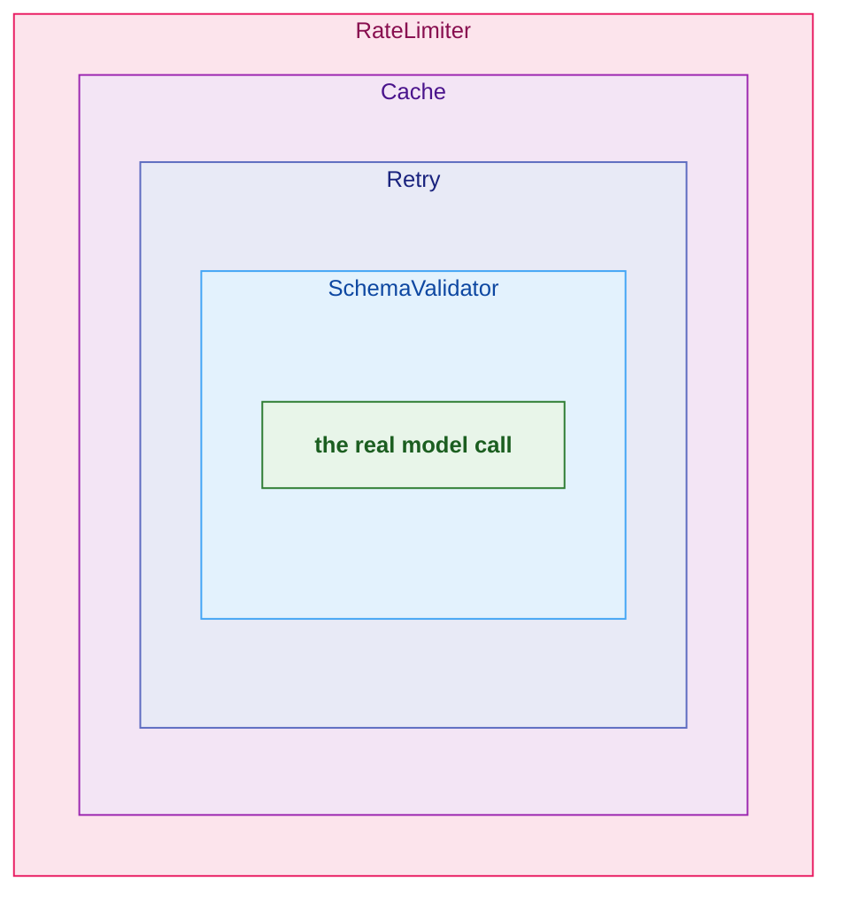
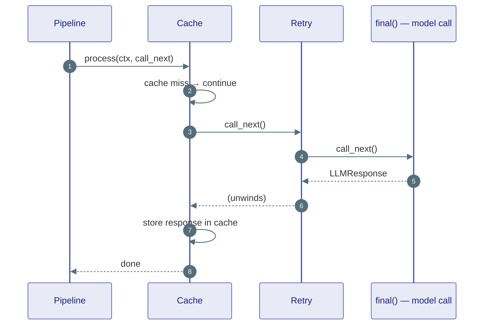

# Middleware

## The problem

There is a long list of things you want to happen *around* an agent's model calls that have nothing to do with the agent's actual reasoning: cache identical requests, retry on transient failures, validate the output against a schema, redact PII, log every call for audit, rate-limit a tenant. Stuffing all of that into the agent loop would turn a 50-line ReAct loop into a 500-line mess and make every behaviour non-reusable.

Middleware pulls these cross-cutting concerns out into composable layers that wrap the call.

---

## The onion model

Middleware forms an onion around the real work. Each layer can act **before** the call (inspect/modify the request), pass control inward with `call_next()`, then act **after** (inspect/modify the result) as control unwinds.



A request travels **inward** through every layer to the core, and the response travels **outward** back through them in reverse. Any layer can short-circuit (the cache returns a hit without calling inward) or abort (a guardrail raises and the inner layers never run).

---

## The contract

A middleware is anything with a `process` method. The pipeline calls it with the shared `context` and a `call_next` continuation:

```python
class MiddlewareProtocol(Protocol[ContextT_contra]):
    async def process(
        self, context: ContextT_contra, call_next: Callable[[], Awaitable[None]]
    ) -> None: ...
```

The shape of a layer is always the same:

```python
class TimingMiddleware:
    async def process(self, context, call_next):
        start = time.monotonic()          # ── before
        await call_next()                  # ── go inward
        context.metadata["elapsed"] = time.monotonic() - start   # ── after
```

- Do work, then `await call_next()`, then do more work. That's the onion.
- **Skip `call_next()`** to short-circuit — the inner layers never run (this is how the cache returns a hit).
- **Raise** to abort — typically `MiddlewareTermination` for a guardrail block.

The `MiddlewarePipeline` simply threads the layers together: `execute(context, final)` builds the chain so that the last `call_next()` invokes `final` — the actual model call.



---

## The context is the payload

Middleware doesn't return values — it reads and writes a shared **context** object that flows through the chain. There are three context types depending on what's being wrapped:

| Context | Wraps | Key fields |
|---|---|---|
| `ChatContext` | A single model call | `messages`, `system_instructions`, `tools`, `result: LLMResponse` |
| `AgentCallContext` | A whole agent run | `messages`, `result: AgentRunResult` |
| `FunctionContext` | A single tool call | `function_name`, `arguments`, `result: ToolExecutionResult` |

A layer reads inputs from the context before `call_next()` and reads or mutates `result`/`metadata` after. For example, the schema validator parses `context.result` and stashes the parsed object in `context.metadata["parsed"]` rather than mutating the frozen `LLMResponse`.

---

## What ships in the box

These live in `agents/middleware/` and follow the contract above:

| Middleware | What it does |
|---|---|
| `Cache` | Returns a stored response for identical requests (short-circuits) |
| `Retry` | Re-attempts the inner call on transient failures with backoff |
| `RateLimiter` | Caps calls per tenant/window |
| `SchemaValidator` | Validates/parses model output against a JSON schema |
| `AuditLogger` | Records every call for compliance |
| `Observability` | Emits spans/metrics around the call |
| `ContentTruncator` / `HistoryTruncator` | Bound payload size before the call |
| `FileValidator` | Checks file inputs before a tool runs |
| **Guardrails** | A whole family — see [Guardrails](guardrails.md) |

Compose them in the order you want them to wrap:

```python
from ravi.agents.middleware import MiddlewarePipeline

pipeline = MiddlewarePipeline([
    RateLimiter(...),
    Cache(...),
    Retry(...),
    SchemaValidator(...),
])
agent = ReActAgent("bot", model=model, middleware=pipeline)
```

The Worker runs the pipeline around the agent run; the agent loop runs it around each model call. Either way the agent's own code stays clean.

---

## Middleware vs. Hooks — when to use which

Both observe the run, but they differ in power:

- **Middleware** sits *in* the call path. It can modify the request, change or replace the result, short-circuit, and abort. Use it when you need to **influence** behaviour.
- **[Hooks](hooks.md)** sit *beside* the call path. They get read-only notifications and cannot change anything; an exception in a hook is swallowed. Use them for **pure observation** (metrics, logging) where you must never affect the run.

---

## Where this lives

| Piece | Location |
|---|---|
| `MiddlewarePipeline`, `MiddlewareProtocol` | `agents/middleware/pipeline.py` |
| Context types (`ChatContext`, …) | `agents/middleware/_contracts.py` |
| Built-in middlewares | `agents/middleware/*.py` |
| Guardrail middlewares | `agents/middleware/guardrails/` |

**Next:** [Guardrails](guardrails.md) — the safety-focused middleware family.
