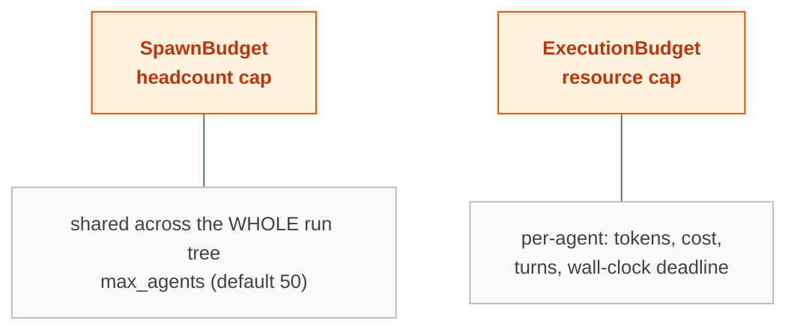
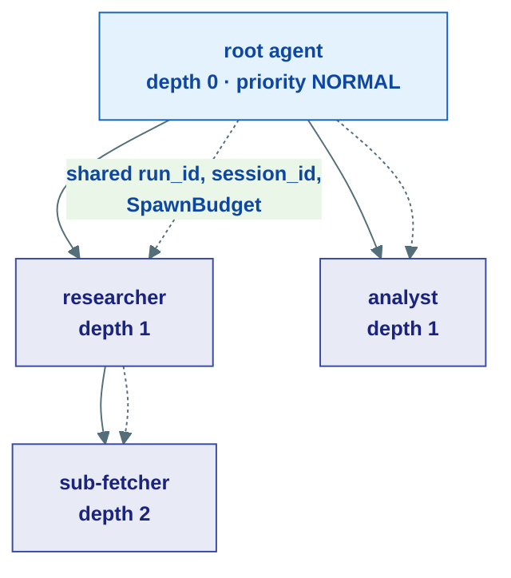
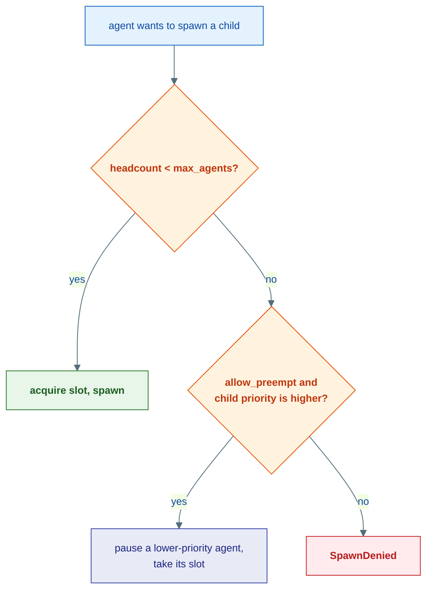

# Supervision & Budgets

## The problem

The moment agents can spawn other agents, you have a new failure mode: a runaway tree. One agent delegates to three, each of those delegates to three more, and suddenly you have a fork bomb burning tokens and money with no ceiling. Even a single agent can loop forever or rack up an unbounded model bill.

Supervision is the org-chart that keeps a multi-agent run accountable: who reports to whom, how many agents may exist at once, and how much each is allowed to spend.

---

## Two orthogonal budgets

Ravi separates "how many agents" from "how much each agent spends." They are enforced independently.



| Budget | Scope | Limits | Enforced by |
|---|---|---|---|
| `SpawnBudget` | **Run-wide** — one shared instance for the whole tree | `max_agents`, `allow_preempt` | `SpawnTracker` (L1) |
| `ExecutionBudget` | **Per-agent** — each agent has its own | `max_tokens`, `max_cost_usd`, `max_turns`, `deadline_s` | `ExecutionTracker` (L1) |

`None` on an `ExecutionBudget` field means unlimited for that dimension. Both budgets are frozen policy objects living in the kernel; the *mutable counters* that enforce them live in the agents layer.

---

## Supervision: the org-chart

Every agent in a run carries a `Supervision` node — its position in the tree. It threads the shared identifiers and policy down from the root to every child:



When the root spawns a child via `spawn_child()`, the child inherits:

- the **same `run_id`** (one execution tree) and **`session_id`** (one conversation),
- the **same `SpawnBudget` instance** — so the headcount cap is global, not per-branch,
- the parent's `ExecutionBudget` by default (override to give a child tighter limits),
- `depth + 1` (informational, for UI nesting; there is no depth limit — `SpawnBudget` is the single structural constraint).

A handy detail: all agents in a run publish progress to one topic, `TopicId("agent.progress", run_id)`, so a UI subscribes once and sees the whole tree.

---

## Priority and preemption

Not all branches are equal. Each agent has a `Priority` — an integer weight used for proportional pool allocation:

| Priority | Weight |
|---|---|
| `BACKGROUND` | 0 (best-effort) |
| `LOW` | 1 |
| `NORMAL` | 2 (default) |
| `HIGH` | 4 |
| `CRITICAL` | 8 |

When the headcount cap is reached and `allow_preempt` is on, a `HIGH`/`CRITICAL` agent that needs a slot can cooperatively **pause** a lower-priority agent to claim it, instead of being denied outright. The `SpawnTracker` manages this — tracking the current count and the paused set.



---

## How the orchestrator uses it

`OrchestratorAgent` is the concrete consumer. It holds a roster of sub-agents, exposes each as a delegation tool, and when the model delegates it:

1. `spawn_tracker.acquire(child_id, priority)` — claim a headcount slot (or preempt).
2. `ctx.spawn(child_id, boot=msg)` — start the child run.
3. `ctx.ask(handle, msg, timeout=…)` — suspend until the child replies, fails, or times out.
4. `spawn_tracker.release(child_id)` in a `finally` — always give the slot back.

Meanwhile each agent's `ExecutionTracker` is wired into its ReAct loop, calling `consume(tokens=…, turns=1)` after every model call and raising `BudgetExhaustedError` the moment a per-agent limit is breached. The `deadline_s` is enforced by `RunContext.check()`, which every loop iteration calls.

---

## Putting it together

```python
from ravi.kernel.agent.supervision import SpawnBudget, ExecutionBudget, Priority

orchestrator = OrchestratorAgent(
    "lead",
    model=model,
    sub_agents=[
        SubAgentConfig(agent=researcher, priority=Priority.HIGH,   ask_timeout=120),
        SubAgentConfig(agent=analyst,    priority=Priority.NORMAL, ask_timeout=120),
    ],
    spawn_budget=SpawnBudget(max_agents=10, allow_preempt=True),
)
```

The whole tree can spawn at most 10 agents; `researcher` outranks `analyst` for the last slot; each delegation waits at most 120 s for a reply.

---

## Where this lives

| Piece | Location |
|---|---|
| `Supervision`, `SpawnBudget`, `ExecutionBudget`, `Priority` | `kernel/agent/supervision.py` |
| `SpawnTracker` (headcount + preemption) | `agents/supervision/budget.py` |
| `ExecutionTracker` (per-agent spend) | `agents/resources/budget.py` |
| `OrchestratorAgent`, `SubAgentConfig` | `agents/core/orchestrator.py` |
| `BudgetExhaustedError` | `kernel/core/errors.py` |

**Next:** [Hooks](hooks.md) — observe the run loop without changing it.
