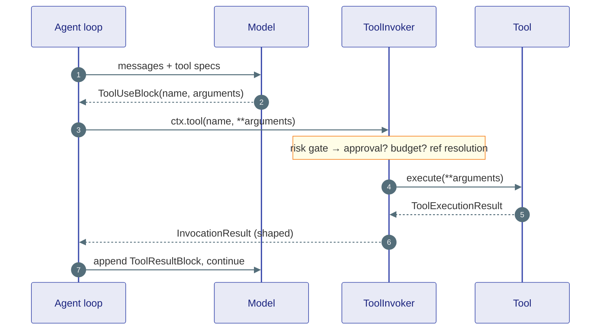
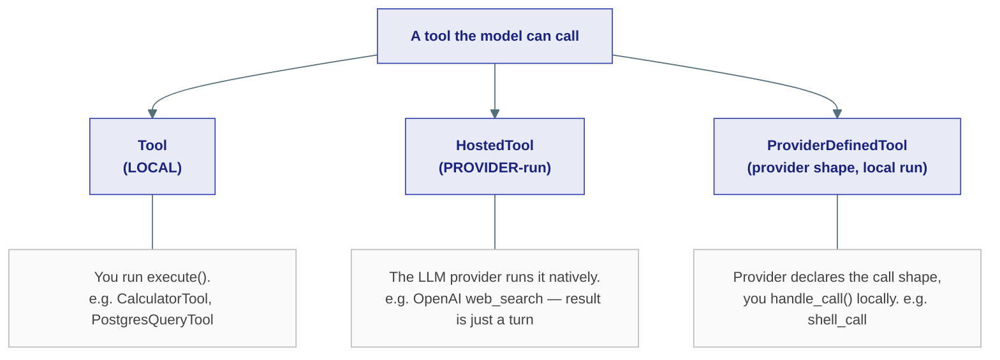

# Tools

## The problem

A language model can only produce text. To *do* anything — search the web, query a database, send an email, run code — it needs tools. The framework's job is to: describe the available tools to the model, let the model choose one and supply arguments, run it safely, and feed the result back so the model can continue reasoning.

The hard parts are the edges: some tools run on *your* server, some run inside the *LLM provider*, some are dangerous, some return 200 MB of data, and the model sometimes wants to chain several together. Ravi's tool model handles each of these explicitly.

---

## The basic shape

A tool is anything matching the `Tool` Protocol — a name, a description, a JSON-schema for its arguments, and an async `execute`:

```python
from ravi.kernel.tools import ToolExecutionResult
from ravi.kernel.core.content import TextBlock

class CalculatorTool:
    name = "calculator"
    description = "Evaluate an arithmetic expression."
    input_schema = {
        "type": "object",
        "properties": {"expression": {"type": "string"}},
        "required": ["expression"],
    }

    async def execute(self, *, ctx=None, **kwargs) -> ToolExecutionResult:
        result = eval(kwargs["expression"])     # illustrative only
        return ToolExecutionResult(content=[TextBlock(text=str(result))])
```

`ToolExecutionResult` carries `content` (a list of `ContentBlock`s — text, images, …), an `is_error` flag, and optional `structured_content`. That's the whole contract for a local tool. Drop a class like this in `capabilities/tools/<name>/tool.py` and the catalog scanner discovers it automatically — no registration call.

---

## The round trip



The model never touches your tool directly. It emits a `ToolUseBlock`; the agent loop routes it through the **`ToolInvoker`**, which enforces all the policy before and after `execute()`.

---

## Three kinds of tool

Not every tool runs the same way. The kernel taxonomy distinguishes who executes the call:



| Type | Who executes | Example |
|---|---|---|
| `Tool` | Your server, via `execute()` | `CalculatorTool`, `WebSearchTool` (self-hosted) |
| `HostedTool` | The LLM provider | OpenAI `web_search_preview` — declared via `provider_specs`, never called locally |
| `ProviderDefinedTool` | Provider declares the call, you run `handle_call()` | OpenAI `shell_call` |

This matters because each LLM encoder needs to send the right thing. An absent provider key in a `HostedTool` means the tool is simply dropped for that provider — never sent malformed (which would 400 the API and break failover).

---

## The risk model

Every tool carries a `ToolRisk`, and this single field powers both [Human-in-the-Loop](human-in-the-loop.md) and [Guardrails](guardrails.md):

| Risk | Meaning |
|---|---|
| `SAFE` | No side-effects — run freely |
| `HIGH` | External side-effect (email, DB write) — may require approval |
| `CRITICAL` | Destructive / irreversible — always requires approval |

The `ToolInvoker` checks the tool's risk against the agent's `approval_required_risk` threshold *before* dispatch. Above the line, it routes through the `ApprovalHandler` (with a bounded timeout so a HITL request can't block forever); below the line, it runs.

---

## What the ToolInvoker enforces

The invoker is the single chokepoint for programmatic tool calls. Around every `execute()` it applies, in order:

1. **Registry lookup & type gate** — unknown / hosted / provider-defined / recursive-chain calls are rejected.
2. **Risk / approval gate** — HIGH/CRITICAL above threshold wait for approval.
3. **Inbound ref resolution** — `{"$artifact": "<ref>"}` arguments are fetched from the blob store *server-side*, so large data never enters a sandbox.
4. **Execute with a per-call timeout** + `ctx.check()` for cancellation.
5. **Result shaping** — small results inline; large ones offload to the blob store and pin a ref; media blocks become file references.
6. **Budget** — a per-chain call counter enforced against `ChainPolicy.max_tool_calls`.
7. **Call trace** — every invocation is recorded for crash-safe at-most-once semantics.

---

## Chaining: code-mode tool use

Sometimes the model wants to call several tools and combine their results — fetch rows, transform them, then post them somewhere. Doing that as separate round-trips is slow and leaks intermediate data through the context. Ravi supports **code-mode chaining**: the model writes a small script that calls tools as functions, and the script runs in a sandbox with every tool call still flowing through the same `ToolInvoker` (so all the policy above still applies). Big intermediate values stay in the blob store as refs and never round-trip through the model.

---

## MCP: tools from anywhere

The [Model Context Protocol](https://modelcontextprotocol.io) lets you attach an external tool server and expose its tools to the agent as if they were native:

```python
from ravi.integrations.tools.mcp import MCPClient, MCPTool

client = MCPClient(url="http://localhost:9000/sse")
tools = await MCPTool.from_mcp_client(client)   # list[MCPTool]
agent = ReActAgent("bot", model=model, tools=tools)
```

Each `MCPTool` satisfies the same `Tool` Protocol, so it inherits risk gating, the invoker pipeline, and everything else — no special-casing.

---

## Where this lives

| Piece | Location |
|---|---|
| `Tool` / `HostedTool` / `ProviderDefinedTool`, `ToolRisk`, `ToolExecutionResult` | `kernel/tools/tools.py` |
| `ToolInvoker`, `InvokerSession` | `agents/tools/invoker.py` |
| `Toolbox` (registry) | `agents/tools/toolbox.py` |
| Built-in tools | `capabilities/tools/` |
| Code-mode chaining | `capabilities/tools/chain/` |
| MCP adapter | `integrations/tools/mcp/` |

**Next:** [Memory & Context](memory.md) — what the agent remembers between turns.
