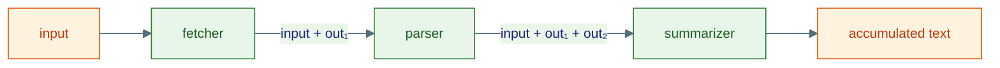
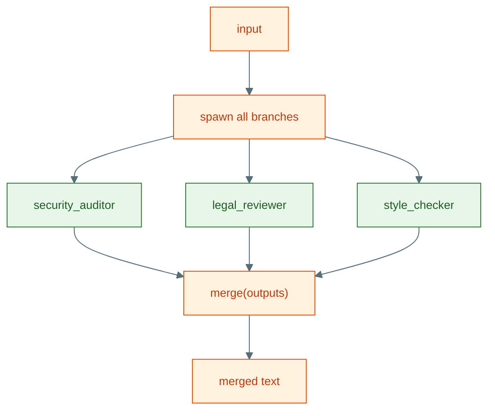

# 1 · Flows

A **flow** wires several agents into one coordinated program. The defining trick
is that a flow is *itself* a kernel agent — it has an `id` and a
`run(ctx, inbox)` method — so it is registered, spawned, and asked exactly like
any other agent. That is why flows **nest**: any step can be another flow.

All three flow types live in
[`fabric/flows/agent.py`](https://github.com/Ravikumarchavva/agent-substrate/blob/main/src/substrate/fabric/flows/agent.py)
and are exported from `substrate.fabric.flows`.

```python
from substrate.fabric.flows import SequentialFlow, ParallelFlow, ConditionalFlow
```

## The shared contract

Every flow follows the same shape:

```python
@dataclass
class SequentialFlow:
    steps: list                      # the agents to coordinate
    name: str = "sequential_flow"    # becomes AgentId(type="flow", key=name)
    description: str = ""
    step_timeout: float = 300.0

    @cached_property
    def id(self) -> AgentId:
        return AgentId(type="flow", key=self.name)

    async def run(self, ctx: RunContext, inbox: list[Message]) -> None:
        ...                          # spawn steps, ask them, reply to caller
```

Internally each flow uses three runtime primitives from L1:

| Primitive | Purpose |
|---|---|
| `ctx.spawn(step.id, boot=msg)` | start a child run for a step/branch |
| `ctx.ask(handle, msg, timeout=…)` | send input and await that child's reply |
| `ctx.reply(msg, {"text": …})` | return the flow's own result to *its* caller |

A flow always replies with a `DataPayload` carrying a `"text"` key. On failure it
replies with `{"text": "", "error": <outcome.kind>}` rather than raising — the
caller decides what to do with a partial result.

!!! warning "Register every participant"
    The flow **and** all of its steps/branches must be registered with the *same*
    `Runtime` before you submit a message to the flow's `id`. A flow can only
    `spawn` agents the runtime knows about.

## SequentialFlow — linear pipeline

Runs steps in order, **accumulating** output: each step receives the original
input plus everything produced so far, joined by blank lines.

```python
from substrate.fabric.flows import SequentialFlow
from substrate.agents.runtime import Runtime

pipeline = SequentialFlow(steps=[fetcher, parser, summarizer], name="doc_pipeline")

async with Runtime() as rt:
    for step in pipeline.steps:
        await rt.register(step)
    await rt.register(pipeline)
    run_id = await rt.submit(pipeline.id, user_message)
```



If any step returns a non-`replied` outcome (timeout, crash, cancellation), the
flow stops immediately and replies with the partial accumulation cleared to
`{"text": "", "error": …}`.

## ParallelFlow — fan-out + merge

Runs all branches **concurrently** with `asyncio.gather`, then merges their
outputs. The same input goes to every branch.

```python
from substrate.fabric.flows import ParallelFlow

panel = ParallelFlow(
    branches=[security_auditor, legal_reviewer, style_checker],
    merge="concat",          # "concat" | "vote" | callable
    name="review_panel",
)
```

| `merge` value | Behaviour |
|---|---|
| `"concat"` *(default)* | join branch outputs with blank lines, in branch order |
| `"vote"` | majority vote (`Counter.most_common`); ties broken by branch order |
| `Callable[[list[str]], str]` | your own reducer over the raw branch outputs |



A branch that does not reply contributes an empty string `""` to the merge rather
than aborting the whole flow — parallel work is best-effort per branch.

## ConditionalFlow — predicate routing

Evaluates a predicate against the input text and routes to one of two agents.

```python
from substrate.fabric.flows import ConditionalFlow

router = ConditionalFlow(
    predicate=lambda text: "refund" in text.lower(),
    if_true=billing_agent,
    if_false=general_agent,
    name="intent_router",
)
```

The predicate is plain Python (`Callable[[str], bool]`) — no LLM call. If it
**raises**, the flow logs a warning and safely takes the `if_false` branch, so a
buggy predicate degrades to a sensible default instead of crashing the run.

## Nesting flows

Because each flow is an agent, composition is free — a branch of a `ParallelFlow`
can be a `SequentialFlow`, and so on:

```python
research = SequentialFlow(steps=[searcher, reader], name="research")
draft    = SequentialFlow(steps=[outliner, writer], name="draft")

pipeline = SequentialFlow(steps=[research, draft, editor], name="article")
# register: searcher, reader, outliner, writer, editor, research, draft, pipeline
```

Remember to register **every** agent that appears anywhere in the tree (leaves and
flows alike) with the runtime before submitting to the outermost flow.

## When to reach for which

| Need | Use |
|---|---|
| Each step depends on the previous one's output | `SequentialFlow` |
| Independent perspectives on the same input | `ParallelFlow` |
| Branch on a cheap, deterministic rule | `ConditionalFlow` |
| Dynamic delegation decided by an LLM | [`OrchestratorAgent`](../agents/01-agent-types.md) (L1), not a flow |

The last row matters: flows encode **static, code-defined** topology. When the
*model* should decide who handles what at runtime, that is an orchestrator, not a
flow.
