# 2 · Evals

The eval framework answers one question: **how good is this agent?** You define a
dataset of cases, run them against any kernel agent, and (optionally) have an LLM
judge score the outputs against named criteria. The result is a structured
`EvalReport` with pass rates and per-criterion aggregates.

```python
from substrate.fabric.evals import (
    EvalCase, EvalDataset, LLMJudge, EvalRunner, CORRECTNESS, HELPFULNESS,
)
```

The whole pipeline:

```mermaid
%%{init: {'theme': 'base', 'themeVariables': {'primaryColor': '#E8EAF6','primaryTextColor': '#1A237E','primaryBorderColor': '#3949AB','lineColor': '#546E7A','fontSize': '13px'}}}%%
flowchart LR
    classDef d fill:#F3E5F5,stroke:#6A1B9A,color:#4A148C
    classDef p fill:#E8F5E9,stroke:#2E7D32,color:#1B5E20
    classDef io fill:#FFF3E0,stroke:#E65100,color:#BF360C

    DS["EvalDataset<br/>[EvalCase, …]"]:::d --> R["EvalRunner"]:::p
    R -->|"submit each case"| AG["agent under test<br/>(via in-memory Runtime)"]:::p
    AG -->|"actual_output"| J["LLMJudge<br/>criteria → EvalScore"]:::p
    J --> REP["EvalReport<br/>pass rate · per-criterion stats"]:::io
```



## Defining cases — `EvalCase` / `EvalDataset`

An `EvalCase` is one test; an `EvalDataset` is a named collection.

```python
dataset = EvalDataset(
    name="math-suite",
    cases=[
        EvalCase(input="What is 2+2?", expected_output="4", tags=["math", "easy"]),
        EvalCase(input="Capital of France?", expected_output="Paris", tags=["geo"]),
    ],
)

# or from plain dicts
dataset = EvalDataset.from_list(
    [{"input": "2+2?", "expected_output": "4"}], name="math-suite"
)

easy = dataset.filter_by_tag("easy")   # → a new EvalDataset
```

| `EvalCase` field | Meaning |
|---|---|
| `input` | the prompt sent to the agent (required) |
| `expected_output` | ground truth, passed to the judge as reference |
| `expected_tool_calls` | tools the agent *should* call (for `TOOL_USAGE`) |
| `context` | extra reference text handed to the judge |
| `tags` | labels for filtering / grouping |
| `case_id` / `metadata` | auto-generated id; arbitrary key-values |

## Criteria — what "good" means

A criterion is a frozen dataclass holding a judge **prompt template**, a raw score
range (default `1–5`), and a pass `threshold` (normalised `0.0–1.0`). Six are
built in ([`fabric/evals/criteria.py`](https://github.com/Ravikumarchavva/agent-substrate/blob/main/src/substrate/fabric/evals/criteria.py)):

| Criterion | Scores… | Threshold |
|---|---|---|
| `CORRECTNESS` | matches `expected_output` | 0.7 |
| `HELPFULNESS` | addresses the user's need | 0.7 |
| `RELEVANCE` | on-topic for the query | 0.7 |
| `SAFETY` | free of harmful content / PII | 0.8 |
| `CONCISENESS` | no filler, every word earns its place | 0.6 |
| `TOOL_USAGE` | right tools, right order | 0.7 |

Write your own by constructing an `EvalCriterion`:

```python
from substrate.fabric.evals import EvalCriterion

TONE = EvalCriterion(
    name="tone",
    description="Is the reply warm and professional?",
    prompt_template=(
        "Score the ACTUAL OUTPUT on tone.\n"
        "USER INPUT: {input}\nACTUAL OUTPUT: {actual_output}\n{context_section}\n"
        'Respond with ONLY JSON: {{"score": <1-5>, "reasoning": "<why>"}}'
    ),
    threshold=0.7,
)
```

Templates may use `{input}`, `{expected_output}`, `{actual_output}`, and
`{context_section}` placeholders.

## Scoring — `LLMJudge`

`LLMJudge` calls an LLM once per criterion, parses a `{"score", "reasoning"}` JSON
object, and normalises the raw score into `0.0–1.0`. It is deliberately robust:

- **Markdown-fence tolerant** — strips ` ```json ` wrappers before parsing, and
  falls back to a regex that finds the first `{... "score": …}` object.
- **Retries** malformed output up to `max_retries` (default 2); on final failure
  it returns a `score=0.0, passed=False` with the error in `reasoning` rather than
  throwing.
- **Parallel by default** — all criteria for a case are judged concurrently
  (`parallel=False` to serialise).

```python
judge = LLMJudge(
    model_client=strong_client,        # any kernel LLMClient — use a capable model
    criteria=[CORRECTNESS, HELPFULNESS, SAFETY],
)
scores = await judge.score(
    input_text="What is 2+2?",
    actual_output="4",
    expected_output="4",
)   # → list[EvalScore]
```

!!! tip "Use a stronger model as judge"
    The judge should generally be at least as capable as the model under test —
    a weak judge produces noisy scores. The judge and the agent are independent
    clients, so you can grade a small model's output with a large one.

## Running — `EvalRunner`

`EvalRunner` accepts **any kernel agent** (a `ReActAgent`, an
`OrchestratorAgent`, or a [flow](01-flows.md)). For each case it spins up a
throwaway in-memory `Runtime`, submits the input, awaits the reply over the
signal bus, then hands the output to the judge.

```python
runner = EvalRunner(
    agent=my_agent,
    judge=judge,            # optional — omit to only capture outputs/latency
    concurrency=4,          # cases run in parallel (default 1 = sequential)
    timeout=60.0,           # per-case seconds; None = no limit
)

report = await runner.run(dataset)
print(report.summary())
```

A case that errors or times out is recorded with `status="error"` and is **not**
sent to the judge — it simply counts against the pass rate. `run_case()` runs a
single case with its own runtime if you want to drive one at a time.

## Results — `EvalReport`

`EvalReport` aggregates every `EvalCaseResult` and exposes computed metrics:

| Metric | Meaning |
|---|---|
| `total_cases` / `passed_cases` / `failed_cases` / `error_cases` | counts |
| `pass_rate` | fraction of cases where every scored criterion passed |
| `avg_score` | mean of per-case average scores |
| `avg_latency` | mean wall-clock seconds per case |
| `scores_by_criterion()` | `{criterion: {mean, min, max, stdev, pass_rate}}` |
| `filter_failed()` / `filter_by_tag(tag)` | drill into specific results |
| `summary()` / `to_dict()` | printable digest / JSON snapshot |

```python
report = await runner.run(dataset)

print(f"pass rate: {report.pass_rate:.0%}")
for name, stats in report.scores_by_criterion().items():
    print(f"  {name}: mean={stats['mean']:.2f} pass={stats['pass_rate']:.0%}")

for failure in report.filter_failed():
    print(failure.case_id, failure.actual_output[:80])
```

## Known limitations

Be aware of what the runner does **not** capture today — these fields exist on
`EvalCaseResult`/`EvalReport` but are currently always zero:

- **`tokens_used` / `total_tokens` / `avg_tokens`** — token accounting is not
  wired through the runner, so token metrics report `0`.
- **`steps_used`, `tool_calls_total`, `tool_calls_by_name`** — the runner reads
  only the agent's final reply text, not its step/tool trace.
- **`TOOL_USAGE` scoring** compares `expected_tool_calls` against the agent's
  *actual* tool calls, but since actual calls aren't captured, this criterion
  currently has nothing real to grade. Prefer output-based criteria
  (`CORRECTNESS`, `HELPFULNESS`, …) until trace capture lands.

`avg_latency` and all judge-based scores are accurate — the gaps are limited to
execution-trace telemetry.
