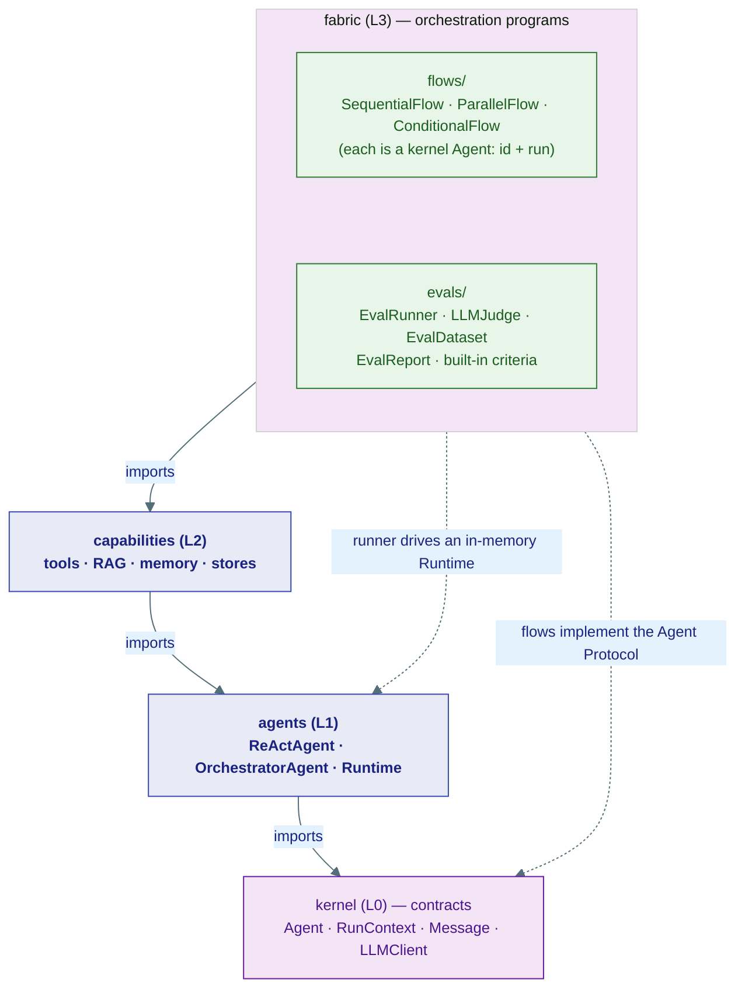

# Fabric Layer (L3)

L3 is the **"how agents are orchestrated"** layer — the top of the stack. Where
[agents (L1)](../agents/index.md) gives you a single thinking agent and
[capabilities (L2)](../capabilities/index.md) gives that agent things to do,
**fabric composes whole agents into larger programs** and measures how well they
perform.

It has exactly two concerns:

- **Flows** — wire multiple agents into a pipeline (sequential, parallel, or
  conditional). A flow is *itself* a kernel agent, so flows nest inside flows.
- **Evals** — run a dataset of cases against an agent and score the outputs with
  an LLM judge, producing a structured report.

!!! tip "The analogy"
    L1 is one musician. L2 is their instruments. **L3 is the score and the
    conductor** — it decides who plays when (flows), and the critic in the
    audience grading the performance (evals).

## Two sub-packages

```
fabric/
├── flows/      SequentialFlow · ParallelFlow · ConditionalFlow
└── evals/      EvalCase · EvalDataset · EvalCriterion · LLMJudge · EvalRunner · EvalReport
```

That is the whole layer — ~1.2k lines, no I/O of its own. Flows borrow the
runtime's `spawn`/`ask`/`reply`; evals borrow an in-memory `Runtime` and an
`LLMClient`. Everything else is imported from below.

## How fabric fits into the stack



## Design rules

**A flow is just an agent.** Every flow implements the same kernel contract as a
`ReActAgent` — an `id: AgentId` and `async def run(ctx, inbox)`. That single fact
is what makes flows *composable*: a step inside a `SequentialFlow` can itself be a
`ParallelFlow`, because both are agents the runtime can `spawn` and `ask`. There
is no separate "flow runtime" — flows reuse the L1 runtime primitives.

**Fabric sits at the top — nothing imports it.** The dependency rule flows
strictly downward: `fabric → capabilities → agents → kernel`. No layer below ever
imports fabric, and import-linter enforces it (`uv run lint-imports`,
contract *"four stack layers"*). Practically: orchestration logic and evaluation
harnesses can change freely without rippling into the engine.

**Evals are agent-agnostic.** `EvalRunner` accepts *any* kernel agent — a bare
`ReActAgent`, an `OrchestratorAgent`, or a flow. It submits each case through a
throwaway `Runtime`, collects the reply over the signal bus, and (optionally)
scores it with an `LLMJudge`. The thing under test and the thing doing the
testing are both just agents and LLM clients.

## Pages in this section

| Page | Topic |
|---|---|
| [1 · Flows](01-flows.md) | `SequentialFlow`, `ParallelFlow`, `ConditionalFlow` — composition patterns, merge strategies, nesting |
| [2 · Evals](02-evals.md) | `EvalCase`/`EvalDataset`, built-in criteria, `LLMJudge`, `EvalRunner`, `EvalReport` |
