# The Kernel

The kernel is the frozen contract layer of ravi-engine. It defines *what* everything is — ABCs, Protocols, dataclasses, enums — without implementing *how* anything works. Every concrete feature lives in `extensions/`, `integrations/`, `catalog/`, or `server/`. The kernel itself contains no databases, no HTTP calls, no Redis, no LLM API calls.

The reason it exists is discipline. When a new feature lands — a new memory backend, a new guardrail strategy, a new agent type — the developer is forced to ask: does this fit an existing contract, or does the contract need to grow? The kernel stays small by design. If you find yourself wanting to add a `for` loop over agent instances or a `requests.get()` call inside `kernel/`, you are in the wrong layer.

---

## Where the Kernel Sits

The framework is five layers deep. Imports flow strictly downward — the kernel never imports from anything above it.

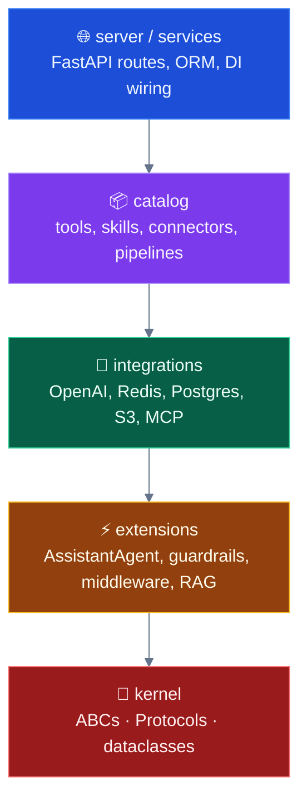

`shared/` and `configs/` are orthogonal — they sit beside the layers and can be imported by anyone above kernel.

**Enforcement**: `uv run lint-imports` (import-linter) fails CI if anything in `ravi.kernel` imports from `ravi.extensions`, `ravi.integrations`, `ravi.catalog`, `ravi.server`, `ravi.services`, `ravi.shared`, `ravi.configs`, or `ravi.logger`. The architecture tests in `tests/architecture/test_kernel_invariants.py` add a hard ceiling on LOC (15k) and file count (110) so the kernel cannot silently balloon.

---

## What Lives in the Kernel

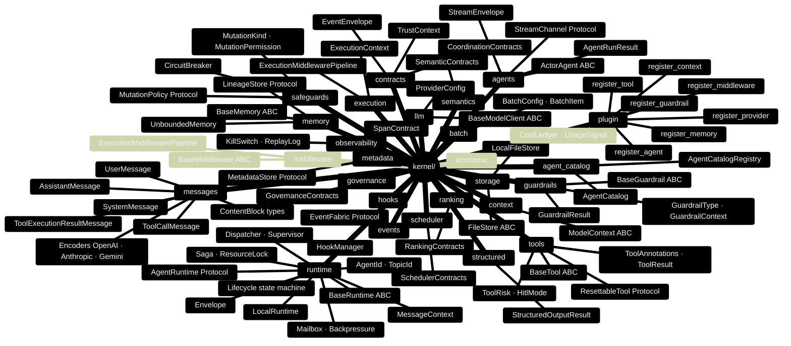

---

## The Actor: Every Agent is a Fabric Node

The single most important contract in the kernel is `ActorAgent`. Before the actor migration (completed 2026-05-28), the framework had two disconnected hierarchies: a callable `BaseAgent → ReActAgent` and an actor-model `RuntimeAgent → RuntimeAssistantAgent`. Features added to one did not appear in the other. That divergence is gone. There is now one hierarchy.

Every agent is an actor:
- it lives inside a **runtime** (required, never `None`)
- it is addressed by an **`AgentId`** (`type/key`, e.g. `assistant/default`)
- it receives work through a single entry point: **`on_message(ctx, content)`**
- it communicates outward only via **`send()`** (point-to-point) or **`publish()`** (broadcast)

External callers never call `agent.run()` directly. They enter the fabric through a `UserProxyAgent`, which is itself an actor that fires messages on the caller's behalf.

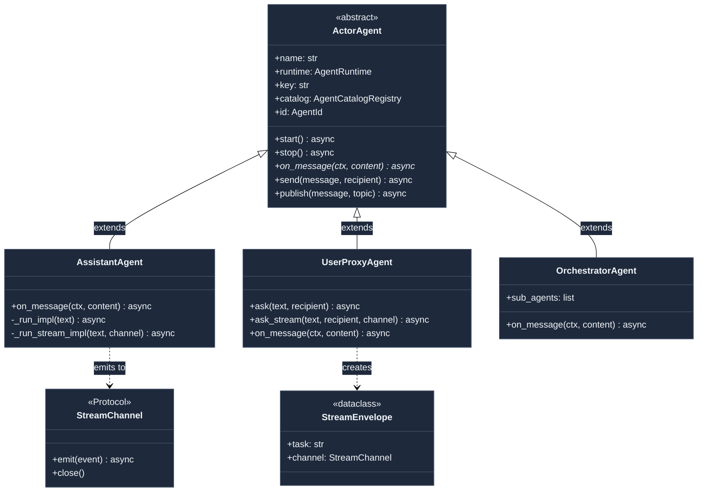

The class-level contract is minimal — only `on_message()` is abstract. Everything else (`start`, `stop`, `send`, `publish`) is concrete and shared. A routing-only agent like `OrchestratorAgent` has almost no code; `AssistantAgent` puts the full ReAct loop inside `on_message()`.

---

## The Runtime: How Messages Flow

The `LocalRuntime` is the in-process implementation of the `AgentRuntime` protocol. It is the only runtime you need for development, tests, and scripts. Production swaps in a `DistributedRuntime` or `GrpcRuntime` that inherits from the same `BaseRuntime` ABC — the rest of the codebase never notices the difference.

### Point-to-point: `send_message`

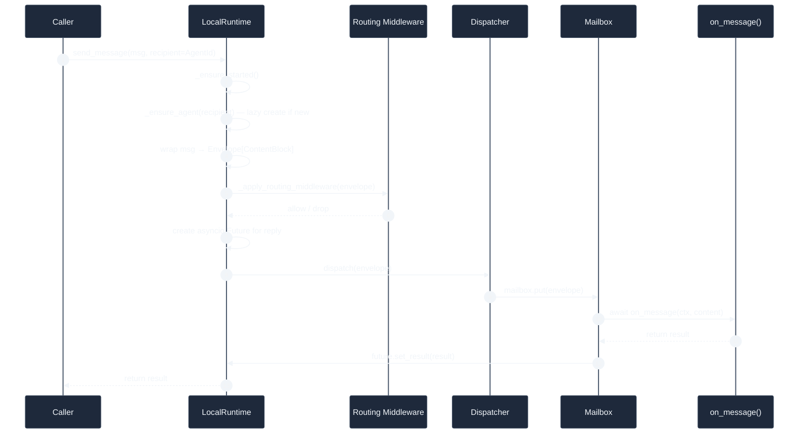

### Pub/sub: `publish_message`

`publish_message` is fire-and-forget. The runtime fans the message out to every agent type subscribed to the topic. Each subscriber gets an `AgentId` with `key = topic.source`, so the same message arrives at every interested agent without the sender knowing who they are.

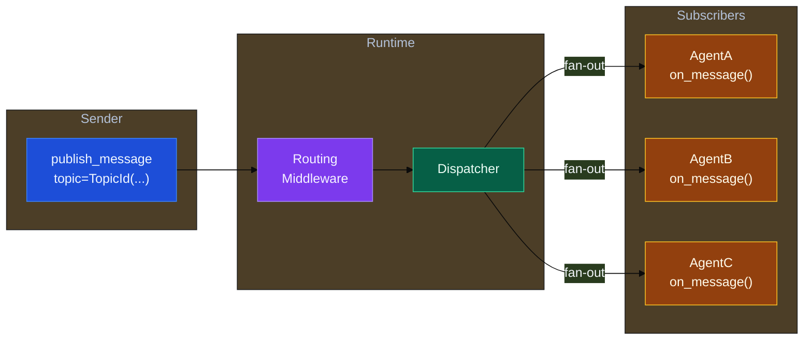

### Agent lifecycle inside LocalRuntime

Every agent instance goes through a state machine managed by `AgentActivationContract`. The runtime uses it to know whether to start a new loop, whether a lease is held, and whether to restart after a crash.

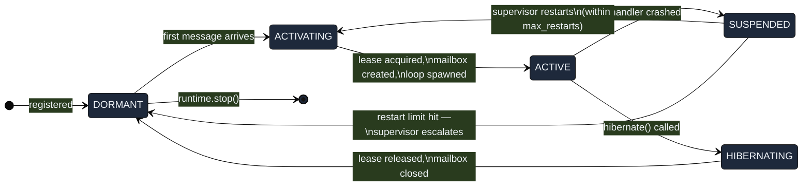

When a `LeaseRegistry` is configured, the `ACTIVATING → ACTIVE` transition also acquires a distributed lease. If another worker already holds the lease, `LeaseAcquisitionFailed` is raised and the caller can route elsewhere — this is the basis for hot-standby failover in the distributed deployment.

### The Envelope

Every message in flight is an `Envelope`. It carries the content but also a rich metadata coat: identity, trust chain, placement hints, temporal semantics (TTL, not-before), OTel trace context, and a correlation ID for response matching.

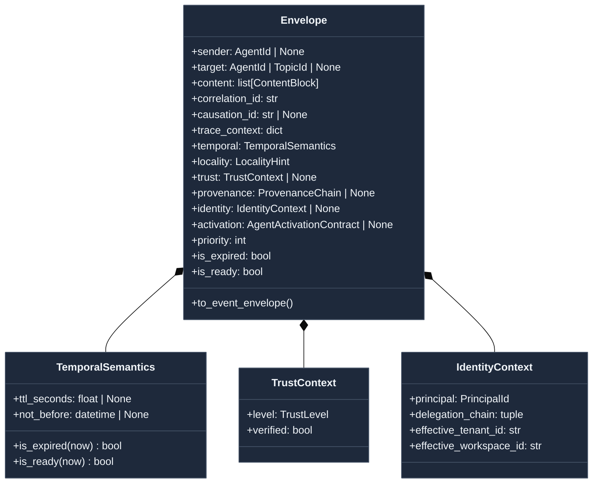

---

## Messages and Content: The Multimodal Type System

Every piece of data that an agent sends to an LLM or receives back from one is a `BaseClientMessage`. There are five concrete types, each with a `role` string that maps to the LLM provider's convention.

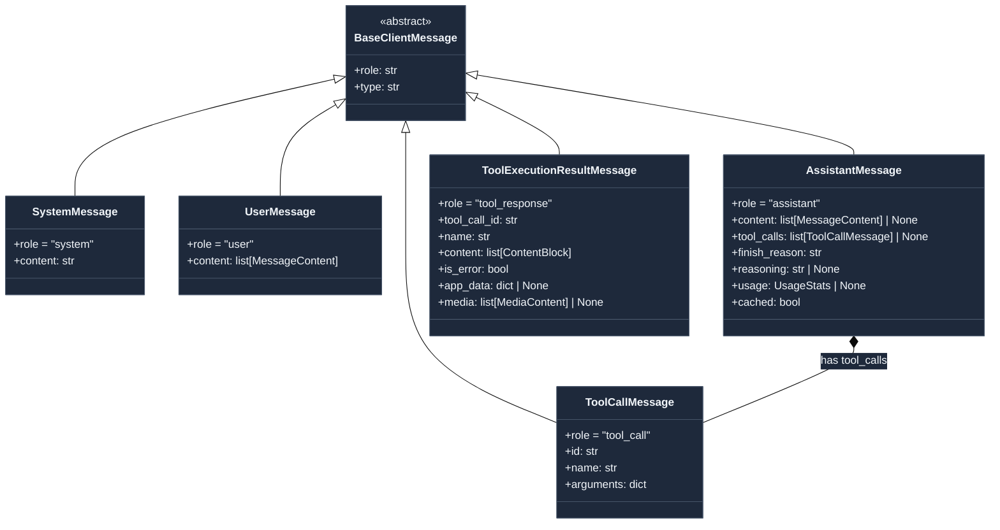

`MessageContent` is a union type: `str | ImageContent | AudioContent | VideoContent | DocumentContent`. The kernel's `ContentBlock` type is narrower — it is the typed primitive for the runtime fabric (`TextBlock | ImageBlock | …`). Provider-specific wire encoding lives in `kernel/messages/encoders/` — the messages themselves are provider-agnostic.

---

## Tools: Template Method + Risk Tier + HITL

`BaseTool` is the Template Method base class for everything the agent can call. The single abstract method is `execute(**kwargs) → ToolResult`. The base class handles input validation, schema publication, and HITL mode flags.

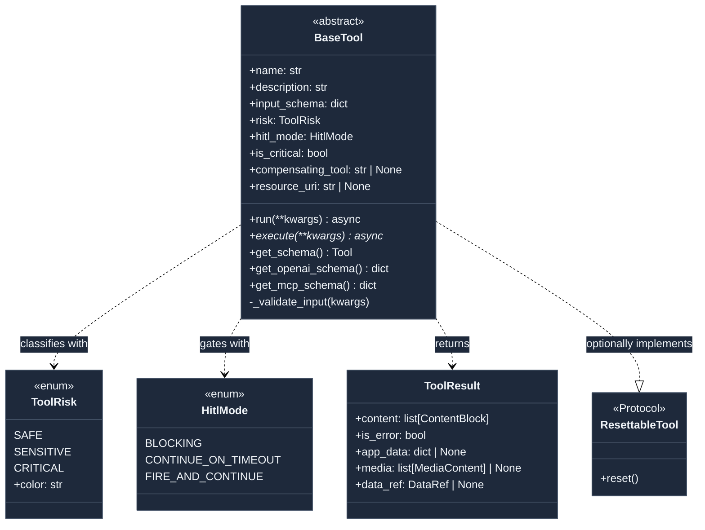

### Risk and HITL interaction

`ToolRisk` is purely informational — it drives UI badge colours and lets policy engines categorise tools without inspecting them. `HitlMode` is operational:

| Mode | What happens when a CRITICAL tool fires |
|------|-----------------------------------------|
| `BLOCKING` | Agent suspends. Non-response = **denied** (veto semantics). Use for send-email, file-delete, payments. |
| `CONTINUE_ON_TIMEOUT` | Agent waits up to `hitl_timeout_seconds`. Timeout = **auto-approved**. Use for time-sensitive UI confirmations. |
| `FIRE_AND_CONTINUE` | Agent sends the SSE event and immediately continues. Use for purely informational UI updates. |

The kernel defines the contracts. The actual approval flow (sending SSE events, waiting for HTTP responses) lives in `catalog/tools/human_input/` and the `server/sse/bridge.py` HITL bridge.

### Runtime integration fields

Two fields on `BaseTool` hook into the `LocalRuntime` subsystems directly:

- **`is_critical = True`** → the runtime wraps execution in a `SagaCoordinator` step for exactly-once semantics. If the process crashes mid-execution, the saga store replays to completion or rolls back via `compensating_tool`.
- **`resource_uri`** → the runtime acquires an exclusive `ResourceLockManager` lock before executing and releases it after. Prevents concurrent modifications to the same file, DB row, or external resource.

---

## Memory: One Async Interface

`BaseMemory` is a single async interface with four methods. There are no sync variants, no `add_message_async` / `add_message_sync` pairs, no `close()`. The only lifecycle method is `clear()`.

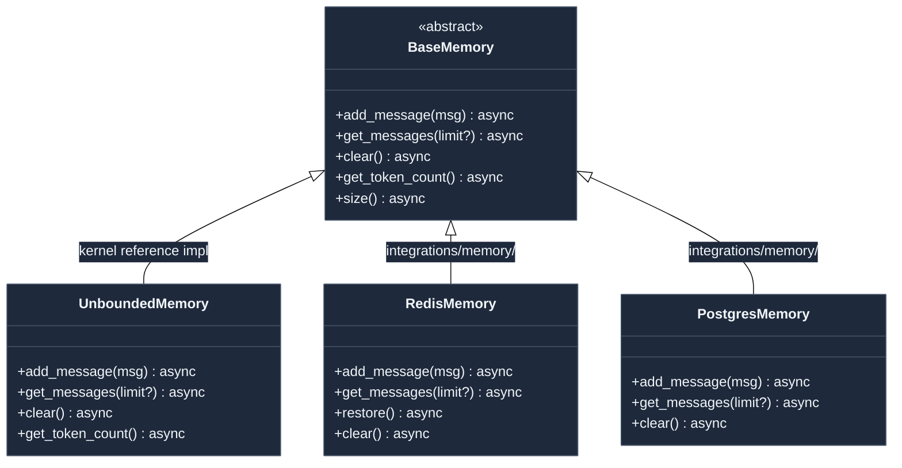

`UnboundedMemory` is the only concrete implementation inside the kernel — a plain in-memory list. It is intentionally simple: no trimming, no TTL, no persistence. Real deployments use `RedisMemory` (hot store) layered over `PostgresMemory` (cold store) via the `HybridContext` strategy in `extensions/context/`.

The `LineageStore` Protocol (also in `kernel/memory/`) is a separate contract for immutable audit trails — session lineage, parent-child message relationships. It is not `BaseMemory`; it is append-only and never cleared.

---

## Guardrails: Three Injection Points

Guardrails are async checks that fire at specific points in the agent loop. A check either **passes**, **fails** (soft — logged, loop continues), or **trips** (hard — loop aborts immediately).

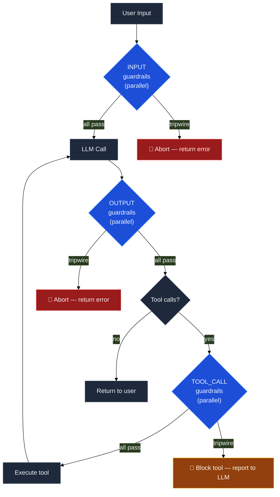

All three injection points run guardrails in parallel via `asyncio.gather` — an expensive external-check guardrail (like an LLM judge) does not serialize the fast regex checks. The `GuardrailContext` passed to each check is a frozen snapshot: no guardrail can mutate agent state.

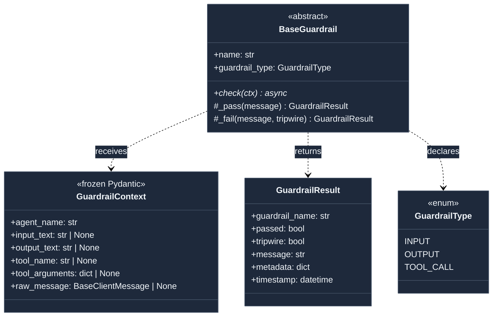

---

## Middleware: Before / Execute / After / OnError

`ExecutionMiddlewarePipeline` is a generic sequential runner. The same engine powers both agent middleware (audit logging, caching, rate limiting, retry) and workflow middleware (pipeline step wrapping). Middleware runs `before()` on each entry in order, then `execute_fn()`, then `after()` in reverse — the standard onion/interceptor pattern.

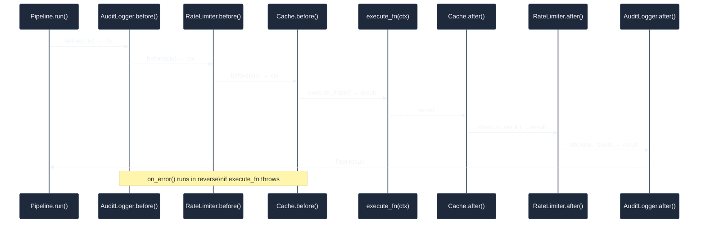

If `execute_fn` raises, each middleware's `on_error(ctx, exc)` runs in reverse order. The first non-`None` return from any `on_error` becomes the result; if all return `None`, the exception re-raises. This lets a retry middleware return a sentinel that the pipeline runner interprets as "try again."

---

## The Plugin Registry

The plugin registry maps `(category, name) → class`. Decorators register classes at import time. The registry is process-global and never cleared except during test teardown.

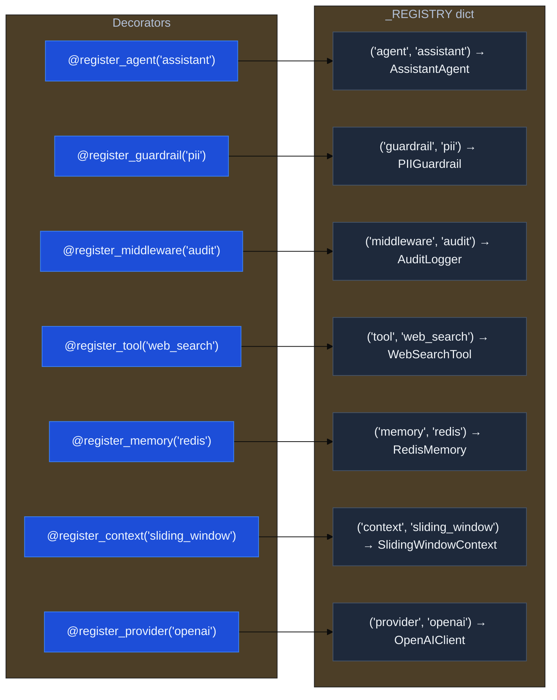

Each decorator is bound to a base class (e.g. `register_agent` → `ActorAgent`, `register_guardrail` → `BaseGuardrail`). Registration fails at import time with a `PluginRegistryError` if the class does not subclass the required base. Duplicate names also fail immediately. This makes misconfiguration loud and early — not silent at runtime.

`get_registered(category, name)` retrieves a class. Construction and wiring is the caller's responsibility — the registry holds classes, not instances.

---

## The AgentCatalog: Per-Agent Capability Registry

Every `ActorAgent` carries an `AgentCatalogRegistry` — a per-agent inventory of its models, memories, contexts, and tools. Unlike the global plugin registry (which holds classes), the catalog holds configured *instances* ready to use.

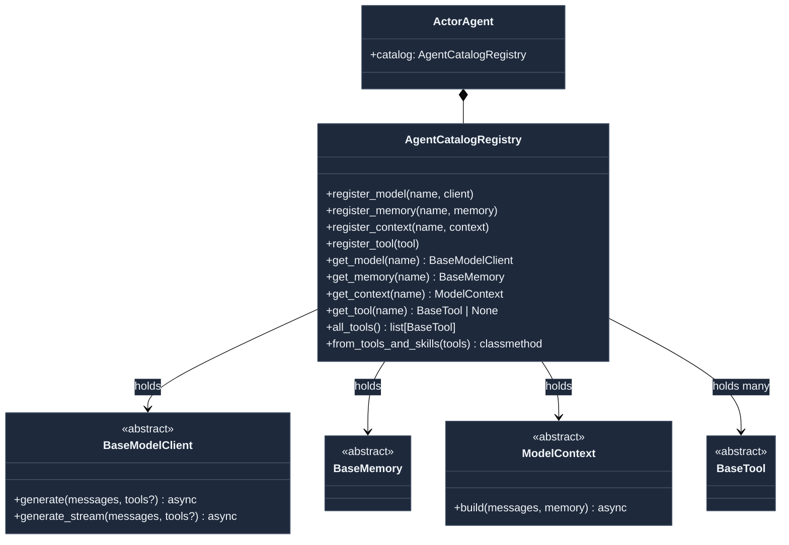

`AssistantAgent` reads from the catalog to get its primary model client (`catalog.get_model("primary")`), memory (`catalog.get_memory("memory")`), and all registered tools. This design means two agents of the same type can have entirely different backends (different LLMs, different memory backends) without subclassing.

---

## Safeguards: Mutation Gates and Circuit Breakers

The kernel has two safeguard contracts that apply to agent self-modification and downstream service stability.

### MutationPolicy — gating self-evolution

An agent that wants to modify itself (rewrite its system prompt, add a tool, push a weight update, or visibly diverge from baseline) must first ask a `MutationPolicy` for permission. The policy returns a `MutationPermission`.

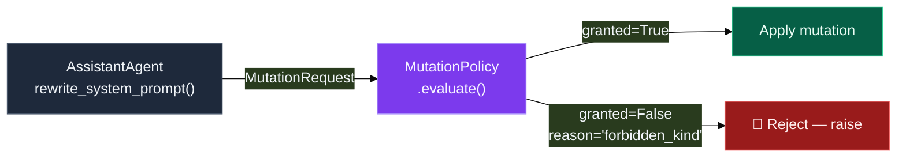

| `MutationKind` | Default gate |
|----------------|-------------|
| `PROMPT_REWRITE` | Allowed (policy configurable) |
| `TOOL_ADD` | Allowed (policy configurable) |
| `TOOL_REMOVE` | Allowed (policy configurable) |
| `WEIGHT_UPDATE` | **Forbidden by default** — must go through operator model registry |
| `BEHAVIOR_DIVERGENCE` | Triggers audit alert |

`family_depth` in the request prevents depth-escalation attacks where a chain of agents-spawning-agents tries to escape the mutation ceiling by delegating one more level down.

### Circuit Breaker — protecting downstream services

`kernel/safeguards/_breaker.py` defines the `CircuitBreaker` contract. It protects downstream calls (LLM providers, external APIs, databases) from cascading failures.

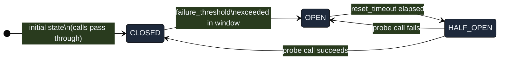

---

## Supporting Contracts

These contracts sit in the kernel but are used less frequently day-to-day. They become important at scale and in multi-tenant deployments.

| Module | What it defines | When you need it |
|--------|-----------------|-----------------|
| `kernel/contracts/_event.py` | `EventEnvelope[T]` — the canonical wire format for cross-service events | When serialising an `Envelope` for Redis Streams or gRPC |
| `kernel/contracts/_trust.py` | `ProvenanceChain`, `PrincipalTrustContext` | When a guardrail needs to inspect *who* sent a message |
| `kernel/contracts/_coordination.py` | `TemporalSemantics`, `LocalityHint`, `PlacementContract` | When messages have TTLs, scheduling constraints, or datacenter placement needs |
| `kernel/events/_fabric.py` | `EventFabric`, `DurableEventLog`, `RealtimeFanout` Protocols | When implementing a new event bus backend |
| `kernel/economic/` | `CostLedger`, `UsageSignal` | Chargeback and token-cost tracking per agent run |
| `kernel/governance/` | Governance policy contracts | When tenant-level operator rules gate capability access |
| `kernel/scheduler/` | Scheduler trigger contracts | When tools or agents need time-based activation |
| `kernel/observability/` | `SpanContract`, `KillSwitch`, `ReplayLog` | OTel span shaping; emergency kill-switch for runaway agents; replay audit log |
| `kernel/semantics/` | Semantic search contracts | When the catalog needs embedding-based capability discovery |
| `kernel/ranking/` | Ranking strategy contracts | When tool selection or memory retrieval needs a scoring function |
| `kernel/metadata/` | `MetadataStore` Protocol | When agents need to persist and retrieve tagged metadata outside memory |
| `kernel/structured/` | `StructuredOutputResult` | When an agent must return a validated Pydantic model instead of free text |
| `kernel/storage/` | `FileStore`, `LocalFileStore`, `Document`, `TenantContext` | When tools or agents read/write files with tenant isolation |
| `kernel/batch/` | `BatchConfig`, `BatchItem`, `BatchResult` | When running the same agent over thousands of inputs in parallel |
| `kernel/hooks.py` | `HookManager`, lifecycle hook types | When you need `on_run_start`, `on_run_end`, `on_tool_call`, `on_tool_result` callbacks |
| `kernel/context/` | `ModelContext` ABC | When building a new message-windowing or summarisation strategy |

---

## How to Add a New Feature

Never edit the kernel to add capability. The kernel grows only when a new *contract* is needed — a new Protocol or ABC that extensions must satisfy.

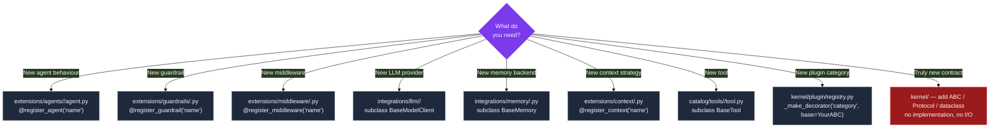

The rule is: if you can build it in `extensions/` by implementing an existing kernel ABC, do that. If you need a new ABC that doesn't exist yet, that's the one case where the kernel grows — but only the contract, never the implementation.
