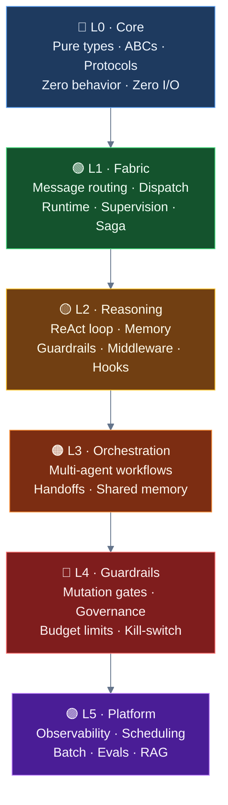
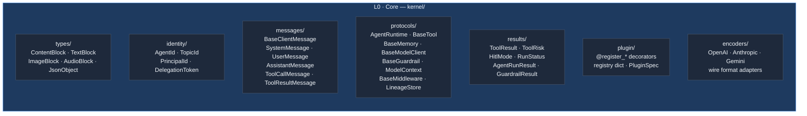
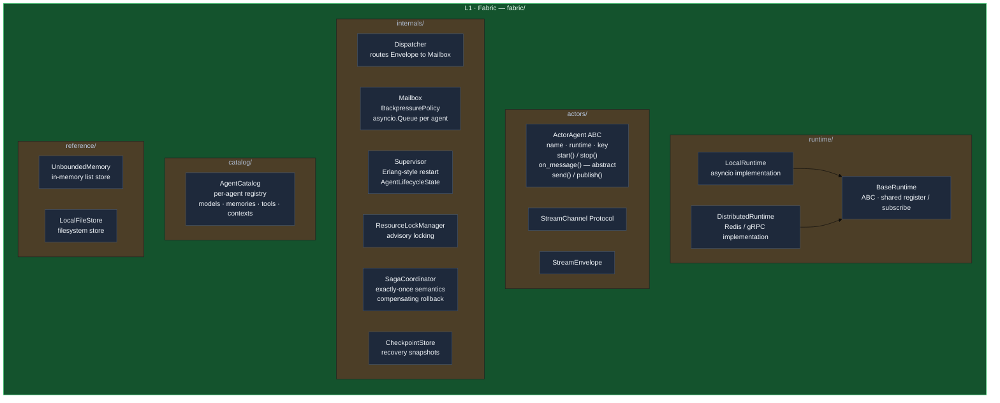
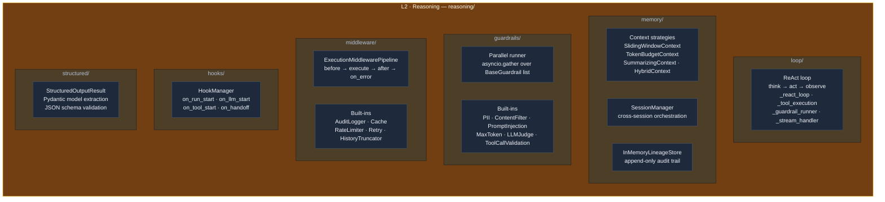
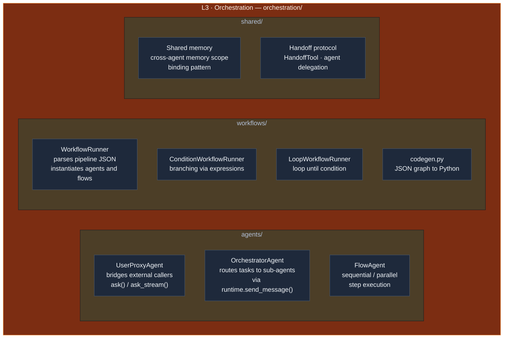
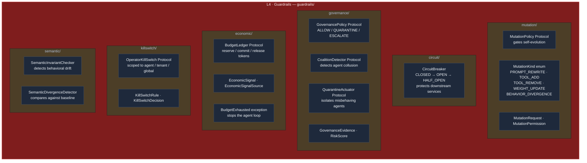
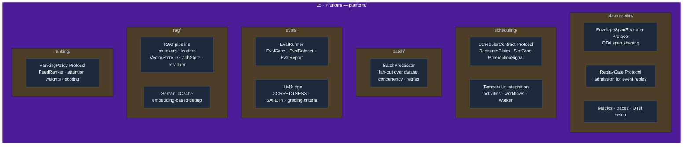

# Layered Architecture Proposal

**Status**: Design proposal — not yet implemented  
**Motivation**: The current `kernel/` is frozen but contains four conceptually different levels of abstraction. This document diagnoses the problem and proposes a clean six-layer model that enables true autonomous agents without the current compression.

---

## The Problem with One Frozen Layer

The kernel is supposed to be "pure contracts — no I/O, no concrete implementations." But look at what's actually inside it:

| File | Lines | What it actually is |
|------|-------|---------------------|
| `kernel/runtime/_local.py` | 643 | Full concrete `LocalRuntime` with asyncio loops |
| `kernel/runtime/_saga.py` | 411 | Complete `SagaCoordinator` implementation |
| `kernel/runtime/_resource_lock.py` | 354 | Complete `ResourceLockManager` with async locking |
| `kernel/runtime/_checkpoint.py` | 296 | Full checkpoint store implementation |
| `kernel/runtime/_client_channel.py` | 310 | Concrete `ClientWriteChannel` |
| `kernel/hooks.py` | 289 | Complete `HookManager` with deque-based dispatch |
| `kernel/governance/_contracts.py` | 241 | `GovernancePolicy`, `CoalitionDetector`, `QuarantineActuator` |
| `kernel/scheduler/_contracts.py` | 212 | `SchedulerContract`, `ResourceClaim`, `PreemptionSignal` |
| `kernel/semantics/_contracts.py` | 225 | `SemanticInvariantChecker`, `SemanticDivergenceDetector` |

The kernel is mixing **four fundamentally different levels** into one frozen bucket:

```mermaid
%%{init: {"theme": "base", "themeVariables": {"primaryColor": "#1e293b", "primaryTextColor": "#f1f5f9", "primaryBorderColor": "#475569"}}}%%
quadrantChart
    title What is actually inside kernel/
    x-axis "Low abstraction (primitives)" --> "High abstraction (platform)"
    y-axis "Protocol-only (correct)" --> "Full implementation (wrong)"
    quadrant-1 Should be platform/ or guardrails/
    quadrant-2 Should be fabric/ (separate layer)
    quadrant-3 Belongs in kernel
    quadrant-4 Should be reasoning/ or fabric/
    AgentId: [0.05, 0.05]
    ToolRisk: [0.08, 0.05]
    ContentBlock: [0.10, 0.05]
    BaseMemory: [0.15, 0.10]
    BaseTool: [0.18, 0.12]
    BaseGuardrail: [0.20, 0.15]
    ModelContext: [0.22, 0.08]
    MessageContext: [0.25, 0.10]
    ExecutionMiddlewarePipeline: [0.35, 0.65]
    HookManager: [0.40, 0.70]
    LocalRuntime: [0.42, 0.90]
    SagaCoordinator: [0.55, 0.88]
    ResourceLockManager: [0.50, 0.85]
    MutationPolicy: [0.72, 0.15]
    GovernancePolicy: [0.85, 0.12]
    EconomicLedger: [0.88, 0.14]
    SchedulerContract: [0.82, 0.12]
    SemanticInvariant: [0.90, 0.15]
    KillSwitch: [0.88, 0.18]
```

The consequence is architectural: when you want to add a new governance rule that references both `EconomicSignal` and `MutationKind` (both currently in `kernel/`), you cannot implement it anywhere — the kernel cannot import from `extensions/`, and `extensions/` cannot import freely from `kernel/governance/` without pulling everything.

---

## What True Autonomy Requires

A truly autonomous agent needs six independent capabilities, each built on the one below it:



Each layer can import from any layer below it. Nothing ever imports upward.

---

## Layer-by-Layer Breakdown

### L0 — Core (what the kernel should be)

The absolute bedrock. Only pure Python types: dataclasses, enums, ABCs with no logic in their bodies, and Protocols. No `asyncio`, no Pydantic `@field_validator` with business logic, no concrete method bodies. If a file has more than a few lines per class, it probably doesn't belong here.



**What moves OUT of kernel to make this possible:**

| Currently in `kernel/` | Moves to |
|------------------------|----------|
| `runtime/_local.py` (LocalRuntime — full concrete) | L1 · Fabric |
| `runtime/_base.py` (BaseRuntime — abstract but with concrete methods) | L1 · Fabric |
| `runtime/_saga.py` (SagaCoordinator — full impl) | L1 · Fabric |
| `runtime/_resource_lock.py` (ResourceLockManager) | L1 · Fabric |
| `runtime/_checkpoint.py` (CheckpointStore impl) | L1 · Fabric |
| `runtime/_client_channel.py` (ClientWriteChannel) | L1 · Fabric |
| `runtime/_dispatcher.py`, `_mailbox.py`, `_supervisor.py` | L1 · Fabric |
| `agents/actor.py` (ActorAgent ABC — refs runtime internals) | L1 · Fabric |
| `agent_catalog/_catalog.py` (AgentCatalog — 789 lines) | L1 · Fabric |
| `hooks.py` (HookManager — concrete, 289 lines) | L2 · Reasoning |
| `execution/pipeline.py` (ExecutionMiddlewarePipeline — concrete runner) | L2 · Reasoning |
| `memory/unbounded_memory.py` (reference impl) | L1 · Fabric |
| `storage/local.py` (LocalFileStore — concrete) | L1 · Fabric |
| `safeguards/_mutation.py` | L4 · Guardrails |
| `safeguards/_breaker.py` | L4 · Guardrails |
| `governance/_contracts.py` | L4 · Guardrails |
| `economic/_ledger.py`, `_signals.py` | L4 · Guardrails |
| `observability/_killswitch.py`, `_replay.py` | L4 · Guardrails |
| `scheduler/_contracts.py` | L5 · Platform |
| `semantics/_contracts.py` | L5 · Platform |
| `ranking/_contracts.py` | L5 · Platform |
| `observability/_spans.py` | L5 · Platform |

**What stays in kernel (L0 Core):** pure types, ABCs with no implementations, Protocols, the plugin registry. The kernel's LOC drops from ~16,895 to roughly ~4,000. The remaining code is truly frozen — it changes only when a new fundamental primitive is needed (which is rare).

---

### L1 — Fabric (the runtime infrastructure)

The fabric makes agents addressable, routes messages between them, supervises their lifecycle, and handles exactly-once execution of critical actions. It is the "operating system" for the agent mesh.



The key distinction from the current arrangement: `ActorAgent` moves from `kernel/` to `fabric/`. It belongs here because its `start()` method calls `runtime.register()` — it has a concrete dependency on the fabric. The kernel (L0 Core) should contain only protocols; `ActorAgent` with its concrete `start()`, `stop()`, `send()`, `publish()` methods is a fabric object.

The fabric is also where `SagaCoordinator` and `ResourceLockManager` live. These are not abstract contracts — they are full working implementations. Having them in a supposedly "frozen" layer was the mistake.

---

### L2 — Reasoning (how one agent thinks)

Reasoning is everything a single agent needs to think, remember, act, and introspect — without caring about other agents, multi-tenancy, or production operations.



The single concrete agent implementation (`AssistantAgent`) lives here, at the top of the reasoning layer. The key insight about reasoning: it is **stateless with respect to other agents**. `AssistantAgent` receives a task, runs a loop against its own memory and tools, and returns a result. It does not know about orchestration, workflows, or other agents. That awareness belongs in the orchestration layer.

---

### L3 — Orchestration (how agents cooperate)

Orchestration is the layer where individual reasoning agents become a system. Patterns here describe how tasks get routed, how results get combined, how context flows between agents.



Orchestration agents (`OrchestratorAgent`, `FlowAgent`) are `ActorAgent` subclasses (L1) whose `on_message()` implementations dispatch to other agents via `runtime.send_message()`. They are architecturally identical to reasoning agents — the difference is that their logic is routing, not thinking.

---

### L4 — Guardrails (how the system stays trustworthy)

Guardrails is the layer that constrains what agents are permitted to do. It is intentionally separate from reasoning and orchestration because safety rules must be enforceable independently of how agents are implemented. A governance policy should not need to know whether it is gating an `AssistantAgent` or an `OrchestratorAgent`.



**Why guardrails is a separate layer and not part of reasoning:**

An agent's reasoning (L2) decides *what* to do. Guardrails (L4) decides *whether* it is *allowed* to do it. These are different authorities — in production you want the ability to strengthen guardrail rules without redeploying reasoning logic, and vice versa.

Currently `MutationPolicy` lives in `kernel/safeguards/` but `GovernancePolicy` lives in `kernel/governance/`. Both are contracts with no implementations — their implementations cannot live in `kernel/` (frozen), but the extensions layer has no way to compose them together. Moving both to `guardrails/` resolves this: guardrail implementations live alongside their contracts, not split across layers.

---

### L5 — Platform (how the system operates at scale)

Platform concerns are orthogonal to what agents do — they describe how the operator observes, schedules, evaluates, and scales the system.



RAG moves here from `extensions/rag/` because retrieval is not a reasoning operation in the single-agent sense — it is a data-platform concern shared across agents and tenants. An `AssistantAgent` calls a tool that queries the RAG pipeline; the RAG pipeline itself is a platform service.

---

## The Full Picture

```mermaid
%%{init: {"theme": "base", "themeVariables": {"primaryColor": "#1e293b", "primaryTextColor": "#f1f5f9", "primaryBorderColor": "#334155", "lineColor": "#64748b", "clusterBkg": "#0f172a"}}}%%
flowchart TD
    subgraph SV["server / services"]
        S1["FastAPI routes<br/>ORM models · DI wiring"]
    end

    subgraph CAT["catalog/"]
        S2["Tools · Skills · Connectors<br/>Data pipelines"]
    end

    subgraph INTG["integrations/"]
        S3["OpenAI · Anthropic · Gemini<br/>Redis · Postgres · S3 · MCP"]
    end

    subgraph PLAT["platform/ — L5"]
        S4["Observability · Scheduling<br/>Batch · Evals · RAG · Ranking"]
    end

    subgraph SAFE["guardrails/ — L4"]
        S5["Mutation gates · Governance<br/>Budget limits · Kill-switch<br/>Semantic drift detection"]
    end

    subgraph COORD["orchestration/ — L3"]
        S6["OrchestratorAgent · FlowAgent<br/>UserProxyAgent · WorkflowRunner"]
    end

    subgraph COG["reasoning/ — L2"]
        S7["AssistantAgent · ReAct loop<br/>Guardrail runner · Middleware<br/>Memory strategies · Hooks"]
    end

    subgraph FAB["fabric/ — L1"]
        S8["LocalRuntime · ActorAgent<br/>Dispatcher · Mailbox · Supervisor<br/>Saga · ResourceLock · AgentCatalog"]
    end

    subgraph KER["kernel/ — L0"]
        S9["ContentBlock · AgentId<br/>Message types · ABCs<br/>Protocols · Enums · Plugin registry"]
    end

    SV --> CAT --> INTG --> PLAT --> SAFE --> COORD --> COG --> FAB --> KER

    style KER fill:#1e3a5f,stroke:#60a5fa,color:#eff6ff
    style FAB fill:#14532d,stroke:#4ade80,color:#f0fdf4
    style COG fill:#713f12,stroke:#fbbf24,color:#fffbeb
    style COORD fill:#7c2d12,stroke:#fb923c,color:#fff7ed
    style SAFE fill:#7f1d1d,stroke:#f87171,color:#fef2f2
    style PLAT fill:#4a1d96,stroke:#c084fc,color:#faf5ff
    style INTG fill:#065f46,stroke:#34d399,color:#ecfdf5
    style CAT fill:#1e3a5f,stroke:#94a3b8,color:#e2e8f0
    style SV fill:#334155,stroke:#94a3b8,color:#e2e8f0
```



`shared/` and `configs/` remain orthogonal utilities (cross-cutting infrastructure: Pydantic settings, JWT auth, database sessions, event bus). They are importable by any layer above L0.

---

## Why This Enables Better Autonomous Agents

### Problem 1: You cannot build a minimal autonomous agent today

Currently the only agent is `AssistantAgent` in `extensions/agents/assistant/`. To use it you must accept that `extensions/` has no internal structure — guardrail runner, context strategies, HITL, middleware, orchestration, RAG are all peers at the same directory level.

You cannot take "just the agent loop" without implicitly depending on the whole `extensions/` bucket.

**With layers:** An `AssistantAgent` depends on `reasoning/` which depends on `fabric/` which depends on `kernel/`. The dependency is explicit and minimal. Taking just `reasoning/` gives you a fully working single agent with no multi-agent, no governance, no platform concerns.

### Problem 2: Safety contracts have no home

`MutationPolicy` is in `kernel/safeguards/` but its implementations must live in `extensions/`. `GovernancePolicy` is in `kernel/governance/` but its implementations are nowhere — nobody has built them because there is no clear place.

**With layers:** `guardrails/` contains both contracts AND implementations. You write a `TenantBudgetPolicy(BudgetLedger)` in `guardrails/economic/` and it is immediately usable. The layer boundary is enforced: guardrails can import from `orchestration/` downward, but `orchestration/` cannot import from `guardrails/`.

### Problem 3: The "frozen" constraint is unenforceable

The kernel has 16,895 LOC including full asyncio implementations. The import-linter can prevent upward imports, but it cannot prevent the kernel from growing with concrete code. `LocalRuntime` alone is 643 lines.

**With layers:** The true kernel (L0 Core) contains only types and protocols — roughly 4,000 LOC. This is genuinely freezable. Adding a new feature never requires editing L0.

### Problem 4: No guidance for where new features live

A new developer asks: "I want to add a budget-aware retry that stops the agent when it hits $10 in LLM costs." Where does this go?

Today: unclear — `kernel/economic/` has the contract, `extensions/resilience/` has retry, `extensions/middleware/` has another retry, nobody has wired them together.

**With layers:** Budget-aware retry is a **guardrails + reasoning** composition. Write `BudgetAwareRetryMiddleware` in `guardrails/economic/` (it reads from `BudgetLedger`) and register it as middleware. The layer guarantees it can import from `reasoning/` (middleware protocol) and from `guardrails/` (economic ledger).

---

## Migration Map

What moves where from the current structure:

| Current path | New path | Layer |
|---|---|---|
| `kernel/runtime/_local.py` | `fabric/runtime/local.py` | L1 |
| `kernel/runtime/_base.py` | `fabric/runtime/base.py` | L1 |
| `kernel/runtime/_dispatcher.py` | `fabric/runtime/dispatcher.py` | L1 |
| `kernel/runtime/_mailbox.py` | `fabric/runtime/mailbox.py` | L1 |
| `kernel/runtime/_supervisor.py` | `fabric/runtime/supervisor.py` | L1 |
| `kernel/runtime/_saga.py` | `fabric/saga.py` | L1 |
| `kernel/runtime/_resource_lock.py` | `fabric/locks.py` | L1 |
| `kernel/runtime/_checkpoint.py` | `fabric/checkpoint.py` | L1 |
| `kernel/runtime/_client_channel.py` | `fabric/channel.py` | L1 |
| `kernel/agents/actor.py` | `fabric/actors/actor.py` | L1 |
| `kernel/agent_catalog/` | `fabric/catalog/` | L1 |
| `kernel/memory/unbounded_memory.py` | `fabric/memory/unbounded.py` | L1 |
| `kernel/storage/local.py` | `fabric/storage/local.py` | L1 |
| `kernel/hooks.py` | `reasoning/hooks/manager.py` | L2 |
| `kernel/execution/pipeline.py` | `reasoning/middleware/pipeline.py` | L2 |
| `extensions/agents/assistant/` | `reasoning/agents/assistant/` | L2 |
| `extensions/context/` | `reasoning/memory/context/` | L2 |
| `extensions/memory/session_manager.py` | `reasoning/memory/session.py` | L2 |
| `extensions/guardrails/` | `reasoning/guardrails/` | L2 |
| `extensions/middleware/` | `reasoning/middleware/` | L2 |
| `extensions/structured/` | `reasoning/structured/` | L2 |
| `extensions/agents/orchestrator/` | `orchestration/agents/orchestrator.py` | L3 |
| `extensions/agents/flow/` | `orchestration/agents/flow.py` | L3 |
| `extensions/agents/user_proxy/` | `orchestration/agents/proxy.py` | L3 |
| `extensions/pipelines/` | `orchestration/workflows/` | L3 |
| `kernel/safeguards/` | `guardrails/mutation/` | L4 |
| `kernel/governance/` | `guardrails/governance/` | L4 |
| `kernel/economic/` | `guardrails/economic/` | L4 |
| `kernel/observability/_killswitch.py` | `guardrails/killswitch.py` | L4 |
| `kernel/semantics/` | `guardrails/semantic/` | L4 |
| `kernel/observability/_spans.py`, `_replay.py` | `platform/observability/` | L5 |
| `kernel/scheduler/` | `platform/scheduling/` | L5 |
| `kernel/ranking/` | `platform/ranking/` | L5 |
| `evals/` | `platform/evals/` | L5 |
| `extensions/rag/` | `platform/rag/` | L5 |
| `extensions/batch/` | `platform/batch/` | L5 |

**Stays in kernel/ (L0 Core):** everything in `kernel/messages/`, `kernel/tools/base_tool.py`, `kernel/memory/base_memory.py`, `kernel/context/base_context.py`, `kernel/guardrails/base_guardrail.py`, `kernel/middleware/base.py`, `kernel/llm/base_client.py`, `kernel/storage/base.py`, `kernel/structured/result.py`, `kernel/runtime/_identity.py`, `kernel/runtime/_protocol.py`, `kernel/runtime/_contracts.py` (Envelope, MessageContext, RestartPolicy), `kernel/runtime/_errors.py`, `kernel/plugin/`, `kernel/contracts/`, `kernel/agents/agent_result.py`.

---

## Implementation Order

This migration is large. Do it in phases so CI stays green throughout.

```mermaid
%%{init: {"theme": "base", "themeVariables": {"primaryColor": "#1e293b", "primaryTextColor": "#f1f5f9", "primaryBorderColor": "#475569"}}}%%
gantt
    title Migration Phases
    dateFormat  X
    axisFormat %s

    section Phase 1 - Create fabric/
    Move LocalRuntime and runtime internals       :p1a, 0, 3
    Move ActorAgent to fabric/actors/             :p1b, 1, 3
    Move AgentCatalog to fabric/catalog/          :p1c, 2, 3
    Move Saga + ResourceLock + Checkpoint         :p1d, 2, 3
    Update all imports                            :p1e, 3, 4

    section Phase 2 - Create reasoning/
    Move AssistantAgent to reasoning/             :p2a, 4, 6
    Move context strategies                       :p2b, 4, 6
    Move guardrail runner and builtins            :p2c, 5, 6
    Move middleware + builtins + HookManager      :p2d, 5, 6

    section Phase 3 - Create orchestration/
    Move OrchestratorAgent, FlowAgent, UserProxy  :p3a, 7, 9
    Rename extensions/pipelines/ to workflows/   :p3b, 7, 9

    section Phase 4 - Create guardrails/
    Move MutationPolicy, CircuitBreaker           :p4a, 10, 12
    Move GovernanceContracts + impls              :p4b, 10, 12
    Move EconomicLedger + impls                   :p4c, 11, 12
    Move SemanticInvariants + KillSwitch          :p4d, 11, 12

    section Phase 5 - Create platform/
    Move observability spans + replay             :p5a, 13, 15
    Move scheduler contracts + Temporal           :p5b, 13, 15
    Move evals/, rag/, batch/, ranking/           :p5c, 14, 15

    section Phase 6 - Strip kernel/
    Delete all moved files from kernel/           :p6a, 16, 17
    Lower LOC + file-count ceilings in CI         :p6b, 16, 17
```



Each phase should pass all tests before the next begins. Phases 1–3 are load-bearing and should be done by one developer sequentially. Phases 4–5 can be parallelised after Phase 3 lands.

---

## What This Does Not Change

- The `catalog/`, `integrations/`, `server/`, `services/`, `shared/` directories are unchanged
- The plugin registry API (`@register_agent`, `@register_guardrail`, etc.) is unchanged
- The `AgentRuntime` protocol and `AgentId`/`TopicId` types are unchanged — they stay in kernel/
- The `Envelope` dataclass stays in kernel/ (it is a pure value type)
- `BaseTool`, `BaseMemory`, `BaseGuardrail`, `BaseModelClient`, `ModelContext` ABCs stay in kernel/

---

## Breaking Changes & Backward Compatibility

- **No Backward Compatibility Required**: We explicitly do not preserve backward compatibility. Public APIs can be changed, and import paths will be updated without adding `__init__.py` shims or maintaining legacy patterns. This allows a clean break to keep the implementation simple.
- **Import Changes**: Consumers must update all import paths immediately to reflect the new structure. For example, `LocalRuntime` will no longer be importable from `kernel.runtime._local` and must instead be imported from `fabric.runtime.local.LocalRuntime`.

