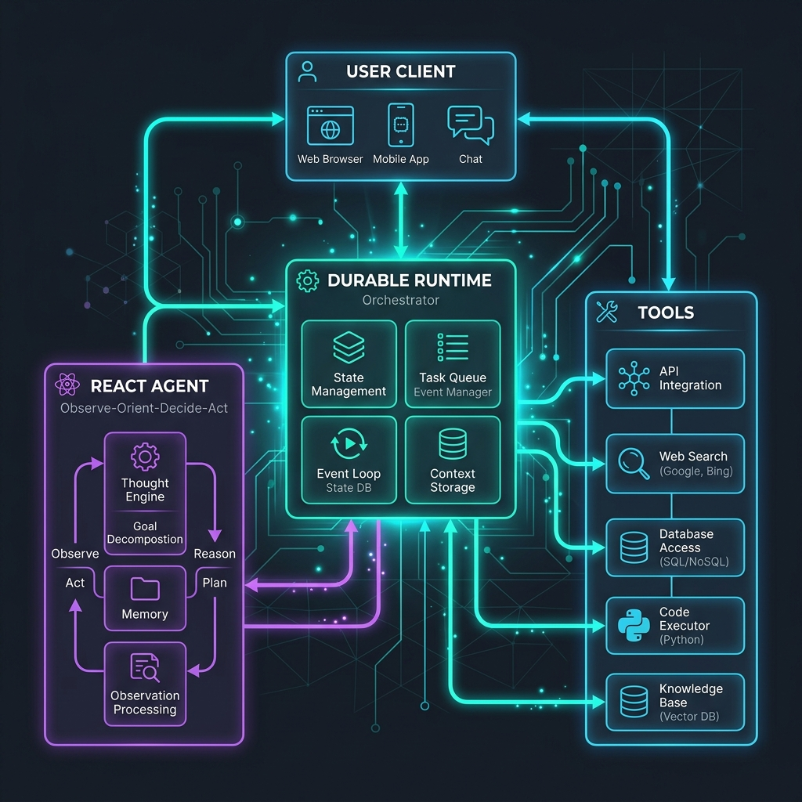
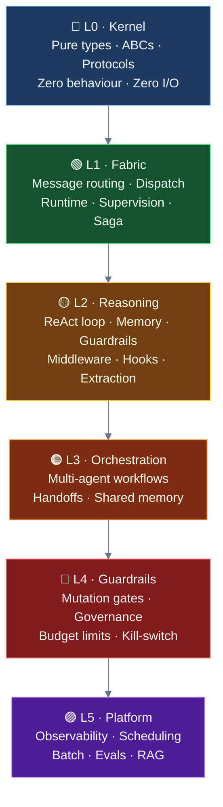

---
hide:
    - navigation
    - toc
---
# Ravi Agent Framework

You want to build an AI agent. Not a chatbot that wraps a single API call, but a real one — one that can call tools, remember what it said three conversations ago, wait for a human to approve a sensitive action, recover from crashes, and scale across workers when you need it to.

That is what Ravi is for.

<div class="grid cards" markdown>

-   :material-rocket-launch-outline: **Start in 5 minutes**

    ---

    Install the framework, create your first agent, run it against an OpenAI model, and understand what the runtime is doing behind the scenes.

    [:octicons-arrow-right-24: Getting Started](getting-started/index.md)

-   :material-layers-outline: **Understand the architecture**

    ---

    Six clean layers, each building on the one below. The kernel defines contracts. The fabric routes messages. Reasoning runs the ReAct loop. Orchestration coordinates fleets.

    [:octicons-arrow-right-24: Layered Architecture](framework/layered-architecture.md)

-   :material-tools: **Build with tools and HITL**

    ---

    Add custom tools, wire up human-in-the-loop approvals, and connect MCP servers using the same patterns the built-in tools follow.

    [:octicons-arrow-right-24: Tutorials](tutorials/index.md)

-   :material-database-clock-outline: **Ship durable agents**

    ---

    Move from an in-process agent to a runtime-backed deployment where every step is checkpointed and resumable after a crash.

    [:octicons-arrow-right-24: Durable Runtime](concepts/durable-runtime.md)

-   :material-chart-line: **Operate in production**

    ---

    Run locally, deploy with Docker or Kind, and inspect structured logs, distributed traces, and metrics with the built-in observability stack.

    [:octicons-arrow-right-24: Operate](operate/index.md)

</div>

---

## The story in one picture

Every request follows the same path — from a client request, through the durable runtime queue, executing the ReAct loop, calling tools, and returning the result.



The key insight: the caller never holds a reference to the agent. It sends a message to an address (`AgentId`). The runtime delivers it. Whether the agent is in the same process, a remote gRPC node, or a Kubernetes pod does not change the call site.

---

## Developer journey

1. Read [Installation](getting-started/installation.md) and run [Quickstart](getting-started/quickstart.md) — you will have a working agent in under ten minutes.
2. Understand why the actor model matters in [Agent Lifecycle](concepts/agent-lifecycle.md) and [Streaming and Events](concepts/streaming-and-events.md).
3. Extend the system with [Create a Tool](tutorials/create-tool.md) and [Connect MCP Tools](tutorials/mcp-tools.md).
4. Read [The Kernel](kernel/index.md) when you are ready to understand the contracts everything is built on.
5. Move to the durable flow in [First Durable Run](getting-started/first-runtime.md) and [Local and Kind](deploy/local-and-kind.md).
6. Use [Observability](operate/observability.md) and [Runbook](operate/runbook.md) when debugging in production.

---

## Installation

=== "uv (recommended)"

    ```bash
    git clone https://github.com/Ravikumarchavva/ravi.git
    cd ravi/ravi-engine
    uv sync
    ```

=== "with extras"

    ```bash
    # Notebook support
    uv sync --group notebooks

    # Browser automation (WebSurferTool)
    uv sync --group browser

    # S3 / object storage
    uv sync --group storage
    ```

---

## Your first agent

```python
import asyncio
from ravi.config import settings
from ravi.agents import ReActAgent, Runtime
from ravi.agents.context import ContextConfig, InMemoryHistoryProvider
from ravi.integrations.llm import LLMFactory
from ravi.capabilities.tools import CalculatorTool


async def main() -> None:
    # 1. Initialize the LLM client
    model = LLMFactory(settings.CHAT_MODEL, settings.OPENAI_API_KEY).build()

    # 2. Construct the agent with custom capabilities and tools
    agent = ReActAgent(
        "helper",
        model=model,
        tools=[CalculatorTool()],
        context=ContextConfig(InMemoryHistoryProvider()),
        system_instructions="You are a helpful assistant.",
    )

    # 3. Start the runtime, register the agent, and run the interactive console
    async with Runtime() as rt:
        await rt.register(agent)
        
        # 4. Use the built-in Console REPL to talk to the agent
        from ravi.console import Console
        console = Console(agent, runtime=rt)
        await console.interactive(stream=True)


if __name__ == "__main__":
    asyncio.run(main())
```

The shape stays the same whether you add tools, guardrails, streaming, HITL approvals, or swap in a distributed runtime. The call site does not change — only the configuration does.

---

## Architecture at a glance



Higher layers may import from lower ones. The reverse is never allowed. `uv run lint-imports` enforces this in CI.

---

## Features

- Actor-model agents — every agent has an address, receives messages, and communicates only through the runtime.
- Human-in-the-loop approvals and structured human input flows, pausable and resumable.
- Tool calling with JSON-schema validation, risk tiers, and MCP server integration.
- Async-first across agents, tools, memory, and every service boundary.
- Streaming responses and event-driven UI updates over SSE.
- Built-in observability: structured logs, OpenTelemetry traces, Grafana dashboards.
- Multiple deployment paths: local monolith, Docker Compose, and Kind/Kubernetes.
- Example notebooks covering foundations, memory, MCP tools, safety, runtime, and observability.

---

## Examples

Explore the [`examples/`](https://github.com/Ravikumarchavva/ravi/tree/main/ravi-engine/examples) folder for notebooks covering everything from a single-tool agent to Kubernetes deployments.

For architecture deep-dives and the full kernel contract reference, see [The Kernel](kernel/index.md) and [Layered Architecture](framework/layered-architecture.md).
