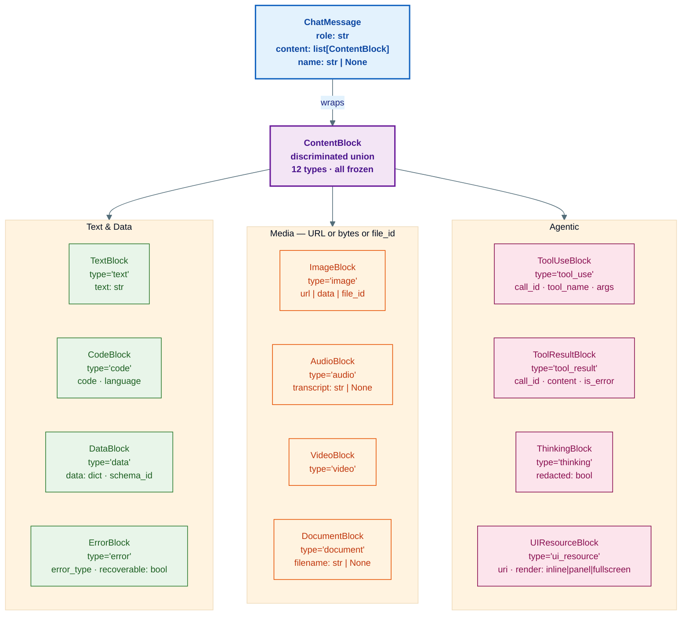
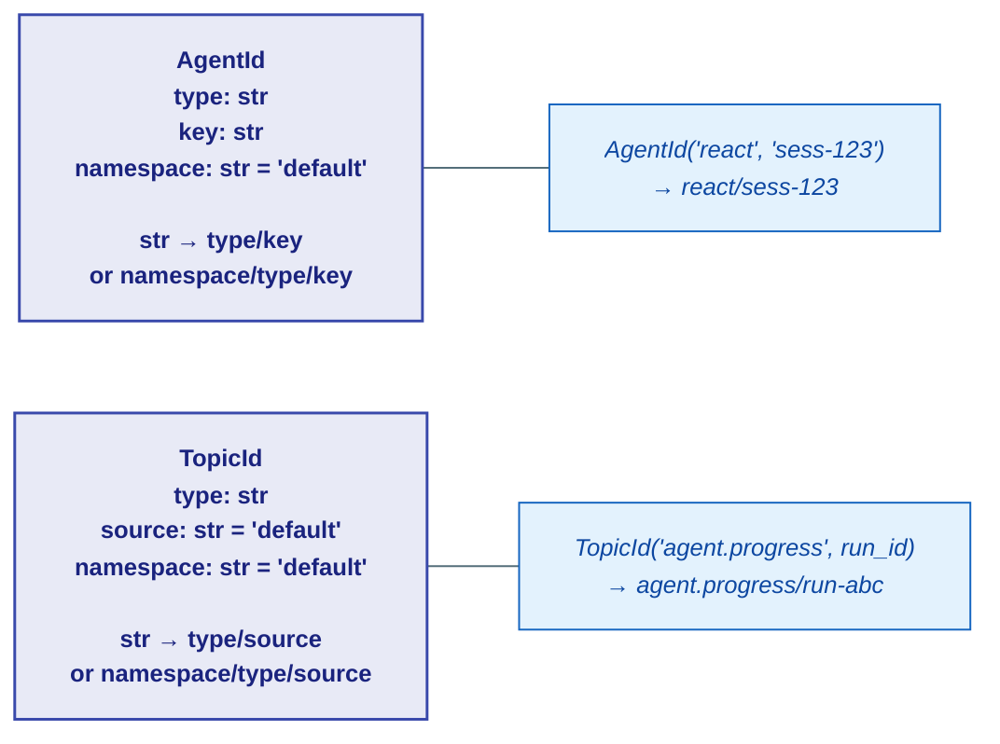
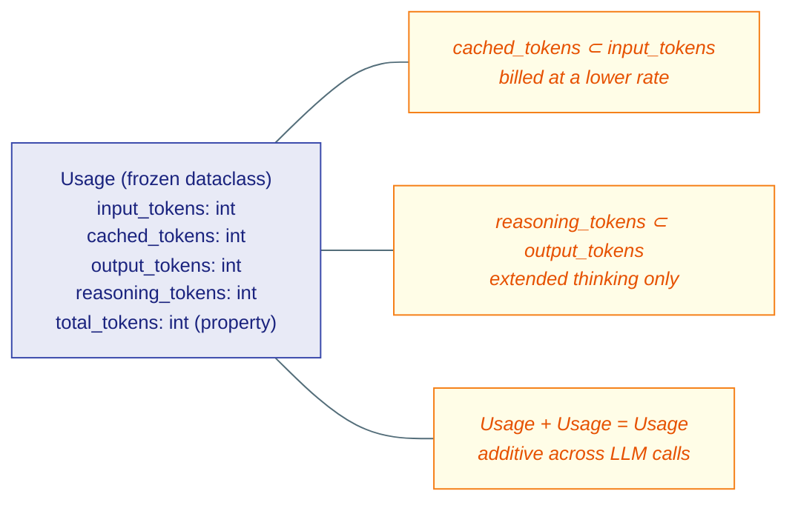

# core/ — The Universal Primitives

> **Source:** `kernel/core/content.py` · `kernel/core/identity.py` · `kernel/core/usage.py` · `kernel/core/errors.py`

Every agent message, every tool result, and every event payload in the entire system is built from these four files. Nothing in the kernel imports from outside `core/` except within `core/` itself.

---

## ContentBlock — The Universal Payload Primitive

Every list of data passed between agents, to the LLM, and back from tools is a `list[ContentBlock]`. There is no other payload type. The `type` literal field is the discriminator — Pydantic routes deserialization automatically.

### Key points

- **All blocks are frozen Pydantic models.** They are immutable once created.
- **`ToolResultBlock.content` is itself a `list[ContentBlock]`** — a tool can return images, code, data, errors, or any mix.
- **`ThinkingBlock`** stores extended chain-of-thought from Anthropic extended thinking. The `redacted` flag lets the UI hide raw reasoning from users.
- **`UIResourceBlock`** is the narrow waist for interactive UIs. A tool emits a `ui://name` URI; `ravi-ui` renders it as a sandboxed iframe. The LLM only sees `text` — never the iframe.
- **`ErrorBlock`** over `TextBlock` — use `ErrorBlock` when a tool fails so consumers can detect errors programmatically without string-matching.
- **`register_block_type(cls)`** extends the discriminator registry for custom block types. Call once at module load time.
- **`content_block_from_dict(data)`** deserializes raw dicts. Unknown `type` values become `UnknownBlock` — no data loss in mixed-version deployments.

---

## AgentId and TopicId — Routing Addresses

`AgentId` is the **point-to-point** routing key — send a message to one specific agent instance.

`TopicId` is the **pub/sub** routing key — emit on a topic; every follower gets the message.

Standard topic conventions (enforced at L1, not kernel):

| Topic | Purpose |
|---|---|
| `agent.progress / {run_id}` | All progress events for one run tree — one subscription covers the whole tree |
| `agent.stream / {agent_id.key}` | Token stream from one specific agent |

---

## Usage — Token Accounting

`Usage` is additive (`a + b` works). Every `LLMResponse` carries one. The L1 `ExecutionTracker` accumulates them to enforce `ExecutionBudget.max_tokens`.

---

## KernelErrors — Typed Runtime Failures

```mermaid
%%{init: {'theme': 'base', 'themeVariables': {'primaryColor': '#FFEBEE','primaryBorderColor': '#C62828','primaryTextColor': '#B71C1C','lineColor': '#C62828','background': '#FAFAFA','fontSize': '13px'}}}%%
graph TB
    classDef base fill:#FFEBEE,stroke:#C62828,stroke-width:2px,color:#B71C1C,font-weight:bold
    classDef err fill:#FFF3E0,stroke:#E65100,stroke-width:1px,color:#BF360C
    classDef policy fill:#FCE4EC,stroke:#880E4F,stroke-width:1px,color:#880E4F
    classDef concur fill:#F3E5F5,stroke:#6A1B9A,stroke-width:1px,color:#4A148C

    KE["KernelError\n(base — catch-all)"]:::base

    ANF["AgentNotFoundError\nSent to unregistered AgentId\n+ agent_id: AgentId"]:::err
    HE["HandlerError\nMessage handler raised internally\n+ cause: Exception"]:::err
    ACE["AgentCrashError\nUnexpected run failure\n+ run_id · agent_id"]:::err
    BEE["BudgetExhaustedError\nHeadcount or token limit hit"]:::policy
    MT["MiddlewareTermination\nIntentional policy halt\n(guardrail, rate limit)\n+ message: str"]:::policy
    CE["CancellationError\nCooperative cancel or deadline"]:::policy
    CAE["ConcurrentAppendError\nTwo workers wrote same run\n+ expected_seq · actual_seq"]:::concur
    SD["SpawnDenied\nSpawnBudget exhausted\n+ parent_run · budget"]:::concur

    KE --> ANF
    KE --> HE
    KE --> ACE
    KE --> BEE
    KE --> MT
    KE --> CE
    KE --> CAE
    KE --> SD
```

`AgentCrashError` — the orchestrator catches this, consults the retry policy, and re-dispatches the crashed agent from the last checkpoint.

`MiddlewareTermination` vs `AgentCrashError` — termination is **intentional** (policy blocked the run); crash is **unexpected** (agent code threw).

`ConcurrentAppendError` — two workers tried to write to the same `EventLog` simultaneously. Callers reload `last_seq` and retry. This fences concurrent writes without a distributed lock.
