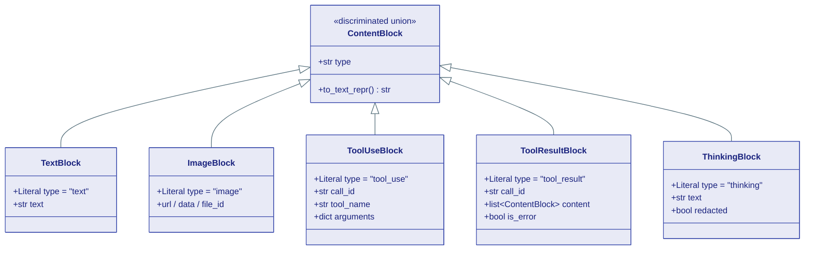
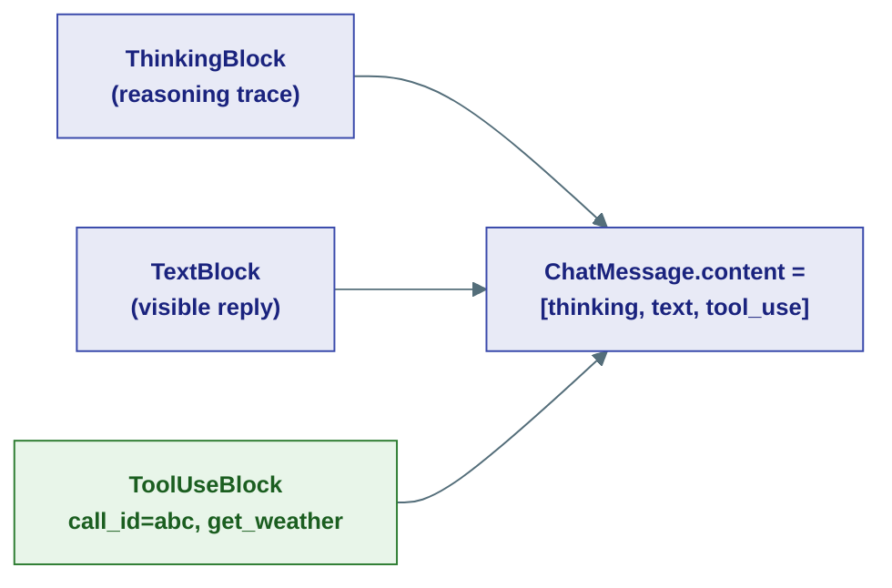
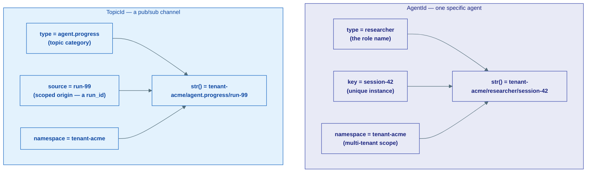
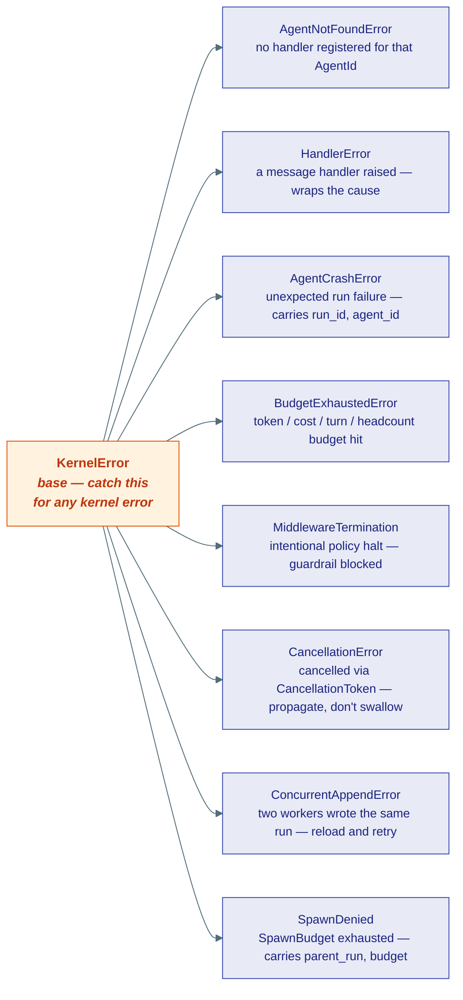

# Core Primitives

## What this is

Before an agent can think, talk, or remember anything, the framework needs a few
tiny, boring data shapes that *everything else* is built out of: how to hold a
piece of a message, how to address an agent, how to count tokens, how to name a
failure. These shapes live in the **kernel** (layer L0) — the frozen core. They
are pure data: Python `dataclass`es, Pydantic models, and enums. No network, no
disk, no I/O. Just the vocabulary the rest of the framework speaks in.

This page teaches that vocabulary. Five ideas, one at a time:

1. **ContentBlock** — the lego brick a message is made of.
2. **ChatMessage** + **Role** — one turn of a conversation.
3. **AgentId** / **TopicId** — postal addresses for routing.
4. **Usage** — the token meter.
5. **Errors** — the family tree of things that can go wrong.

!!! note "Why a 'frozen' core?"
    The kernel is deliberately small and never imports anything from the layers
    above it. Because these types are stable and dependency-free, every other
    layer — agents, tools, LLM providers, storage — can rely on them without
    pulling in heavy machinery. Think of it as the alphabet: everyone agrees on
    the letters before anyone writes a sentence.

---

## 1. ContentBlock — the lego brick of a message

**Plain English:** a `ContentBlock` is the smallest self-contained piece of a
message. One block holds *one kind of thing* — some text, or an image, or a
request to call a tool, or the result of that tool.

**Analogy:** content blocks are **lego bricks**. A message isn't a single
molded object; it's a *list of bricks* snapped together. A reply from the model
might be `[a thinking brick, a text brick, a tool-call brick]`. Each brick knows
what it is.

A block is **multimodal-ready** and **self-describing**: every block carries a
`type` field (a fixed string literal like `"text"` or `"image"`) so code can
tell the bricks apart. This collection of brick types forms a *discriminated
union* — a fancy term meaning "one of these N classes, and the `type` field
tells you which."



### The full set of bricks

There are twelve block types in the curated union. Here is the whole drawer:

| Block | `type` | What it holds | Key fields |
|---|---|---|---|
| `TextBlock` | `"text"` | Plain text | `text` |
| `CodeBlock` | `"code"` | Language-tagged source code | `code`, `language` |
| `DataBlock` | `"data"` | Structured JSON (rich tool output) | `data`, `schema_id` |
| `ErrorBlock` | `"error"` | A typed error (use instead of text when a tool fails) | `error_type`, `message`, `details`, `recoverable` |
| `ImageBlock` | `"image"` | An image | one of `url` / `data` / `file_id`, `media_type` |
| `AudioBlock` | `"audio"` | Audio (with optional transcript) | `url` / `data`, `media_type`, `transcript` |
| `VideoBlock` | `"video"` | Video | `url` / `data`, `media_type` |
| `DocumentBlock` | `"document"` | A document (e.g. a PDF) | one of `url` / `data` / `file_id`, `media_type`, `filename` |
| `ToolUseBlock` | `"tool_use"` | A request to call a tool | `call_id`, `tool_name`, `arguments` |
| `ToolResultBlock` | `"tool_result"` | The result of a tool call (itself a list of blocks) | `call_id`, `name`, `content`, `is_error` |
| `ThinkingBlock` | `"thinking"` | The model's reasoning / chain-of-thought | `text`, `redacted` |
| `UIResourceBlock` | `"ui_resource"` | An interactive UI to render in a sandboxed iframe | `uri`, `structured_content`, `text`, `render` |

There is also one special non-union brick:

- **`UnknownBlock`** (`type="unknown"`) — a *lossless carrier*. When the framework
  reads a block whose `type` it doesn't recognize (e.g. a newer service produced
  it), it wraps the raw payload in `UnknownBlock` instead of throwing it away.
  This keeps mixed-version deployments from silently corrupting data.

!!! warning "Only `TextBlock` has `.text` — you MUST check the type"
    This trips up everyone once. The bricks do **not** share a `.text`
    attribute. `TextBlock` has `.text`, but `ImageBlock` has `.url`,
    `ToolUseBlock` has `.tool_name`, and so on. You **cannot** loop over a
    message's content and read `block.text` — that will crash on the first
    image. Always narrow the type first with `isinstance`:

    ```python
    from ravi.kernel.core.content import TextBlock

    texts = [b.text for b in message.content if isinstance(b, TextBlock)]
    ```

    (`ThinkingBlock` and the `text` *fallback* field on `UIResourceBlock` also
    happen to carry text, but they are different fields with different meaning —
    don't assume.)

!!! tip "Every block can render itself: `to_text_repr()`"
    Each block knows how to describe itself as a string via `to_text_repr()`.
    `TextBlock` returns its text verbatim; `ImageBlock` returns something like
    `[Image: https://…]`. The helper `content_blocks_to_str(blocks)` joins these
    for a quick, safe, human-readable dump of *any* mix of blocks — no
    `isinstance` dance required.

### How bricks compose into a message

A whole agent message, tool result, or pub/sub event carries a
`list[ContentBlock]`. The model's turn flows in, blocks get appended, and the
result is one ordered list:



### The contract (trimmed)

```python
class TextBlock(BaseModel):
    type: Literal["text"] = "text"
    text: str
    model_config = {"frozen": True}
    def to_text_repr(self) -> str: ...

class ToolUseBlock(BaseModel):
    type: Literal["tool_use"] = "tool_use"
    call_id: str
    tool_name: str
    arguments: JsonObject = Field(default_factory=dict)

class ToolResultBlock(BaseModel):
    type: Literal["tool_result"] = "tool_result"
    call_id: str
    name: str = ""
    content: list["ContentBlock"] = Field(default_factory=list)  # nested blocks!
    is_error: bool = False

# The union itself — discriminated on the `type` field
ContentBlock = Annotated[
    TextBlock | ImageBlock | AudioBlock | VideoBlock | DocumentBlock
    | DataBlock | CodeBlock | ErrorBlock | ToolUseBlock | ToolResultBlock
    | ThinkingBlock | UIResourceBlock,
    Field(discriminator="type"),
]
```

!!! note "Blocks are frozen and serializable"
    Every block is an immutable (`frozen=True`) Pydantic model. To turn one into
    JSON, call `block.model_dump(mode="json")`; to read one back, call
    `content_block_from_dict(data)` (which returns an `UnknownBlock` for
    unrecognized types instead of crashing). Binary media (`bytes`) is encoded as
    **base64** in JSON automatically. A `ToolResultBlock` can even nest *more*
    blocks inside its `content`, so a tool can return text + an image + a chart in
    one result.

---

## 2. ChatMessage + Role — one turn of a conversation

**Plain English:** a `ChatMessage` is a single turn in a conversation, tagged
with *who* said it and carrying a list of content blocks for *what* they said.

**Analogy:** if blocks are lego bricks, a `ChatMessage` is **one assembled lego
model with a name tag on it** — "this was built by the user", "this was built by
the assistant".

The "who" is the `role`, drawn from the `Role` enum:

| Role | Value | Who is speaking |
|---|---|---|
| `Role.SYSTEM` | `"system"` | The setup / instructions for the agent |
| `Role.USER` | `"user"` | The human (or upstream caller) |
| `Role.ASSISTANT` | `"assistant"` | The model / agent |
| `Role.TOOL` | `"tool"` | The output of a tool call |

```python
class Role(StrEnum):
    SYSTEM = "system"
    USER = "user"
    ASSISTANT = "assistant"
    TOOL = "tool"

class ChatMessage(BaseModel):
    role: str                                # follows Role, but accepts any string
    content: list["ContentBlock"] = Field(default_factory=list)
    name: str | None = None                  # which participant, for multi-agent
    metadata: dict[str, Any] = Field(default_factory=dict)
    model_config = {"frozen": True}
```

!!! tip "`Role` is a `StrEnum` — strings just work"
    Because `Role` subclasses `str`, you can write `Role.USER` *or* the plain
    string `"user"` interchangeably. `msg.role == "user"` is `True` when the role
    is `Role.USER`. The enum exists so the codebase spells these four strings
    consistently, but it never forces you to import it.

The `name` field identifies *which* participant spoke in a multi-agent
conversation (an agent's name, a user handle) — useful for attribution and
routing when more than two parties are in the room.

---

## 3. AgentId & TopicId — addresses for routing

**Plain English:** these are the *addresses* the framework uses to know where to
deliver a message. An `AgentId` points at one specific agent instance. A
`TopicId` points at a pub/sub channel many subscribers can listen to.

**Analogy:** an `AgentId` is a **postal address for one mailbox** (this exact
agent). A `TopicId` is a **radio frequency** — anyone tuned in hears what's
broadcast.

Both are built the same way: a `type` (a category) plus a key, and a
`namespace` that keeps different tenants from colliding on shared infrastructure.



### AgentId — addressing one agent

```python
@dataclass(frozen=True, slots=True)
class AgentId:
    type: str                 # the agent's role name, e.g. "researcher"
    key: str                  # unique instance id within that type
    namespace: str = "default"

    def __str__(self) -> str:
        # "type/key", or "namespace/type/key" when not default
        ...

    @classmethod
    def generate(cls, agent_type: str, *, namespace: str = "default") -> AgentId:
        ...  # key becomes a random uuid4 hex
```

- `type` is the *role name* — what kind of agent this is.
- `key` uniquely identifies *this instance* within that type (a session id, or a
  generated UUID via `AgentId.generate("researcher")`).
- `namespace` (default `"default"`) scopes the agent to one tenant so two
  tenants can both have a `researcher/session-1` without their messages crossing
  wires on shared infra like Redis pub/sub.

### TopicId — addressing a channel

```python
@dataclass(frozen=True, slots=True)
class TopicId:
    type: str                 # topic category, e.g. "agent.progress"
    source: str = "default"   # origin scope — a run_id, session, pipeline
    namespace: str = "default"
```

`TopicId` is the same idea for broadcasts: `type` is the *category* of event,
and `source` scopes it to a particular origin. The standard conventions are:

- `agent.progress / <run_id>` — all progress events for one execution run.
- `agent.stream / <run_id>` — the token stream for a specific run.

!!! note "Why frozen dataclasses with `slots=True`?"
    Both ids are immutable (`frozen=True`) so they can be safely used as
    dictionary keys and set members — exactly what a routing table needs.
    `slots=True` makes them memory-light, which matters when the system tracks
    thousands of them. Their `__str__` gives a stable, human-readable address you
    can log or use as a topic string.

---

## 4. Usage — the token meter

**Plain English:** `Usage` is the receipt for a single LLM call — how many tokens
went in, how many came out, and two special sub-counts that let you compute cost
accurately.

**Analogy:** it's the **itemized utility bill** for one model call. The total
matters, but the line items (cached, reasoning) are billed at different rates.

!!! warning "The fields are input/output — NOT prompt/completion"
    Many SDKs say `prompt_tokens` / `completion_tokens`. Ravi does **not**. The
    kernel names are `input_tokens` and `output_tokens`. Code expecting
    `prompt_tokens` will not find it here.

| Field | Meaning |
|---|---|
| `input_tokens` | Tokens sent *to* the model (the prompt). |
| `output_tokens` | Tokens generated *by* the model (the reply). |
| `cached_tokens` | Subset of `input_tokens` served from the provider's prompt cache (billed cheaper). Already counted inside `input_tokens`. |
| `reasoning_tokens` | Subset of `output_tokens` spent on extended thinking / chain-of-thought. Already counted inside `output_tokens`. |

The two "cached" and "reasoning" counts are **broken out, not added on top** —
they are slices of input and output respectively, exposed so you can attribute
cost precisely (cache reads are cheaper; reasoning tokens are part of output).

```python
@dataclass(frozen=True, slots=True)
class Usage:
    input_tokens: int = 0
    cached_tokens: int = 0       # subset of input_tokens (provider prompt cache)
    output_tokens: int = 0
    reasoning_tokens: int = 0    # subset of output_tokens (extended thinking)

    @property
    def total_tokens(self) -> int:
        return self.input_tokens + self.output_tokens   # NOT cached/reasoning

    def __add__(self, other: "Usage") -> "Usage":
        ...   # field-wise sum
```

!!! tip "Usage adds up across calls"
    `Usage` defines `__add__`, so you can fold the cost of a whole multi-step run
    into one total with plain arithmetic:

    ```python
    total = Usage()
    for step in run_steps:
        total = total + step.usage
    print(total.total_tokens)   # input + output across every call
    ```

    Note `total_tokens` is `input + output` only — `cached` and `reasoning` are
    *already inside* those, so adding them again would double-count.

---

## 5. Errors — the family tree of failures

**Plain English:** when something goes wrong inside the runtime, it raises a
*typed* error — a specific class, not a vague exception — so callers can catch
exactly the failure they care about.

**Analogy:** it's a **family tree**. Everything descends from one ancestor,
`KernelError`. Catch the ancestor to catch the whole family; catch a specific
descendant to handle just that one case.



| Error | Raised when | Carries |
|---|---|---|
| `KernelError` | Base class — never raised directly; catch it to intercept *any* kernel error. | — |
| `AgentNotFoundError` | You send to an `AgentId` that has no registered handler. | `agent_id` |
| `HandlerError` | A message handler itself raised — wrapped so you get a typed error, not a bare exception. | `cause` |
| `AgentCrashError` | An agent's run fails with an unexpected exception. The orchestrator catches it, consults the retry policy, and resumes from the last checkpoint. | `run_id`, `agent_id` |
| `BudgetExhaustedError` | A headcount or token/cost/turn budget is exhausted — stops runaway agent trees. | — |
| `MiddlewareTermination` | Middleware *intentionally* halts the run (a guardrail blocked the request, a rate limit tripped). The loop turns this into a result with `status="guardrail_tripped"`. | `message` |
| `CancellationError` | An operation is cancelled via a `CancellationToken`. Propagate it — don't swallow it. | — |
| `ConcurrentAppendError` | Two workers tried to append to the same run's event log at once (optimistic-concurrency clash). Reload and retry. | `run_id`, `expected_seq`, `actual_seq` |
| `SpawnDenied` | A `Supervisor.spawn` is refused because the root run's `SpawnBudget` is exhausted. | `parent_run`, `budget` |

!!! tip "Crash vs. intentional halt — two very different errors"
    `AgentCrashError` means *something broke unexpectedly* — the orchestrator may
    retry it. `MiddlewareTermination` means *we chose to stop* — a guardrail or
    policy halted the run on purpose, and it surfaces as a clean
    `guardrail_tripped` result, not a retry. Don't conflate them.

```python
class KernelError(Exception):
    """Base class for all ravi kernel errors."""

class AgentCrashError(KernelError):
    def __init__(self, message: str, *, run_id: str, agent_id: AgentId) -> None:
        super().__init__(message)
        self.run_id = run_id
        self.agent_id = agent_id

class ConcurrentAppendError(KernelError):
    def __init__(
        self, message: str, *, run_id: str, expected_seq: int, actual_seq: int
    ) -> None:
        super().__init__(message)
        self.run_id = run_id
        self.expected_seq = expected_seq
        self.actual_seq = actual_seq
```

---

## Where this lives

| Concept | Source file |
|---|---|
| `Role`, `ContentBlock` union, all block types, `ChatMessage`, helpers (`content_block_from_dict`, `content_blocks_to_str`, `register_block_type`) | `kernel/core/content.py` |
| `AgentId`, `TopicId` | `kernel/core/identity.py` |
| `Usage` | `kernel/core/usage.py` |
| `KernelError` and the full error hierarchy | `kernel/core/errors.py` |

**Next:** [The LLM Contract](02-llm.md) — how these primitives flow into and out
of a model: the `LLMClient` Protocol that takes `list[ChatMessage]`, streams back
`ContentBlock`s, and reports `Usage`.
