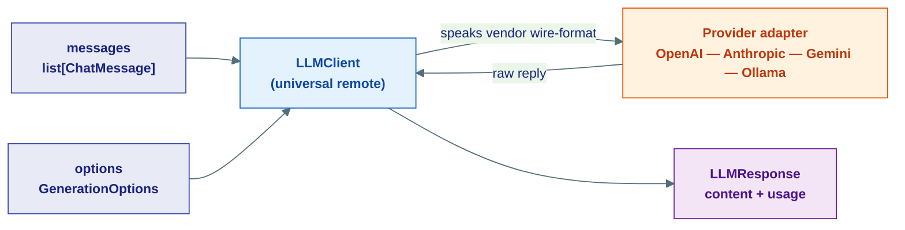
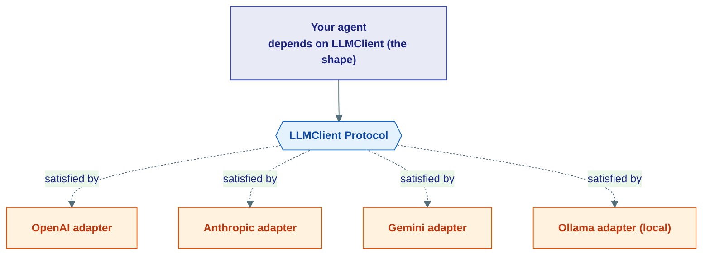
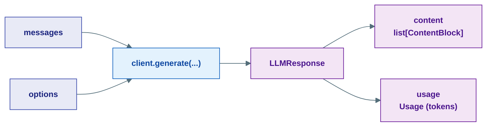
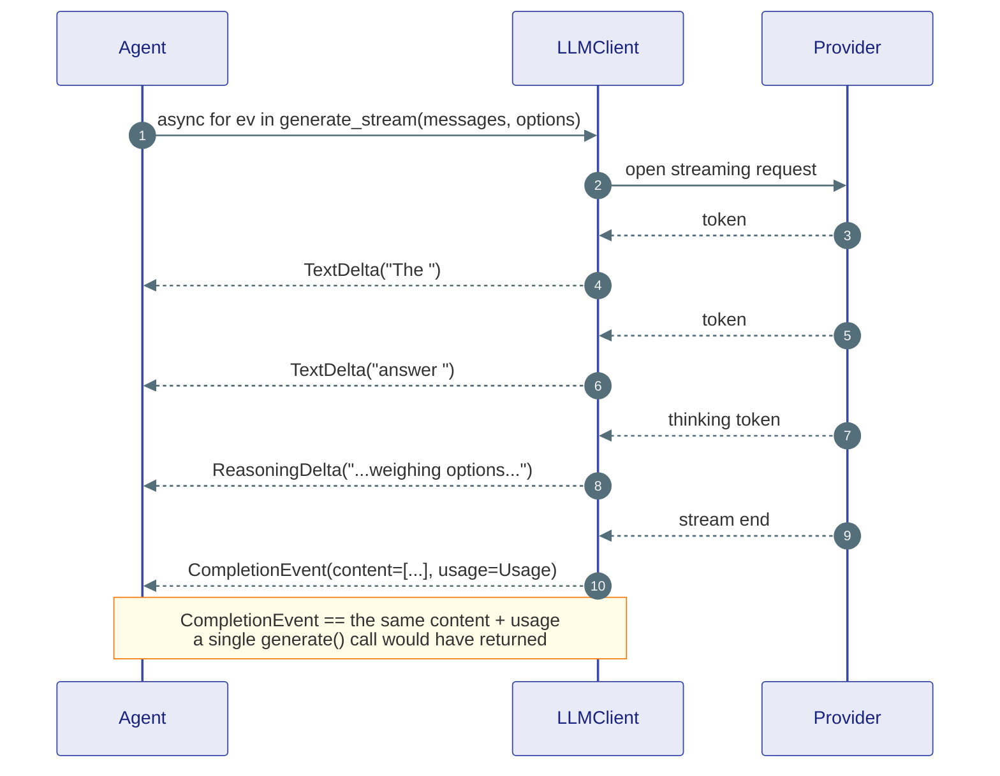
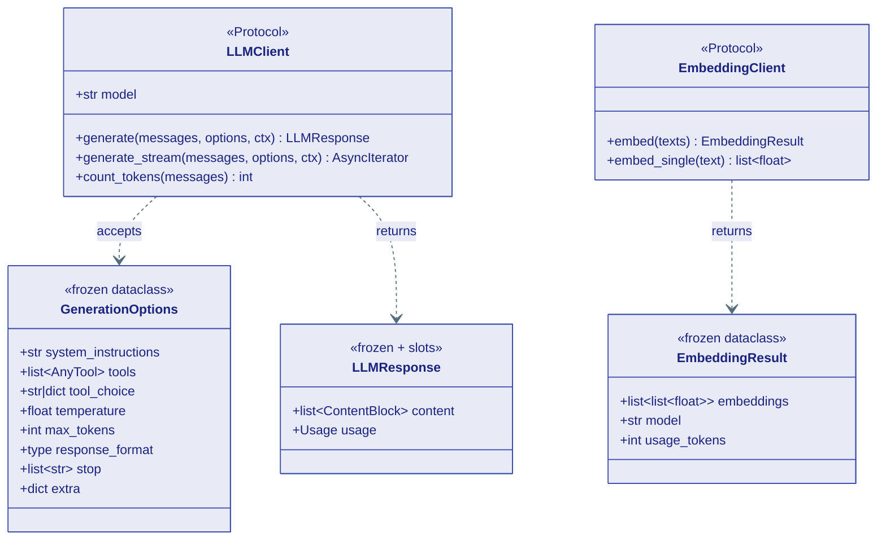

# The LLM Contract

## What this is, in one line

This is the kernel's promise about **how an agent talks to a language model** — a single, provider-agnostic shape that every model adapter (OpenAI, Anthropic, Gemini, Ollama) must fit into.

!!! note "The analogy: a universal remote"
    `LLMClient` is a **universal remote control**. The buttons are always the same — *play*, *volume*, *power*. It does not care whether the TV behind it is a Sony, an LG, or a Samsung. Swap the TV, keep the remote.

    In Ravi, the "buttons" are `generate()` and `generate_stream()`. The "TV brand" is the provider. Your agent only ever presses the buttons — it never learns which brand is plugged in. That is why you can switch from GPT to Claude to a local Llama without touching a single line of agent code.

Everything on this page lives in `kernel/llm/llm.py`. The kernel is **frozen**: it defines *only* the contract (Python `Protocol`s and `dataclass`es), with **zero I/O**. The real network calls live one layer down, in adapters that *implement* this contract.

---

## The big picture

You hand the model a **list of messages** plus a bag of **options**. You get back **one response** (content + token usage). That is the whole loop.



The adapter does the dirty work of translating Ravi's neutral types into each vendor's wire format and back. The agent above it never sees that translation.

---

## The `LLMClient` Protocol

A **Protocol** is a shape, not a base class. Any object that has these methods *is* an `LLMClient` — no inheritance required. That is how a brand-new provider plugs in: implement the shape, and you are done.

Here is the contract, trimmed to its essence:

```python
class LLMClient(Protocol):
    """Contract every LLM provider adapter must satisfy."""

    model: str  # which model this client speaks to, e.g. "gpt-4o"

    async def generate(
        self,
        messages: list[ChatMessage],
        *,
        options: GenerationOptions = GenerationOptions(),
        ctx: RunMeta | None = None,
    ) -> LLMResponse: ...

    def generate_stream(
        self,
        messages: list[ChatMessage],
        *,
        options: GenerationOptions = GenerationOptions(),
        ctx: RunMeta | None = None,
    ) -> AsyncIterator[TextDelta | ReasoningDelta | CompletionEvent]: ...

    async def count_tokens(self, messages: list[ChatMessage]) -> int: ...
```

Three things to notice:

- **`model`** is a plain attribute — a string naming the model the client is wired to (`"gpt-4o"`, `"claude-sonnet-4"`, `"llama3.2"`). Reading it tells you *who is on the other end of the remote*.
- **`messages`** is always a `list[ChatMessage]`. A `ChatMessage` is a role-tagged turn (`system` / `user` / `assistant` / `tool`) carrying multimodal `ContentBlock`s — text, images, tool calls, and more. (See the core content types for the full block list — we just *use* them here.)
- **`ctx`** is optional run metadata (`RunMeta`) carrying the **cancellation token and deadline**. A well-behaved adapter calls `ctx.check()` before its first network call and respects `ctx.is_expired()` between streamed chunks, so a cancelled run stops promptly instead of burning tokens.

!!! tip "Why a contract instead of `**kwargs`?"
    Hand-rolled adapters love to invent their own parameter names — one calls it `max_tokens`, another `maxOutputTokens`. The Protocol forbids that drift: every implementation accepts the *same* typed `messages`, `options`, and `ctx`. You get autocomplete and type errors at write-time instead of surprises at runtime.

### Swapping providers without touching agent code

Because the agent depends on the **shape**, not the brand, switching models is a one-line change at the wiring site — never inside the agent.



The agent points at the diamond, never at a box. Repoint the wiring at a different box and the agent is none the wiser.

---

## `GenerationOptions` — the knobs

Everything that tunes a call — beyond the messages themselves — lives in one frozen `dataclass` so every provider reads the **same field names**.

| Field | Type | What it does |
|---|---|---|
| `system_instructions` | `str` | The system prompt text. Default `""`. |
| `tools` | `list[AnyTool] \| None` | Tools the model may call. Kept as kernel `Tool` objects — each adapter converts them to its own vendor wire-format internally. |
| `tool_choice` | `str \| dict \| None` | How the model should pick a tool (e.g. force one, or let it decide). |
| `temperature` | `float \| None` | Randomness. Lower = more deterministic. |
| `max_tokens` | `int \| None` | Cap on tokens generated. |
| `response_format` | `type[BaseModel] \| None` | A Pydantic model to coerce the reply into structured output. |
| `stop` | `list[str] \| None` | Strings that, once produced, halt generation. |
| `extra` | `dict` | Escape hatch for provider-specific knobs not modelled above. |

!!! note "`tools` are kernel tools, not vendor JSON"
    You pass plain Ravi `Tool` objects. The adapter is responsible for rewriting them into whatever shape OpenAI / Anthropic / Gemini expects. Same input, every provider.

A call with no options is valid — the default `GenerationOptions()` is a sensible empty bag, which is why the Protocol can use it as a default argument.

---

## `LLMResponse` — what comes back

The return value of `generate()` is small and immutable:

```python
@dataclass(frozen=True, slots=True)
class LLMResponse:
    content: list[ContentBlock]   # the model's reply, as multimodal blocks
    usage: Usage                  # tokens consumed by this call
```

- **`content`** is a `list[ContentBlock]` — the same universal block type used everywhere else in Ravi. The reply may be plain text (`TextBlock`), a reasoning trace (`ThinkingBlock`), a tool request (`ToolUseBlock`), or a mix.
- **`usage`** is a `Usage` record: `input_tokens`, `cached_tokens`, `output_tokens`, and `reasoning_tokens`, plus a `total_tokens` property. Cached and reasoning counts are *broken out* so you can attribute cost accurately (cached prompt tokens are billed cheaper, reasoning tokens come from extended thinking).

!!! warning "`LLMResponse` is frozen AND slotted — you cannot tack on attributes"
    `@dataclass(frozen=True, slots=True)` means two things:

    - **frozen** → you cannot reassign a field after construction (`resp.content = ...` raises `FrozenInstanceError`).
    - **slots** → the object has *no `__dict__`*, so you cannot invent new attributes either (`resp.my_note = "hi"` raises `AttributeError`).

    This is deliberate. A model response is a fact about what happened — it should be a read-only value you can safely pass around, log, and journal without anyone mutating it behind your back. If you need to add information, build a *new* object.

### From inputs to that one response



---

## `generate()` vs `generate_stream()` — two ways to get the answer

Both take the **same** `messages`, `options`, and `ctx`. They differ only in *how the answer arrives*.

| | `generate()` | `generate_stream()` |
|---|---|---|
| Returns | one `LLMResponse` | an async iterator of stream events |
| When you get content | all at once, at the end | token-by-token, as it is produced |
| `await` style | `resp = await client.generate(...)` | `async for ev in client.generate_stream(...):` |
| Best for | batch jobs, tool loops, anything that just needs the final text | live UIs where the user watches the answer appear |
| Carries `Usage` | directly on `LLMResponse` | on the **final** `CompletionEvent` |

!!! tip "`generate_stream` is not awaited"
    It is an async-generator function: a *synchronous* call that returns an `AsyncIterator`. You write `async for event in client.generate_stream(...)` — no `await` in front. The `await` happens implicitly on each iteration.

### How streaming events relate to the final response

`generate_stream()` yields a sequence of small deltas, then one final assembling event:

- **`TextDelta`** — an incremental chunk of visible text.
- **`ReasoningDelta`** — an incremental chunk of the model's thinking trace.
- **`CompletionEvent`** — the last event, carrying the **fully assembled** `content` plus the final `Usage`.

In other words: the deltas are the live commentary, the `CompletionEvent` is the box score. The `content` + `usage` you would have gotten from a single `generate()` call is exactly what the trailing `CompletionEvent` hands you.



!!! note "Delta types are documented next door"
    `TextDelta`, `ReasoningDelta`, and `CompletionEvent` are *messaging* primitives, not LLM primitives — they live in `kernel/messaging/stream.py`. The full field-by-field breakdown is on the [Messaging & Streaming](03-messaging.md) page. Here we only care that the LLM contract knows how to emit them.

---

## `EmbeddingClient` — turning text into vectors

Not every model call generates words. Sometimes you need a **vector** — a list of numbers that captures the *meaning* of a piece of text, so you can compare texts by closeness (the engine behind search and RAG).

!!! note "The analogy: GPS coordinates for meaning"
    An embedding is like a **GPS coordinate for a sentence**. Two sentences that mean almost the same thing land near each other on the map. "How do I reset my password?" and "I forgot my login" end up as neighbours, even though they share no words.

`EmbeddingClient` is the contract for the thing that produces those coordinates:

```python
class EmbeddingClient(Protocol):
    """Contract every embedding provider adapter must satisfy."""

    async def embed(self, texts: list[str]) -> EmbeddingResult: ...

    async def embed_single(self, text: str) -> list[float]: ...
```

- **`embed(texts)`** — batch: turn many strings into many vectors in one call. Returns an `EmbeddingResult` (`embeddings: list[list[float]]`, the `model` used, and `usage_tokens`).
- **`embed_single(text)`** — convenience: one string in, one `list[float]` vector out.

Same Protocol pattern as `LLMClient`: any object with these two methods *is* an embedding client, so a new embedding provider plugs in without changing callers.

---

## How the four pieces fit together



---

## Where this lives

| Piece | Location |
|---|---|
| `LLMClient`, `GenerationOptions`, `LLMResponse` | `kernel/llm/llm.py` |
| `EmbeddingClient`, `EmbeddingResult` | `kernel/llm/llm.py` |
| `ChatMessage`, `ContentBlock` (message/reply payloads) | `kernel/core/content.py` |
| `Usage` (token accounting) | `kernel/core/usage.py` |
| `TextDelta`, `ReasoningDelta`, `CompletionEvent` (stream events) | `kernel/messaging/stream.py` |
| `RunMeta` (cancellation token + deadline) | `kernel/agent/runtime_context.py` |
| Concrete adapters (the real network calls) | `capabilities/llm/` and `integrations/llm/` |

**Next:** [Messaging & Streaming](03-messaging.md) — the delta and event types that flow out of `generate_stream()`, and the progress channel every agent in the tree publishes to.
