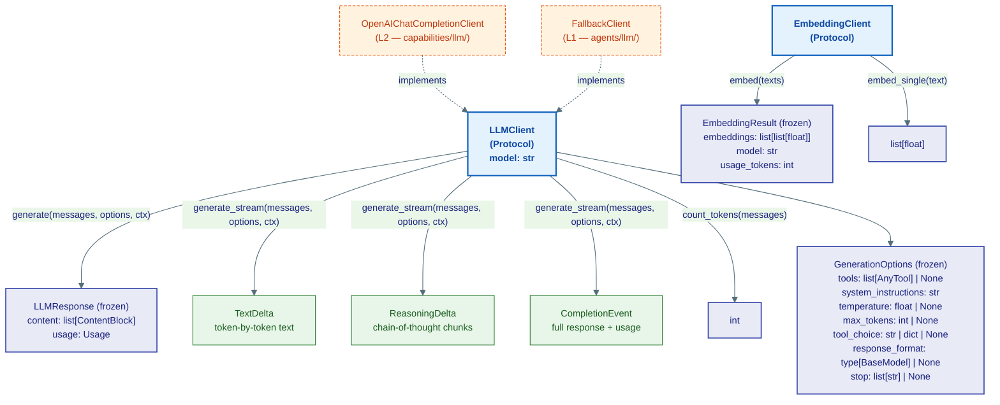
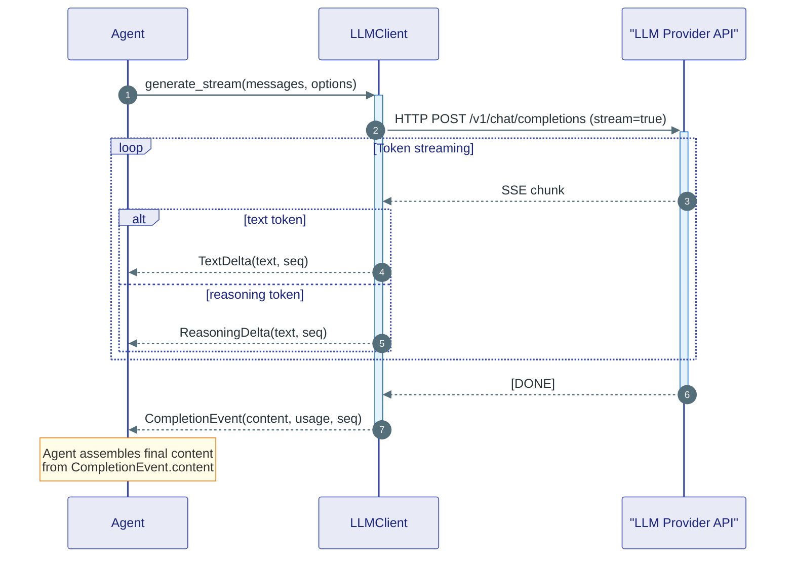

# llm/ — LLM & Embedding Contracts

> **Source:** `kernel/llm/llm.py`

Defines two Protocols: one for text generation, one for embeddings. Every LLM adapter in `integrations/llm/` implements `LLMClient`. The kernel never imports a concrete client — it only defines what every client must look like.

---

## Protocol Overview



---

## Token Stream Events

When `generate_stream` is called, it returns an `AsyncIterator` that yields events in this order:



### Event types

| Event | When | Key fields |
|---|---|---|
| `TextDelta` | Each text token | `text`, `seq`, `run_id`, `agent_id` |
| `ReasoningDelta` | Each thinking token (extended-thinking models only) | `text`, `seq` |
| `CompletionEvent` | End of stream | `content: list[ContentBlock]`, `usage: Usage`, `seq` |

`seq` is strictly increasing within one run. Consumers use it to reorder out-of-order delivery from pub/sub transports.

---

## GenerationOptions — Typed Parameters

`GenerationOptions` replaces `**kwargs` in both `generate` and `generate_stream`. Every implementation agrees on the same parameter names — no silent mismatch possible.

`tools: list[AnyTool]` — the kernel contract. Each LLM adapter converts to its vendor wire format internally (OpenAI `function` objects, Anthropic `tools` array, etc.). The kernel never inspects vendor wire formats.

---

## Concrete Adapters (at L2 and L1)

| Class | Layer | Notes |
|---|---|---|
| `OpenAIChatCompletionClient` | L2 `capabilities/llm/` | Universal `/v1/chat/completions` client — works with OpenAI, Groq, Ollama, any OpenAI-compatible endpoint |
| `FallbackClient` | L1 `agents/llm/` | Wraps multiple `LLMClient` instances; tries each in order on failure |
| `SemanticCache` | L1 `agents/llm/` | Wraps an `LLMClient`; returns cached responses for semantically similar prompts |
| `LLMFactory` | `integrations/llm/` | Auto-detects provider from model name prefix; builds the correct adapter |

Build via `LLMFactory`:

```python
from ravi.integrations.llm import LLMFactory

client = LLMFactory("gpt-4o", api_key).build()                        # OpenAI
client = LLMFactory("anthropic/claude-opus-4-8", api_key).build()     # Anthropic
client = LLMFactory("groq/llama-3.3-70b-versatile", api_key).build()  # Groq
client = LLMFactory("ollama/llama3.2", "ollama").build()               # local
```
