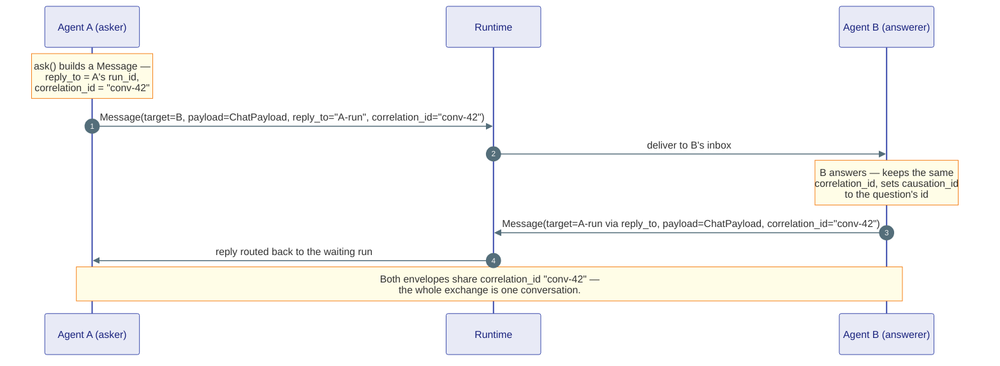
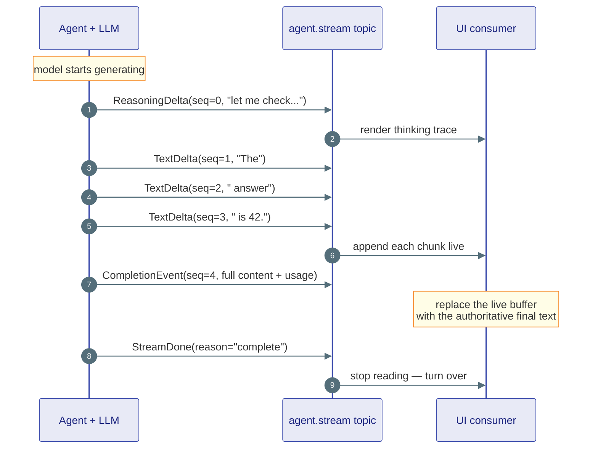

# Messaging

## The one-line version

**Messaging is how agents talk to each other and to the user.** Everything an agent sends — a chat turn, a tool request, a "please pause" signal — is wrapped in a single **envelope** called a `Message`, handed to the runtime, and delivered to a target. Separately, while an agent is *working*, it leaks a live feed of tiny updates (**stream deltas**) so the UI can show typing in real time.

!!! note "Analogy"
    A `Message` is a **postal envelope**: it has an address (`target`), a return address (`sender`), the letter inside (`payload`), and a tracking sticker (`correlation_id`) so every envelope in the same back-and-forth can be grouped together. **Stream deltas** are a **live news ticker** — a fast trickle of half-sentences scrolling by while the full story is still being written, ending with a "— END —" card (`StreamDone`).

This page covers three things, all pure data types with **zero I/O**:

1. The **Message envelope** and its **payloads** — durable, routable, one per turn.
2. **Streaming deltas** — ephemeral, real-time, many per turn.
3. The **Event envelope** — the versioned wire format both buses share.

---

## 1. The Message envelope

A **Message** is the unit of agent-to-agent communication. Every send or publish wraps a payload in one. The runtime reads the address, delivers it, and (for a direct send) returns the recipient's reply.

```mermaid
%%{init: {'theme': 'base', 'themeVariables': {'primaryColor': '#E8EAF6','primaryTextColor': '#1A237E','primaryBorderColor': '#3949AB','lineColor': '#546E7A','fontSize': '13px'}}}%%
flowchart TB
    classDef agent   fill:#E8EAF6,stroke:#3949AB,color:#1A237E,font-weight:bold
    classDef runtime fill:#E3F2FD,stroke:#1565C0,color:#0D47A1
    classDef tool    fill:#E8F5E9,stroke:#2E7D32,color:#1B5E20
    classDef external fill:#FFF3E0,stroke:#E65100,color:#BF360C

    MSG["Message — the envelope"]:::agent

    MSG --> T["target<br/>(AgentId or TopicId)<br/>where it goes"]:::runtime
    MSG --> S["sender<br/>(AgentId or None)<br/>return address"]:::runtime
    MSG --> P["payload<br/>(PayloadBase)<br/>the letter inside"]:::tool
    MSG --> C["correlation_id<br/>conversation tracking sticker"]:::external
    MSG --> CA["causation_id<br/>which message caused this one"]:::external
    MSG --> R["reply_to<br/>run_id of the asker"]:::external
    MSG --> M["metadata<br/>(dict of strings)<br/>extra notes"]:::runtime
    MSG --> ID["id + created_at + schema_version<br/>dedup and versioning"]:::runtime
```



Here is the actual type, trimmed to the fields you'll touch:

```python
class Message(BaseModel):
    target: AgentId | TopicId          # required — no destination, no delivery
    payload: Payload                   # the letter (any PayloadBase subclass)
    sender: AgentId | None = None      # return address; None = anonymous/bootstrap

    correlation_id: str = ...          # ties one logical conversation together
    causation_id: str | None = None    # the exact message that triggered this one
    reply_to: str | None = None        # run_id of the asker; set by RunContext.ask()

    metadata: dict[str, str] = {}      # free-form string notes for transports
    id: str = ...                      # time-sortable hex id — dedup / idempotency
    created_at: datetime = ...
    schema_version: int = 1

    @property
    def is_broadcast(self) -> bool:    # True when target is a TopicId (fan-out)
        ...
```

**Addressing** uses two routing keys from `kernel/core/identity.py` (covered in the identity page; here they are just addresses):

- `AgentId(type, key, namespace)` — a **direct** address to one agent instance. `str` form: `"researcher/abc123"`.
- `TopicId(type, source, namespace)` — a **broadcast** address to a topic, for pub/sub fan-out. When `target` is a `TopicId`, `message.is_broadcast` is `True`.

!!! tip "Direct send vs. broadcast"
    Send to an `AgentId` for a one-to-one request that expects a reply. Publish to a `TopicId` to fan a message out to *every* subscriber, like a radio broadcast — nobody is obliged to reply.

---

### Payload types — the letter inside

The envelope is dumb; the **payload** is the meaning. Every payload subclasses `PayloadBase` and carries a `kind` string so the runtime can deserialize it safely. These are the built-ins:

| Payload | `kind` | Carries | Used for |
|---|---|---|---|
| `ChatPayload` | `"chat"` | a `ChatMessage` (role + content blocks) | a normal conversation turn |
| `DataPayload` | `"data"` | a `JsonObject` (a `dict`) | arbitrary structured data between agents |
| `ControlPayload` | `"control"` | a `signal` string + `data` dict | runtime signals — pause, cancel, handoff |
| `ProgressPayload` | `"progress"` | an `AgentProgress` event | wrapping a progress step as a message |
| `ToolCallRequest` | `"tool_call"` | a request to run a tool | asking for a tool execution (defined in `tools.py`) |
| `ToolExecutionResult` | `"tool_result"` | the result of a tool run | returning a tool's output (defined in `tools.py`) |

```python
class ChatPayload(PayloadBase):
    kind: Literal["chat"] = "chat"
    message: ChatMessage               # role-tagged turn of ContentBlocks

class DataPayload(PayloadBase):
    kind: Literal["data"] = "data"
    data: JsonObject                   # any JSON-serializable dict

class ControlPayload(PayloadBase):
    kind: Literal["control"] = "control"
    signal: str                        # e.g. "pause", "cancel", "handoff"
    data: JsonObject = {}
```

!!! note "Extending payloads"
    Need a new kind of letter? Subclass `PayloadBase`, give it a `kind` literal, and call `register_payload_type(YourPayload)` once at import time. Registration is enforced — an unregistered payload is rejected on the way in, so deserialization is always safe. (You almost never need this; the built-ins cover most cases.)

---

### Subscriptions — who's listening on a topic

A **Subscription** is a tiny record that says "this agent is listening to this topic." The runtime keeps these so a `TopicId` broadcast knows where to fan out.

```python
class Subscription(BaseModel):
    id: str = ...              # unique subscription id
    topic: TopicId            # the topic being listened to
    agent_id: AgentId         # the agent that subscribed
```

---

## 2. correlation_id and reply_to — how a conversation hangs together

Two fields do the relationship work. They are easy to mix up, so define them once:

- **`correlation_id`** — the **conversation id**. Every message in one logical back-and-forth shares the *same* `correlation_id`. It's the tracking sticker that says "all these envelopes belong to the same story."
- **`reply_to`** — the **return-run address**. When an agent *asks* and wants the answer routed straight back to its own run, `RunContext.ask()` stamps the asker's `run_id` here. The reply travels back to exactly that run.
- **`causation_id`** — the **direct parent**. It names the single message that *caused* this one. `correlation_id` groups the whole tree; `causation_id` is the one edge up.

### Ask → reply, step by step

This is the request/response pattern: agent A asks agent B a question and waits for the answer.



!!! tip "Why two ids instead of one"
    `correlation_id` lets a log viewer pull up *every* message in a conversation. `reply_to` lets the runtime deliver a single answer back to the exact run that's blocked waiting for it — without it, the reply would have nowhere specific to go.

---

## 3. Streaming deltas — the live ticker

The `Message` envelope is for *finished* turns. But an LLM produces its answer **token by token**, and users want to watch it happen. That's what `stream.py` is for: small, frozen, fire-and-forth events emitted *during* a run.

There are **two independent channels**:

1. **Token stream** — the words and thoughts of the agent currently speaking.
2. **Progress stream** — structured "what step am I on" events from *every* agent in the supervision tree.

### Token stream events

| Event | What it is | When it fires |
|---|---|---|
| `TextDelta` | a chunk of visible answer text | every few tokens, as the model writes |
| `ReasoningDelta` | a chunk of the model's thinking trace | every few tokens, as the model *thinks* |
| `CompletionEvent` | the fully assembled final response + `Usage` | once, at the end of the turn |
| `StreamDone` | the "stream is over" sentinel | last — consumers stop reading on receipt |

```python
class TextDelta(BaseModel):          # incremental visible text
    text: str
    agent_id: AgentId | None = None
    run_id: str = ""
    seq: int = 0                     # strictly increasing within a run

class CompletionEvent(BaseModel):    # the final, whole response
    content: list[ContentBlock]
    usage: Usage = ...               # tokens / cost for this turn
    agent_id: AgentId | None = None
    run_id: str = ""
    seq: int = 0

class StreamDone(BaseModel):         # the END card
    reason: str = "complete"
```

!!! warning "Order by `seq`, not arrival"
    Over a transport that can reorder (Redis, NATS), deltas may arrive out of order. Every event carries a strictly-increasing `seq` *within one run*. Consumers reassemble emission order from `seq` — never trust raw arrival order. The `agent_id` / `run_id` fields let one subscription demultiplex several concurrent agent streams.

### What a streaming turn looks like



### Progress stream — the supervision-tree heartbeat

While the token stream is *one speaker*, the **progress stream** is *everybody*. Every agent in a run — parent and children — publishes `AgentProgress` events to **one shared topic**, `TopicId("agent.progress", run_id)`. The UI subscribes once and rebuilds the whole tree from each event's `agent_id`, `parent_id`, and `depth`.

```python
class AgentStep(StrEnum):            # the standard step names
    STARTED = "started"
    THINKING = "thinking"
    TOOL_CALL = "tool_call"
    TOOL_RESULT = "tool_result"
    HANDOFF = "handoff"
    PAUSED = "paused"
    DONE = "done"
    ERROR = "error"

class AgentProgress(BaseModel):
    agent_id: AgentId                # who emitted it
    step: AgentStep                  # which standard step
    content: str                     # human-readable detail
    run_id: str = ""
    parent_id: AgentId | None = None # who spawned this agent
    depth: int = 0                   # nesting level in the tree
    seq: int = 0                     # ordering within the run
    ts: datetime = ...               # wall-clock — for display only
```

!!! note "Topic conventions (set by the agents layer, not the kernel)"
    `token stream  → TopicId("agent.stream",   agent_id.key)` — one per speaker.<br/>
    `progress      → TopicId("agent.progress", run_id)` — **one per run**, shared by the whole tree.

---

## 4. The Event envelope

Underneath both buses sits one shared wire contract: the **`Event`**. The in-process kernel pub/sub and the distributed infrastructure bus (Redis, NATS, Kafka) all carry `Event` objects, so there is exactly one event format across every transport.

```python
class Event(BaseModel):
    id: str = ...                    # unique — enables consumer dedup
    type: str                        # e.g. "agent.started", "tool.called"
    source: str                      # str(AgentId(...)) or a service name
    correlation_id: str = ""         # ties all events in one run together
    schema_version: int = 1          # bump when `data` shape changes
    data: JsonObject = {}            # event-specific payload
    ts: datetime = ...

    @classmethod
    def create(cls, event_type, *, source, data=None, correlation_id="", ...):
        ...                          # source accepts an AgentId or a string
```

Two Protocols abstract the transport so the same producer code works in-process or over Redis:

```python
class EventPublisher(Protocol):
    async def publish(self, event: Event, *, topic: str = "") -> None: ...

class EventSubscriber(Protocol):
    async def subscribe(self, topic: str, handler: EventHandler) -> str: ...
    async def unsubscribe(self, subscription_id: str) -> None: ...
    def stream(self, topic: str) -> AsyncIterator[Event]: ...
```

!!! tip "Message vs. Event — don't confuse them"
    A **`Message`** is *addressed to a specific target* and is the thing an agent *runs on* (it lands in an inbox). An **`Event`** is a *fact that happened*, broadcast to whoever subscribes (it lands in a log or a UI). Both share `correlation_id` so you can stitch a run's messages and events into one timeline.

---

## Where this lives

| Piece | Location |
|---|---|
| `Message`, `Subscription`, payload registry | `kernel/messaging/message.py` |
| `ChatPayload`, `DataPayload`, `ControlPayload`, `ProgressPayload` | `kernel/messaging/message.py` |
| `ToolCallRequest`, `ToolExecutionResult`, `PayloadBase` | `kernel/tools/tools.py` (re-exported by `message.py`) |
| `TextDelta`, `ReasoningDelta`, `CompletionEvent`, `StreamDone` | `kernel/messaging/stream.py` |
| `AgentProgress`, `AgentStep` | `kernel/messaging/stream.py` |
| `Event`, `EventPublisher`, `EventSubscriber`, `EventHandler` | `kernel/messaging/events.py` |
| `AgentId`, `TopicId` (addressing) | `kernel/core/identity.py` |
| `ChatMessage`, `ContentBlock`, `JsonObject` | `kernel/core/content.py` |

**Next:** [Tools, Skills & Approval](04-tools.md) — what an agent can actually *do* once it has decided to act, and how a risky action gets a human's sign-off.
