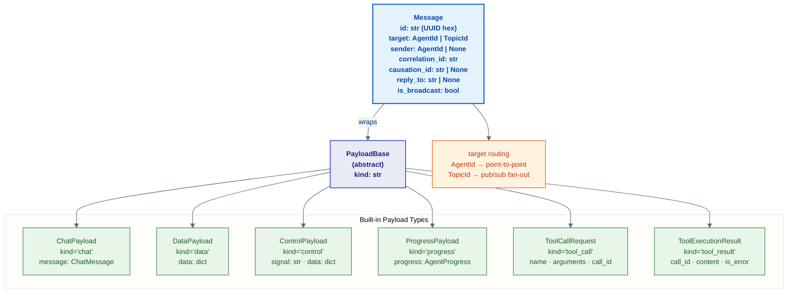
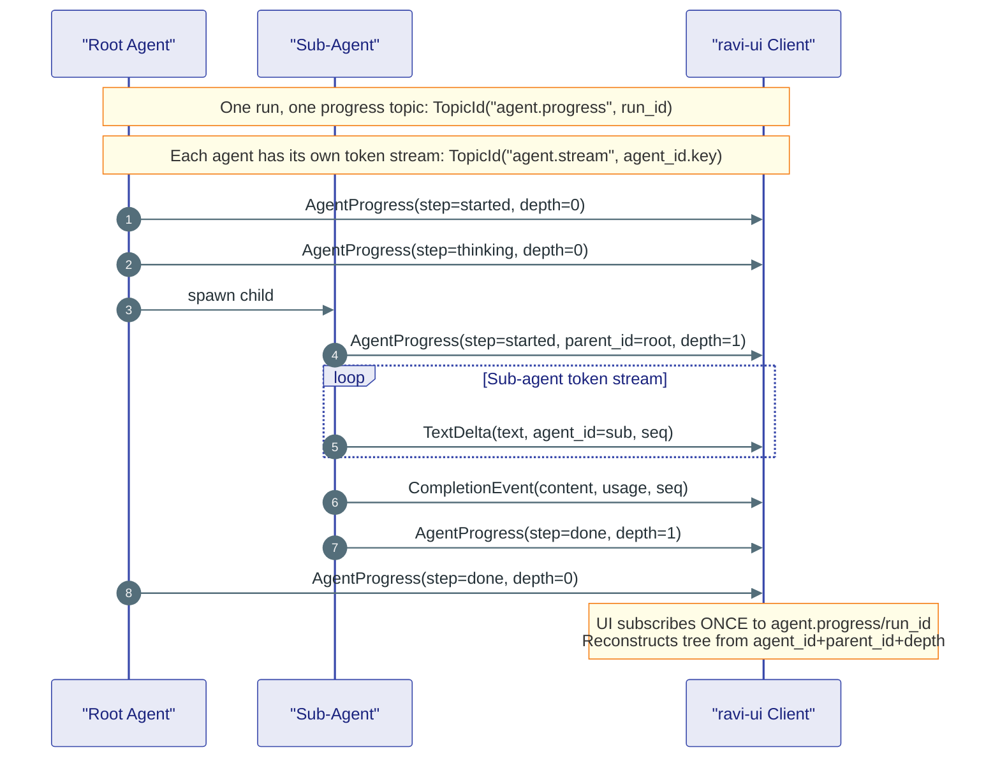
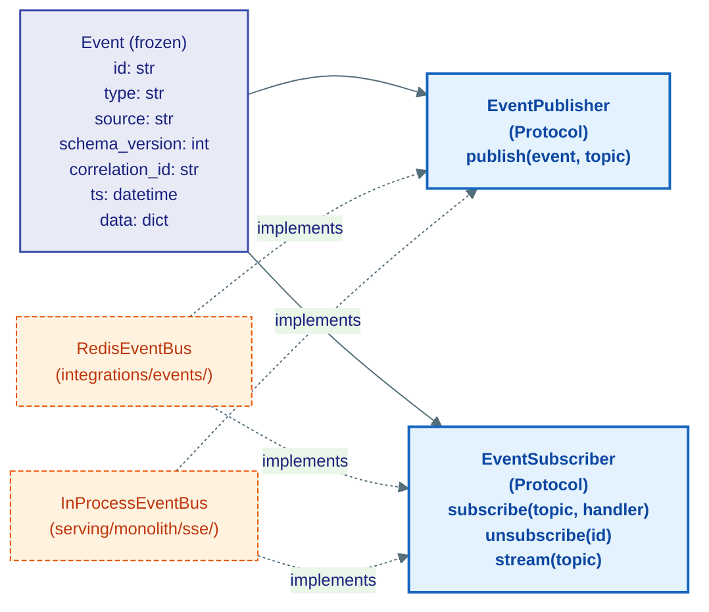

# messaging/ — Agent Communication

> **Source:** `kernel/messaging/message.py` · `kernel/messaging/stream.py` · `kernel/messaging/events.py`

Three distinct communication channels — messages between agents, stream events to the UI, and generic events to the event bus. They look similar but serve different purposes.

---

## The Message — Agent-to-Agent Envelope

A `Message` wraps any `Payload` and routes it to a specific agent or topic. Every agent-to-agent send goes through a `Message`.



**Key fields explained:**

| Field | Purpose |
|---|---|
| `correlation_id` | Ties all messages in one logical conversation/run together |
| `causation_id` | Points to the specific message that triggered this one — builds a causal chain |
| `reply_to` | The `run_id` of the asker — set by `RunContext.ask()` so the responder knows where to send the reply |
| `is_broadcast` | `True` when `target` is a `TopicId` — triggers fan-out delivery to all followers |

**`register_payload_type(cls)`** — add custom payload kinds. `cls` must subclass `PayloadBase` and have a `kind: Literal[...]` field. Call once at module load time.

---

## Two Parallel Visibility Streams

While agents run, two independent channels stream to the UI. They share `seq` for ordering but serve different consumers.



### Stream event types

**Token stream** — `TopicId("agent.stream", agent_id.key)` — one topic per agent:

| Type | When | Key fields |
|---|---|---|
| `TextDelta` | Each text token from the LLM | `text`, `seq`, `agent_id`, `run_id` |
| `ReasoningDelta` | Each thinking token (extended-thinking only) | `text`, `seq` |
| `CompletionEvent` | End of LLM call | `content: list[ContentBlock]`, `usage`, `seq` |
| `StreamDone` | End sentinel | `reason: str` |

**Progress stream** — `TopicId("agent.progress", run_id)` — ONE topic for the whole run:

| `AgentStep` | Meaning |
|---|---|
| `started` | Agent woke up, beginning `run()` |
| `thinking` | Agent made an LLM call |
| `tool_call` | Agent invoked a tool |
| `tool_result` | Tool returned a result |
| `handoff` | Orchestrator delegated to a sub-agent |
| `paused` | Agent suspended (waiting for signal/timer/child) |
| `done` | Agent completed |
| `error` | Agent failed |

`AgentProgress.depth` is used by the UI to indent sub-agents correctly in the tree view.

---

## Event — The Generic Bus Envelope

Separate from `Message`. `Event` is the envelope for the Redis pub/sub event bus (`integrations/events/`). It carries infrastructure-level events like `workflow.started`, `agent.crashed`, `hitl.approved`.



**Always use factory functions** from `serving/shared/events/types.py` — never construct `Event` dicts manually:

```python
from ravi.serving.shared.events.types import workflow_started
await bus.publish(workflow_started(run_id=run.id, thread_id=thread.id, user_content=text))
```

`Event.create()` is the kernel-level convenience constructor for when factory functions don't exist yet.
