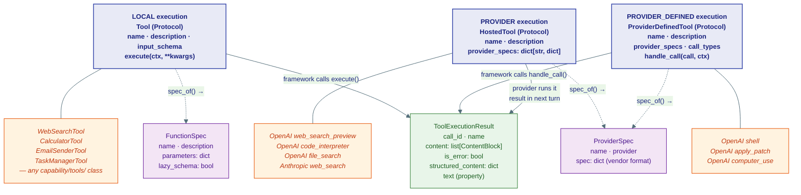
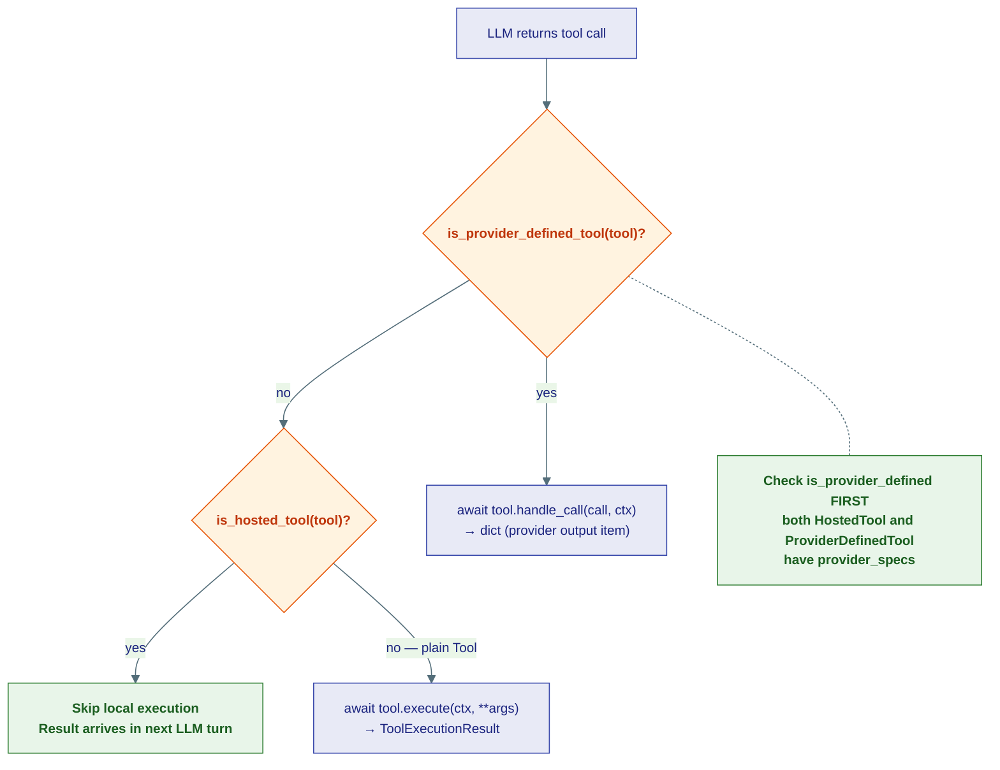
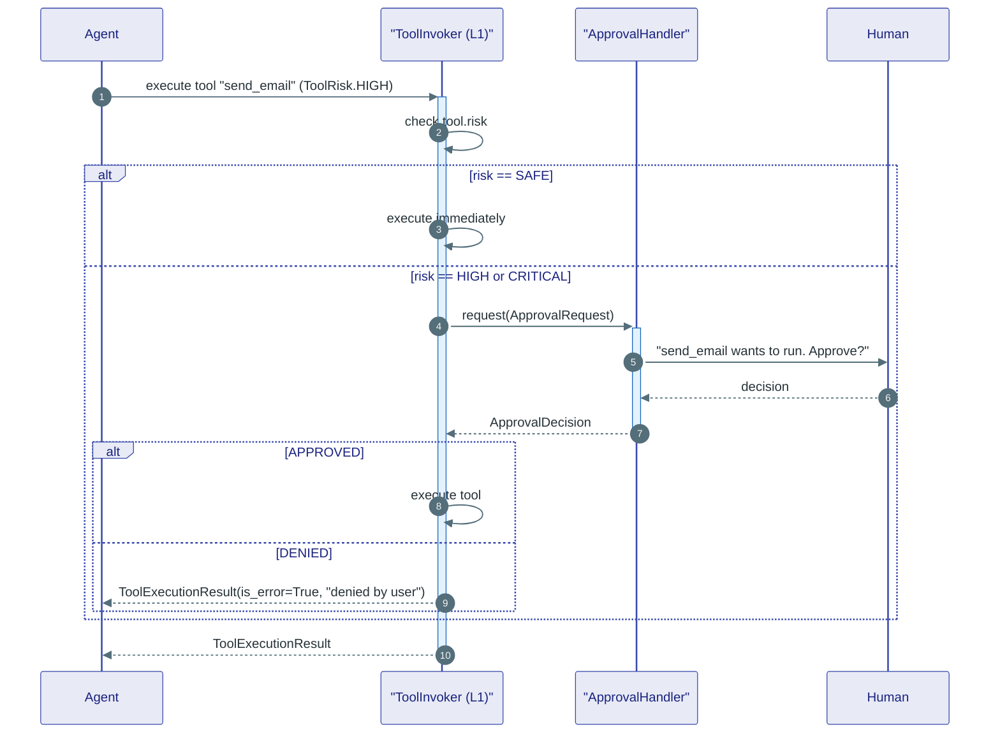
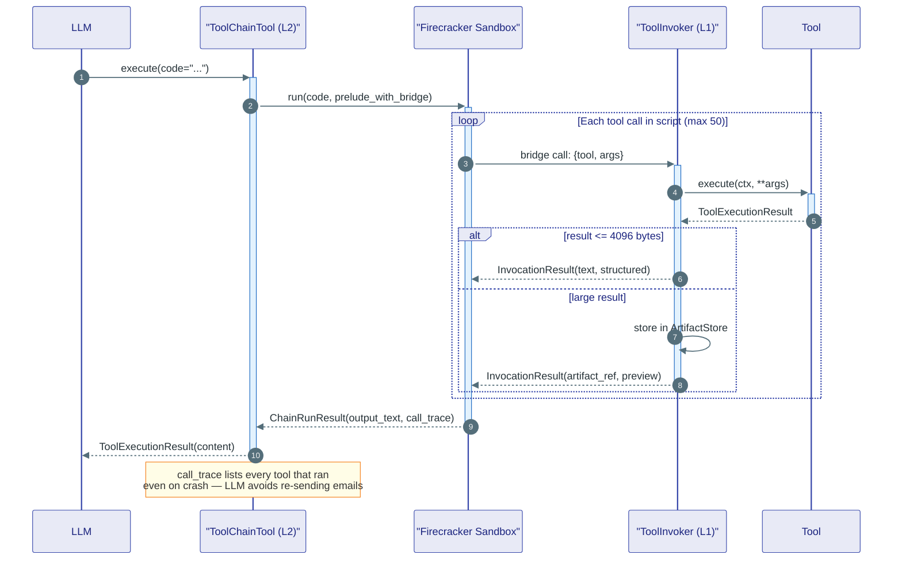
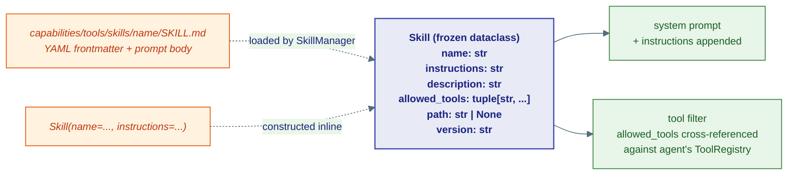

# tools/ — What Agents Can Do

> **Source:** `kernel/tools/tools.py` · `kernel/tools/chain.py` · `kernel/tools/approval.py` · `kernel/tools/skills.py`

Defines the complete tool taxonomy: three execution modes across two axes, wire declarations for LLM providers, sandboxed code chaining, human-in-the-loop approval, and prompt skills.

---

## The Tool Taxonomy

Three Protocols govern all tools. The right one depends on **who executes** and **who declares**:

### Dispatch pattern at runtime

**Always check `is_provider_defined_tool` before `is_hosted_tool`** — both have `provider_specs`, but only `ProviderDefinedTool` has `handle_call`.

---

## ToolRisk and Approval

Tools declare a risk level. High and critical risk tools pause execution and ask a human before proceeding.

`ApprovalRequest` is immutable and fully serializable — it can be stored in Postgres and resumed after a restart. `ApprovalHandler` implementations: `WebApprovalHandler` (the `ravi-ui` HITL card), `AutoApprovalHandler` (tests), `CliApprovalHandler` (terminal).

---

## Sandboxed Code-Mode Chaining

Tool chaining lets the LLM write a Python script that calls multiple tools and pipes results between them. The script runs in a Firecracker/K8s sandbox; each tool call crosses the bridge back to the framework-side `ToolInvoker`.

**Key types from `chain.py`:**

| Type | Purpose |
|---|---|
| `ChainPolicy` | Limits: `max_tool_calls=50`, `call_timeout_s=60`, `total_timeout_s=300`, `max_inline_result_bytes=4096` |
| `InvocationResult` | What the sandbox receives back: `status`, `text`, `structured`, `artifact_ref`, `files` |
| `ChainRunResult` | Final outcome: `status`, `output_text`, `call_trace`, `duration_ms` |
| `ChainCallRecord` | One entry per bridged call in the trace: `tool`, `args_digest`, `status`, `duration_ms` |

---

## Skills — Prompt Packages

A `Skill` extends an agent's behaviour without modifying its code. When attached to an agent, `instructions` are appended to the effective system prompt and `allowed_tools` limits which tools the skill can use.
